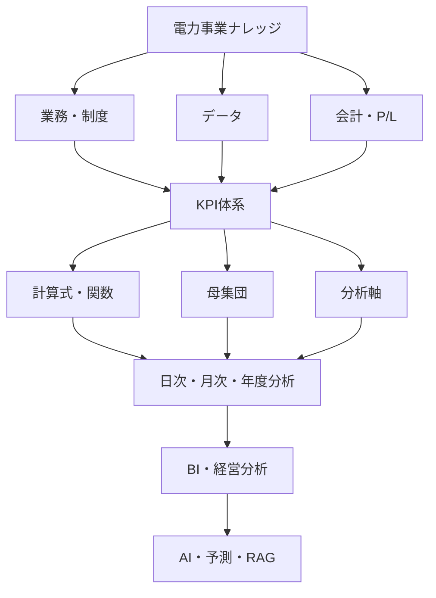
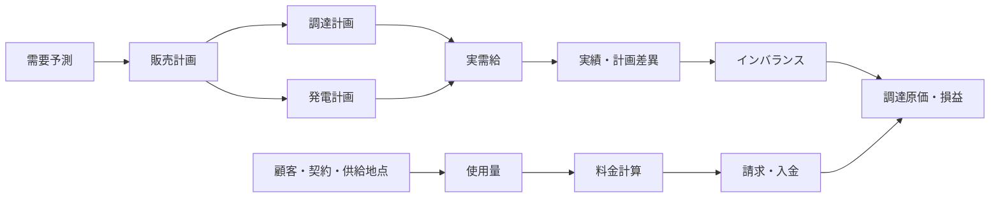
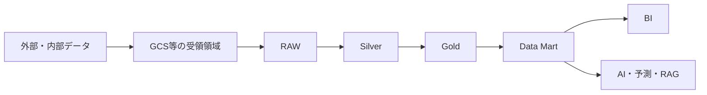

# 電力事業データ分析基盤 ナレッジ体系 v1.0

> **目的**：本書は、電力事業における業務知識、制度・契約、データ定義、損益計算、KPI、分析軸、データガバナンスを一つの体系として整理するための共通土台である。GCS（Google Cloud Storage）から BigQuery の RAW／Silver／Gold、日次・月次の収支管理、BI、AI 活用までを、同じ定義で接続することを目指す。[1]

| 項目 | 内容 |
|---|---|
| 文書名 | 電力事業データ分析・損益管理ナレッジ体系 |
| 版数 | v1.0 |
| 対象 | 発電・小売・需給・調達・市場・会計・データ基盤・BI・AIの関係者 |
| 主な用途 | 業務知識の共有、データ定義書、KPI定義書、損益計算仕様書、データモデル設計の起点 |
| 設計原則 | 定義の一貫性、時間・確定性・改定履歴の分離、粒度の明示、再現性、監査可能性 |
| 注意事項 | 制度、約款、契約、データ提供元により定義・更新頻度・確定時期は異なる。個別実装時は対象エリア、適用期間、契約条件を明記する。 |

## 1. 全体像と設計方針

電力事業の分析では、販売量や売上だけを集計しても、正しい経営判断には到達しにくい。電力データには、**対象となる受渡・使用の時刻**、**データを取得・更新した時刻**、**値が確定した時刻**、**会計に計上した時刻**が併存する。また、同じ需要量・発電量・市場価格であっても、速報、日報、暫定、確定、訂正といった状態の差異により、日次収支と月次会計が一致しないことがある。

したがって、本体系では業務・制度・データ・会計を個別に扱わず、各データについて「何を表すか」「誰が作成するか」「どこから取得するか」「いつ更新・確定するか」「どの計算・単価・約款に使うか」「損益とKPIへどう影響するか」を連鎖させる。



### 1.1 共通設計原則

| 原則 | 内容 | 実装上の要点 |
|---|---|---|
| 業務起点 | データ項目は業務イベントと意思決定目的に結び付ける。 | 取得元、発生条件、責任部署、利用KPIを定義する。 |
| 時間の分離 | 「いつの電力か」と「いつ分かった・確定したか」を混同しない。 | 対象時刻、受渡日時、取得日時、更新日時、確定日時、計上日時を分ける。 |
| 確定性の明示 | 値の品質・用途はデータ状態に依存する。 | `data_status`、`revision`、有効期間を保持する。 |
| 版管理 | 約款、単価、計算式、制度改定により結果が変わる。 | 適用開始日・終了日と Version を持たせる。 |
| 粒度の明示 | 30分、時間、日、月を安易に混在させない。 | 最小粒度、集計規則、単位、タイムゾーンを定義する。 |
| 再現性 | 過去の収支・KPIを当時の条件で説明できるようにする。 | RAW保存、履歴、計算ロジック、マスタ参照版、監査証跡を残す。 |

### 1.2 揺らぎへの対応原則

電力事業のデータには、用語、制度、時刻、データ状態、単位、会計方針、データソースの違いによる揺らぎがある。揺らぎを一律に排除するのではなく、**意味が同じものは統一し、意味が異なるものは区別し、変化するものは履歴として管理する**。

| 揺らぎの種類 | 例 | 対応方法 |
|---|---|---|
| 用語の揺らぎ | 「実績」「確定」「売り戻し」などの呼称差 | 用語辞書に定義、同義語、対象範囲、非該当例を登録する。 |
| 業務意味の揺らぎ | 瞬時値と区間平均値、調達量とネット調達量 | データ項目を分け、単位・粒度・算定方法を明記する。 |
| 時間の揺らぎ | 対象時刻、取得時刻、確定時刻、計上期間の差 | 時刻の種類を分離し、タイムゾーンと適用期間を保持する。 |
| 状態の揺らぎ | 速報、暫定、確定、訂正、取消 | `data_status` と `revision` を用い、上書きせず履歴化する。 |
| 制度・契約の揺らぎ | 約款、料金、容量負担、PPA条件の改定 | SCD Type 2、Version、有効期間、変更理由で管理する。 |
| 集計の揺らぎ | 日次参考値と月次確定値、ネット単価と買い単価 | KPIごとの集計契約に、目的・粒度・分母・集計関数を登録する。 |
| ソースの揺らぎ | 市場、送配電、請求、会計システム間の差 | ソース、優先順位、照合規則、差異理由を記録する。 |

#### 1.2.1 一致・一貫・整合・簡潔の使い分け

本書では、類似する品質概念を次のように使い分ける。

| 用語 | 本書での意味 |
|---|---|
| 一致 | 同じ条件・同じ定義で算出した値が一致している状態。例：請求と会計の金額一致。 |
| 一貫 | 用語、ルール、データモデル、処理が複数の領域で同じ原則に従っている状態。 |
| 整合 | 異なるデータ・業務・制度の間に矛盾がなく、関係が説明できる状態。 |
| 簡潔 | 定義・例外・前提を省略せず、重複や不要な断定を避けて記述した状態。 |

制度や契約によって複数の扱いが成立する場合は、単一の結論を一般化せず、標準デフォルト、選択肢、適用条件、未決事項を分けて記述する。これにより、共通仕様の一貫性と、個別制度への適応性を両立する。

## 2. ナレッジ体系の全体構造

本体系は、実務で利用しやすいように38の知識領域で構成する。第1群は事業・制度・業務、第2群は契約・料金・会計、第3群はKPI・データ管理、第4群は基盤・ガバナンス・意思決定を扱う。各領域は単なる用語集ではなく、業務フロー、必要データ、マスタ、計算、データ状態、分析軸、損益影響、統制を関連付けて記述する。

| 群 | No. | 知識領域 | 主な論点 |
|---|---:|---|---|
| 事業・制度 | 01 | 電力業界・事業基礎 | 発電、送配電、小売、需要家、事業者の役割 |
| 事業・制度 | 02 | 電力制度・市場制度 | 電力自由化、発送電分離、BG、OCCTO、JEPX、先物・先渡・相対取引 |
| 事業・制度 | 03 | 電力バリューチェーン | 発電から供給、請求、回収までの連鎖 |
| 事業・制度 | 04 | 発電事業 | 発電計画、実績、販売、原価、利益 |
| 事業・制度 | 05 | 電源種別・発電方式 | 火力、原子力、水力、再エネ、自家発、コージェネ |
| 事業・制度 | 06 | 電力小売事業 | 顧客獲得、契約、供給、料金、請求、入金、解約 |
| 事業・制度 | 07 | 需要家・需要特性 | 使用量、需要予測、需要パターン、電圧等 |
| 事業・制度 | 08 | 電源調達 | JEPX、相対、PPA、先渡、ベースロード等 |
| 事業・制度 | 09 | BG・需給管理 | 需要・販売・調達・発電計画と実需給の管理 |
| 事業・制度 | 10 | JEPX・市場取引 | JEPXの現物取引、JEPX以外の市場、先物・先渡、容量、需給調整市場 |
| 事業・制度 | 11 | インバランス | 量、単価、料金、予測・計画誤差、コスト |
| 事業・制度 | 12 | 託送・送配電 | 託送、接続供給、発電量調整供給、供給地点 |
| 契約・会計 | 13 | 契約 | 小売・調達契約、受渡条件、負担区分、環境価値 |
| 契約・会計 | 14 | 約款・規程・料金 | 約款、規程、料金メニュー、単価、適用Version |
| 契約・会計 | 15 | 販売・営業 | 販売量、販売単価、基本料金、調整額、値引 |
| 契約・会計 | 16 | 顧客・供給地点 | 顧客、契約、供給地点、料金メニューの関係 |
| 契約・会計 | 17 | 環境価値・非化石価値 | 非化石価値の属性、取引、収益・費用への影響 |
| 契約・会計 | 18 | 会計・財務会計 | 請求、入金、計上、月次締め、財務会計科目 |
| 契約・会計 | 19 | 管理会計・P/L | 事業別、部門別、電源別、顧客別の採算管理 |
| 契約・会計 | 20 | 利益構造・利益ブリッジ | 発電・小売利益、増減要因、ウォーターフォール |
| KPI・データ | 21 | KPI体系 | 発電・小売・需給・経営の主要指標 |
| KPI・データ | 22 | KPI計算式・関数・母集団 | 算式、分子・分母、対象集合、適用条件 |
| KPI・データ | 23 | KPI分析軸・ディメンション | 時間、エリア、電源、顧客、契約、料金等 |
| KPI・データ | 24 | 時間・日付・カレンダー | 30分コマ、営業日、会計年度、休日、受渡日 |
| KPI・データ | 25 | データ状態・速報・日報・確定値 | データの確定性と利用目的 |
| KPI・データ | 26 | データ更新頻度・確定タイミング | 取得周期、遅延、締め・精算との関係 |
| KPI・データ | 27 | マスタ・コード体系 | 横断ディメンション、キー、コード、履歴 |
| KPI・データ | 28 | データモデル・粒度 | ファクト、ディメンション、粒度、単位、履歴 |
| KPI・データ | 29 | データ品質 | 欠損、重複、異常値、単位、時系列完全性 |
| KPI・データ | 30 | データガバナンス | オーナー、定義、承認、アクセス、変更管理 |
| 基盤・統制 | 31 | データ連携・外部データ | 取得元、ファイル、API、受領管理、取り込み |
| 基盤・統制 | 32 | データ基盤・システム | RAW／Silver／Gold、Data Mart、BI、AI |
| 基盤・統制 | 33 | BI・ダッシュボード | 日次収支、月次P/L、例外検知、ドリルダウン |
| 基盤・統制 | 34 | AI・予測・RAG | 予測支援、定義検索、説明支援、利用統制 |
| 基盤・統制 | 35 | リスク管理 | 価格、需給、契約、信用、オペレーションリスク |
| 基盤・統制 | 36 | 法令・制度変更管理 | 制度・約款・料金改定の影響範囲と適用管理 |
| 基盤・統制 | 37 | 監査・証跡・再現性 | 原データ、改定履歴、計算根拠、承認記録 |
| 基盤・統制 | 38 | 経営分析・意思決定 | 収益性、利益変動、予実、リスク、施策評価 |

## 3. 事業・業務の基本モデル

### 3.1 電力バリューチェーン

電力事業をデータで扱う際は、発電、調達、需給、販売、請求、回収を分断しない。販売計画は調達計画と発電計画に接続し、実需給はインバランス、原価、利益へ連鎖する。小売業務では、顧客・契約・供給地点・使用量・料金・請求・入金を一貫したキーで接続する。



### 3.2 発電事業

発電事業では、発電計画、発電実績、発電販売、売上、発電原価、発電利益を連鎖させる。発電所、発電機、電源種別、燃料種別、エリア、設備容量、発電可能量、最低・最大出力、設備利用率、発電効率、稼働状態を、対象時刻または対象期間とともに管理する。

| 管理対象 | 代表データ項目 | 主な分析・管理目的 |
|---|---|---|
| 発電資産 | 電源ID、発電所ID、発電機ID、電源種別、燃料種別、エリア | 資産構成、電源別採算、稼働把握 |
| 計画・実績 | 発電計画量、発電実績量、発電可能量、出力上下限 | 予実差異、供給力、需給計画 |
| 効率・稼働 | 設備容量、設備利用率、発電効率、稼働状態 | 運転評価、原価・収益性分析 |
| 損益 | 発電売上、燃料費、変動O&M、その他変動費 | 発電限界利益、電源別収益性 |

### 3.3 小売事業・需要家

小売業務は、顧客獲得から契約、供給開始、使用量、料金計算、請求、入金、解約、未収までのライフサイクルで整理する。顧客ID、契約ID、供給地点IDを軸に、契約容量、契約期間、料金メニュー、電圧、エリア、請求先などを結合可能にする。需要データでは、予測値、計画値、実績、確定値といったデータ状態を区別し、30分コマなどの最小粒度で保管する。

### 3.4 調達・市場・需給・インバランス

電力調達は、JEPX、JEPX以外の取引市場、相対契約、PPA、先物、先渡、ベースロード、その他調達に分解し、調達量、調達単価、調達金額、計画・実績・確定値を保持する。先物・先渡については、現物受渡を伴う取引か、差金決済等の金融的な取引かを商品ルールに基づいて区分する。概念上、現物ベースの先渡は将来の電力量と価格を合わせて固定し、数量不足リスクと価格変動リスクを同時に抑える目的を持つ。一方、金融先物は、電力の現物調達を別途行うことを前提に、価格変動による金額差を差金決済等で相殺する目的を持つ。ただし、実際の受渡・決済・ヘッジ会計の扱いは商品ルールと契約条件に従う。需給管理では、需要予測、販売計画、調達計画、発電計画、実需給、実績、計画差異を同一時間軸で比較する。インバランスは、量、単価、料金、正負の区分、予測誤差、計画誤差を区別して記録する。

| 領域 | 最低限のデータ項目 | 損益との接続 |
|---|---|---|
| 市場取引 | 市場、商品、市場区分、約定日時、対象コマ、量、単価、金額、決済方法 | 調達原価、ヘッジ損益または取引収益 |
| 相対・PPA調達 | 契約、相手先、電源、受渡条件、量、単価、環境価値 | 契約別調達原価、リスク評価 |
| 先物・先渡 | 商品、限月・受渡期間、約定価格、決済方法、証拠金・精算情報 | 価格変動リスク、ヘッジ損益、将来調達コスト |
| JEPX以外の市場 | 市場ID、運営主体、商品、取引区分、エリア、約定・精算情報 | 市場別調達構成、価格差、リスク・収益性 |
| 需給管理 | 需要予測、販売・調達・発電計画、実績、差異 | 予実差異、余剰・不足、インバランス |
| インバランス | インバランス量、単価、料金、正負区分、確定状態 | 変動費、小売限界利益への影響 |
| 託送 | 送配電事業者、供給地点、託送量、託送単価、金額 | 小売売上原価または変動費 |

### 3.5 JEPXと、それ以外の市場・取引の整理

市場データは、すべてを「JEPX価格」として扱わない。まず、**JEPXの市場取引**、**JEPX以外の取引市場**、**相対取引**、**先物・先渡取引**、**属性・制度価値の取引**に分類する。次に、現物受渡の有無、金融的な決済の有無、対象期間、対象エリア、価格の確定方法、損益計上方法を定義する。ビジネス目的の観点では、現物先渡は電力の数量と価格を将来期間について固定する取引、金融先物は現物の数量調達とは切り離して価格変動のみを金額でヘッジする取引、と整理すると理解しやすい。ただし、名称だけで現物・金融を判定せず、個別商品と契約の決済条件を優先する。

「先物」と「先渡」は、文書・契約・システム上で同じ意味として扱わない。取引所取引か相対取引か、標準化された商品か個別条件の商品か、現物受渡か差金決済か、証拠金・精算が発生するかなどを、対象商品のルールに従って個別に管理する。本書では、これらの違いを吸収できるように、`market_type` と `settlement_type` を分けて持つことを推奨する。

| 分類 | 位置付け | 区別する項目 | 分析上の主な目的 |
|---|---|---|---|
| JEPXの現物取引 | JEPX上のスポット・時間前等の取引。 | 商品、市場、対象コマ、約定量、約定単価、確定状態 | 実需給に対する短期調達・販売価格の分析 |
| JEPX以外の市場 | JEPXとは別の運営主体・制度・取引ルールを持つ市場。 | 市場ID、運営主体、商品、エリア、約定・精算ルール | 市場間の価格差、調達先構成、制度別収益性 |
| 相対取引 | 取引相手との個別契約に基づく取引。 | 相手先、契約Version、受渡条件、契約量、価格、負担区分 | 契約採算、信用・数量・価格リスクの管理 |
| 先物・先渡 | 将来の期間・商品を対象とする取引。現物先渡は数量と価格、金融先物は主に価格変動をヘッジする。 | 取引形態、限月・受渡期間、約定価格、決済方法、精算・証拠金、現物受渡の有無 | 将来価格・数量リスクのヘッジ、評価損益、調達コストの管理 |
| 属性・制度価値取引 | 非化石価値等、電力そのものと区別して扱う価値の取引。 | 属性ID、対象電力量、価値単価、適用制度、償却・移転状態 | 環境価値の収益・費用と証跡の管理 |

市場マスタには、少なくとも市場ID、市場名称、運営主体、`market_type`、商品区分、現物・金融区分、対象エリア、取引時間、受渡・決済方法、適用制度、適用期間、Versionを持たせる。取引ファクトには、約定日時、対象日・対象コマまたは限月、約定量、約定単価、金額、手数料、決済額、データ状態、Revision、取得日時を保持する。

## 4. 契約・約款・料金・単価

### 4.1 契約と約款のモデル

契約・約款は、料金と損益の根拠であるため、単なる文書保管対象ではない。小売契約では契約種別、容量、期間、単価、基本料金、電力量料金、調整方法、違約金、解約条件を管理する。調達契約では契約相手、電源、契約量、契約単価、受渡条件、エリア、期間、インバランス負担、環境価値を管理する。

約款・規程は Version 管理を基本とする。約款ID、名称、Version、制定日、施行日、適用開始日、適用終了日、改定内容、対象契約を持たせ、料金・計算式との関連を明確にする。

| 対象 | 主な属性 | 履歴管理の要点 |
|---|---|---|
| 小売契約 | 契約種別、容量、料金、調整方法、解約条件 | 適用期間と供給地点・料金メニューの関係を保持する。 |
| 調達契約 | 相手先、電源、量、単価、受渡条件、IB負担 | 契約更改・条件変更を上書きせず版管理する。 |
| 約款・規程 | 文書種別、Version、施行日、改定内容 | 対象契約・料金・KPI算式への影響を追跡する。 |
| 料金メニュー | 基本料金、電力量料金、調整ルール、適用条件 | 契約と供給地点に対する適用期間を明示する。 |

### 4.2 単価を独立した知識体系として管理する

電力事業では、単価が売上・原価・利益を直接左右する。よって「単価マスタ」を一つの固定表に留めず、適用条件と改定履歴を持つ独立した知識領域として扱う。販売単価、JEPX単価、調達単価、相対契約単価、PPA単価、燃料費調整単価、託送単価、インバランス単価、非化石価値単価、需給調整単価などを共通フォーマットで管理する。

| 必須項目 | 説明 |
|---|---|
| 単価ID・単価種類 | 一意な識別子と業務上の単価区分。 |
| 単価・単位 | 値と、円/kWh、円/MWhなどの単位。 |
| 適用開始日・適用終了日 | 有効な期間。改定前後を再現する根拠となる。 |
| 対象条件 | エリア、契約、電源、顧客、料金メニュー、時間帯等。 |
| 約款Version・改定Version | 単価の制度・契約上の根拠。 |
| 登録・承認情報 | 作成・確認・承認・更新の証跡。 |

### 4.3 料金・費用の税区分管理

電力事業における料金・費用は、金額だけでなく**税区分・課税関係**を管理する。税区分は取引内容、契約条件、取引時点、適用制度等に基づいて判定し、金額から推測しない。

#### 4.3.1 主な税区分

| 区分 | 概念上の位置付け |
|---|---|
| 課税 | 所定の税率により税額を計算する取引。 |
| 非課税 | 法令上、課税対象から除外され、税を課さない取引。 |
| 不課税 | 当該税の課税対象となる取引に該当しないもの。 |
| 免税・税金免除 | 制度上の要件により、税負担または納税が免除されるもの。適用要件と根拠を管理する。 |
| 軽減税率 | 課税取引に標準税率とは異なる税率を適用するもの。税区分とは別に税率区分として管理する。 |
| 標準税率 | 課税取引に通常適用する税率。適用期間と制度Versionを管理する。 |

「非課税」「不課税」「免税・税金免除」は税務上の意味が異なるため、税額がゼロであることだけを根拠に同一視しない。個別取引の判定は、適用制度、契約、請求・精算システム、証憑、社内税務方針を根拠とする。

#### 4.3.2 管理対象

各料金・費用について、次の項目を保持する。

| 管理項目 | 内容 |
|---|---|
| 金額 | 税抜金額、税込金額、または基準金額。原数値の定義を明記する。 |
| 税区分 | 課税、非課税、不課税、免税等の区分。 |
| 税率 | 標準税率、軽減税率等を含む適用税率。 |
| 税額 | 算定された税額。税額がゼロとなる理由も区別する。 |
| 税込／税抜 | 入力金額・表示金額が税込か税抜か。 |
| 適用開始日・適用終了日 | 税率、制度、契約、判定ルールの有効期間。 |
| 税制度・根拠 | 制度Version、判定理由、根拠コード、請求書・精算書等。 |

#### 4.3.3 データ設計例

```text
tax_category
tax_rate
tax_amount
tax_included_flag
tax_rule_version
valid_from
valid_to
```

必要に応じて、`taxable_amount`、`tax_rate_type`、`tax_reason_code`、`amount_excl_tax`、`amount_incl_tax`、`invoice_id`、`evidence_id`も保持する。

#### 4.3.4 分析上の注意

売上、調達費、託送費、インバランス費、手数料、環境価値費用等を集計する際は、**税込・税抜を混在させない**。限界利益、限界利益率、利益/kWh、単価、予実差異等のKPIには、税抜・税込の別、税額の含否、税区分の母集団、丸め規則を定義する。

制度変更や税率変更に対応できるよう、税区分、税率、税制度・根拠、適用期間をVersion管理する。これにより、過去の料金・費用を当時の税ルールで再現できる。税額を回収・控除できるか、費用に含めるかは、会計方針・税務方針に基づいて別途管理する。

#### 4.3.5 インバランス精算の消費税取扱い

インバランス精算は、一般送配電事業者と小売電気事業者・発電事業者等との間で、託送供給等約款その他の制度に基づいて行われる請求・支払である。需給計画と実績の差分に対する精算であっても、取引の法的性質、約款上の位置付け、請求・支払の相手方を確認して税区分を判定する。

実務上は、インバランス料金単価や請求・支払明細に、消費税等相当額を含むか否かが示される場合がある。したがって、単価や金額の数値だけから税区分を推測せず、次の情報を照合する。

| 確認項目 | 実務上の確認内容 |
|---|---|
| 取引当事者 | 一般送配電事業者、BG、小売電気事業者、発電事業者等の関係。 |
| 根拠 | 託送供給等約款、接続送電サービス・発電量調整供給等の約款、制度要綱、契約Version。 |
| 精算の性質 | 電力・調整・託送等の役務または取引の対価か、別個の損害賠償・制裁・補助等か。名称だけで判断しない。 |
| 金額表示 | インバランス料金単価・精算額が税抜か税込か、消費税等相当額の表示があるか。 |
| 証憑 | 請求書、支払通知書、精算明細、適格請求書の発行者・登録番号・税率・税額。 |
| 期間 | 対象コマ、精算対象期間、確定日、訂正Revision、会計計上期間。 |

インバランス精算を調達原価に含める場合でも、税抜原価、税額、税込支払額を分離して保持する。支払側では仕入税額控除の可否を、受取側では課税売上等への該当性を、適格請求書その他の保存要件と併せて確認する。一般送配電事業者の公表資料には、消費税等相当額を含む単価と含まない単価の表示があるため、`tax_included_flag` と根拠資料を必須管理項目とする。[5]

#### 4.3.6 再エネ特措法に基づく交付金・電力買取の消費税取扱い

再エネ特措法に関連する収入・支出は、**電力の買取対価**、**環境価値・属性の対価**、**交付金・補助的な収入**を分けて判定する。制度名や会計科目だけで、すべてを同じ税区分にはしない。

| 取引・収入の類型 | 消費税判定の基本的な考え方 | 実務上の確認事項 |
|---|---|---|
| FIT等に基づく電力の買取対価 | 電力の譲渡の対価として行われる取引であるかを判定する。課税事業者等との取引では、適用税率・インボイス対応を確認する。 | 発電者の事業者区分、インボイス登録状況、買取契約、受給料金のお知らせ、適用税率、仕入税額控除の可否。 |
| FIP等の電力・環境価値の対価 | 電力、環境価値、プレミアム等の各対価を契約・制度上分解して判定する。 | 物理電力の受渡、属性の移転、プレミアムの支払根拠、請求・支払明細、契約Version。 |
| 再エネ特措法に基づく交付金 | 電力等の提供に対する反対給付ではなく、補助金・交付金としての性質を持つ場合は、一般に消費税の課税対象外（不課税）として整理する。 | 交付要綱・法令上の目的、交付条件、対価性の有無、交付金額の算定根拠、返還条件。 |
| 交付金に関連する精算・返還 | 返還額や減額が、交付金本体の返還なのか、別の役務・電力等の対価の修正なのかを区別する。 | 返還通知、精算書、元取引との対応、税区分、会計計上月、Revision。 |

交付金は、国税庁が示す「国または地方公共団体からの補助金や助成金等」の一般的な考え方に照らすと、対価性がなければ不課税となる。一方、交付金の名称であっても、実質的に電力・役務の提供に対する反対給付であれば、課税関係が異なる可能性がある。したがって、交付金本体を非課税とするのではなく、まず「対価性の有無」を確認し、非課税・不課税・課税の区分と根拠を記録する。

インボイス制度では、電力の買取対価に係る仕入税額控除と、交付金そのものの消費税区分を分けて扱う。発電者が免税事業者であることは、取引の税区分そのものと同義ではなく、インボイス発行・仕入税額控除の要件に関係する。データモデルでは、`tax_category`、`invoice_registration_status`、`invoice_id`、`consideration_flag`、`grant_program_id`、`tax_rule_version`を分離して管理する。

#### 4.3.7 消費税区分の判定手順

インバランス精算、再エネ買取、交付金等の判定は、次の順序で行う。

1. 取引の相手方、対象物、役務、制度・契約上の根拠を特定する。
2. 国内取引であるか、事業として行う取引であるか、反対給付としての対価性があるかを確認する。
3. 課税対象であれば、非課税・免税に該当する特別規定の有無を確認する。
4. 課税・非課税・不課税・免税の区分、税率、税額、インボイス要件を記録する。
5. 適用期間、制度Version、証憑、判定者、判定日を保存する。

この手順は、税務判断を自動化して置き換えるものではなく、判定根拠と再現性を確保するための業務・データ統制である。[2] [3] [4]

## 5. 時間・日付・確定性の設計

### 5.1 六つの時間

一つの電力データに対して、少なくとも次の六つの時間を区別する。これにより、対象日の実績、取得時点で見えていた速報、後日確定した値、会計に反映した金額を混同せずに分析できる。

| 時間 | 定義 | 主な用途 |
|---|---|---|
| 対象時刻 | 電力の使用・発電・市場対象となる時刻またはコマ。 | 時間別需給、30分コマ集計。 |
| 受渡日時 | 契約・市場上で電力を受け渡す日時。 | 調達・販売・市場取引の照合。 |
| データ取得日時 | 外部・内部システムからデータを取得した日時。 | 速報性、取り込み管理、再現性。 |
| データ更新日時 | レコードの内容が更新された日時。 | 差分取込、改定追跡。 |
| データ確定日時 | 正式な実績・精算値として確定した日時。 | 請求、会計、正式KPI。 |
| 会計計上日時 | 財務・管理会計で計上した日時または期間。 | 月次締め、会計照合。 |

### 5.2 時間軸とカレンダー

電力データの基本時間軸は、30分コマから時間、日、週、月、四半期、年度へと連続する。加えて、受渡日、営業日、休日、祝日、会社休日、市場営業日、会計期間を管理する。会計年度の呼称は会社定義に依存するため、単純な暦年関数ではなく、会計カレンダーマスタにより決定する。

| マスタ | 必須項目 | 利用例 |
|---|---|---|
| D_日付 | 日付、曜日、祝日区分、営業日フラグ | 日次・月次集計、休日比較 |
| D_時間 | 時、時間帯区分 | 時間帯別価格・負荷分析 |
| D_30分コマ | 対象日、コマ番号、開始・終了時刻 | 需給、JEPX、インバランスの整合 |
| D_会計カレンダー | 会計年度、会計月、会計四半期、期間 | FY・月次・四半期P/L |
| D_会社休日 | 会社休日、市場営業日、会計営業日 | 締め処理、運用計画、営業日分析 |

### 5.3 データ状態と Revision

電力データの状態は単純な一本道ではない。データ提供元・制度・契約により、速報から日報を経ずに確定する場合や、確定後に訂正される場合がある。したがって、固定的なステータス遷移を前提とせず、データ状態と Revision を属性として保持する。

| `data_status` | 日本語の意味 | 主な利用目的 |
|---|---|---|
| `forecast` | 予測 | 計画策定、リスク予測 |
| `planned` | 計画 | 需給計画、予実比較の基準 |
| `flash` | 速報 | 早期把握、日次の運用判断 |
| `daily` | 日報 | 前日実績の業務管理 |
| `preliminary` | 暫定 | 精算・確定前の収支把握 |
| `confirmed` | 確定 | 請求、会計、正式実績 |
| `revised` | 訂正 | 確定後を含む修正版 |
| `cancelled` | 無効 | 取消・不要レコードの識別 |

過去値を上書きすると、過去に行った判断や数値の変化を説明できなくなる。そのため、対象日・対象コマ・値・データ状態・Revision・取得日時・有効開始日時・確定日時を保持し、必要に応じて「最新値」と「当時利用可能だった値」を使い分ける。

### 5.4 データライフサイクル

| データ | 主な粒度 | 更新の例 | 確定の例 | 管理上の注意 |
|---|---|---|---|---|
| JEPX | 30分 | 日次または随時 | 市場確定時 | 商品・対象コマ・市場状態を明示する。 |
| 需要 | 30分 | 速報から確定へ段階更新 | 後日 | 予測、計画、実績、確定を混在させない。 |
| 発電 | 30分または時間 | 日次等 | 後日確定 | 発電機、出力、停止状態と結合する。 |
| インバランス | 30分 | 段階更新 | 精算時 | 正負区分、単価、料金、精算版を管理する。 |
| 顧客使用量 | 30分等 | 日次等 | 検針・確定時 | 供給地点・契約・検針との整合を確認する。 |
| 売上 | 日または月 | 日次・月次 | 請求確定時 | 速報収支と請求確定額を区別する。 |
| 会計 | 月次 | 月次 | 月次締め時 | 計上期間と対象期間を分離する。 |

## 6. 損益計算と利益ブリッジ

### 6.1 基本的な損益構造

損益計算は、売上から売上原価、売上総利益、変動費、限界利益、固定費、営業利益、営業外損益、経常利益、特別損益、税引前利益、法人税、純利益へと接続する。発電と小売の管理会計は、それぞれの限界利益を計算した上で統合する。小売の変動費には、電気そのものを仕入れる**調達コスト**と、送配電網を利用して届けるための**ネットワークコスト（託送費）**が含まれる。両者はいずれも利益を押し下げるが、前者は仕入れ、後者は配送・インフラ利用という性質が異なるため、採算分析では別項目として管理する。

| 事業 | 管理会計の概念式 | 主な構成要素 |
|---|---|---|
| 発電 | 発電限界利益 ＝ 発電売上 − 燃料費 − 変動O&M − その他変動費 | 発電量、発電単価、燃料・運転関連費用 |
| 小売 | 小売限界利益 ＝ 小売売上 − 調達原価 − 託送費 − その他変動費 | 販売量、販売単価、調達、託送、インバランス。調達原価は市場・相対等の電力仕入れと、制度・精算上のインバランスに係るエネルギーコストを含む概念であり、託送費は送配電網の利用に伴うネットワークコストとして区分する。 |
| 統合 | 統合利益 ＝ 発電限界利益 + 小売限界利益 − 共通費等 | 事業別損益、共通費、配賦方針 |

> **算定上の留意点**：実際の制度上・契約上の計算方法は、対象制度、エリア、期間、約款、契約条件によって定義する。本書の式はデータモデルとKPI辞書を整備するための概念式であり、個別の請求・精算ロジックを代替しない。調達原価と託送費はいずれも変動費となり得るが、仕入れコストとネットワークコストの性質を分けて定義する。[1]

### 6.2 基本式の例

| 指標・金額 | 概念式 | 定義する条件 |
|---|---|---|
| 売上 | 基本料金 + 電力量料金 + 調整額 + その他収益 − 値引 | 税の扱い、対象契約、請求確定状態、計上基準 |
| 調達原価 | 調達量 × 調達単価 | 調達種別、単価の適用時点、単位換算、精算状態 |
| インバランス量 | 実績量 − 計画量 | 対象量の定義、正負の符号、対象コマ。不足（買い）を原価増、余剰（売り）を精算による原価減または売上として扱う等、損益方向の規則を定義する。 |
| 限界利益 | 売上 − 変動費 | 変動費の範囲、配賦の有無、確定性 |
| 限界利益率 | 限界利益 ÷ 売上 | 分母ゼロ時の扱い、税抜・税込、対象集合 |
| 利益/kWh | 利益 ÷ 販売電力量 | 利益の種類、販売量の状態・単位、除外条件 |

### 6.3 利益ブリッジ

利益ブリッジは、前月営業利益から当月営業利益までの変動を、販売量、販売単価、JEPX価格、燃料価格、調達量、インバランス、託送費、固定費などの要因に分解する仕組みである。各ブリッジ要因には、対象期間、比較基準、対象母集団、単価・数量の固定条件、符号規則、配賦方針を定義しなければならない。これにより、ウォーターフォール図を再現可能なKPIとして提供できる。

## 7. KPI体系：指標・関数・母集団・分析軸

### 7.1 KPIを構成する四要素

KPIは名称や算式だけでは定義として不十分である。KPIごとに、何を測るか、どう計算するか、どのデータを対象とするか、どの軸で分析するかを一体で管理する。

| 要素 | 定義 | 例 |
|---|---|---|
| KPI | 測定対象・目的を表す指標。 | 小売限界利益、予測誤差、設備利用率 |
| 関数・計算式 | KPIを算出するロジック。 | 売上 − 調達費 − 託送費 − インバランス費 |
| 母集団 | KPI計算に含める対象集合と除外条件。 | 有効契約かつ対象月に供給実績がある供給地点 |
| 分析軸 | KPIを分解・比較するディメンション。 | 月、エリア、電源、顧客セグメント、契約 |

### 7.2 KPIカテゴリ

| 分類 | 主要KPI | 主な分析意図 |
|---|---|---|
| 発電 | 発電量、発電単価、発電原価、発電限界利益、設備利用率、発電効率 | 電源別の稼働・採算・効率を把握する。 |
| 小売 | 販売量、売上、販売単価、調達単価、限界利益、限界利益/kWh | 顧客・契約・料金別の収益性を把握する。 |
| 需給 | 予測誤差、計画誤差、インバランス量、インバランス率 | 計画精度と需給運用の影響を把握する。 |
| 経営 | 売上、売上総利益、限界利益、営業利益、経常利益、純利益 | 日次・月次・年度の収益性を把握する。 |
| データ運用 | 取込遅延、確定率、速報・確定差分、欠損率、異常値率 | データの利用可能性と信頼性を把握する。 |

### 7.3 KPI辞書の標準項目

KPI辞書は、BI・AI・会議資料で同じ数値を参照するための統制文書である。計算式をコードやレポート内に散在させず、適用期間を持つマスタとして管理する。

| 項目 | 説明 |
|---|---|
| KPI_ID・KPI名称 | 一意な識別子と業務上の名称。 |
| 定義・意思決定目的 | 指標が何を測り、どの判断を支援するか。 |
| 計算式・入力項目 | 算式、参照するデータ項目、結合条件。 |
| 母集団・除外条件 | 対象契約、対象顧客、対象データ状態、除外ルール。 |
| 単位・丸め規則 | kWh、MWh、円、円/kWh、%等と表示・丸めの規則。 |
| 集計粒度・分析軸 | 最小粒度、集計可能なディメンション。 |
| データ状態・確定性 | 速報、日報、確定のどれを使うか。 |
| 適用期間・適用制度・約款 | 有効期間と制度・約款・契約上の前提。 |
| Version・承認情報 | 改定履歴、責任者、承認日時。 |

### 7.4 KPI関数と母集団の定義例

| KPI | 概念式 | 母集団の例 | 分析軸の例 |
|---|---|---|---|
| 小売限界利益 | 小売売上 − 調達費 − 託送費 − IB費 − その他変動費 | 有効な小売契約に紐づく対象期間の確定・または速報データ | 月、エリア、料金メニュー、顧客、契約 |
| 予測誤差 | 実績需要 − 予測需要 | 同一対象コマで比較可能な予測と実績 | 日、時間帯、エリア、顧客群、予測モデル版 |
| 設備利用率 | 発電量 ÷ （設備容量 × 対象時間） | 稼働対象の発電機または発電所 | 月、電源種別、発電所、エリア |
| 限界利益/kWh | 限界利益 ÷ 販売電力量 | 販売量と利益が同じ契約・期間・状態で揃う対象 | 月、顧客、料金、電圧、エリア |
| 速報・確定差分 | 確定値 − 速報値 | 対応する対象時刻・対象量・版が特定できるレコード | データ種別、データソース、月、エリア |

### 7.5 標準分析軸

分析軸は横断マスタとして定義し、各ファクトテーブルと結合可能にする。安易にディメンションを増やすのではなく、キーの粒度と有効期間を統制する。

| 軸 | 代表ディメンション | 主な活用 |
|---|---|---|
| 時間 | 30分コマ、時間、日、週、月、四半期、年度 | 時系列、季節性、予実比較 |
| エリア | 供給エリア、送配電エリア、市場エリア | 地域別需給・価格・収益性 |
| 組織 | 会社、部門、事業、責任組織 | 管理会計、責任別KPI |
| 電源 | 電源種別、発電所、発電機、燃料 | 発電・調達の採算・リスク |
| 調達・市場 | 調達種別、市場、商品、取引先 | 調達構成、価格影響 |
| 顧客・契約 | 顧客、セグメント、契約、供給地点、電圧 | 小売収益性、解約・獲得分析 |
| 料金・単価 | 料金メニュー、単価種類、約款Version | 売上単価・調整額の要因分析 |
| 会計 | 会計科目、管理会計科目、計上期間 | P/L、予実、配賦分析 |
| データ状態 | `data_status`、Revision、ソース、取得日 | 速報・確定比較、品質・再現性 |

## 8. 横断マスタ・データモデル

### 8.1 最低限の横断マスタ

通常の顧客・商品マスタだけでは、電力事業の時間・制度・契約・単価の複雑さを吸収できない。次の横断マスタを最低限の共通基盤とする。

| マスタ群 | 推奨マスタ |
|---|---|
| 時間・カレンダー | D_日付、D_時間、D_30分コマ、D_会計カレンダー、D_会社休日 |
| 設備・地理 | D_電源、D_発電所、D_発電機、D_エリア、D_送配電事業者 |
| 顧客・契約 | D_顧客、D_契約、D_供給地点、D_料金メニュー、D_調達契約 |
| 取引・会計 | D_市場、D_単価、D_約款、D_会計科目、D_管理会計科目 |
| データ統制 | D_データ状態、D_データRevision、D_単位、D_データソース |

### 8.2 ファクトと粒度

ファクトテーブルは、事実が一意になる最小の粒度を先に宣言する。例えば、需要・発電・市場・インバランスは「対象日 × 30分コマ × エリア／資産／契約等 × データ状態 × Revision」を候補粒度とする。売上・請求・会計は、明細または月次計上単位で管理し、対象期間と計上期間の両方を持つ。

| ファクト | 推奨の基本粒度 | 主要ディメンション |
|---|---|---|
| F_需要 | 対象日 × 30分コマ × 供給地点または集計単位 × 状態・Revision | 時間、顧客、契約、供給地点、エリア、状態 |
| F_発電 | 対象日 × 30分コマまたは時間 × 発電機 × 状態・Revision | 時間、発電所、発電機、電源、エリア、状態 |
| F_市場取引 | 対象日 × 対象コマ × 市場商品 × 取引 | 時間、市場、エリア、単価、契約 |
| F_調達 | 対象日 × 対象コマ × 調達契約・取引 × 状態 | 時間、調達契約、相手先、電源、エリア |
| F_販売・請求 | 請求明細または対象月 × 契約・供給地点 | 顧客、契約、供給地点、料金、単価、会計 |
| F_インバランス | 対象日 × 30分コマ × BG・エリア × 状態・Revision | 時間、BG、エリア、単価、状態 |
| F_会計 | 計上日または月 × 勘定・組織・事業 | 会計期間、会計科目、管理会計、組織、事業 |

### 8.3 RAWからAIまでのレイヤー

データ基盤は、取り込み元を失わず、整形・集計・利用の責務を分ける。RAWには少なくとも `source_system`、`source_file`、取得日時、対象日、データ状態、Revisionを保持する。



| レイヤー | 主な役割 | 保存・統制の要点 |
|---|---|---|
| 受領領域 | 外部ファイル・API結果を受け取る。 | 受領日時、ファイル名、チェックサム、取込結果を残す。 |
| RAW | 原形を保ったまま蓄積する。 | ソース、取得時刻、状態、Revision、原データの再現性を保持する。 |
| Silver | 形式・単位・キーを標準化し、品質検査を行う。 | 単位換算、重複・欠損判定、コード変換、エラー隔離。 |
| Gold | 業務で再利用できる統合・履歴データを作る。 | 共通マスタ、適用期間、事業横断の結合。 |
| Data Mart | KPI・レポート用途へ集計・最適化する。 | KPI Version、母集団、スナップショット、権限を明示する。 |
| BI・AI | 意思決定・検索・予測を支援する。 | 表示対象の状態、データ鮮度、根拠データを示す。 |


### 8.4 実装統制：単位換算・集計規則・市場ポジション

本節は、知識領域を39個へ機械的に増やすものではなく、複数領域にまたがる実装上の統制を定める。具体的な数値・符号・会計処理は、対象データソース、制度、契約、社内会計方針を確認したうえで、データ辞書・KPI辞書・計算仕様書に登録する。

#### 8.4.1 単位換算と集計規則

30分区間の平均出力を電力量へ変換する場合は、区間長を時間単位に直して計算する。30分区間であれば、概念式は **電力量（kWh）＝平均出力（kW）×0.5（時間）** となる。ただし、入力値が瞬時値か区間平均値か、実際の区間長、タイムゾーン、夏時間、欠損・補間の扱いを確認する。

| 指標の性質 | 標準的な集計 | 注意点 |
|---|---|---|
| 電力量、金額 | SUM | 取消、重複、税、精算状態、通貨・単位を定義する。 |
| 件数 | COUNTまたはCOUNT DISTINCT | レコード件数と業務イベント件数を区別し、重複排除キーを定義する。 |
| 出力・需要（kW） | MAX、平均、時間加重平均等 | 指標の目的に応じて選択する。単純なSUMを自動適用しない。 |
| 単価 | 数量加重平均等 | 単純平均を避け、分母、ゼロ量、売買区分を定義する。 |
| 比率・率 | 分子集計 ÷ 分母集計 | 比率の単純平均を原則とせず、母集団とゼロ除算を定義する。 |

これらの規則はSQLへ一律適用するのではなく、ファクト・KPIごとの「集計契約」として管理する。集計契約には、許容粒度、単位、符号、状態、集計関数、欠損時の扱い、検証ケースを含める。

#### 8.4.2 JEPXスポット・時間前市場のネットポジション

スポットと時間前市場を同じ市場価格として単純集計せず、同一対象日、対象コマ、BG、エリア、商品等の粒度で取引を整合させる。買いを正、売り戻しを負とする等の符号規則を明示したうえで、ネット調達量を算出する。

`net_procurement_qty = spot_qty + intraday_qty`

数量加重平均単価は、比較可能な約定の数量と価格から算出する。ネット量がゼロとなる場合、売買が混在する場合、取消・訂正・手数料・精算差額がある場合は、単一の平均単価に無理に集約せず、買い・売り・調整を分離したうえで表示する。

#### 8.4.3 非化石価値等の長期遅延とRevision

環境価値は、電力の受渡月とオークション・割当・精算の確定月が大きく異なる場合がある。したがって、対象月、取得日時、確定日時、会計計上期間を分離し、暫定値・見越または引当・正式確定値を状態とRevisionで管理する。正式値の確定時には過去レコードを上書きせず、訂正後の値を新しいRevisionとして追記する。

管理会計上の速報収支と、後日確定した精算値の双方を再現可能にする。ただし、見越・引当および財務会計への計上方法は、適用制度と会社の会計方針に従う。

#### 8.4.4 先物の値洗いと実現損益

現物先渡と金融先物は、どちらも将来価格に関係するが、業務上のヘッジ対象が異なる。現物先渡は将来の電力量と価格を固定して現物の数量・価格リスクを抑えるのに対し、金融先物は現物の調達を別途行いながら価格変動による金額差を相殺する。この違いを、現物受渡の有無、数量の確定方法、決済方法、ヘッジ対象の属性としてデータ上も保持する。

先物・先渡等の金融的取引では、未決済ポジションの時価評価損益（MtM）、証拠金・日々の精算、実現損益、現物受渡に伴う調達原価への反映を別の属性で保持する。管理会計上、未実現の評価損益を小売限界利益から分離して「調整項目」等として表示することは有効である。

ただし、営業外損益、調整項目、ヘッジ会計、実現時の原価相殺等の最終区分は一律に決めず、会社の会計方針・商品ルール・契約条件を参照する。データモデルには少なくとも、取引形態、決済方法、評価状態、実現状態、会計区分、損益区分、適用方針Versionを保持する。

#### 8.4.5 30分コマの業務定義

「30分データ」は、単なる時刻の区切りではなく、計量・需給・市場取引・損益を結び付ける業務上の基本粒度である。まず、出力・需要の値が瞬時値なのか30分区間の平均値なのかを項目ごとに定義する。瞬時値は最大負荷や系統状態の監視に用い、区間平均値は、区間長を掛けて電力量（kWh）を算出する元データとして用いる。

コマ番号と実時刻の対応も固定する。例えば、1コマを `00:00以上00:30未満` とするのか、00:30時点の確定値として表示するのかをデータ辞書に登録し、対象時刻の開始・終了境界、タイムゾーン、受渡日を保持する。海外市場や将来の制度変更を含む場合は、夏時間（DST）等により1日の区間数が変わり得るため、固定48コマを前提にせず、実時間区間とカレンダー上の営業日を分離して扱う。

#### 8.4.6 JEPX取引の符号・取消・訂正

小売事業者の需給ポジションでは、買い（調達）を正、売り戻しを負とする符号規則を標準候補とする。ただし、これは「数量ポジション」の符号であり、損益の借方・貸方や金額の符号とは別である。したがって、数量、金額、損益、ポジションの符号を別々に定義する。

取消・訂正は、元レコードを物理的に削除せず、元取引との関連を保持した状態変更または逆向きの調整レコードとして記録する。市場データソースが提供する方式に応じて、`cancelled`、`revised`、訂正Revision、相殺元取引IDを保持し、「最新の有効値」と「当時取得した値」の双方を再現可能にする。

#### 8.4.7 加重平均単価の目的別定義

加重平均単価は単一の定義に固定せず、分析目的に応じて定義する。買い100、売り戻し20の例では、ネット量ベースは買いと売りを相殺した正味80を分母とし、正味調達コストを測る。一方、買いポジションベースは買い100を分母とし、売り戻し20を売却収益として別建てにすることで、調達価格の評価に用いる。

手数料・精算額についても、会計上の仕入原価を測る指標では含め、市場価格への連動性や約定能力を測る指標では除外する等、目的別に定義する。KPI辞書には、分母の考え方、買い・売りの区分、手数料・精算額の含否、ネット量ゼロ時の扱いを登録する。

#### 8.4.8 環境価値の見越・確定差額

再エネプランの販売月と非化石証書等の調達・確定月がずれる場合、販売月に将来の合理的な見込調達費を見越原価として認識するかを、管理会計方針として定める。見越を行う場合は、見積単価、対象電力量、見積Version、戻入条件を保持し、販売月の過大な利益と証書購入月の過大な損失を抑える。

正式単価が確定した後の差額は、過去の対象月をRevisionして再表示する方法と、確定月の調整として計上する方法がある。どちらを採用するかは、管理会計の目的、月次締めの運用、財務会計方針、監査要件を踏まえて決定し、`recognition_policy_version` として管理する。

#### 8.4.9 先物損益の速報・実現・会計区分

未決済先物のMtMや証拠金の変動は、現物の限界利益とは別に、日次速報上の「現在の市場リスク」として表示できる。これにより、現物調達原価の実績と、将来価格変動による評価損益を混同せずに把握する。

満了・決済時の実現損益は、調達原価の相殺として限界利益に含める方法と、デリバティブ損益として限界利益の外側に置く方法がある。業績評価やインセンティブ設計に直結するため、商品・ヘッジ目的・会計方針・管理会計方針を基に決定し、速報表示、管理会計、財務会計の3つの表示区分を必要に応じて分ける。

#### 8.4.10 KPI・ファクトの集計契約

KPIやファクトの「集計契約」は、誰が計算しても同じ意味の数値になるように、許容粒度と集計方法を合意するための業務定義である。KPIごとに、最小粒度、日次・月次での利用可否、集計関数、速報・確定の区分、単位、分子・分母、欠損時の表示、ゼロ除算の扱いを登録する。

例えば、託送費や請求額が月次でしか確定しない「限界利益/kWh」は、日次では暫定単価による参考値とし、確定値と同じ意味で表示しない。販売量がゼロの場合の利益/kWhは、ゼロではなく原則NULLまたは「算定不能」とし、売上だけが存在する場合も別の例外状態で表示する。データ欠損がある日次収支は、完全値として表示せず、欠損範囲・推定有無・利用制限を注記する。

#### 8.4.11 標準デフォルトと合意形成が必要な事項

実装を停滞させないため、業界標準または制度上の前提が強い事項は標準デフォルトとして採用し、経営・会計・インセンティブ設計に関わる事項は選択肢を比較して承認する。

| 区分 | 標準デフォルト／論点 | 適用・判断の考え方 |
|---|---|---|
| 標準デフォルト | 国内小売の計量・需給用30分実績は、区間平均値として扱う。 | `00:00以上00:30未満` 等の開始時刻区間とし、kWhは平均kW×0.5時間で算出する。瞬時値は系統監視等の別用途データとして区別する。 |
| 標準デフォルト | 日本国内のみを対象とする場合、標準的な日次データは48コマとする。 | DSTは国内現行運用の前提には置かない。ただし海外市場・将来制度・別タイムゾーンを扱えるよう、実時刻とカレンダーを保持する設計は残す。 |
| 標準デフォルト | JEPXの小売ポジションは買いを正、売り戻しを負とする。 | 調達量・ネットポジションの符号であり、金額・損益の符号とは分離する。取消・訂正はRevisionで追記する。 |
| 標準デフォルト | kWh・金額はSUM、kWはMAX・平均・時間加重平均等を指標定義に従って使用する。 | `_kwh`・`_kw`の命名とセマンティックレイヤーの集計制約を用いる。ただしkWの全指標をMAXまたはAVGに固定せず、最大需要・平均出力等の意味をKPIごとに定義する。 |
| 合意形成が必要 | 加重平均単価をネット量ベースと買いポジションベースのどちらで評価するか。 | 財務上の正味調達単価と、需給部門の調達力KPIを分け、必要なら両方を併記する。 |
| 合意形成が必要 | 環境価値を販売月に見越すか、証書の確定・購入月に計上するか。 | 期ズレを抑える管理会計指標と、現物着地・財務会計の実績指標を分け、認識方針Versionを管理する。 |
| 合意形成が必要 | 先物の実現損益を小売限界利益に含めるか、外部のデリバティブ損益とするか。 | ヘッジ目的、経営評価、会計・監査方針を踏まえ、現物とヘッジを合算した指標と現物単独指標を必要に応じて併記する。 |

この区分により、制度に直接結び付く基本仕様は先に実装し、④〜⑥のように企業ごとに答えが異なる事項は、選択肢・影響・責任者を明示したうえで意思決定できる。

### 8.5 SCD Type 2が必要となるマスタ・契約データ

過去の収支・KPIを当時の契約・単価・組織・制度条件で再現する必要があるデータには、**Slowly Changing Dimension Type 2（SCD Type 2）**を適用する。SCD Type 2では、業務上の識別子（Business Key）を維持したまま、属性変更のたびに旧レコードを上書きせず新しい履歴レコードを追加する。ファクトが発生した時点のサロゲートキーまたは有効期間で結合することで、現在のマスタではなく、当時有効だった属性を参照できる。

| SCD Type 2の主な対象 | 変更履歴を保持する属性の例 | 過去再現が必要な理由 |
|---|---|---|
| 契約・調達契約 | 契約条件、数量、単価、受渡条件、負担区分、適用期間 | 当時の売上・調達原価・リスク配賦を再現するため。 |
| 料金メニュー・約款・規程 | 料金、調整方法、適用条件、施行日、Version | 請求額と制度根拠を当時の条件で説明するため。 |
| 単価・精算ルール | 単価、単位、エリア、時間帯、適用制度、適用期間 | 過去の原価・収益・KPIを再計算するため。 |
| 顧客・供給地点・組織 | 顧客属性、セグメント、供給地点、所属部門、責任組織 | 当時の顧客別・組織別採算と責任範囲を再現するため。 |
| 設備・電源・市場 | 電源種別、容量、発電所所属、市場区分、運営主体 | 発電・市場取引・設備KPIの分析軸を再現するため。 |
| コード・制度・KPI定義 | コード名称、分類、算式、母集団、適用制度、Version | 過去レポートと現在の定義を比較・説明するため。 |

#### 8.5.1 SCD Type 2の標準保持項目

履歴ディメンションには、少なくとも次の項目を持たせる。

| 項目 | 役割 |
|---|---|
| `business_key` | 業務上同一の顧客・契約・単価等を識別する不変キー。 |
| `surrogate_key` | 属性Versionごとの一意キー。ファクト結合に使用する。 |
| `valid_from` / `valid_to` | 業務上の適用開始・終了日時。終了日時は排他的とする等の規則を統一する。 |
| `is_current` | 現在有効なVersionかを示すフラグ。 |
| `version_no` | 属性履歴の連番またはVersion。 |
| `recorded_at` / `source_updated_at` | DWHに記録した時刻と原システムの更新時刻。 |
| `change_reason` / `source_system` | 変更理由と変更元を追跡する情報。 |

SCD Type 2の有効期間は、原則として**業務上の有効期間**と**DWHへの記録期間**を混同しない。契約が4月1日から有効であっても、DWHへの取込が4月5日なら、`valid_from`と`recorded_at`は異なる。後日判明した遡及改定は、履歴を削除・上書きせず、訂正Versionと監査証跡を追加する。

#### 8.5.2 SCD Type 2とファクトRevisionの使い分け

契約・単価・顧客属性などの「分析軸の属性が時間とともに変わる」場合はSCD Type 2を用いる。一方、需要実績、インバランス、環境価値精算、市場約定などの「同じ対象時刻・対象取引の値が速報から確定・訂正へ変わる」場合は、ファクトのRevisionまたは追記型イベント履歴を用いる。両者を混同せず、必要に応じてファクトからSCD Type 2の該当Versionを参照する。

## 9. データ品質・ガバナンス・監査

### 9.1 データ品質管理

電力データでは、値が存在するかだけでなく、時間コマの連続性、単位、状態、確定性、改定履歴が品質の一部となる。品質ルールは、ソース単位、データセット単位、KPI単位に分けて定義し、検知結果を可視化する。

| 品質観点 | 代表的な検査 | 対応の方向性 |
|---|---|---|
| 完全性 | 対象日の30分コマ欠落、必須キー欠損 | 再取得、補完区分、利用制限、アラート |
| 一意性 | 同一粒度・状態・Revisionの重複 | 重複除外規則、ソース優先順位、原因調査 |
| 妥当性 | 異常値、上下限逸脱、負値の不整合 | 閾値、資産・契約条件、例外承認 |
| 整合性 | 需要・販売・請求、計画・実績、速報・確定の差異 | 照合ルール、差異理由、訂正履歴 |
| 単位 | kW/kWhの混同、MWh/kWh換算、円/kWhと円/MWh | D_単位、換算係数、単位付き項目名 |
| 適時性 | 予定時刻までの未着、更新遅延、確定遅延 | SLA、遅延フラグ、日次運用管理 |
| 再現性 | 過去集計値を再計算できない | 原データ、Revision、参照マスタ・算式Versionの保存 |

### 9.2 ガバナンスと変更管理

データガバナンスでは、データオーナー、定義責任者、システム責任者、利用責任者を明確にする。約款・料金・単価・KPI算式・マスタ・コードの変更は、影響データセット、影響KPI、適用開始日、テスト、承認、リリース記録を一つの変更台帳で管理する。

| 統制対象 | 必要な管理内容 |
|---|---|
| データ定義 | 業務定義、項目定義、粒度、単位、値域、更新頻度、オーナー |
| マスタ | キー、コード、適用期間、Version、承認、参照先 |
| 計算式・KPI | 算式、母集団、入力、適用制度、約款、Version、検証結果 |
| データ連携 | 取得元、受領条件、取込手順、エラー対応、SLA、再取込方法 |
| 権限・個人情報 | 利用目的、最小権限、マスキング、閲覧・更新の証跡 |
| 制度・約款改定 | 改定内容、影響範囲、適用開始日、旧新比較、移行計画 |
| 監査証跡 | 原データ、処理履歴、承認記録、計算根拠、出力スナップショット |

## 10. BI・AI・経営意思決定への接続

BIでは、日次速報と月次確定値を同じ画面・同じKPIとして無区別に表示しない。画面には対象期間、データ状態、最終更新日時、確定日時、KPI Version、単位を明示する。経営向けには、全社P/Lだけでなく、発電・小売・需給・調達のドリルダウン、利益ブリッジ、速報から確定までの差異を追跡できる構成が有効である。

AI・予測・RAG（Retrieval-Augmented Generation：検索拡張生成）は、データや定義の唯一の判断根拠とはせず、承認済みのデータマート、KPI辞書、約款・規程のVersion、データカタログを参照情報として用いる。AIが出力する説明には、対象データの期間、状態、KPI定義版、根拠レコードまたは文書を示せる設計とする。

| 利用領域 | 代表的なアウトプット | 参照すべき統制情報 |
|---|---|---|
| 日次運用 | 需給差異、インバランス、日次収支速報、異常検知 | データ鮮度、速報状態、対象コマ、未着・欠損フラグ |
| 月次管理 | 月次P/L、予実、利益ブリッジ、請求・会計照合 | 確定状態、計上期間、会計科目、算式Version |
| 収益性分析 | 顧客・契約・電源・調達別の限界利益 | 母集団、単価適用、契約・約款Version、配賦基準 |
| 経営意思決定 | 収益変動要因、リスク、施策評価 | 比較基準、分析軸、確定性、根拠データ |
| AI・RAG | 定義照会、差異説明、制度・約款検索、分析補助 | 文書Version、アクセス権、引用根拠、最新性 |

## 10.1 概念理解を深める追加領域

本節は、既存の38領域を置き換えるものではなく、経営・需給・調達・会計・データ部門が同じ損益構造を理解するための深掘りテーマを示す。各テーマは、制度・契約・会計方針に依存する部分と、制度をまたいで有効な概念モデルを分けて整理する。

| 深掘り領域 | 概念モデル | 損益・意思決定への接続 | 先に定義すべき事項 |
|---|---|---|---|
| 料金制度・売上構造 | 燃料費調整・市場連動調整は、原価変動と請求単価の反映時期がずれる。 | 原価先行による月次の見かけ上の赤字・黒字を、期ずれと基礎収益に分けて評価する。 | 調整額の参照期間、請求反映月、上限・下限、見越・戻入、顧客契約。 |
| 容量拠出金 | 将来の供給力（kW）確保に係る負担を、料金メニュー等を通じて回収する。 | 固定費的な負担、需要量・契約容量との関係、回収不足・超過を予実管理する。 | 負担の発生時期、配賦基準、基本料金・電力量料金への転嫁、未回収リスク。 |
| PPA | 物理的な電力の流れと、環境価値・契約差額などの金銭の流れを分離する。 | 固定価格によるヘッジ効果と、市場価格下落時の機会損失・高騰時の回避効果を評価する。 | オンサイト／オフサイト／バーチャルの区分、受渡、価格差、属性移転、インバランス負担。 |
| 需給調整市場（ΔkW） | 発電リソースを発電電力量として売るか、調整力として確保するかを比較する。 | JEPX等での売電収益と、ΔkW確保・応動による収益および機会費用を評価する。 | 商品区分、応動・稼働条件、容量対価と電力量対価、未達・ペナルティ、対象制度。 |
| BG内融通・インナー清算 | BG全体で相殺された不足・余剰を、メンバーの寄与と便益に配賦する。 | 全体最適によるメリットと、個社の予測・計画精度を公平な内部損益へ変換する。 | 配賦単価、基準価格、寄与量、回避コスト、共通費、例外・精算Revision。 |
| DR・ネガワット | 需要抑制・シフトによる基準値との差分を、実現可能な削減量として評価する。 | 調達価格高騰・インバランスを回避した価値と、需要家へのインセンティブを比較する。 | ベースライン、計測誤差、追加性、反動需要、発動条件、支払単価。 |
| フォワードP/L・リスク | 契約上の販売・調達ポジションに市場フォワードカーブを適用する。 | 将来の収支分布、価格・数量・相関リスク、VaR等の指標でポートフォリオを管理する。 | ポジション粒度、カーブ、評価時点、シナリオ、信頼区間、流動性・モデルリスク。 |
| FIT／非FIT・FIP | 再エネの固定的な支援・買取と、市場価格連動・プレミアム精算を分けて捉える。 | 総調達原価の安定要素・変動要素、回避可能費用、市場連動精算の影響を評価する。 | FIT／非FIT／FIPの区分、精算主体、回避可能費用、プレミアム、環境価値の帰属。 |
| 環境価値トラッキング | 電力量と属性情報を発電所・期間・需要家へ追跡可能な形で紐付ける。 | 再エネ利用の証明、ブランド価値、再エネプレミアム売上と二重計上防止を管理する。 | 属性ID、発電所・期間、アロケーション、償却・移転、報告要件。 |

### 10.1.1 深掘りに共通する分析の型

各テーマは、単に制度用語を追加するのではなく、次の順序で分析する。第一に、物理的な電力・供給力・属性の流れを定義する。第二に、契約・市場・制度による価格・精算・負担の流れを定義する。第三に、対象期間、確定期間、請求・会計計上期間を分ける。第四に、基準ケースとの差分を、数量、価格、時期、制度、リスク、機会費用に分解する。最後に、管理会計上の評価と財務会計上の計上を区別する。

例えば燃料費調整では、当月の調達原価と当月請求売上をそのまま比較するのではなく、原価の発生月、調整額の参照月、請求反映月を並べ、期ずれを調整した指標と実績計上指標を併記する。PPAやΔkWでは、実際に受け渡した電力量だけでなく、固定したために得られたヘッジ効果、別の取引機会を失った機会費用、未達・インバランス等の付随費用を含めて評価する。

## 11. 各領域を記述する標準テンプレート

今後、38領域を詳細化する際は、すべてを同じ型で記述する。これにより、業務部門、データ部門、経理部門、BI開発者が同じ粒度で会話できる。

| 記述項目 | 記載内容 |
|---|---|
| 用語・定義 | 何を指すか。類似用語との違いも明記する。 |
| 制度・約款・規程 | 根拠となる制度、約款、契約、適用期間、Version。 |
| 業務・業務フロー | 発生条件、担当者、入力・出力、後続業務。 |
| データ項目・データソース | 項目定義、取得元、キー、粒度、単位、取得方法。 |
| 必要マスタ | 参照マスタ、コード、適用期間、結合キー。 |
| 時間・状態・Revision | 対象時刻、取得・更新・確定・計上時刻、状態、版。 |
| 計算式・KPI | 算式、入力、母集団、除外条件、単位、丸め、Version。 |
| 分析軸 | 時間、エリア、組織、電源、顧客、契約、料金、会計等。 |
| 損益影響 | 売上、原価、変動費、限界利益、固定費、会計科目への影響。 |
| 品質・統制 | 品質ルール、責任者、承認、監査証跡、保存期間。 |
| システム・AI活用 | RAW／Silver／Gold／Martの配置、BI表示、AI参照条件。 |

## 12. 実装優先順位

体系を一度に完成させるのではなく、収支・KPIの再現性に直結する領域から整備する。最初に時間・状態・単価・契約・KPIの共通定義を固め、その後に主要ファクトとBI、最後にAI・高度分析へ拡張する。

| フェーズ | 優先領域 | 主な成果物 |
|---|---|---|
| 1. 共通基盤定義 | 時間・カレンダー、データ状態、単位、エリア、契約、単価、約款 | 横断マスタ定義書、データ状態・Revision方針、用語集 |
| 2. 収支・KPIの標準化 | 発電・需要・調達・販売・インバランス、P/L、KPI | KPI辞書、損益計算仕様書、母集団・分析軸定義 |
| 3. データモデル実装 | RAW／Silver／Gold、主要ファクト、品質検査 | 論理・物理データモデル、連携仕様、品質ルール |
| 4. BI・運用定着 | 日次速報、月次確定、利益ブリッジ、例外管理 | ダッシュボード仕様、運用手順、差異説明テンプレート |
| 5. 高度活用 | 予測、RAG、意思決定支援、リスク分析 | AI利用方針、根拠表示仕様、評価・監査ルール |

## 13. 結論

本ナレッジ体系は、電力業界の知識を列挙するための資料ではない。**業務・制度・契約・約款・単価・データライフサイクル・計算式・損益・KPI・システムを、一貫した定義で接続するための設計図**である。

特に、次の四点を共通基盤として先行確立することが重要である。第一に、対象時刻から会計計上日時までの複数時間を分離する。第二に、速報・日報・暫定・確定・訂正とRevisionを履歴として保持する。第三に、単価、約款、契約、KPI計算式を適用期間とVersionを持つマスタとして管理する。第四に、すべてのKPIを計算式、母集団、分析軸、確定性とともに定義する。

これらを実装すれば、GCSからBigQueryのRAW／Silver／Gold、日次・月次収支、BI、AIまでの各層が同じ業務定義と計算根拠を共有できる。結果として、速報と確定値の差異、過去データの改定、日次収支と月次会計の差異を説明可能にし、再現性のある経営分析・意思決定へ接続できる。

## 参考資料

[1]: https://www.nta.go.jp/taxes/shiraberu/taxanswer/shohi/6157.htm "国税庁 No.6157 課税の対象とならないもの（不課税）の具体例"
[2]: https://www.nta.go.jp/taxes/shiraberu/taxanswer/shohi/6209.htm "国税庁 No.6209 非課税と不課税の違い"
[3]: https://www.enecho.meti.go.jp/category/saving_and_new/saiene/kaitori/fit_invoice.html "資源エネルギー庁 FIT・FIP制度 インボイス制度関連"
[4]: https://www.kansai-td.co.jp/consignment/agreement/imbalance.html "関西電力送配電 インバランス料金単価"
