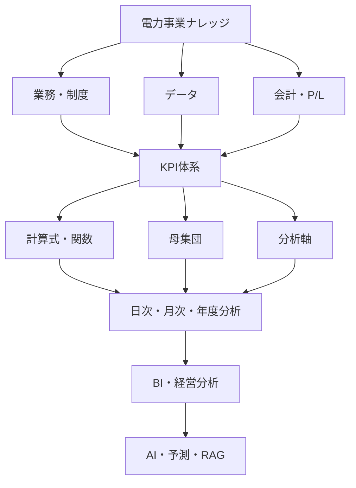
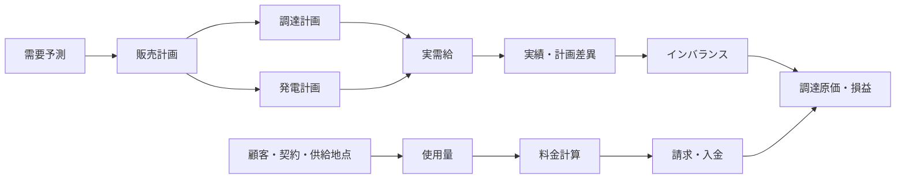
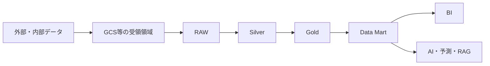

# 電力小売 データ分析基盤 導入ガイド 統合版（知識体系・初級・中級・上級・応用）

**更新日**：2026-09-10

本書は5部を1本に統合したもの。部ごとの単体ファイルは各フォルダを参照。

---

# 第Ⅰ部　知識体系：電力事業データ分析基盤 ナレッジ体系

## 電力事業データ分析基盤 ナレッジ体系 v1.0

> **目的**：本書は、電力事業における業務知識、制度・契約、データ定義、損益計算、KPI、分析軸、データガバナンスを一つの体系として整理するための共通土台である。GCS（Google Cloud Storage）から BigQuery の RAW／Silver／Gold、日次・月次の収支管理、BI、AI 活用までを、同じ定義で接続することを目指す。[1]

| 項目 | 内容 |
|---|---|
| 文書名 | 電力事業データ分析・損益管理ナレッジ体系 |
| 版数 | v1.0 |
| 対象 | 発電・小売・需給・調達・市場・会計・データ基盤・BI・AIの関係者 |
| 主な用途 | 業務知識の共有、データ定義書、KPI定義書、損益計算仕様書、データモデル設計の起点 |
| 設計原則 | 定義の一貫性、時間・確定性・改定履歴の分離、粒度の明示、再現性、監査可能性 |
| 注意事項 | 制度、約款、契約、データ提供元により定義・更新頻度・確定時期は異なる。個別実装時は対象エリア、適用期間、契約条件を明記する。 |

### 1. 全体像と設計方針

電力事業の分析では、販売量や売上だけを集計しても、正しい経営判断には到達しにくい。電力データには、**対象となる受渡・使用の時刻**、**データを取得・更新した時刻**、**値が確定した時刻**、**会計に計上した時刻**が併存する。また、同じ需要量・発電量・市場価格であっても、速報、日報、暫定、確定、訂正といった状態の差異により、日次収支と月次会計が一致しないことがある。

したがって、本体系では業務・制度・データ・会計を個別に扱わず、各データについて「何を表すか」「誰が作成するか」「どこから取得するか」「いつ更新・確定するか」「どの計算・単価・約款に使うか」「損益とKPIへどう影響するか」を連鎖させる。



#### 1.1 共通設計原則

| 原則 | 内容 | 実装上の要点 |
|---|---|---|
| 業務起点 | データ項目は業務イベントと意思決定目的に結び付ける。 | 取得元、発生条件、責任部署、利用KPIを定義する。 |
| 時間の分離 | 「いつの電力か」と「いつ分かった・確定したか」を混同しない。 | 対象時刻、受渡日時、取得日時、更新日時、確定日時、計上日時を分ける。 |
| 確定性の明示 | 値の品質・用途はデータ状態に依存する。 | `data_status`、`revision`、有効期間を保持する。 |
| 版管理 | 約款、単価、計算式、制度改定により結果が変わる。 | 適用開始日・終了日と Version を持たせる。 |
| 粒度の明示 | 30分、時間、日、月を安易に混在させない。 | 最小粒度、集計規則、単位、タイムゾーンを定義する。 |
| 再現性 | 過去の収支・KPIを当時の条件で説明できるようにする。 | RAW保存、履歴、計算ロジック、マスタ参照版、監査証跡を残す。 |

#### 1.2 揺らぎへの対応原則

電力事業のデータには、用語、制度、時刻、データ状態、単位、会計方針、データソースの違いによる揺らぎがある。揺らぎを一律に排除するのではなく、**意味が同じものは統一し、意味が異なるものは区別し、変化するものは履歴として管理する**。

| 揺らぎの種類 | 例 | 対応方法 |
|---|---|---|
| 用語の揺らぎ | 「実績」「確定」「売り戻し」などの呼称差 | 用語辞書に定義、同義語、対象範囲、非該当例を登録する。 |
| 業務意味の揺らぎ | 瞬時値と区間平均値、調達量とネット調達量 | データ項目を分け、単位・粒度・算定方法を明記する。 |
| 時間の揺らぎ | 対象時刻、取得時刻、確定時刻、計上期間の差 | 時刻の種類を分離し、タイムゾーンと適用期間を保持する。 |
| 状態の揺らぎ | 速報、暫定、確定、訂正、取消 | `data_status` と `revision` を用い、上書きせず履歴化する。 |
| 制度・契約の揺らぎ | 約款、料金、容量負担、PPA条件の改定 | SCD Type 2、Version、有効期間、変更理由で管理する。 |
| 集計の揺らぎ | 日次参考値と月次確定値、ネット単価と買い単価 | KPIごとの集計契約に、目的・粒度・分母・集計関数を登録する。 |
| ソースの揺らぎ | 市場、送配電、請求、会計システム間の差 | ソース、優先順位、照合規則、差異理由を記録する。 |

##### 1.2.1 一致・一貫・整合・簡潔の使い分け

本書では、類似する品質概念を次のように使い分ける。

| 用語 | 本書での意味 |
|---|---|
| 一致 | 同じ条件・同じ定義で算出した値が一致している状態。例：請求と会計の金額一致。 |
| 一貫 | 用語、ルール、データモデル、処理が複数の領域で同じ原則に従っている状態。 |
| 整合 | 異なるデータ・業務・制度の間に矛盾がなく、関係が説明できる状態。 |
| 簡潔 | 定義・例外・前提を省略せず、重複や不要な断定を避けて記述した状態。 |

制度や契約によって複数の扱いが成立する場合は、単一の結論を一般化せず、標準デフォルト、選択肢、適用条件、未決事項を分けて記述する。これにより、共通仕様の一貫性と、個別制度への適応性を両立する。

### 2. ナレッジ体系の全体構造

本体系は、実務で利用しやすいように38の知識領域で構成する。第1群は事業・制度・業務、第2群は契約・料金・会計、第3群はKPI・データ管理、第4群は基盤・ガバナンス・意思決定を扱う。各領域は単なる用語集ではなく、業務フロー、必要データ、マスタ、計算、データ状態、分析軸、損益影響、統制を関連付けて記述する。

| 群 | No. | 知識領域 | 主な論点 |
|---|---:|---|---|
| 事業・制度 | 01 | 電力業界・事業基礎 | 発電、送配電、小売、需要家、事業者の役割 |
| 事業・制度 | 02 | 電力制度・市場制度 | 電力自由化、発送電分離、BG、OCCTO、JEPX、先物・先渡・相対取引 |
| 事業・制度 | 03 | 電力バリューチェーン | 発電から供給、請求、回収までの連鎖 |
| 事業・制度 | 04 | 発電事業 | 発電計画、実績、販売、原価、利益 |
| 事業・制度 | 05 | 電源種別・発電方式 | 火力、原子力、水力、再エネ、自家発、コージェネ |
| 事業・制度 | 06 | 電力小売事業 | 顧客獲得、契約、供給、料金、請求、入金、解約 |
| 事業・制度 | 07 | 需要家・需要特性 | 使用量、需要予測、需要パターン、電圧等 |
| 事業・制度 | 08 | 電源調達 | JEPX、相対、PPA、先渡、ベースロード等 |
| 事業・制度 | 09 | BG・需給管理 | 需要・販売・調達・発電計画と実需給の管理 |
| 事業・制度 | 10 | JEPX・市場取引 | JEPXの現物取引、JEPX以外の市場、先物・先渡、容量、需給調整市場 |
| 事業・制度 | 11 | インバランス | 量、単価、料金、予測・計画誤差、コスト |
| 事業・制度 | 12 | 託送・送配電 | 託送、接続供給、発電量調整供給、供給地点 |
| 契約・会計 | 13 | 契約 | 小売・調達契約、受渡条件、負担区分、環境価値 |
| 契約・会計 | 14 | 約款・規程・料金 | 約款、規程、料金メニュー、単価、適用Version |
| 契約・会計 | 15 | 販売・営業 | 販売量、販売単価、基本料金、調整額、値引 |
| 契約・会計 | 16 | 顧客・供給地点 | 顧客、契約、供給地点、料金メニューの関係 |
| 契約・会計 | 17 | 環境価値・非化石価値 | 非化石価値の属性、取引、収益・費用への影響 |
| 契約・会計 | 18 | 会計・財務会計 | 請求、入金、計上、月次締め、財務会計科目 |
| 契約・会計 | 19 | 管理会計・P/L | 事業別、部門別、電源別、顧客別の採算管理 |
| 契約・会計 | 20 | 利益構造・利益ブリッジ | 発電・小売利益、増減要因、ウォーターフォール |
| KPI・データ | 21 | KPI体系 | 発電・小売・需給・経営の主要指標 |
| KPI・データ | 22 | KPI計算式・関数・母集団 | 算式、分子・分母、対象集合、適用条件 |
| KPI・データ | 23 | KPI分析軸・ディメンション | 時間、エリア、電源、顧客、契約、料金等 |
| KPI・データ | 24 | 時間・日付・カレンダー | 30分コマ、営業日、会計年度、休日、受渡日 |
| KPI・データ | 25 | データ状態・速報・日報・確定値 | データの確定性と利用目的 |
| KPI・データ | 26 | データ更新頻度・確定タイミング | 取得周期、遅延、締め・精算との関係 |
| KPI・データ | 27 | マスタ・コード体系 | 横断ディメンション、キー、コード、履歴 |
| KPI・データ | 28 | データモデル・粒度 | ファクト、ディメンション、粒度、単位、履歴 |
| KPI・データ | 29 | データ品質 | 欠損、重複、異常値、単位、時系列完全性 |
| KPI・データ | 30 | データガバナンス | オーナー、定義、承認、アクセス、変更管理 |
| 基盤・統制 | 31 | データ連携・外部データ | 取得元、ファイル、API、受領管理、取り込み |
| 基盤・統制 | 32 | データ基盤・システム | RAW／Silver／Gold、Data Mart、BI、AI |
| 基盤・統制 | 33 | BI・ダッシュボード | 日次収支、月次P/L、例外検知、ドリルダウン |
| 基盤・統制 | 34 | AI・予測・RAG | 予測支援、定義検索、説明支援、利用統制 |
| 基盤・統制 | 35 | リスク管理 | 価格、需給、契約、信用、オペレーションリスク |
| 基盤・統制 | 36 | 法令・制度変更管理 | 制度・約款・料金改定の影響範囲と適用管理 |
| 基盤・統制 | 37 | 監査・証跡・再現性 | 原データ、改定履歴、計算根拠、承認記録 |
| 基盤・統制 | 38 | 経営分析・意思決定 | 収益性、利益変動、予実、リスク、施策評価 |

### 3. 事業・業務の基本モデル

#### 3.1 電力バリューチェーン

電力事業をデータで扱う際は、発電、調達、需給、販売、請求、回収を分断しない。販売計画は調達計画と発電計画に接続し、実需給はインバランス、原価、利益へ連鎖する。小売業務では、顧客・契約・供給地点・使用量・料金・請求・入金を一貫したキーで接続する。



#### 3.2 発電事業

発電事業では、発電計画、発電実績、発電販売、売上、発電原価、発電利益を連鎖させる。発電所、発電機、電源種別、燃料種別、エリア、設備容量、発電可能量、最低・最大出力、設備利用率、発電効率、稼働状態を、対象時刻または対象期間とともに管理する。

| 管理対象 | 代表データ項目 | 主な分析・管理目的 |
|---|---|---|
| 発電資産 | 電源ID、発電所ID、発電機ID、電源種別、燃料種別、エリア | 資産構成、電源別採算、稼働把握 |
| 計画・実績 | 発電計画量、発電実績量、発電可能量、出力上下限 | 予実差異、供給力、需給計画 |
| 効率・稼働 | 設備容量、設備利用率、発電効率、稼働状態 | 運転評価、原価・収益性分析 |
| 損益 | 発電売上、燃料費、変動O&M、その他変動費 | 発電限界利益、電源別収益性 |

#### 3.3 小売事業・需要家

小売業務は、顧客獲得から契約、供給開始、使用量、料金計算、請求、入金、解約、未収までのライフサイクルで整理する。顧客ID、契約ID、供給地点IDを軸に、契約容量、契約期間、料金メニュー、電圧、エリア、請求先などを結合可能にする。需要データでは、予測値、計画値、実績、確定値といったデータ状態を区別し、30分コマなどの最小粒度で保管する。

#### 3.4 調達・市場・需給・インバランス

電力調達は、JEPX、JEPX以外の取引市場、相対契約、PPA、先物、先渡、ベースロード、その他調達に分解し、調達量、調達単価、調達金額、計画・実績・確定値を保持する。先物・先渡については、現物受渡を伴う取引か、差金決済等の金融的な取引かを商品ルールに基づいて区分する。概念上、現物ベースの先渡は将来の電力量と価格を合わせて固定し、数量不足リスクと価格変動リスクを同時に抑える目的を持つ。一方、金融先物は、電力の現物調達を別途行うことを前提に、価格変動による金額差を差金決済等で相殺する目的を持つ。ただし、実際の受渡・決済・ヘッジ会計の扱いは商品ルールと契約条件に従う。需給管理では、需要予測、販売計画、調達計画、発電計画、実需給、実績、計画差異を同一時間軸で比較する。インバランスは、量、単価、料金、正負の区分、予測誤差、計画誤差を区別して記録する。

| 領域 | 最低限のデータ項目 | 損益との接続 |
|---|---|---|
| 市場取引 | 市場、商品、市場区分、約定日時、対象コマ、量、単価、金額、決済方法 | 調達原価、ヘッジ損益または取引収益 |
| 相対・PPA調達 | 契約、相手先、電源、受渡条件、量、単価、環境価値 | 契約別調達原価、リスク評価 |
| 先物・先渡 | 商品、限月・受渡期間、約定価格、決済方法、証拠金・精算情報 | 価格変動リスク、ヘッジ損益、将来調達コスト |
| JEPX以外の市場 | 市場ID、運営主体、商品、取引区分、エリア、約定・精算情報 | 市場別調達構成、価格差、リスク・収益性 |
| 需給管理 | 需要予測、販売・調達・発電計画、実績、差異 | 予実差異、余剰・不足、インバランス |
| インバランス | インバランス量、単価、料金、正負区分、確定状態 | 変動費、小売限界利益への影響 |
| 託送 | 送配電事業者、供給地点、託送量、託送単価、金額 | 小売売上原価または変動費 |

#### 3.5 JEPXと、それ以外の市場・取引の整理

市場データは、すべてを「JEPX価格」として扱わない。まず、**JEPXの市場取引**、**JEPX以外の取引市場**、**相対取引**、**先物・先渡取引**、**属性・制度価値の取引**に分類する。次に、現物受渡の有無、金融的な決済の有無、対象期間、対象エリア、価格の確定方法、損益計上方法を定義する。ビジネス目的の観点では、現物先渡は電力の数量と価格を将来期間について固定する取引、金融先物は現物の数量調達とは切り離して価格変動のみを金額でヘッジする取引、と整理すると理解しやすい。ただし、名称だけで現物・金融を判定せず、個別商品と契約の決済条件を優先する。

「先物」と「先渡」は、文書・契約・システム上で同じ意味として扱わない。取引所取引か相対取引か、標準化された商品か個別条件の商品か、現物受渡か差金決済か、証拠金・精算が発生するかなどを、対象商品のルールに従って個別に管理する。本書では、これらの違いを吸収できるように、`market_type` と `settlement_type` を分けて持つことを推奨する。

| 分類 | 位置付け | 区別する項目 | 分析上の主な目的 |
|---|---|---|---|
| JEPXの現物取引 | JEPX上のスポット・時間前等の取引。 | 商品、市場、対象コマ、約定量、約定単価、確定状態 | 実需給に対する短期調達・販売価格の分析 |
| JEPX以外の市場 | JEPXとは別の運営主体・制度・取引ルールを持つ市場。 | 市場ID、運営主体、商品、エリア、約定・精算ルール | 市場間の価格差、調達先構成、制度別収益性 |
| 相対取引 | 取引相手との個別契約に基づく取引。 | 相手先、契約Version、受渡条件、契約量、価格、負担区分 | 契約採算、信用・数量・価格リスクの管理 |
| 先物・先渡 | 将来の期間・商品を対象とする取引。現物先渡は数量と価格、金融先物は主に価格変動をヘッジする。 | 取引形態、限月・受渡期間、約定価格、決済方法、精算・証拠金、現物受渡の有無 | 将来価格・数量リスクのヘッジ、評価損益、調達コストの管理 |
| 属性・制度価値取引 | 非化石価値等、電力そのものと区別して扱う価値の取引。 | 属性ID、対象電力量、価値単価、適用制度、償却・移転状態 | 環境価値の収益・費用と証跡の管理 |

市場マスタには、少なくとも市場ID、市場名称、運営主体、`market_type`、商品区分、現物・金融区分、対象エリア、取引時間、受渡・決済方法、適用制度、適用期間、Versionを持たせる。取引ファクトには、約定日時、対象日・対象コマまたは限月、約定量、約定単価、金額、手数料、決済額、データ状態、Revision、取得日時を保持する。

### 4. 契約・約款・料金・単価

#### 4.1 契約と約款のモデル

契約・約款は、料金と損益の根拠であるため、単なる文書保管対象ではない。小売契約では契約種別、容量、期間、単価、基本料金、電力量料金、調整方法、違約金、解約条件を管理する。調達契約では契約相手、電源、契約量、契約単価、受渡条件、エリア、期間、インバランス負担、環境価値を管理する。

約款・規程は Version 管理を基本とする。約款ID、名称、Version、制定日、施行日、適用開始日、適用終了日、改定内容、対象契約を持たせ、料金・計算式との関連を明確にする。

| 対象 | 主な属性 | 履歴管理の要点 |
|---|---|---|
| 小売契約 | 契約種別、容量、料金、調整方法、解約条件 | 適用期間と供給地点・料金メニューの関係を保持する。 |
| 調達契約 | 相手先、電源、量、単価、受渡条件、IB負担 | 契約更改・条件変更を上書きせず版管理する。 |
| 約款・規程 | 文書種別、Version、施行日、改定内容 | 対象契約・料金・KPI算式への影響を追跡する。 |
| 料金メニュー | 基本料金、電力量料金、調整ルール、適用条件 | 契約と供給地点に対する適用期間を明示する。 |

#### 4.2 単価を独立した知識体系として管理する

電力事業では、単価が売上・原価・利益を直接左右する。よって「単価マスタ」を一つの固定表に留めず、適用条件と改定履歴を持つ独立した知識領域として扱う。販売単価、JEPX単価、調達単価、相対契約単価、PPA単価、燃料費調整単価、託送単価、インバランス単価、非化石価値単価、需給調整単価などを共通フォーマットで管理する。

| 必須項目 | 説明 |
|---|---|
| 単価ID・単価種類 | 一意な識別子と業務上の単価区分。 |
| 単価・単位 | 値と、円/kWh、円/MWhなどの単位。 |
| 適用開始日・適用終了日 | 有効な期間。改定前後を再現する根拠となる。 |
| 対象条件 | エリア、契約、電源、顧客、料金メニュー、時間帯等。 |
| 約款Version・改定Version | 単価の制度・契約上の根拠。 |
| 登録・承認情報 | 作成・確認・承認・更新の証跡。 |

#### 4.3 料金・費用の税区分管理

電力事業における料金・費用は、金額だけでなく**税区分・課税関係**を管理する。税区分は取引内容、契約条件、取引時点、適用制度等に基づいて判定し、金額から推測しない。

##### 4.3.1 主な税区分

| 区分 | 概念上の位置付け |
|---|---|
| 課税 | 所定の税率により税額を計算する取引。 |
| 非課税 | 法令上、課税対象から除外され、税を課さない取引。 |
| 不課税 | 当該税の課税対象となる取引に該当しないもの。 |
| 免税・税金免除 | 制度上の要件により、税負担または納税が免除されるもの。適用要件と根拠を管理する。 |
| 軽減税率 | 課税取引に標準税率とは異なる税率を適用するもの。税区分とは別に税率区分として管理する。 |
| 標準税率 | 課税取引に通常適用する税率。適用期間と制度Versionを管理する。 |

「非課税」「不課税」「免税・税金免除」は税務上の意味が異なるため、税額がゼロであることだけを根拠に同一視しない。個別取引の判定は、適用制度、契約、請求・精算システム、証憑、社内税務方針を根拠とする。

##### 4.3.2 管理対象

各料金・費用について、次の項目を保持する。

| 管理項目 | 内容 |
|---|---|
| 金額 | 税抜金額、税込金額、または基準金額。原数値の定義を明記する。 |
| 税区分 | 課税、非課税、不課税、免税等の区分。 |
| 税率 | 標準税率、軽減税率等を含む適用税率。 |
| 税額 | 算定された税額。税額がゼロとなる理由も区別する。 |
| 税込／税抜 | 入力金額・表示金額が税込か税抜か。 |
| 適用開始日・適用終了日 | 税率、制度、契約、判定ルールの有効期間。 |
| 税制度・根拠 | 制度Version、判定理由、根拠コード、請求書・精算書等。 |

##### 4.3.3 データ設計例

```text
tax_category
tax_rate
tax_amount
tax_included_flag
tax_rule_version
valid_from
valid_to
```

必要に応じて、`taxable_amount`、`tax_rate_type`、`tax_reason_code`、`amount_excl_tax`、`amount_incl_tax`、`invoice_id`、`evidence_id`も保持する。

##### 4.3.4 分析上の注意

売上、調達費、託送費、インバランス費、手数料、環境価値費用等を集計する際は、**税込・税抜を混在させない**。限界利益、限界利益率、利益/kWh、単価、予実差異等のKPIには、税抜・税込の別、税額の含否、税区分の母集団、丸め規則を定義する。

制度変更や税率変更に対応できるよう、税区分、税率、税制度・根拠、適用期間をVersion管理する。これにより、過去の料金・費用を当時の税ルールで再現できる。税額を回収・控除できるか、費用に含めるかは、会計方針・税務方針に基づいて別途管理する。

##### 4.3.5 インバランス精算の消費税取扱い

インバランス精算は、一般送配電事業者と小売電気事業者・発電事業者等との間で、託送供給等約款その他の制度に基づいて行われる請求・支払である。需給計画と実績の差分に対する精算であっても、取引の法的性質、約款上の位置付け、請求・支払の相手方を確認して税区分を判定する。

実務上は、インバランス料金単価や請求・支払明細に、消費税等相当額を含むか否かが示される場合がある。したがって、単価や金額の数値だけから税区分を推測せず、次の情報を照合する。

| 確認項目 | 実務上の確認内容 |
|---|---|
| 取引当事者 | 一般送配電事業者、BG、小売電気事業者、発電事業者等の関係。 |
| 根拠 | 託送供給等約款、接続送電サービス・発電量調整供給等の約款、制度要綱、契約Version。 |
| 精算の性質 | 電力・調整・託送等の役務または取引の対価か、別個の損害賠償・制裁・補助等か。名称だけで判断しない。 |
| 金額表示 | インバランス料金単価・精算額が税抜か税込か、消費税等相当額の表示があるか。 |
| 証憑 | 請求書、支払通知書、精算明細、適格請求書の発行者・登録番号・税率・税額。 |
| 期間 | 対象コマ、精算対象期間、確定日、訂正Revision、会計計上期間。 |

インバランス精算を調達原価に含める場合でも、税抜原価、税額、税込支払額を分離して保持する。支払側では仕入税額控除の可否を、受取側では課税売上等への該当性を、適格請求書その他の保存要件と併せて確認する。一般送配電事業者の公表資料には、消費税等相当額を含む単価と含まない単価の表示があるため、`tax_included_flag` と根拠資料を必須管理項目とする。[5]

##### 4.3.6 再エネ特措法に基づく交付金・電力買取の消費税取扱い

再エネ特措法に関連する収入・支出は、**電力の買取対価**、**環境価値・属性の対価**、**交付金・補助的な収入**を分けて判定する。制度名や会計科目だけで、すべてを同じ税区分にはしない。

| 取引・収入の類型 | 消費税判定の基本的な考え方 | 実務上の確認事項 |
|---|---|---|
| FIT等に基づく電力の買取対価 | 電力の譲渡の対価として行われる取引であるかを判定する。課税事業者等との取引では、適用税率・インボイス対応を確認する。 | 発電者の事業者区分、インボイス登録状況、買取契約、受給料金のお知らせ、適用税率、仕入税額控除の可否。 |
| FIP等の電力・環境価値の対価 | 電力、環境価値、プレミアム等の各対価を契約・制度上分解して判定する。 | 物理電力の受渡、属性の移転、プレミアムの支払根拠、請求・支払明細、契約Version。 |
| 再エネ特措法に基づく交付金 | 電力等の提供に対する反対給付ではなく、補助金・交付金としての性質を持つ場合は、一般に消費税の課税対象外（不課税）として整理する。 | 交付要綱・法令上の目的、交付条件、対価性の有無、交付金額の算定根拠、返還条件。 |
| 交付金に関連する精算・返還 | 返還額や減額が、交付金本体の返還なのか、別の役務・電力等の対価の修正なのかを区別する。 | 返還通知、精算書、元取引との対応、税区分、会計計上月、Revision。 |

交付金は、国税庁が示す「国または地方公共団体からの補助金や助成金等」の一般的な考え方に照らすと、対価性がなければ不課税となる。一方、交付金の名称であっても、実質的に電力・役務の提供に対する反対給付であれば、課税関係が異なる可能性がある。したがって、交付金本体を非課税とするのではなく、まず「対価性の有無」を確認し、非課税・不課税・課税の区分と根拠を記録する。

インボイス制度では、電力の買取対価に係る仕入税額控除と、交付金そのものの消費税区分を分けて扱う。発電者が免税事業者であることは、取引の税区分そのものと同義ではなく、インボイス発行・仕入税額控除の要件に関係する。データモデルでは、`tax_category`、`invoice_registration_status`、`invoice_id`、`consideration_flag`、`grant_program_id`、`tax_rule_version`を分離して管理する。

##### 4.3.7 消費税区分の判定手順

インバランス精算、再エネ買取、交付金等の判定は、次の順序で行う。

1. 取引の相手方、対象物、役務、制度・契約上の根拠を特定する。
2. 国内取引であるか、事業として行う取引であるか、反対給付としての対価性があるかを確認する。
3. 課税対象であれば、非課税・免税に該当する特別規定の有無を確認する。
4. 課税・非課税・不課税・免税の区分、税率、税額、インボイス要件を記録する。
5. 適用期間、制度Version、証憑、判定者、判定日を保存する。

この手順は、税務判断を自動化して置き換えるものではなく、判定根拠と再現性を確保するための業務・データ統制である。[2] [3] [4]

### 5. 時間・日付・確定性の設計

#### 5.1 六つの時間

一つの電力データに対して、少なくとも次の六つの時間を区別する。これにより、対象日の実績、取得時点で見えていた速報、後日確定した値、会計に反映した金額を混同せずに分析できる。

| 時間 | 定義 | 主な用途 |
|---|---|---|
| 対象時刻 | 電力の使用・発電・市場対象となる時刻またはコマ。 | 時間別需給、30分コマ集計。 |
| 受渡日時 | 契約・市場上で電力を受け渡す日時。 | 調達・販売・市場取引の照合。 |
| データ取得日時 | 外部・内部システムからデータを取得した日時。 | 速報性、取り込み管理、再現性。 |
| データ更新日時 | レコードの内容が更新された日時。 | 差分取込、改定追跡。 |
| データ確定日時 | 正式な実績・精算値として確定した日時。 | 請求、会計、正式KPI。 |
| 会計計上日時 | 財務・管理会計で計上した日時または期間。 | 月次締め、会計照合。 |

#### 5.2 時間軸とカレンダー

電力データの基本時間軸は、30分コマから時間、日、週、月、四半期、年度へと連続する。加えて、受渡日、営業日、休日、祝日、会社休日、市場営業日、会計期間を管理する。会計年度の呼称は会社定義に依存するため、単純な暦年関数ではなく、会計カレンダーマスタにより決定する。

| マスタ | 必須項目 | 利用例 |
|---|---|---|
| D_日付 | 日付、曜日、祝日区分、営業日フラグ | 日次・月次集計、休日比較 |
| D_時間 | 時、時間帯区分 | 時間帯別価格・負荷分析 |
| D_30分コマ | 対象日、コマ番号、開始・終了時刻 | 需給、JEPX、インバランスの整合 |
| D_会計カレンダー | 会計年度、会計月、会計四半期、期間 | FY・月次・四半期P/L |
| D_会社休日 | 会社休日、市場営業日、会計営業日 | 締め処理、運用計画、営業日分析 |

#### 5.3 データ状態と Revision

電力データの状態は単純な一本道ではない。データ提供元・制度・契約により、速報から日報を経ずに確定する場合や、確定後に訂正される場合がある。したがって、固定的なステータス遷移を前提とせず、データ状態と Revision を属性として保持する。

| `data_status` | 日本語の意味 | 主な利用目的 |
|---|---|---|
| `forecast` | 予測 | 計画策定、リスク予測 |
| `planned` | 計画 | 需給計画、予実比較の基準 |
| `flash` | 速報 | 早期把握、日次の運用判断 |
| `daily` | 日報 | 前日実績の業務管理 |
| `preliminary` | 暫定 | 精算・確定前の収支把握 |
| `confirmed` | 確定 | 請求、会計、正式実績 |
| `revised` | 訂正 | 確定後を含む修正版 |
| `cancelled` | 無効 | 取消・不要レコードの識別 |

過去値を上書きすると、過去に行った判断や数値の変化を説明できなくなる。そのため、対象日・対象コマ・値・データ状態・Revision・取得日時・有効開始日時・確定日時を保持し、必要に応じて「最新値」と「当時利用可能だった値」を使い分ける。

#### 5.4 データライフサイクル

| データ | 主な粒度 | 更新の例 | 確定の例 | 管理上の注意 |
|---|---|---|---|---|
| JEPX | 30分 | 日次または随時 | 市場確定時 | 商品・対象コマ・市場状態を明示する。 |
| 需要 | 30分 | 速報から確定へ段階更新 | 後日 | 予測、計画、実績、確定を混在させない。 |
| 発電 | 30分または時間 | 日次等 | 後日確定 | 発電機、出力、停止状態と結合する。 |
| インバランス | 30分 | 段階更新 | 精算時 | 正負区分、単価、料金、精算版を管理する。 |
| 顧客使用量 | 30分等 | 日次等 | 検針・確定時 | 供給地点・契約・検針との整合を確認する。 |
| 売上 | 日または月 | 日次・月次 | 請求確定時 | 速報収支と請求確定額を区別する。 |
| 会計 | 月次 | 月次 | 月次締め時 | 計上期間と対象期間を分離する。 |

### 6. 損益計算と利益ブリッジ

#### 6.1 基本的な損益構造

損益計算は、売上から売上原価、売上総利益、変動費、限界利益、固定費、営業利益、営業外損益、経常利益、特別損益、税引前利益、法人税、純利益へと接続する。発電と小売の管理会計は、それぞれの限界利益を計算した上で統合する。小売の変動費には、電気そのものを仕入れる**調達コスト**と、送配電網を利用して届けるための**ネットワークコスト（託送費）**が含まれる。両者はいずれも利益を押し下げるが、前者は仕入れ、後者は配送・インフラ利用という性質が異なるため、採算分析では別項目として管理する。

| 事業 | 管理会計の概念式 | 主な構成要素 |
|---|---|---|
| 発電 | 発電限界利益 ＝ 発電売上 − 燃料費 − 変動O&M − その他変動費 | 発電量、発電単価、燃料・運転関連費用 |
| 小売 | 小売限界利益 ＝ 小売売上 − 調達原価 − 託送費 − その他変動費 | 販売量、販売単価、調達、託送、インバランス。調達原価は市場・相対等の電力仕入れと、制度・精算上のインバランスに係るエネルギーコストを含む概念であり、託送費は送配電網の利用に伴うネットワークコストとして区分する。 |
| 統合 | 統合利益 ＝ 発電限界利益 + 小売限界利益 − 共通費等 | 事業別損益、共通費、配賦方針 |

> **算定上の留意点**：実際の制度上・契約上の計算方法は、対象制度、エリア、期間、約款、契約条件によって定義する。本書の式はデータモデルとKPI辞書を整備するための概念式であり、個別の請求・精算ロジックを代替しない。調達原価と託送費はいずれも変動費となり得るが、仕入れコストとネットワークコストの性質を分けて定義する。[1]

#### 6.2 基本式の例

| 指標・金額 | 概念式 | 定義する条件 |
|---|---|---|
| 売上 | 基本料金 + 電力量料金 + 調整額 + その他収益 − 値引 | 税の扱い、対象契約、請求確定状態、計上基準 |
| 調達原価 | 調達量 × 調達単価 | 調達種別、単価の適用時点、単位換算、精算状態 |
| インバランス量 | 実績量 − 計画量 | 対象量の定義、正負の符号、対象コマ。不足（買い）を原価増、余剰（売り）を精算による原価減または売上として扱う等、損益方向の規則を定義する。 |
| 限界利益 | 売上 − 変動費 | 変動費の範囲、配賦の有無、確定性 |
| 限界利益率 | 限界利益 ÷ 売上 | 分母ゼロ時の扱い、税抜・税込、対象集合 |
| 利益/kWh | 利益 ÷ 販売電力量 | 利益の種類、販売量の状態・単位、除外条件 |

#### 6.3 利益ブリッジ

利益ブリッジは、前月営業利益から当月営業利益までの変動を、販売量、販売単価、JEPX価格、燃料価格、調達量、インバランス、託送費、固定費などの要因に分解する仕組みである。各ブリッジ要因には、対象期間、比較基準、対象母集団、単価・数量の固定条件、符号規則、配賦方針を定義しなければならない。これにより、ウォーターフォール図を再現可能なKPIとして提供できる。

### 7. KPI体系：指標・関数・母集団・分析軸

#### 7.1 KPIを構成する四要素

KPIは名称や算式だけでは定義として不十分である。KPIごとに、何を測るか、どう計算するか、どのデータを対象とするか、どの軸で分析するかを一体で管理する。

| 要素 | 定義 | 例 |
|---|---|---|
| KPI | 測定対象・目的を表す指標。 | 小売限界利益、予測誤差、設備利用率 |
| 関数・計算式 | KPIを算出するロジック。 | 売上 − 調達費 − 託送費 − インバランス費 |
| 母集団 | KPI計算に含める対象集合と除外条件。 | 有効契約かつ対象月に供給実績がある供給地点 |
| 分析軸 | KPIを分解・比較するディメンション。 | 月、エリア、電源、顧客セグメント、契約 |

#### 7.2 KPIカテゴリ

| 分類 | 主要KPI | 主な分析意図 |
|---|---|---|
| 発電 | 発電量、発電単価、発電原価、発電限界利益、設備利用率、発電効率 | 電源別の稼働・採算・効率を把握する。 |
| 小売 | 販売量、売上、販売単価、調達単価、限界利益、限界利益/kWh | 顧客・契約・料金別の収益性を把握する。 |
| 需給 | 予測誤差、計画誤差、インバランス量、インバランス率 | 計画精度と需給運用の影響を把握する。 |
| 経営 | 売上、売上総利益、限界利益、営業利益、経常利益、純利益 | 日次・月次・年度の収益性を把握する。 |
| データ運用 | 取込遅延、確定率、速報・確定差分、欠損率、異常値率 | データの利用可能性と信頼性を把握する。 |

#### 7.3 KPI辞書の標準項目

KPI辞書は、BI・AI・会議資料で同じ数値を参照するための統制文書である。計算式をコードやレポート内に散在させず、適用期間を持つマスタとして管理する。

| 項目 | 説明 |
|---|---|
| KPI_ID・KPI名称 | 一意な識別子と業務上の名称。 |
| 定義・意思決定目的 | 指標が何を測り、どの判断を支援するか。 |
| 計算式・入力項目 | 算式、参照するデータ項目、結合条件。 |
| 母集団・除外条件 | 対象契約、対象顧客、対象データ状態、除外ルール。 |
| 単位・丸め規則 | kWh、MWh、円、円/kWh、%等と表示・丸めの規則。 |
| 集計粒度・分析軸 | 最小粒度、集計可能なディメンション。 |
| データ状態・確定性 | 速報、日報、確定のどれを使うか。 |
| 適用期間・適用制度・約款 | 有効期間と制度・約款・契約上の前提。 |
| Version・承認情報 | 改定履歴、責任者、承認日時。 |

#### 7.4 KPI関数と母集団の定義例

| KPI | 概念式 | 母集団の例 | 分析軸の例 |
|---|---|---|---|
| 小売限界利益 | 小売売上 − 調達費 − 託送費 − IB費 − その他変動費 | 有効な小売契約に紐づく対象期間の確定・または速報データ | 月、エリア、料金メニュー、顧客、契約 |
| 予測誤差 | 実績需要 − 予測需要 | 同一対象コマで比較可能な予測と実績 | 日、時間帯、エリア、顧客群、予測モデル版 |
| 設備利用率 | 発電量 ÷ （設備容量 × 対象時間） | 稼働対象の発電機または発電所 | 月、電源種別、発電所、エリア |
| 限界利益/kWh | 限界利益 ÷ 販売電力量 | 販売量と利益が同じ契約・期間・状態で揃う対象 | 月、顧客、料金、電圧、エリア |
| 速報・確定差分 | 確定値 − 速報値 | 対応する対象時刻・対象量・版が特定できるレコード | データ種別、データソース、月、エリア |

#### 7.5 標準分析軸

分析軸は横断マスタとして定義し、各ファクトテーブルと結合可能にする。安易にディメンションを増やすのではなく、キーの粒度と有効期間を統制する。

| 軸 | 代表ディメンション | 主な活用 |
|---|---|---|
| 時間 | 30分コマ、時間、日、週、月、四半期、年度 | 時系列、季節性、予実比較 |
| エリア | 供給エリア、送配電エリア、市場エリア | 地域別需給・価格・収益性 |
| 組織 | 会社、部門、事業、責任組織 | 管理会計、責任別KPI |
| 電源 | 電源種別、発電所、発電機、燃料 | 発電・調達の採算・リスク |
| 調達・市場 | 調達種別、市場、商品、取引先 | 調達構成、価格影響 |
| 顧客・契約 | 顧客、セグメント、契約、供給地点、電圧 | 小売収益性、解約・獲得分析 |
| 料金・単価 | 料金メニュー、単価種類、約款Version | 売上単価・調整額の要因分析 |
| 会計 | 会計科目、管理会計科目、計上期間 | P/L、予実、配賦分析 |
| データ状態 | `data_status`、Revision、ソース、取得日 | 速報・確定比較、品質・再現性 |

### 8. 横断マスタ・データモデル

#### 8.1 最低限の横断マスタ

通常の顧客・商品マスタだけでは、電力事業の時間・制度・契約・単価の複雑さを吸収できない。次の横断マスタを最低限の共通基盤とする。

| マスタ群 | 推奨マスタ |
|---|---|
| 時間・カレンダー | D_日付、D_時間、D_30分コマ、D_会計カレンダー、D_会社休日 |
| 設備・地理 | D_電源、D_発電所、D_発電機、D_エリア、D_送配電事業者 |
| 顧客・契約 | D_顧客、D_契約、D_供給地点、D_料金メニュー、D_調達契約 |
| 取引・会計 | D_市場、D_単価、D_約款、D_会計科目、D_管理会計科目 |
| データ統制 | D_データ状態、D_データRevision、D_単位、D_データソース |

#### 8.2 ファクトと粒度

ファクトテーブルは、事実が一意になる最小の粒度を先に宣言する。例えば、需要・発電・市場・インバランスは「対象日 × 30分コマ × エリア／資産／契約等 × データ状態 × Revision」を候補粒度とする。売上・請求・会計は、明細または月次計上単位で管理し、対象期間と計上期間の両方を持つ。

| ファクト | 推奨の基本粒度 | 主要ディメンション |
|---|---|---|
| F_需要 | 対象日 × 30分コマ × 供給地点または集計単位 × 状態・Revision | 時間、顧客、契約、供給地点、エリア、状態 |
| F_発電 | 対象日 × 30分コマまたは時間 × 発電機 × 状態・Revision | 時間、発電所、発電機、電源、エリア、状態 |
| F_市場取引 | 対象日 × 対象コマ × 市場商品 × 取引 | 時間、市場、エリア、単価、契約 |
| F_調達 | 対象日 × 対象コマ × 調達契約・取引 × 状態 | 時間、調達契約、相手先、電源、エリア |
| F_販売・請求 | 請求明細または対象月 × 契約・供給地点 | 顧客、契約、供給地点、料金、単価、会計 |
| F_インバランス | 対象日 × 30分コマ × BG・エリア × 状態・Revision | 時間、BG、エリア、単価、状態 |
| F_会計 | 計上日または月 × 勘定・組織・事業 | 会計期間、会計科目、管理会計、組織、事業 |

#### 8.3 RAWからAIまでのレイヤー

データ基盤は、取り込み元を失わず、整形・集計・利用の責務を分ける。RAWには少なくとも `source_system`、`source_file`、取得日時、対象日、データ状態、Revisionを保持する。



| レイヤー | 主な役割 | 保存・統制の要点 |
|---|---|---|
| 受領領域 | 外部ファイル・API結果を受け取る。 | 受領日時、ファイル名、チェックサム、取込結果を残す。 |
| RAW | 原形を保ったまま蓄積する。 | ソース、取得時刻、状態、Revision、原データの再現性を保持する。 |
| Silver | 形式・単位・キーを標準化し、品質検査を行う。 | 単位換算、重複・欠損判定、コード変換、エラー隔離。 |
| Gold | 業務で再利用できる統合・履歴データを作る。 | 共通マスタ、適用期間、事業横断の結合。 |
| Data Mart | KPI・レポート用途へ集計・最適化する。 | KPI Version、母集団、スナップショット、権限を明示する。 |
| BI・AI | 意思決定・検索・予測を支援する。 | 表示対象の状態、データ鮮度、根拠データを示す。 |


#### 8.4 実装統制：単位換算・集計規則・市場ポジション

本節は、知識領域を39個へ機械的に増やすものではなく、複数領域にまたがる実装上の統制を定める。具体的な数値・符号・会計処理は、対象データソース、制度、契約、社内会計方針を確認したうえで、データ辞書・KPI辞書・計算仕様書に登録する。

##### 8.4.1 単位換算と集計規則

30分区間の平均出力を電力量へ変換する場合は、区間長を時間単位に直して計算する。30分区間であれば、概念式は **電力量（kWh）＝平均出力（kW）×0.5（時間）** となる。ただし、入力値が瞬時値か区間平均値か、実際の区間長、タイムゾーン、夏時間、欠損・補間の扱いを確認する。

| 指標の性質 | 標準的な集計 | 注意点 |
|---|---|---|
| 電力量、金額 | SUM | 取消、重複、税、精算状態、通貨・単位を定義する。 |
| 件数 | COUNTまたはCOUNT DISTINCT | レコード件数と業務イベント件数を区別し、重複排除キーを定義する。 |
| 出力・需要（kW） | MAX、平均、時間加重平均等 | 指標の目的に応じて選択する。単純なSUMを自動適用しない。 |
| 単価 | 数量加重平均等 | 単純平均を避け、分母、ゼロ量、売買区分を定義する。 |
| 比率・率 | 分子集計 ÷ 分母集計 | 比率の単純平均を原則とせず、母集団とゼロ除算を定義する。 |

これらの規則はSQLへ一律適用するのではなく、ファクト・KPIごとの「集計契約」として管理する。集計契約には、許容粒度、単位、符号、状態、集計関数、欠損時の扱い、検証ケースを含める。

##### 8.4.2 JEPXスポット・時間前市場のネットポジション

スポットと時間前市場を同じ市場価格として単純集計せず、同一対象日、対象コマ、BG、エリア、商品等の粒度で取引を整合させる。買いを正、売り戻しを負とする等の符号規則を明示したうえで、ネット調達量を算出する。

`net_procurement_qty = spot_qty + intraday_qty`

数量加重平均単価は、比較可能な約定の数量と価格から算出する。ネット量がゼロとなる場合、売買が混在する場合、取消・訂正・手数料・精算差額がある場合は、単一の平均単価に無理に集約せず、買い・売り・調整を分離したうえで表示する。

##### 8.4.3 非化石価値等の長期遅延とRevision

環境価値は、電力の受渡月とオークション・割当・精算の確定月が大きく異なる場合がある。したがって、対象月、取得日時、確定日時、会計計上期間を分離し、暫定値・見越または引当・正式確定値を状態とRevisionで管理する。正式値の確定時には過去レコードを上書きせず、訂正後の値を新しいRevisionとして追記する。

管理会計上の速報収支と、後日確定した精算値の双方を再現可能にする。ただし、見越・引当および財務会計への計上方法は、適用制度と会社の会計方針に従う。

##### 8.4.4 先物の値洗いと実現損益

現物先渡と金融先物は、どちらも将来価格に関係するが、業務上のヘッジ対象が異なる。現物先渡は将来の電力量と価格を固定して現物の数量・価格リスクを抑えるのに対し、金融先物は現物の調達を別途行いながら価格変動による金額差を相殺する。この違いを、現物受渡の有無、数量の確定方法、決済方法、ヘッジ対象の属性としてデータ上も保持する。

先物・先渡等の金融的取引では、未決済ポジションの時価評価損益（MtM）、証拠金・日々の精算、実現損益、現物受渡に伴う調達原価への反映を別の属性で保持する。管理会計上、未実現の評価損益を小売限界利益から分離して「調整項目」等として表示することは有効である。

ただし、営業外損益、調整項目、ヘッジ会計、実現時の原価相殺等の最終区分は一律に決めず、会社の会計方針・商品ルール・契約条件を参照する。データモデルには少なくとも、取引形態、決済方法、評価状態、実現状態、会計区分、損益区分、適用方針Versionを保持する。

##### 8.4.5 30分コマの業務定義

「30分データ」は、単なる時刻の区切りではなく、計量・需給・市場取引・損益を結び付ける業務上の基本粒度である。まず、出力・需要の値が瞬時値なのか30分区間の平均値なのかを項目ごとに定義する。瞬時値は最大負荷や系統状態の監視に用い、区間平均値は、区間長を掛けて電力量（kWh）を算出する元データとして用いる。

コマ番号と実時刻の対応も固定する。例えば、1コマを `00:00以上00:30未満` とするのか、00:30時点の確定値として表示するのかをデータ辞書に登録し、対象時刻の開始・終了境界、タイムゾーン、受渡日を保持する。海外市場や将来の制度変更を含む場合は、夏時間（DST）等により1日の区間数が変わり得るため、固定48コマを前提にせず、実時間区間とカレンダー上の営業日を分離して扱う。

##### 8.4.6 JEPX取引の符号・取消・訂正

小売事業者の需給ポジションでは、買い（調達）を正、売り戻しを負とする符号規則を標準候補とする。ただし、これは「数量ポジション」の符号であり、損益の借方・貸方や金額の符号とは別である。したがって、数量、金額、損益、ポジションの符号を別々に定義する。

取消・訂正は、元レコードを物理的に削除せず、元取引との関連を保持した状態変更または逆向きの調整レコードとして記録する。市場データソースが提供する方式に応じて、`cancelled`、`revised`、訂正Revision、相殺元取引IDを保持し、「最新の有効値」と「当時取得した値」の双方を再現可能にする。

##### 8.4.7 加重平均単価の目的別定義

加重平均単価は単一の定義に固定せず、分析目的に応じて定義する。買い100、売り戻し20の例では、ネット量ベースは買いと売りを相殺した正味80を分母とし、正味調達コストを測る。一方、買いポジションベースは買い100を分母とし、売り戻し20を売却収益として別建てにすることで、調達価格の評価に用いる。

手数料・精算額についても、会計上の仕入原価を測る指標では含め、市場価格への連動性や約定能力を測る指標では除外する等、目的別に定義する。KPI辞書には、分母の考え方、買い・売りの区分、手数料・精算額の含否、ネット量ゼロ時の扱いを登録する。

##### 8.4.8 環境価値の見越・確定差額

再エネプランの販売月と非化石証書等の調達・確定月がずれる場合、販売月に将来の合理的な見込調達費を見越原価として認識するかを、管理会計方針として定める。見越を行う場合は、見積単価、対象電力量、見積Version、戻入条件を保持し、販売月の過大な利益と証書購入月の過大な損失を抑える。

正式単価が確定した後の差額は、過去の対象月をRevisionして再表示する方法と、確定月の調整として計上する方法がある。どちらを採用するかは、管理会計の目的、月次締めの運用、財務会計方針、監査要件を踏まえて決定し、`recognition_policy_version` として管理する。

##### 8.4.9 先物損益の速報・実現・会計区分

未決済先物のMtMや証拠金の変動は、現物の限界利益とは別に、日次速報上の「現在の市場リスク」として表示できる。これにより、現物調達原価の実績と、将来価格変動による評価損益を混同せずに把握する。

満了・決済時の実現損益は、調達原価の相殺として限界利益に含める方法と、デリバティブ損益として限界利益の外側に置く方法がある。業績評価やインセンティブ設計に直結するため、商品・ヘッジ目的・会計方針・管理会計方針を基に決定し、速報表示、管理会計、財務会計の3つの表示区分を必要に応じて分ける。

##### 8.4.10 KPI・ファクトの集計契約

KPIやファクトの「集計契約」は、誰が計算しても同じ意味の数値になるように、許容粒度と集計方法を合意するための業務定義である。KPIごとに、最小粒度、日次・月次での利用可否、集計関数、速報・確定の区分、単位、分子・分母、欠損時の表示、ゼロ除算の扱いを登録する。

例えば、託送費や請求額が月次でしか確定しない「限界利益/kWh」は、日次では暫定単価による参考値とし、確定値と同じ意味で表示しない。販売量がゼロの場合の利益/kWhは、ゼロではなく原則NULLまたは「算定不能」とし、売上だけが存在する場合も別の例外状態で表示する。データ欠損がある日次収支は、完全値として表示せず、欠損範囲・推定有無・利用制限を注記する。

##### 8.4.11 標準デフォルトと合意形成が必要な事項

実装を停滞させないため、業界標準または制度上の前提が強い事項は標準デフォルトとして採用し、経営・会計・インセンティブ設計に関わる事項は選択肢を比較して承認する。

| 区分 | 標準デフォルト／論点 | 適用・判断の考え方 |
|---|---|---|
| 標準デフォルト | 国内小売の計量・需給用30分実績は、区間平均値として扱う。 | `00:00以上00:30未満` 等の開始時刻区間とし、kWhは平均kW×0.5時間で算出する。瞬時値は系統監視等の別用途データとして区別する。 |
| 標準デフォルト | 日本国内のみを対象とする場合、標準的な日次データは48コマとする。 | DSTは国内現行運用の前提には置かない。ただし海外市場・将来制度・別タイムゾーンを扱えるよう、実時刻とカレンダーを保持する設計は残す。 |
| 標準デフォルト | JEPXの小売ポジションは買いを正、売り戻しを負とする。 | 調達量・ネットポジションの符号であり、金額・損益の符号とは分離する。取消・訂正はRevisionで追記する。 |
| 標準デフォルト | kWh・金額はSUM、kWはMAX・平均・時間加重平均等を指標定義に従って使用する。 | `_kwh`・`_kw`の命名とセマンティックレイヤーの集計制約を用いる。ただしkWの全指標をMAXまたはAVGに固定せず、最大需要・平均出力等の意味をKPIごとに定義する。 |
| 合意形成が必要 | 加重平均単価をネット量ベースと買いポジションベースのどちらで評価するか。 | 財務上の正味調達単価と、需給部門の調達力KPIを分け、必要なら両方を併記する。 |
| 合意形成が必要 | 環境価値を販売月に見越すか、証書の確定・購入月に計上するか。 | 期ズレを抑える管理会計指標と、現物着地・財務会計の実績指標を分け、認識方針Versionを管理する。 |
| 合意形成が必要 | 先物の実現損益を小売限界利益に含めるか、外部のデリバティブ損益とするか。 | ヘッジ目的、経営評価、会計・監査方針を踏まえ、現物とヘッジを合算した指標と現物単独指標を必要に応じて併記する。 |

この区分により、制度に直接結び付く基本仕様は先に実装し、④〜⑥のように企業ごとに答えが異なる事項は、選択肢・影響・責任者を明示したうえで意思決定できる。

#### 8.5 SCD Type 2が必要となるマスタ・契約データ

過去の収支・KPIを当時の契約・単価・組織・制度条件で再現する必要があるデータには、**Slowly Changing Dimension Type 2（SCD Type 2）**を適用する。SCD Type 2では、業務上の識別子（Business Key）を維持したまま、属性変更のたびに旧レコードを上書きせず新しい履歴レコードを追加する。ファクトが発生した時点のサロゲートキーまたは有効期間で結合することで、現在のマスタではなく、当時有効だった属性を参照できる。

| SCD Type 2の主な対象 | 変更履歴を保持する属性の例 | 過去再現が必要な理由 |
|---|---|---|
| 契約・調達契約 | 契約条件、数量、単価、受渡条件、負担区分、適用期間 | 当時の売上・調達原価・リスク配賦を再現するため。 |
| 料金メニュー・約款・規程 | 料金、調整方法、適用条件、施行日、Version | 請求額と制度根拠を当時の条件で説明するため。 |
| 単価・精算ルール | 単価、単位、エリア、時間帯、適用制度、適用期間 | 過去の原価・収益・KPIを再計算するため。 |
| 顧客・供給地点・組織 | 顧客属性、セグメント、供給地点、所属部門、責任組織 | 当時の顧客別・組織別採算と責任範囲を再現するため。 |
| 設備・電源・市場 | 電源種別、容量、発電所所属、市場区分、運営主体 | 発電・市場取引・設備KPIの分析軸を再現するため。 |
| コード・制度・KPI定義 | コード名称、分類、算式、母集団、適用制度、Version | 過去レポートと現在の定義を比較・説明するため。 |

##### 8.5.1 SCD Type 2の標準保持項目

履歴ディメンションには、少なくとも次の項目を持たせる。

| 項目 | 役割 |
|---|---|
| `business_key` | 業務上同一の顧客・契約・単価等を識別する不変キー。 |
| `surrogate_key` | 属性Versionごとの一意キー。ファクト結合に使用する。 |
| `valid_from` / `valid_to` | 業務上の適用開始・終了日時。終了日時は排他的とする等の規則を統一する。 |
| `is_current` | 現在有効なVersionかを示すフラグ。 |
| `version_no` | 属性履歴の連番またはVersion。 |
| `recorded_at` / `source_updated_at` | DWHに記録した時刻と原システムの更新時刻。 |
| `change_reason` / `source_system` | 変更理由と変更元を追跡する情報。 |

SCD Type 2の有効期間は、原則として**業務上の有効期間**と**DWHへの記録期間**を混同しない。契約が4月1日から有効であっても、DWHへの取込が4月5日なら、`valid_from`と`recorded_at`は異なる。後日判明した遡及改定は、履歴を削除・上書きせず、訂正Versionと監査証跡を追加する。

##### 8.5.2 SCD Type 2とファクトRevisionの使い分け

契約・単価・顧客属性などの「分析軸の属性が時間とともに変わる」場合はSCD Type 2を用いる。一方、需要実績、インバランス、環境価値精算、市場約定などの「同じ対象時刻・対象取引の値が速報から確定・訂正へ変わる」場合は、ファクトのRevisionまたは追記型イベント履歴を用いる。両者を混同せず、必要に応じてファクトからSCD Type 2の該当Versionを参照する。

### 9. データ品質・ガバナンス・監査

#### 9.1 データ品質管理

電力データでは、値が存在するかだけでなく、時間コマの連続性、単位、状態、確定性、改定履歴が品質の一部となる。品質ルールは、ソース単位、データセット単位、KPI単位に分けて定義し、検知結果を可視化する。

| 品質観点 | 代表的な検査 | 対応の方向性 |
|---|---|---|
| 完全性 | 対象日の30分コマ欠落、必須キー欠損 | 再取得、補完区分、利用制限、アラート |
| 一意性 | 同一粒度・状態・Revisionの重複 | 重複除外規則、ソース優先順位、原因調査 |
| 妥当性 | 異常値、上下限逸脱、負値の不整合 | 閾値、資産・契約条件、例外承認 |
| 整合性 | 需要・販売・請求、計画・実績、速報・確定の差異 | 照合ルール、差異理由、訂正履歴 |
| 単位 | kW/kWhの混同、MWh/kWh換算、円/kWhと円/MWh | D_単位、換算係数、単位付き項目名 |
| 適時性 | 予定時刻までの未着、更新遅延、確定遅延 | SLA、遅延フラグ、日次運用管理 |
| 再現性 | 過去集計値を再計算できない | 原データ、Revision、参照マスタ・算式Versionの保存 |

#### 9.2 ガバナンスと変更管理

データガバナンスでは、データオーナー、定義責任者、システム責任者、利用責任者を明確にする。約款・料金・単価・KPI算式・マスタ・コードの変更は、影響データセット、影響KPI、適用開始日、テスト、承認、リリース記録を一つの変更台帳で管理する。

| 統制対象 | 必要な管理内容 |
|---|---|
| データ定義 | 業務定義、項目定義、粒度、単位、値域、更新頻度、オーナー |
| マスタ | キー、コード、適用期間、Version、承認、参照先 |
| 計算式・KPI | 算式、母集団、入力、適用制度、約款、Version、検証結果 |
| データ連携 | 取得元、受領条件、取込手順、エラー対応、SLA、再取込方法 |
| 権限・個人情報 | 利用目的、最小権限、マスキング、閲覧・更新の証跡 |
| 制度・約款改定 | 改定内容、影響範囲、適用開始日、旧新比較、移行計画 |
| 監査証跡 | 原データ、処理履歴、承認記録、計算根拠、出力スナップショット |

### 10. BI・AI・経営意思決定への接続

BIでは、日次速報と月次確定値を同じ画面・同じKPIとして無区別に表示しない。画面には対象期間、データ状態、最終更新日時、確定日時、KPI Version、単位を明示する。経営向けには、全社P/Lだけでなく、発電・小売・需給・調達のドリルダウン、利益ブリッジ、速報から確定までの差異を追跡できる構成が有効である。

AI・予測・RAG（Retrieval-Augmented Generation：検索拡張生成）は、データや定義の唯一の判断根拠とはせず、承認済みのデータマート、KPI辞書、約款・規程のVersion、データカタログを参照情報として用いる。AIが出力する説明には、対象データの期間、状態、KPI定義版、根拠レコードまたは文書を示せる設計とする。

| 利用領域 | 代表的なアウトプット | 参照すべき統制情報 |
|---|---|---|
| 日次運用 | 需給差異、インバランス、日次収支速報、異常検知 | データ鮮度、速報状態、対象コマ、未着・欠損フラグ |
| 月次管理 | 月次P/L、予実、利益ブリッジ、請求・会計照合 | 確定状態、計上期間、会計科目、算式Version |
| 収益性分析 | 顧客・契約・電源・調達別の限界利益 | 母集団、単価適用、契約・約款Version、配賦基準 |
| 経営意思決定 | 収益変動要因、リスク、施策評価 | 比較基準、分析軸、確定性、根拠データ |
| AI・RAG | 定義照会、差異説明、制度・約款検索、分析補助 | 文書Version、アクセス権、引用根拠、最新性 |

### 10.1 概念理解を深める追加領域

本節は、既存の38領域を置き換えるものではなく、経営・需給・調達・会計・データ部門が同じ損益構造を理解するための深掘りテーマを示す。各テーマは、制度・契約・会計方針に依存する部分と、制度をまたいで有効な概念モデルを分けて整理する。

| 深掘り領域 | 概念モデル | 損益・意思決定への接続 | 先に定義すべき事項 |
|---|---|---|---|
| 料金制度・売上構造 | 燃料費調整・市場連動調整は、原価変動と請求単価の反映時期がずれる。 | 原価先行による月次の見かけ上の赤字・黒字を、期ずれと基礎収益に分けて評価する。 | 調整額の参照期間、請求反映月、上限・下限、見越・戻入、顧客契約。 |
| 容量拠出金 | 将来の供給力（kW）確保に係る負担を、料金メニュー等を通じて回収する。 | 固定費的な負担、需要量・契約容量との関係、回収不足・超過を予実管理する。 | 負担の発生時期、配賦基準、基本料金・電力量料金への転嫁、未回収リスク。 |
| PPA | 物理的な電力の流れと、環境価値・契約差額などの金銭の流れを分離する。 | 固定価格によるヘッジ効果と、市場価格下落時の機会損失・高騰時の回避効果を評価する。 | オンサイト／オフサイト／バーチャルの区分、受渡、価格差、属性移転、インバランス負担。 |
| 需給調整市場（ΔkW） | 発電リソースを発電電力量として売るか、調整力として確保するかを比較する。 | JEPX等での売電収益と、ΔkW確保・応動による収益および機会費用を評価する。 | 商品区分、応動・稼働条件、容量対価と電力量対価、未達・ペナルティ、対象制度。 |
| BG内融通・インナー清算 | BG全体で相殺された不足・余剰を、メンバーの寄与と便益に配賦する。 | 全体最適によるメリットと、個社の予測・計画精度を公平な内部損益へ変換する。 | 配賦単価、基準価格、寄与量、回避コスト、共通費、例外・精算Revision。 |
| DR・ネガワット | 需要抑制・シフトによる基準値との差分を、実現可能な削減量として評価する。 | 調達価格高騰・インバランスを回避した価値と、需要家へのインセンティブを比較する。 | ベースライン、計測誤差、追加性、反動需要、発動条件、支払単価。 |
| フォワードP/L・リスク | 契約上の販売・調達ポジションに市場フォワードカーブを適用する。 | 将来の収支分布、価格・数量・相関リスク、VaR等の指標でポートフォリオを管理する。 | ポジション粒度、カーブ、評価時点、シナリオ、信頼区間、流動性・モデルリスク。 |
| FIT／非FIT・FIP | 再エネの固定的な支援・買取と、市場価格連動・プレミアム精算を分けて捉える。 | 総調達原価の安定要素・変動要素、回避可能費用、市場連動精算の影響を評価する。 | FIT／非FIT／FIPの区分、精算主体、回避可能費用、プレミアム、環境価値の帰属。 |
| 環境価値トラッキング | 電力量と属性情報を発電所・期間・需要家へ追跡可能な形で紐付ける。 | 再エネ利用の証明、ブランド価値、再エネプレミアム売上と二重計上防止を管理する。 | 属性ID、発電所・期間、アロケーション、償却・移転、報告要件。 |

#### 10.1.1 深掘りに共通する分析の型

各テーマは、単に制度用語を追加するのではなく、次の順序で分析する。第一に、物理的な電力・供給力・属性の流れを定義する。第二に、契約・市場・制度による価格・精算・負担の流れを定義する。第三に、対象期間、確定期間、請求・会計計上期間を分ける。第四に、基準ケースとの差分を、数量、価格、時期、制度、リスク、機会費用に分解する。最後に、管理会計上の評価と財務会計上の計上を区別する。

例えば燃料費調整では、当月の調達原価と当月請求売上をそのまま比較するのではなく、原価の発生月、調整額の参照月、請求反映月を並べ、期ずれを調整した指標と実績計上指標を併記する。PPAやΔkWでは、実際に受け渡した電力量だけでなく、固定したために得られたヘッジ効果、別の取引機会を失った機会費用、未達・インバランス等の付随費用を含めて評価する。

### 11. 各領域を記述する標準テンプレート

今後、38領域を詳細化する際は、すべてを同じ型で記述する。これにより、業務部門、データ部門、経理部門、BI開発者が同じ粒度で会話できる。

| 記述項目 | 記載内容 |
|---|---|
| 用語・定義 | 何を指すか。類似用語との違いも明記する。 |
| 制度・約款・規程 | 根拠となる制度、約款、契約、適用期間、Version。 |
| 業務・業務フロー | 発生条件、担当者、入力・出力、後続業務。 |
| データ項目・データソース | 項目定義、取得元、キー、粒度、単位、取得方法。 |
| 必要マスタ | 参照マスタ、コード、適用期間、結合キー。 |
| 時間・状態・Revision | 対象時刻、取得・更新・確定・計上時刻、状態、版。 |
| 計算式・KPI | 算式、入力、母集団、除外条件、単位、丸め、Version。 |
| 分析軸 | 時間、エリア、組織、電源、顧客、契約、料金、会計等。 |
| 損益影響 | 売上、原価、変動費、限界利益、固定費、会計科目への影響。 |
| 品質・統制 | 品質ルール、責任者、承認、監査証跡、保存期間。 |
| システム・AI活用 | RAW／Silver／Gold／Martの配置、BI表示、AI参照条件。 |

### 12. 実装優先順位

体系を一度に完成させるのではなく、収支・KPIの再現性に直結する領域から整備する。最初に時間・状態・単価・契約・KPIの共通定義を固め、その後に主要ファクトとBI、最後にAI・高度分析へ拡張する。

| フェーズ | 優先領域 | 主な成果物 |
|---|---|---|
| 1. 共通基盤定義 | 時間・カレンダー、データ状態、単位、エリア、契約、単価、約款 | 横断マスタ定義書、データ状態・Revision方針、用語集 |
| 2. 収支・KPIの標準化 | 発電・需要・調達・販売・インバランス、P/L、KPI | KPI辞書、損益計算仕様書、母集団・分析軸定義 |
| 3. データモデル実装 | RAW／Silver／Gold、主要ファクト、品質検査 | 論理・物理データモデル、連携仕様、品質ルール |
| 4. BI・運用定着 | 日次速報、月次確定、利益ブリッジ、例外管理 | ダッシュボード仕様、運用手順、差異説明テンプレート |
| 5. 高度活用 | 予測、RAG、意思決定支援、リスク分析 | AI利用方針、根拠表示仕様、評価・監査ルール |

### 13. 結論

本ナレッジ体系は、電力業界の知識を列挙するための資料ではない。**業務・制度・契約・約款・単価・データライフサイクル・計算式・損益・KPI・システムを、一貫した定義で接続するための設計図**である。

特に、次の四点を共通基盤として先行確立することが重要である。第一に、対象時刻から会計計上日時までの複数時間を分離する。第二に、速報・日報・暫定・確定・訂正とRevisionを履歴として保持する。第三に、単価、約款、契約、KPI計算式を適用期間とVersionを持つマスタとして管理する。第四に、すべてのKPIを計算式、母集団、分析軸、確定性とともに定義する。

これらを実装すれば、GCSからBigQueryのRAW／Silver／Gold、日次・月次収支、BI、AIまでの各層が同じ業務定義と計算根拠を共有できる。結果として、速報と確定値の差異、過去データの改定、日次収支と月次会計の差異を説明可能にし、再現性のある経営分析・意思決定へ接続できる。

### 参考資料

[1]: https://www.nta.go.jp/taxes/shiraberu/taxanswer/shohi/6157.htm "国税庁 No.6157 課税の対象とならないもの（不課税）の具体例"
[2]: https://www.nta.go.jp/taxes/shiraberu/taxanswer/shohi/6209.htm "国税庁 No.6209 非課税と不課税の違い"
[3]: https://www.enecho.meti.go.jp/category/saving_and_new/saiene/kaitori/fit_invoice.html "資源エネルギー庁 FIT・FIP制度 インボイス制度関連"
[4]: https://www.kansai-td.co.jp/consignment/agreement/imbalance.html "関西電力送配電 インバランス料金単価"


---

# 第Ⅱ部　初級・入門編：業界基礎知識講義

## 電力小売・発電事業の「データ基盤開発に必要な一般知識」完全解説

**対象**：電力小売・発電データ分析基盤の開発・分析に初めて携わるエンジニア、データアナリスト
**方針**：システム用語（テーブル名・列名・SQL）は使わない。業務の仕組み、業界の共通ルール、売上・原価を構成する要素の前提知識だけを、例え話と具体的な数字で説明する。

---

### 第1章：電力業界の構造と時間軸（ビジネスの前提）

#### ■ 1.1 電気事業の三層構造（発電・送配電・小売）

*   **【専門用語のやさしい解説】**:
    電気の世界は「作る人」「運ぶ人」「売る人」の3つに分かれています。工場で作った電気（発電）を、全国に張り巡らされた電線という道路（送配電）で運び、お客さまと契約して代金をもらう（小売）、という分業です。道路の持ち主が「一般送配電事業者（略して一送）」で、東京電力パワーグリッドや関西電力送配電がこれにあたります。私たち（小売事業者）は、道路を借りて自分の電気をお客さまに届けます。道路の通行料が「託送料金」です。
    宅配便に例えると、発電所は「商品を作るメーカー」、一送は「配送トラックと道路を持つ運送会社」、小売は「お客さまに商品を売るお店」です。お店は運送会社に送料を払わないと商品を届けられません。

*   **【ビジネス・実務上の仕組みと背景】**:
    2016年の電力全面自由化までは、地域の電力会社が「作る・運ぶ・売る」を全部やっていました。自由化で「売る」部分が誰でも参入できるようになり、2020年には「運ぶ」部分が法的に分離されました。道路（送配電網）は1本しか引けない独占インフラなので、公平に貸すために発電・小売から切り離されたのです。だから一送は「誰の電気でも同じ条件で運ぶ」義務があり、その対価として全小売事業者から託送料金を徴収します。託送料金は一送が勝手に決められず、国の認可を受けた「託送供給等約款」に定められています。

*   **【分析・開発をする上での前提常識】**:
    - 小売事業者の原価は「電気の仕入値」だけではなく、「道路代（託送料金）」が必ず乗る。売上の3〜4割が託送料金ということも珍しくない。
    - 一送は電気の「検針」（メーターの読み取り）も担う。つまり、私たちが請求の根拠にする使用量データは、自社ではなく一送から届く。
    - 発電事業者も2024年度から道路代の一部を負担するようになった（4.5で説明）。

*   **【具体的な数字でのイメージ】**:
    あるお客さまが1ヶ月に10,000kWh使ったとします。小売の売上が約25円/kWh × 10,000 = 25万円だとすると、そのうち託送料金として一送へ払うのは、高圧なら基本料金と電力量料金を合わせて概ね8〜10万円程度。残りから電気の仕入代を引いたものが粗利です。「売上25万円」の数字だけ見ても、儲かっているかは全く分かりません。

#### ■ 1.2 エリア（一般送配電事業者）の概念

*   **【専門用語のやさしい解説】**:
    日本の送配電網は、北海道・東北・東京・中部・北陸・関西・中国・四国・九州の9エリア（＋沖縄）に分かれ、それぞれ別の一送が管理しています。エリアは「電気の国境」のようなもので、国境をまたぐ電線（連系線）は細く、大量には流せません。だから電気の値段も需給バランスもエリアごとに違います。

*   **【ビジネス・実務上の仕組みと背景】**:
    歴史的に地域ごとの電力会社が独自に網を作ってきたためです。東日本は50Hz、西日本は60Hzと周波数まで違い、境目（静岡・長野あたり）では周波数変換所を通さないと電気を送れません。沖縄は本土と海で隔てられ電線がつながっていないため、制度も別建てで、多くの新電力はスコープ外にしています。
    エリアが分かれている最大の実務的意味は、**インバランス（計画と実績のズレの精算単価）、託送料金、送電損失率が全部エリアごとに違う**ことです。同じ会社が東京と関西で商売をしていても、精算は完全に別々に行われます。

*   **【分析・開発をする上での前提常識】**:
    - 何を集計するにも「どのエリアか」が最初の軸。全国合計はエリア別を足したものでしかない。
    - 電気の卸価格（1.3・3.1のJEPX）も「エリアプライス」で、同じ30分でも東京と九州で価格が違う（連系線が混雑すると大きく開く）。
    - お客さまや発電所の識別番号（22桁の供給地点特定番号）は、先頭2桁がエリアを表す。

*   **【具体的な数字でのイメージ】**:
    ある日の13:00〜13:30の卸価格が、東京エリアは30円/kWh、九州エリアは太陽光が余って0.01円/kWh、ということが実際に起きます。同じ「1kWhの仕入れ」でも、どこのエリアの需要家に届けるかで原価が3,000倍違うわけです。

#### ■ 1.2b 事業者を識別する3つのコード（混同注意）

*   **【専門用語のやさしい解説】**:
    電力業界には似た番号がいくつもあり、実務で最も間違えやすいところです。3つだけ押さえてください。
    - **登録番号（A番号）**：国（資源エネルギー庁）が小売電気事業者に与える「営業許可証の番号」。**1社に全国で1つ**。会社の身分証です。
    - **小売電気事業者コード（5桁）**：OCCTO が発行する「システム上の宛名」。**上4桁が会社、下1桁がエリア**。同じ会社でも東京で売るときと関西で売るときで下1桁が変わります。市外局番付きの電話番号のようなものです。
    - **一般送配電事業者コード**：電線ネットワークを持つ会社（東京電力パワーグリッド等）に付く番号。**エリアに1つ**。

*   **【ビジネス・実務上の仕組みと背景】**:
    ここで一番よく誤解されるのが、「うちの新電力にも送配電のコードがあるはずだ」という思い込みです。**小売電気事業者には一般送配電事業者コードは割り当てられません**。小売は電気を売るだけで電線を持っていないからです。どの新電力と契約しても、家に電気を届けている電線は元の地域電力会社のものなので、その需要家に紐づく送配電事業者コードは地域の一般送配電事業者のもののままです。
    もう一つの落とし穴は「10桁の番号」という言い方です。手続き書類でそう言われた場合、送配電のコードではなく、**電気を使う場所を特定する22桁の供給地点特定番号**か、**各小売事業者が勝手に決めているお客様番号**（10桁前後が多い）を指していることがほとんどです。後者は国のコードとは無関係な、一企業の管理番号にすぎません。

*   **【分析・開発をする上での前提常識】**:
    - 自社を名乗るときは「登録番号（全国で1つ）」と「小売事業者コード（エリアごと）」を使い分ける。届出・電文はエリアごとの5桁。
    - 他社を識別するとき（需要家の切替＝スイッチング）は、相手先の5桁コードから会社を引く。
    - 受信ファイルの送信元を見分けるときは、一般送配電事業者コードでエリアを引く。
    - **他社のお客様番号を結合キーにしない**。場所の識別は必ず22桁の供給地点特定番号を使う。
    - 5桁コードと送配電コードは一括ダウンロードできず、社内システムや過去の届出書類から拾い集める必要がある。基盤構築の初期作業として工数を見込む。

*   **【具体的な数字でのイメージ】**:
    ある新電力が東京と関西で商売しているとします。登録番号は `A0123` の1つだけ。一方、小売事業者コードは東京向けが `47233`（会社4723＋東京3）、関西向けが `47236`（会社4723＋関西6）の2つになります。この会社が「うちのコードは何番？」と聞かれたら、**どの場面の話かによって答えが変わる**わけです。

#### ■ 1.3 30分コマ（1日48コマ）という単位

*   **【専門用語のやさしい解説】**:
    電力業界の時計は「30分刻み」で動きます。0:00〜0:30 が1コマ目、0:30〜1:00 が2コマ目、…、23:30〜24:00 が48コマ目です。この30分の区切りを「コマ」と呼びます。1日は24時間ではなく「48コマ」で数えます。

*   **【ビジネス・実務上の仕組みと背景】**:
    電気は貯められないので（1.4）、需要と供給を「常に」一致させる必要がありますが、1秒単位で精算するのは不可能です。そこで業界全体で「30分ごとの合計電力量が合っていればよい」と決めました。卸市場の取引、計画の提出、インバランスの精算、スマートメーターの検針データ、すべてがこの30分単位です。
    なお、コマの「開始時刻が属する日」がその日の扱いです。23:30〜24:00のコマ（48コマ目）は「当日」に属します。

*   **【分析・開発をする上での前提常識】**:
    - 日報の最小粒度は「1日×48コマ」。月次の数字は48×30日≒1,440コマの積み上げ。
    - 電力量（kWh）と電力（kW）の関係：30分コマで平均100kW使えば、その30分の電力量は 100kW × 0.5時間 = 50kWh。「kWは瞬間の勢い、kWhは積み上がった量」と覚えると混乱しない。
    - 30分ごとに単価が違う世界なので、「月平均単価 × 月間使用量」で原価を出すと必ずズレる。コマごとに掛けてから足すのが原則。

*   **【具体的な数字でのイメージ】**:
    ある需要家が、昼の1コマ（13:00〜13:30）に60kWh、夜の1コマ（2:00〜2:30）に20kWh使ったとします。卸価格が昼30円、夜8円なら、仕入れは 60×30 + 20×8 = 1,800 + 160 = 1,960円。もし「1日の平均単価19円 × 80kWh = 1,520円」と計算すると、440円も原価を過小評価してしまいます。

#### ■ 1.4 計画値同時同量という義務

*   **【専門用語のやさしい解説】**:
    電気は倉庫に貯めておけない商品です。作った瞬間に使われないと、周波数が乱れて停電の原因になります。だから「小売事業者は、お客さまが使う量（需要）を予測して、その分をちょうど調達しておく」という義務があります。これが「計画値同時同量」。30分コマごとに「明日はこのコマで何kWh使われるはず」という計画を出し、実績とのズレは後から精算されます。そのズレの精算が「インバランス」です。

*   **【ビジネス・実務上の仕組みと背景】**:
    実際には予測は必ず外れるので、ズレの分は一送が調整用の電源を動かして埋めています。その調整コストを、ズレを出した事業者に「インバランス料金」として請求するのがルールです。単価は30分コマ・エリアごとに決まり、需給が逼迫している時ほど高くなります（数百円/kWhに達することも）。
    計画は前日（前日計画）に出し、実需給の1時間前（ゲートクローズ）まで修正できます（当日計画）。ゲートクローズ後は変更できず、その時点の計画と実績の差がインバランスになります。

*   **【分析・開発をする上での前提常識】**:
    - インバランスは「発生させた量 × その時の単価」。量が小さくても、逼迫コマに当たると金額は跳ね上がる。
    - 複数の会社が「バランシンググループ（BG）」を組むと、Aの余りとBの不足が相殺され、グループ全体のズレが小さくなる。代表者が一送へまとめて払い、内部で按分する（コンソーシアムBG）。
    - 需要予測の精度は、そのまま原価に直結する経営指標。

*   **【具体的な数字でのイメージ】**:
    あるコマで、計画10,000kWhに対し実績10,300kWh（300kWh不足）。そのコマのインバランス単価が50円/kWhなら、追加で 300 × 50 = 15,000円払います。逆に予測が多すぎて300kWh余った場合、余剰分は安く買い取られる（たとえば5円/kWh）ため、30円で仕入れた電気を5円で手放す損が出ます。「足りなくても余っても損」なのがインバランスです。

#### ■ 1.5 目減りする電気（送電損失率）の物理

*   **【専門用語のやさしい解説】**:
    電気は電線を流れる間に、一部が熱になって消えます。発電所側で100kWh送っても、お客さまのメーターに届くのは97kWhくらい。この目減りの割合が「送電損失率」で、エリアと電圧によって違います（高圧で2〜4%、低圧で4〜6%程度）。発電所側の量を「送電端」、お客さま側の量を「受電端」と呼びます。
    水道に例えると、浄水場から送った水（送電端）は、配管の漏れで家の蛇口（受電端）に着くまでに少し減ります。

*   **【ビジネス・実務上の仕組みと背景】**:
    小売の売上はお客さまのメーター（受電端）で決まりますが、卸市場での仕入れやインバランスの計算は発電所側（送電端）で行われます。基準が違うものを直接比べると、必ず数%ズレます。だから業界のルールとして「受電端の量を損失率で割り戻して送電端に換算してから比較する」ことになっています。

*   **【分析・開発をする上での前提常識】**:
    - 「売った量」と「仕入れた量」を単純に比べてはいけない。仕入れは必ず売った量より多い。
    - 換算式は「送電端 ＝ 受電端 ÷ (1 − 損失率)」。3%なら ÷0.97。
    - 損失率は一送の約款で決まる公表値で、改定されることがある。

*   **【具体的な数字でのイメージ】**:
    お客さまが受電端で970kWh使い、損失率が3%なら、送電端では 970 ÷ 0.97 = 1,000kWh。つまり市場で1,000kWh仕入れて初めてお客さまに970kWh届く。この30kWhの差は「ロス分の仕入れ」として原価に乗り、売上には乗りません。

---

### 第2章：売上高と原価の基礎知識（利益分析の特殊性）

#### ■ 2.1 「売上高総利益率（%）」が機能しない理由

*   **【専門用語のやさしい解説】**:
    普通の小売業では「粗利率 ＝ 粗利 ÷ 売上」を最重要KPIにします。ところが電力小売では、この%指標が経営判断を誤らせます。代わりに使うのが「1kWhあたり何円儲かったか（円/kWh）」という指標です。
    例えるなら、ガソリンスタンドの利益を「売上に対する%」で見ると、原油高騰で売価が上がった月ほど利益率が下がって見える、という話と同じです。

*   **【ビジネス・実務上の仕組みと背景】**:
    電気の仕入値（卸市場価格）は、気温や燃料価格で月によって2〜3倍変動します。市場連動プランや燃料費調整の仕組みで、その変動はある程度売上にも転嫁されます。すると、儲けの絶対額が全く同じでも、仕入値が高い月は売上（分母）が膨らんで粗利率は下がり、安い月は上がります。%を見ていると「今月は成績が悪い」と誤読します。
    さらに、再エネ賦課金（4.3）のように「預かって国に流すだけ」のお金も売上と原価の両方に乗るため、粗利率をさらに押し下げます。

*   **【分析・開発をする上での前提常識】**:
    - 主指標は「粗利の絶対額」と「円/kWh」。分母は売上ではなく販売電力量。
    - 賦課金は売上・原価の双方から除いて考える（純粋な事業の儲けが見えなくなるため）。
    - 利益は層に分けて見る。①市場での仕入れと販売のサヤ（コマ限界利益）、②託送や公的費用を引いた事業粗利、③会計上の粗利（賦課金込みの見た目の数字）。現場の実力は①②で評価する。

*   **【具体的な数字でのイメージ】**:
    4月：売上20円/kWh、仕入15円/kWh → 儲け5円、粗利率25%。
    8月（市場高騰）：売上40円/kWh、仕入35円/kWh → 儲け5円、粗利率12.5%。
    儲けは同じ5円なのに、粗利率は半分。「8月は不調」ではなく「8月も同じだけ稼いだ」が正解です。

#### ■ 2.2 電気料金の「二階建て」構造と時間のズレ

*   **【専門用語のやさしい解説】**:
    電気料金は「基本料金（月固定）」と「電力量料金（使った分だけ）」の二階建てです。携帯電話の「基本料金＋通話料」と同じ構造です。電力量料金には、時間帯（昼／夜）、季節（夏／その他）、曜日（平日／休日）で単価が変わるメニューが多くあります。

*   **【ビジネス・実務上の仕組みと背景】**:
    電力量料金は30分ごとの使用量に単価を掛ければ日々計算できます。しかし基本料金は「月に1回、月額いくら」と決まるもので、しかも高圧では月の途中まで金額が確定しません（2.3）。原価側の託送料金も同じ二階建てです。
    だから日々の収支を見るときは、基本料金を「月額 ÷ 日数 ÷ 48コマ」で日割りした「試算値」として乗せ、月末に確定額との差を調整する、という二段構えになります。

*   **【分析・開発をする上での前提常識】**:
    - 日報の基本料金は「試算」、月次の基本料金が「確定」。日報の合計と月次請求が数円〜数百円ズレるのは正常で、その差は月末に一括で調整する。
    - 燃料費調整額（燃料価格の変動を転嫁する加算・減算）は固定単価プランだけに付く。市場連動プランは市場価格そのものが燃料価格を織り込んでいるので付けない（付けると二重取り）。
    - 低圧の家庭向けは「アンペア制」（10A〜60Aの契約容量で基本料金が決まる）が主流で、kWではなくA（アンペア）で契約する。

*   **【具体的な数字でのイメージ】**:
    高圧の需要家、契約電力500kW、基本料金単価1,500円/kW・月なら、基本料金は75万円/月。30日の月なら1日2.5万円、1コマあたり約520円を日報に乗せておきます。月末に契約電力が確定して510kWになれば、差額1.5万円を月末日に調整します。

#### ■ 2.3 実量制基本料金（過去12ヶ月ホールド）の仕組み

*   **【専門用語のやさしい解説】**:
    高圧の需要家の基本料金は、契約書に書かれた固定のkWではなく、「過去12ヶ月間で一番たくさん使った30分の平均電力（最大需要電力）」で毎月自動的に決まります。これが「実量制」。一度大きなピークを出すと、その後1年間はそのkWが基本料金の基準として「ホールド」されます。
    ジムの会費が「過去1年で一番混んだ日の利用人数」で決まる、と考えると理不尽さが伝わるでしょう。

*   **【ビジネス・実務上の仕組みと背景】**:
    送配電網は「最大の瞬間」に耐えられるように作られています。一度でも大きなピークを出す需要家は、それだけ設備を占有しているとみなされ、その分の固定費を1年間負担する、という考え方です。だから工場は「ピークカット」（一斉に機械を動かさない）に必死になります。

*   **【分析・開発をする上での前提常識】**:
    - 高圧の基本料金は「毎月変動する可能性がある固定費」。当月のピークが過去12ヶ月の最大を更新した瞬間に上がる。
    - 判定は「当月を含む過去12ヶ月」の窓。年をまたいでも連続して数える。
    - 複数の工場をまとめて1契約にしている場合、合算したピークで判定する約款もある（グループ実量制）。

*   **【具体的な数字でのイメージ】**:
    ある工場の月別の最大需要電力が、昨年8月に520kW、それ以外は450〜480kW。今年7月までの基本料金は「520kW」で計算されます。今年8月に500kWで収まれば、昨年8月が窓から外れて基準は500kWに下がる。逆に今年8月に550kWを出せば、来年7月まで550kWで払い続けます。

---

### 第3章：多様な「電気の仕入れ方」とヘッジ（保険）の仕組み

#### ■ 3.1 JEPX（日本卸電力取引所）の役割

*   **【専門用語のやさしい解説】**:
    JEPXは電気の「魚市場」です。前日に「明日の48コマ分の電気を、コマごとに何kWh、いくらで買います」と入札し、売り手と買い手の値段が合ったところで約定します。これが「スポット市場」。実需給の1時間前まで追加で売り買いできる「時間前市場」もあり、当日の予測修正に使います。
    約定価格は30分コマ×エリアごとに決まる「エリアプライス」です。

*   **【ビジネス・実務上の仕組みと背景】**:
    自前の発電所を持たない新電力にとって、JEPXは主要な仕入れ先です。価格は需給で決まるため、猛暑・厳冬・燃料高騰で数十円、時に100円/kWhを超え、太陽光が余る春の昼間は0.01円まで下がります。
    取引には手数料がかかります。約定した量に対する従量手数料（取引手数料0.03円＋決済代行手数料0.01円＝0.04円/kWh、売り買い両方）と、年会費・システム利用料のような固定費です。

*   **【分析・開発をする上での前提常識】**:
    - 仕入原価は「約定量 × 約定価格」で、「お客さまの使用量 × 価格」ではない（約定量と実際の使用量は一致しない。差はインバランス）。
    - 従量手数料は約定した瞬間に金額が確定するが、固定費は月末まで確定しないので、日々は前月実績ベースで暫定的に配分する。
    - 発電側が市場で売る場合も同じ手数料がかかる。

*   **【具体的な数字でのイメージ】**:
    あるコマで5,000kWhを20円で買った場合、約定代金10万円＋従量手数料 5,000 × 0.04 = 200円。年会費が年12万円なら月1万円で、これを当月の総約定量で割った単価を日々の約定量に掛けて暫定計上します。

#### ■ 3.2 PPA（電力購入契約）と再エネ調達

*   **【専門用語のやさしい解説】**:
    PPAは、特定の発電所（多くは太陽光・風力）と直接結ぶ長期の電力購入契約です。2種類あります。
    - **フィジカルPPA**：電気そのもの（物理的な潮流）と環境価値をセットで引き取る。発電所→自社の電気の流れが実際にある。
    - **バーチャルPPA（VPPA）**：電気は普通に市場から買う。発電所とは「固定価格」だけを約束し、市場価格との差額（差金）をお金でやり取りする。環境価値（証書）だけを受け取る。
    VPPAは、旅行の「為替予約」に似ています。実際のドルは市場で買いますが、約束したレートとの差額だけを精算します。

*   **【ビジネス・実務上の仕組みと背景】**:
    再エネの電気を「うちの電気は再エネです」と売るには、環境価値の裏付けが要ります。フィジカルPPAは電気ごと引き取るので発電量の変動リスク（インバランス）を自社が負います。VPPAは電気の物流を伴わない金融取引なので、差金決済は「資産の譲渡の対価ではない」として**不課税**（消費税がかからない）です。
    ここで大事なのは「二重計上しない」こと。VPPAでは電気を市場から買っているので、市場の仕入原価はそのまま乗ります。それに加えて「差金」だけを原価の加減算項として乗せます。契約単価を丸ごと原価に足すと、電気代を二重に払ったことになります。

*   **【分析・開発をする上での前提常識】**:
    - フィジカルPPA＝仕入原価そのもの、VPPA＝原価の調整項（プラスにもマイナスにもなる）。
    - 市場が高騰したコマでは、VPPAの差金はマイナス（市場価格 > 固定価格なので発電所側から受け取る）になり、原価を押し下げるヘッジとして働く。
    - 税区分（課税／不課税）を混ぜると消費税の申告を誤る。

*   **【具体的な数字でのイメージ】**:
    VPPAの固定価格が15円/kWh、契約量1,000kWh。あるコマの市場価格が25円なら、差金は (15 − 25) × 1,000 = −10,000円（受取）。市場から25円で買った原価25,000円と合わせて、実質15,000円で仕入れたのと同じになります。市場が10円のコマなら差金は +5,000円（支払）で、実質はやはり15円/kWh。固定化されるのがVPPAの本質です。

#### ■ 3.3 専属調達契約（Dedication）の概念

*   **【専門用語のやさしい解説】**:
    RE100（事業で使う電気を100%再エネにする国際的な取り組み）に参加する大企業などは、「うちの工場に届く電気は、あの太陽光発電所のものにしてほしい」と求めます。この要望に応えて、特定の再エネ契約を特定の需要家に「1対1で専属」に割り当てるのが専属調達（Dedication）です。
    レストランの「この農家の野菜だけを使ったコース」のようなものです。

*   **【ビジネス・実務上の仕組みと背景】**:
    通常、再エネ契約の費用はエリア内の全需要家に「使用量に応じて薄く広く」配分します。しかし専属契約は、その需要家のために結んだものなので、費用もその需要家（群）だけに配分しないと、他の需要家の原価に混ざって収益性の判断を誤ります。逆に専属分をエリア全体にも配ると二重計上です。

*   **【分析・開発をする上での前提常識】**:
    - 専属契約の費用は専属先だけに直接配分し、一般の配分からは除外する。
    - 1本の契約を複数の工場（同じ企業グループ）で分け合う場合は、その工場群の使用量比で配分する。
    - 専属先が設定されていない期間は、通常の配分に戻る。

*   **【具体的な数字でのイメージ】**:
    エリア内に需要家が100社、専属契約の当日費用が10万円。一般配分なら1社あたり1,000円ずつ乗りますが、専属ならA社1社に10万円全額。A社の原価は正しく重くなり、他の99社の原価は変わりません。

#### ■ 3.4 電力先物によるヘッジ（保険）

*   **【専門用語のやさしい解説】**:
    電力先物は、「来月の電気の平均価格を、今のうちに○円で固定する」金融商品です。取引所（TOCOM、EEX）で売買され、実際に電気は動きません。受渡月が来たら、約束した価格と実際の平均価格（清算値）の差額だけを精算します。
    商品は2種類。**ベース（Base）**は「24時間全コマの平均」、**ピーク（Peak）**は「平日の昼間（8時〜20時）だけの平均」を対象にします。

*   **【ビジネス・実務上の仕組みと背景】**:
    固定単価プランのお客さまには、市場が高騰しても決まった単価でしか請求できません。仕入値だけ上がると赤字になります。そこで、あらかじめ先物を買っておけば、高騰時に先物で利益が出て、現物の損を埋められます。これが「保険」としての先物です。逆に市場が暴落すると先物で損をしますが、現物の仕入れが安くなるので相殺されます。
    ピーク商品は平日昼間だけが対象なので、土日祝や取引所の休業日の昼間コマには効きません。

*   **【分析・開発をする上での前提常識】**:
    - 先物の損益は「営業外」に追いやらず、電気の調達原価の調整項として一緒に見る。そうしないと「現物で大赤字、先物で大黒字」の実態（ヘッジが効いた）が見えない。
    - 差金は不課税。
    - 月単位の損益を30分コマに割り戻して日報に乗せる。ベースは全コマ、ピークは取引所営業日の昼間コマだけ。

*   **【具体的な数字でのイメージ】**:
    8月分のベース先物を15円/kWhで1,000kW分買っておいたとします。8月の実際の平均価格（清算値）が25円なら、1コマあたり 1,000kW × 0.5h × (25 − 15) = 5,000円の利益。現物は25円で仕入れて高くついていますが、先物の利益で実質15円に固定できています。

---

### 第4章：再エネアグリゲーションと複雑な公的制度・費用

#### ■ 4.0 発電所が「生まれる」までの段階（試運転と商業運転）

*   **【専門用語のやさしい解説】**:
    発電所は完成した瞬間から普通に売電を始めるわけではありません。建設が終わったあと、次の順で「生まれて」いきます。
    1. **系統連系**：電線につなぐ工事が終わり、電気を流せる状態になる。
    2. **試運転（コミッショニング）**：機器が設計どおり動くかを試す期間。ここで**実際に発電して系統へ電気を流します**。出力を意図的に上げ下げしたり、わざと系統から切り離す試験（解列試験）をしたりします。
    3. **商業運転開始（COD：Commercial Operation Date）**：試験に合格し、正式に営業運転を始める日。
    つまり**「発電しているが、まだ商業運転していない期間」が存在する**のがポイントです。新車の納車前に工場で行う走行テストのようなもので、実際にタイヤは回っていますが、まだ営業運行ではありません。

*   **【ビジネス・実務上の仕組みと背景】**:
    試運転は電気事業法上の手続き（工事計画届出、使用前自己確認など）と一体で進み、太陽光・風力・火力それぞれで期間も内容も違います。太陽光なら数日〜数週間、大型の風力や火力なら数ヶ月に及ぶこともあります。
    実務上ややこしいのは、**この期間の電気とお金の扱いが制度や契約で決まっており、一律ではない**ことです。試運転中の売電代金を受け取れるのか、FIPの交付金（プレミアム）がいつから出るのか、送配電網の利用料（発電側課金）がいつから発生するのか。これらは認定内容・系統連系契約・一送の約款で個別に決まります。「たぶんこうだろう」で決めてよい領域ではありません。

*   **【分析・開発をする上での前提常識】**:
    - 発電所には「**運転開始日**」という1つの日付だけでは足りない。**試運転開始日**と**商業運転開始日**の2つが要る。
    - 試運転期間中の発電実績は「実際に流れた電気」だが、**通常運転の実績とは性質が違う**。試験のために意図的にゼロにしたり急変させたりしているので、そのまま分析に混ぜてはいけない。
    - 試運転中も系統に電気を流す以上、**需給計画の提出義務とインバランスの対象**になる。ここは通常運転と同じ。
    - 「売電を計上するか」「交付金はいつからか」「課金はいつからか」は、**案件ごとに確認して記録しておく**必要がある。

*   **【具体的な数字でのイメージ】**:
    2,000kWの太陽光が5月10日に系統連系し、6月20日に商業運転を開始したとします。5月10日〜6月19日の41日間が試運転期間です。この間の発電量が仮に20万kWhあったとして、
    - 売電できる契約なら、市場価格12円で240万円の収入になる
    - 売電できない契約なら、収入はゼロ（電気は流れているが対価はない）
    - FIPのプレミアム（仮に24円/kWh）は商業運転開始前なので**出ない**（出ると誤って計上すれば480万円の過大計上）
    この差は小さくありません。1件の発電所でも数百万円単位で収支が変わります。

#### ■ 4.1 FIT（固定価格買取）からFIP（市場連動型）への移行

*   **【専門用語のやさしい解説】**:
    - **FIT**（固定価格買取制度）：太陽光などで作った電気を、国が決めた固定価格で20年間買い取ってくれる制度。発電所は「作れば必ず一定価格で売れる」ので、需給を気にする必要がありませんでした。
    - **FIP**（フィード・イン・プレミアム）：発電所が自分で市場（JEPX）に電気を売り、その売上に国が「プレミアム（上乗せ）」を足してくれる制度。市場で売るので、計画値同時同量の義務（1.4）を負います。
    FITは「固定給」、FIPは「歩合給＋手当」です。

*   **【ビジネス・実務上の仕組みと背景】**:
    再エネが増えすぎて、「いつ発電しても同じ値段」のFITでは、電気が余る昼間に太陽光が大量に発電して系統が不安定になりました。FIPは「市場が高い時に売れば儲かる」仕組みなので、蓄電池で夕方にずらす等の工夫を促します。
    ただ、小さな太陽光発電所が1つずつ需給計画を出すのは無理です。そこで「アグリゲーター」が数百の発電所を束ね、まとめて計画を出し、発電所間の過不足を相殺してインバランスを小さくします。これが再エネアグリゲーションビジネスです。

*   **【分析・開発をする上での前提常識】**:
    - FIP発電所の売上は「市場売電」＋「プレミアム」＋「バランシングコスト（需給管理の手当）」の3本立て。
    - 太陽光は夜間の発電が物理的にゼロ。風力は風が強すぎると安全停止（カットアウト）して突然ゼロになる。発電データの「ゼロ」は異常ではないことが多い。
    - 束ねた発電所群も「発電バランシンググループ」として一送に計画を出す。

*   **【具体的な数字でのイメージ】**:
    FIT時代：発電1,000kWh × 固定36円 = 36,000円（市場価格が何円でも同じ）。
    FIP時代：発電1,000kWh × 市場価格20円 = 20,000円 ＋ プレミアム（4.2で説明）16,000円 = 36,000円。合計は同じでも、市場が高い時間に売れば市場分が増えて、より儲かります。

#### ■ 4.2 FIPプレミアム（P値）と市場参照価格（A値）の二階建て構造

*   **【専門用語のやさしい解説】**:
    - **基準価格（F値）**：国が「この電源はこれくらいの価格が妥当」と決めた固定の値（例：36円/kWh）。
    - **市場参照価格（A値）**：その月の市場価格の平均（発電量で重み付け）。国の機関（GIO）が翌月に公表します。
    - **プレミアム（P値）** ＝ F − A。市場が安い月ほど国の補填が大きく、高い月ほど小さくなります。
    FIP発電所の1kWhあたり収入 ＝ 市場で売った価格 ＋ P値、という二階建てです。

*   **【ビジネス・実務上の仕組みと背景】**:
    「市場で売った分」と「F値との差額の補填」を足すと、平均するとF値に近づくよう設計されています。ただしP値には重要なルールがあります。**市場が高騰してA値がF値を上回った月、P値はマイナスにならず0円で止まります（0クリップ）**。つまり高騰時は「市場で高く売れた分は丸儲け」で、国に返す必要はありません。
    一方、市場価格そのものは、電気が余る時にマイナス（お金を払って引き取ってもらう）になることがあり、その場合の市場売電は「負の売上」になります。

*   **【分析・開発をする上での前提常識】**:
    - A値は月が終わるまで確定しない。月中は市場価格の実績から「暫定A値」を自社で計算して日報を作り、公表後に確定値で計算し直す。
    - 市場売電は課税、プレミアムとバランシングコストは国からの交付金なので不課税。
    - 「プレミアムは負にならない、市場売電は負になる」。この非対称を忘れると高騰月の収支を間違える。

*   **【具体的な数字でのイメージ】**:
    F値36円。3月のA値が12円なら P = 24円。発電1,000kWhで、市場売電（平均12円）12,000円＋プレミアム24,000円 = 36,000円。
    8月に高騰してA値が45円なら P = max(0, 36 − 45) = 0円。市場売電45,000円＋プレミアム0円 = 45,000円。F値を超えた分は返さなくてよい。

#### ■ 4.3 再エネ賦課金と納付（パススルー）の仕組み

*   **【専門用語のやさしい解説】**:
    再エネ賦課金は、FIT・FIPで再エネを買い支える費用を、全国の電気利用者が使用量に応じて負担する公的な上乗せ金です。単価は国が年度ごとに決める全国一律の税込価格（例：3.98円/kWh）。小売事業者はお客さまから預かり、そのまま国の機関（GIO）へ納めます。
    小売事業者にとっては、店で預かった「募金」を袋ごと寄付先に渡すようなもので、1円も手元に残りません。

*   **【ビジネス・実務上の仕組みと背景】**:
    年度の切り替えは「4月1日の使用分から」ではなく、「**5月検針分から**」です。電気料金は検針（メーターの読み取り）でひと月分が確定するため、国のルールも検針月を基準にしています。4月20日に検針して確定した分は「4月検針分」なので旧単価、5月15日検針分から新単価、というわけです。同じ4月25日の使用量でも、需要家の検針日によって適用単価が変わります（5.1）。
    金額は「税込単価 × 月間使用量」を税込のまま合算し、月末に1円未満を切り捨ててから税抜に直す、という順序で請求されます。

*   **【分析・開発をする上での前提常識】**:
    - 賦課金は売上にも原価にも同額で乗る。だから粗利の額には影響しないが、売上と原価を膨らませて利益率（%）を歪める。利益分析では除外して見る（2.1）。
    - 適用単価は「使用日」ではなく「検針月（請求月）」で決める。
    - 税込のまま月合算してから丸めるので、30分ごとに税抜にして足すと請求と1円ズレる。

*   **【具体的な数字でのイメージ】**:
    月間使用量10,000kWh、賦課金単価3.98円（税込）。預かり金は 39,800円（税込）。これを税抜に直すと 39,800 ÷ 1.1 ≒ 36,181.8円。売上に36,181円、原価にも36,181円が乗り、粗利はゼロ。売上40万円の需要家なら、賦課金を含めた売上は約44万円に見え、粗利率は約1割低く見えます。

#### ■ 4.4 容量拠出金制度（将来の供給力確保）

*   **【専門用語のやさしい解説】**:
    数年後に日本全体で発電所が足りなくならないよう、国の機関（OCCTO）が「容量市場」で発電所に「4年後も稼働していてください」と予約料を払います。その原資を、電気を売る小売事業者が「容量拠出金」として負担します。
    マンションの「大規模修繕積立金」に近い発想で、今は使わなくても将来の安心のために払う費用です。

*   **【ビジネス・実務上の仕組みと背景】**:
    制度上はピーク時の使用電力（kW）に応じた負担が本則ですが、実務では多くの一送が「年度ごとの一律単価（円/kWh）× 使用量」で請求しています。単価は年度・エリアごとに決まり、年度が変わると変わります。小売にとっては「使った分だけ乗る公的な固定費」です。

*   **【分析・開発をする上での前提常識】**:
    - 原価の一項目として、使用量 × 年度単価で毎日乗せる。
    - 単価は年度切り替え（4月）で変わる。
    - 制度は見直しが続いているため、請求方式（kWhかkWか）が変わる可能性を頭に置く。

*   **【具体的な数字でのイメージ】**:
    容量拠出金の単価が1.2円/kWhのエリアで月間使用量10,000kWhなら、12,000円/月の原価。小さく見えますが、販売電力量が年間1億kWhの事業者なら年1.2億円です。

#### ■ 4.5 発電側課金制度（送配電網の維持費）

*   **【専門用語のやさしい解説】**:
    2024年度から、送配電網の維持費（託送料金）の一部を、電気を作る側（発電事業者）にも負担してもらう制度が始まりました。これが「発電側課金」。発電所の契約出力（kW）に応じた月額と、発電量に応じた従量分から成ります。
    それまで道路代は「買い物客（需要家・小売）」だけが払っていましたが、「商品を出荷するメーカー（発電）」も一部負担するようになった、と考えてください。

*   **【ビジネス・実務上の仕組みと背景】**:
    再エネの大量導入で、発電所をつなぐための送電線の増強費用が膨らみました。その費用を発電側にも負担させ、「電線に余裕のある場所に発電所を作る」ように誘導するのが狙いです。だから、系統に空きがあるエリアや、既存の発電所には「割引」が設定されています（割引エリア・割引区分）。

*   **【分析・開発をする上での前提常識】**:
    - 自社の発電所（FIP電源等）の原価に「発電側課金」が乗る。契約出力 × 単価 × (1 − 割引率) を月割りで日報に乗せる。
    - 割引の有無と率は、エリアと発電所の区分で違う。
    - 発電所の粗利は「市場売電＋プレミアム＋バランシングコスト − 売り手数料 − 発電側課金」で見る。

*   **【具体的な数字でのイメージ】**:
    契約出力2,000kWの太陽光、単価150円/kW・月、割引率20%なら、月額 2,000 × 150 × 0.8 = 24万円。30日の月なら1日8,000円、1コマあたり約167円の原価が発電所側に乗ります。

---

### 第5章：カレンダーと顧客の実態

#### ■ 5.1 分散検針（検針日カレンダー）の実態

*   **【専門用語のやさしい解説】**:
    検針は「メーターを読んでひと月分の使用量を確定する」作業です。全需要家を月末に一斉検針すると一送の負荷が集中するため、需要家ごとに検針日をずらしています（1日〜19日等の区分）。ある需要家は「8/16〜9/15」が9月分、別の需要家は「9/1〜9/30」が9月分、というふうに、**ひと月の範囲が需要家ごとに違う**のです。これが分散検針。
    携帯電話の「締め日」が契約者ごとに違うのと同じです。

*   **【ビジネス・実務上の仕組みと背景】**:
    スマートメーターの普及で「毎月末の24時に一斉締め（月末一括検針）」も増えましたが、まだ両方が混在します。さらに、通信が届かない場所のアナログメーターは検針員が月1回目視で読む「訪問検針」で、30分ごとのデータが存在せず、月1本の総量しか届きません。通信障害の時は一送が推定した値（推定検針）が公式値として届きます。

*   **【分析・開発をする上での前提常識】**:
    - 「9月9日の使用量」がどの請求月に属するかは需要家ごとに違う。賦課金（4.3）や燃料費調整のように「請求月で単価が決まる」ものは、日付ではなく検針期間で判定する。
    - 訪問検針の需要家は30分の内訳がないので、標準的な使用パターン（負荷曲線）で月間総量を48コマに配分して扱う。
    - 推定検針の値は公式だが実際の潮流ではないので、需給分析では除外できるように区別しておく。

*   **【具体的な数字でのイメージ】**:
    需要家Aは検針日が15日、需要家Bは月末締め。4月25日の使用量は、Aにとっては「5月検針分」（4/16〜5/15）なので賦課金は**新年度単価**、Bにとっては「4月分」（4/1〜4/30）なので**旧年度単価**。同じ日、同じ1kWhでも預かる金額が違います。

#### ■ 5.2 会社休日と想定稼働率（需要予測の前提）

*   **【専門用語のやさしい解説】**:
    電気の需要に効く「休日」は3種類あります。
    1. **公的休日**：土日祝（デジタル庁が公表する祝日）。
    2. **自社の約款休日**：料金メニューで「この日は休日単価を適用する」と自社が定めた日（年末年始など）。料金に直接影響します。
    3. **顧客の会社休日**：工場の創立記念日、お盆休み、ライン停止日など。料金は変わりませんが、その日の需要はガクッと落ちます。
    予測モデルにとっては「その工場が動く日かどうか」が最大の特徴量です。

*   **【ビジネス・実務上の仕組みと背景】**:
    工場の休業日を知らずに「平日だから通常稼働」と予測すると、実績が計画を大幅に下回り、余った電気を安値で手放すインバランス損が出ます。だから営業やカスタマーサポートが顧客の休業日を集め、「その日の想定稼働率（平常日を1.0として0.3など）」として登録する運用が必要です。逆に、料金の休日判定に顧客の休業日を使ってはいけません（顧客が休んでも単価は変わらない）。

*   **【分析・開発をする上での前提常識】**:
    - 「料金用の休日」と「予測用の休日」は別物。前者は自社約款＋土日祝、後者はさらに顧客固有の休業日を含む。
    - 予測が外れた日に「平日扱いで予測していたのに実績が大幅減」なら、まずアルゴリズムより「休業日の登録漏れ」を疑う。
    - 一送や取引所の営業日（先物のピーク商品の対象日）は、また別のカレンダー。

*   **【具体的な数字でのイメージ】**:
    ある工場の平日需要が1日24,000kWh。創立記念日（平日）を登録し忘れて24,000kWhで計画したところ、実績は3,000kWh。21,000kWh余り、余剰の買取単価が5円、仕入れが20円なら、1日で約 21,000 × 15 = 31.5万円の損。想定稼働率0.1を登録しておけば、計画は2,400kWhとなり損はほぼゼロでした。

---

### おわりに：この講義で押さえてほしい5つの共通認識

1. **単位は30分コマ、軸はエリア**。月平均や全国合計は、コマ×エリアの積み上げでしかない。
2. **売上はお客さまのメーター（受電端）、仕入れは発電所側（送電端）**。損失率で揃えてから比べる。
3. **儲けは「円/kWh」と絶対額で見る**。粗利率（%）は市場変動と賦課金で歪む。
4. **単価が「いつ」決まるかを意識する**。基本料金は月次、賦課金は検針月、A値は翌月、インバランスは事後。日報は「暫定」、月次で「確定」。
5. **公的なお金の流れを区別する**。賦課金は預かって流すだけ、プレミアムは交付金で不課税、差金決済も不課税。課税・不課税を混ぜない。


---

# 第Ⅲ部　中級：数字ができるまでを1日追う

## 電力小売・発電事業 データ分析 中級講義 — 数字ができるまでを1日追う

**対象**：基礎講義を読み終え、応用講義（実務の落とし穴）に進む前のエンジニア・データアナリスト
**位置づけ**：基礎編の「業務の仕組み」と、応用編の「罠」の間を埋める。ある1日を題材に、需要実績が届いてから日報の粗利になるまでを、実際の数字で通しで追う。
**表記**：物理名（テーブル名・列名・SQL）は使わない。論理名（需要実績、料金メニュー、日報損益マート等）は使う。
**題材**：2026年9月9日（水・平日）、東京エリア（03）、高圧の需要家「A社 新宿工場」1地点と、その所属BG。数値はすべて説明用の例。

---

### 第1章：ある1日のデータは4回書き換わる

#### ■ 1.1 時系列で見る「9月9日の数字」の一生

*   **【何を追うか】**: A社 新宿工場の「9月9日 13:00〜13:30（27コマ目）」の使用量が、いつ、どの精度で分かるか。
*   **【流れ】**:

| 時刻 | 起きること | 27コマ目の値 | 状態 |
|---|---|---|---|
| 9/8 18:00 | 需要予測に基づき、翌日48コマの計画を一送・広域機関へ提出（前日計画） | 計画 100kW（＝50kWh） | 計画 |
| 9/9 12:00 | 直近の気温・実績で計画を修正し再提出（当日計画。13:00の1時間前＝12:00がゲートクローズ） | 計画 104kW（＝52kWh） | 計画（確定） |
| 9/9 13:40 | スマートメーターの速報が届く（数分〜30分遅れ、再送あり） | 速報 54.2kWh | 速報値 |
| 9/9 14:10 | 再送で値が更新される | 速報 54.6kWh | 速報値（最新） |
| 9/10 06:00 | 一送から前日分48コマが一括で届き、欠損補完を経て確報になる | 確報 54.6kWh | 確報値 |
| 9/10 07:00 | 日報損益バッチが確報を使って9月9日の粗利を計算 | — | 日報（確報ベース） |
| 10/21 | 一送から9月分の月次確定値が届く | 確定 54.6kWh | 確定値 |
| 10/22 | 確定値で9月9日を再計算（リラン）。9月分の請求・精算に使う | — | 日報（確定ベース） |

*   **【押さえること】**:
    - 同じ「27コマ目の使用量」が、計画→速報→確報→確定と4段階で決まる。速報は何度も上書きされ、確報は翌朝1回、確定は翌月1回。
    - 日報は「その時点で最も確かな値」で作る。9/10の朝は確報、10/22以降は確定。数字が変わるのは異常ではなく仕様。
    - 画面には必ず「この数字は速報か、確報か、確定か」を出す。
*   **【数字で確認】**: 計画52kWh に対して実績54.6kWh。差の **+2.6kWh** が、後で見る「インバランス」の種になる。

#### ■ 1.2 単価も「いつ決まるか」が違う

*   **【何を追うか】**: 27コマ目の粗利を出すのに必要な単価が、それぞれいつ確定するか。
*   **【流れ】**:

| 単価 | 決まる時期 | 9/10 07:00 時点 |
|---|---|---|
| 小売の従量単価（固定プラン） | 契約時に決定。改定は事前公表 | 確定（16.00円） |
| JEPXスポットのエリアプライス | 前日 9/8 の午前に約定 | 確定（22.50円） |
| 託送の電力量料金単価 | 約款で事前に決定 | 確定（夏季平日ピーク 2.78円） |
| 送電損失率 | 約款で事前に決定 | 確定（高圧 1.9%） |
| 容量拠出金単価 | 年度で事前に決定 | 確定（1.20円） |
| 再エネ賦課金単価 | 年度で決定。ただし適用は検針月で判定 | 確定（3.98円 税込） |
| インバランス単価 | 暫定は翌日、確定は翌月 | 暫定（45.00円） |
| 小売の基本料金 | 月の最大需要電力が決まる月末 | 試算（日割り） |
| JEPX定額手数料（年会費等） | 月末の総約定量で按分 | 暫定（前月実績ベース） |

*   **【押さえること】**: 9/10の朝の日報は、「確定している単価」と「暫定・試算の単価」が混ざった状態で作られる。月末に確定するものは、月末に差額を調整する（第2章 2.6）。

---

### 第2章：1需要家×1コマの粗利を手で組み立てる

A社 新宿工場、9月9日 27コマ目（13:00〜13:30）。確報 **54.6kWh（受電端）**。夏季・平日・ピーク時間帯。固定単価プラン、契約電力（実量制の当月判定値）500kW。

#### ■ 2.1 電力量を「送電端」に揃える

*   **【計算】**: 損失率1.9%。送電端換算 ＝ 54.6 ÷ (1 − 0.019) ＝ 54.6 ÷ 0.981 ＝ **55.657kWh**。
*   **【何に使うか】**: 市場の仕入れ・インバランス・BG按分は送電端。売上・託送従量・容量拠出金・賦課金は受電端（54.6kWh）。以降、どちらを使うかを毎回明示する。

#### ■ 2.2 売上（税抜）を費目別に積む

| 費目 | 計算 | 金額 |
|---|---|---|
| 従量電力量料金 | 受電端 54.6kWh × 夏季ピーク単価 16.00円 | 873.60円 |
| 燃料費調整額 | 54.6kWh × 当月燃調単価 −1.20円（燃料安で減算） | −65.52円 |
| 再エネ賦課金（税込総額） | 54.6kWh × 3.98円 ＝ 217.31円（税込のまま保持） | （217.31円） |
| 再エネ賦課金（税抜換算・参考） | 217.31 ÷ 1.1 ＝ 197.55円 | 197.55円 |
| 基本料金（日割試算） | 500kW × 1,500円/kW・月 ÷ 30日 ÷ 48コマ ＝ 520.83円 | 520.83円 |
| **売上合計（税抜参考値）** | 873.60 − 65.52 + 197.55 + 520.83 | **1,526.46円** |

*   **【押さえること】**:
    - 単価は足さない。費目ごとに「量×単価」してから足す。
    - 賦課金は税込の217.31円が正の値。税抜換算はこの時点では参考（月末に月間合計を切り捨ててから税抜化する）。
    - 基本料金は「試算」。9月末に最大需要電力が確定すると置き換わる。

#### ■ 2.3 調達原価（税抜）を費目別に積む — まずBG単位で起きていること

A社は「需要BG-T01」に所属し、このBGには他に9社（合計10地点）が属する。27コマ目のBG全体：

| 項目 | 値 |
|---|---|
| BG全体の送電端需要 | 1,113.14kWh（A社は55.657kWh＝5.0%） |
| JEPXスポット約定（買） | 1,100kWh × 22.50円 ＝ 24,750円、従量手数料 1,100 × 0.04 ＝ 44円 |
| BG計画合計（当日計画） | 1,090kWh |
| BGインバランス | 1,113.14 − 1,090 ＝ +23.14kWh（不足） × 暫定単価45.00円 ＝ 1,041.30円 |
| 先物（ベース、1,000kW、契約15円、清算値22円） | 1,000 × 0.5 × (15 − 22) ＝ −3,500円（利益。原価の減算） |

*   **【押さえること】**: 市場の仕入れ、インバランス、先物は「BGで1つの数字」しかない。需要家ごとに分けるには**按分**が要る（第3章）。

#### ■ 2.4 A社に按分して原価を確定する

按分比率 ＝ A社の送電端需要 ÷ BGの送電端需要 ＝ 55.657 ÷ 1,113.14 ＝ **5.0%**

| 費目 | 計算 | 金額 |
|---|---|---|
| JEPX約定代金 | 24,750円 × 5.0% | 1,237.50円 |
| JEPX従量手数料 | 44円 × 5.0% | 2.20円 |
| 先物差金（相対・PPA・先物の枠） | −3,500円 × 5.0% | −175.00円 |
| インバランス精算 | 1,041.30円 × 5.0% | 52.07円 |
| 託送電力量料金 | 受電端 54.6kWh × 2.78円 | 151.79円 |
| 託送基本料金（日割試算） | 500kW × 532円/kW・月 ÷ 30 ÷ 48 | 184.72円 |
| 容量拠出金 | 54.6kWh × 1.20円 | 65.52円 |
| 非化石証書 | 環境価値なしプランのため 0 | 0.00円 |
| 再エネ賦課金の納付（パススルー） | 売上側の税抜換算 197.55円 と同額 | 197.55円 |
| JEPX定額手数料（暫定） | 当日約定1,100kWh × 前月ベース単価0.009円 × 5.0% | 0.50円 |
| **調達原価合計（税抜）** | | **1,716.85円** |

*   **【押さえること】**:
    - BG共通の費用は「送電端需要比」、需要家固有の費用（託送従量・容量拠出金・賦課金）は「受電端量×単価」。混ぜない。
    - 先物の利益はマイナスの原価として同じ枠に入れる。営業外に逃がさない。
    - 賦課金は売上にも原価にも同額。粗利には効かない。

#### ■ 2.5 粗利と利益階層

| 利益 | 計算 | 金額 |
|---|---|---|
| ① コマ限界利益 | 従量売上 873.60 − JEPX約定 1,237.50 − 従量手数料 2.20 − 先物差金（−175.00） | **−191.10円** |
| ② 調整後売上総利益（＝粗利） | 売上合計 1,526.46 − 原価合計 1,716.85 | **−190.39円** |
| kWhあたり限界利益 | ② ÷ 54.6kWh | −3.49円/kWh |

*   **【読み方】**:
    - このコマは赤字。理由は①で分かる：市場22.50円の時間に固定16円で売っているので、市場だけで見るとサヤが負。先物で175円戻しても足りない。
    - ②が①よりわずかに良いのは、基本料金の試算（520.83）と燃調（−65.52）、託送・容量・インバランス（−454.10）の差し引き。
    - 夏の昼ピークが赤字で、夜間（市場8円、売り10円）が黒字、というのが固定単価プランの典型的な1日。**1コマの赤字で慌てない。48コマ、そして月で見る。**

#### ■ 2.6 月末に「試算」が「確定」に置き換わる

| 項目 | 日次の試算 | 月末の確定 | 調整 |
|---|---|---|---|
| 基本料金（小売） | 500kW前提で 520.83円/コマ × 1,440コマ ＝ 750,000円 | 当月最大需要電力が 512kW と判明 → 768,000円 | +18,000円を9/30の行に一括計上 |
| 託送基本料金 | 同様に 266,000円 | 512kW × 532円 ＝ 272,384円 | +6,384円を9/30に計上 |
| JEPX定額手数料 | 前月ベースで 9月合計 720円 | 実請求 748円 | +28円を9/30に計上 |
| 再エネ賦課金 | 税抜換算参考値の合計 284,672.7円 | 税込合計 313,140.0円 → 切捨て 313,140円 → ÷1.1 ＝ 284,672.72円 | 差 +0.02円を丸め調整に計上 |
| インバランス単価 | 暫定45.00円 | 確定46.20円 | 単価を差し替えて9/9を**再計算**（調整ではなくリラン） |

*   **【押さえること】**: 「月末に決まるもの」は差額を月末日に一括で足す（過去のコマを書き換えない）。「単価が後から直るもの」は過去のコマを再計算する。この2つの方式の使い分けが、日報と月次請求を1円で合わせる仕組み。

---

### 第3章：「按分」という考え方

#### ■ 3.1 按分には3種類ある

| 種類 | 何を配るか | 分母 | 例 |
|---|---|---|---|
| BG按分 | BG単位で発生する費用（市場約定、インバランス、先物、定額手数料） | 同じ日・コマ・エリア・BGの送電端需要合計 | 2.4 の JEPX約定代金 |
| エリア按分 | エリア単位で発生する費用（相対・PPAの精算額） | 同じ日・コマ・エリアの送電端需要合計 | 相対契約の電気を、そのエリアの全需要家に配る |
| 期間按分（日割） | 月単位で決まる固定費（基本料金、定額手数料） | 月日数 × 48コマ（グループ実量制なら × 地点数） | 2.2 の基本料金試算 |

*   **【押さえること】**: 分母が違うと結果が全く違う。「BGの費用をエリアの需要で割る」と、BGに属さない需要家にまで費用が乗る。

#### ■ 3.2 按分の例外 — 専属契約

*   **【状況】**: 東京エリアに「相対契約R-01（太陽光、固定14円）」があり、この日の27コマ目の精算額は 5,600円。通常はエリアの全需要家（送電端合計 22,000kWh）に配る。A社の取り分 ＝ 5,600 × 55.657 ÷ 22,000 ＝ 14.17円。
*   **【専属の場合】**: R-01 が「B社（RE100）専属」と設定されていれば、5,600円は**B社にだけ**乗り、A社を含む他の需要家には 0円。R-01 はエリア按分の対象から**除外**する（除外しないと B社に 5,600円＋全員に薄く 5,600円で、合計 11,200円になる）。
*   **【押さえること】**: 専属契約の費用は「専属先に直接、一般配分からは除外」。分母（エリアの総需要）は変えない。

#### ■ 3.3 按分の合計は、必ず元の金額に戻るか

*   **【検算】**: BGの10地点に配ったJEPX約定代金を足すと 24,750円に戻るはず。しかし各地点で1円に丸めると 24,748円や24,752円になりうる。
*   **【ルール】**: 日報の按分額は丸めない（小数のまま持つ）。丸めるのは月次の請求・精算で1回。BG内部精算のように「1円単位の精算書」を作る場面では、端数を「最もズレの大きい構成員（または協定書が定める代表者）」に寄せて合計を一致させる。
*   **【押さえること】**: 「Σ按分額＝元の金額」が成り立たない按分は、精算に使えない。

---

### 第4章：マスタとファクトと期間管理

#### ■ 4.1 「変わるもの」と「起きたこと」

| 種類 | 性質 | 例 | 変更のされ方 |
|---|---|---|---|
| マスタ（変わるもの） | 業務のルール・条件。時期によって値が違う | 料金メニューの単価、契約、託送単価、損失率、BG構成員、休日 | 「いつから有効か」を付けて行を追加する |
| ファクト（起きたこと） | 事実の記録。後から変わらない（訂正は追記） | 需要実績、約定明細、インバランス単価、精算明細 | 対象日ごとに増えていく |
| マート（作ったもの） | マスタとファクトから計算した結果 | 日報損益、月次サマリ | 対象日単位で削除して作り直す（再計算できる） |

#### ■ 4.2 期間管理 — 「その日に有効な1行を引く」

*   **【仕組み】**: 料金メニュー「高圧固定プランA」の夜間単価が、10月1日から 15円→17円 に上がるとする。メニューには「9/30まで有効：15円」「10/1から有効：17円」の2行を持つ。9月9日の計算では「9/9 が有効期間に含まれる行」を引くので15円、10月5日なら17円。
*   **【なぜこの形か】**: プランAを契約している1万社の契約は1行も触らない。単価の履歴はメニューが持ち、契約は「どのメニューをいつから使うか」だけを持つ。
*   **【識別子のルール】**: 改定のたびに新しいメニューコードや契約IDを発行しない。「同じ識別子＋新しい開始日」で版を表す。識別子が変わるのは、解約後に別の契約として再契約した時だけ。
*   **【押さえること】**: 期間管理のマスタには「重複」（同じ日に2行有効）も「隙間」（どの行も有効でない日）もあってはならない。重複は売上が2倍に、隙間は単価が引けず日報が止まる。登録前に検証する。

#### ■ 4.3 A社の契約を期間で追う

| 有効期間 | メニュー | 需要BG | 契約電力 |
|---|---|---|---|
| 2024/4/1〜2025/9/30 | 高圧固定プランA | BG-T01 | 480kW |
| 2025/10/1〜2026/3/31 | 高圧固定プランA | BG-T02（BG乗換） | 480kW |
| 2026/4/1〜9999/12/31 | 高圧市場連動プランM | BG-T02 | 実量制 |

*   **【読み方】**: 契約履歴IDは3行とも同じ（同じ工場の継続契約）。9月9日の計算では3行目が有効。BG按分は BG-T02 で行い、単価は市場連動なので固定単価表ではなく市場価格から算出する。
*   **【押さえること】**: 「9月9日」を指定すれば契約・メニュー・BG・単価がすべて1本に決まる。日付を変えれば別の行が引かれる。これが期間管理の価値。

---

### 第5章：粒度と集計軸

#### ■ 5.1 日報損益の1行は何を表すか

日報損益は「日 × コマ × エリア × BG × 流向 × セグメント × メニュー種別」で1行。

| 軸 | A社の27コマ目が属する値 | なぜ軸に要るか |
|---|---|---|
| 日・コマ | 9/9・27 | 単価が30分ごとに違う |
| エリア | 03（東京） | 市場価格・託送・損失率がエリアごと |
| BG | BG-T02 | 市場約定・インバランスがBG単位 |
| 流向 | INBOUND（需要） | 需要と発電を同じ場所で区別する |
| セグメント | 高圧 | 託送・損失率・料金構造が電圧で違う |
| メニュー種別 | 市場連動 | 固定と市場連動で売上の計算が違う |

*   **【押さえること】**: 1行は「A社1社」ではなく「9/9・27コマ・東京・BG-T02・需要・高圧・市場連動 に属する需要家全部の合計」。A社1社の粗利は、この行をさらに需要家別に分けた別の集計（需要家別損益）で見る。日報損益は経営向けの粒度。

#### ■ 5.2 足し上げると何になるか

| 集計 | 軸の畳み方 | 用途 |
|---|---|---|
| 日次・エリア別粗利 | コマ・BG・セグメント・メニューを畳む | 経営日報（P1） |
| 需要BG別インバランス | エリア・セグメントを畳み、BG・コマを残す | 需給管理（P3） |
| 会社全体の利益階層 | 流向も含めて全部畳む | ①コマ限界利益、②調整後粗利、③会計上粗利 |
| 月次サマリ | 日を月に畳む＋月末調整を加える | 月次経営会議、請求突合 |

*   **【押さえること】**: 「流向」を畳むと需要と発電が合算される。会社全体の①（サヤ）は「小売のサヤ＋発電のサヤ」。分けて見たい時は流向で切る。

---

### 第6章：3つのカレンダーを1週間で並べる

2026年9月14日（月）〜20日（日）。9月15日（火）を「自社の約款休日（創立記念日）」、9月17日（木）をA社の「工場休業日」とする。

| 日 | 曜日 | 公的休日 | 料金用休日（自社約款＋土日祝） | 予測用休日（A社） | 取引所営業日（先物ピーク対象） |
|---|---|---|---|---|---|
| 9/14 | 月 | – | 平日 | 稼働 | ○ |
| 9/15 | 火 | – | **休日**（約款休日） | 稼働 | ○ |
| 9/16 | 水 | – | 平日 | 稼働 | ○ |
| 9/17 | 木 | – | 平日 | **休業**（想定稼働率0.1） | ○ |
| 9/18 | 金 | – | 平日 | 稼働 | ○ |
| 9/19 | 土 | – | 休日 | 休業 | × |
| 9/20 | 日 | – | 休日 | 休業 | × |

*   **【読み方】**:
    - 9/15：料金は休日単価（安い）で計算するが、A社の工場は動くので需要予測は平日並み。先物ピークは対象日。
    - 9/17：料金は平日単価。需要予測はほぼゼロに落とす。先物ピークは対象日。
    - 9/19：料金は休日、予測は休業、先物ピークは対象外（土曜）。
*   **【押さえること】**: 3つのカレンダーは目的が違うので、1つにまとめられない。「休日」と言われたら「どのカレンダーの休日か」を必ず確認する。

---

### 第7章：検算 — 「合っている」とは何を確認することか

#### ■ 7.1 3つの検算

| 検算 | 何を確認するか | 9/9・東京の例 | 合格基準 |
|---|---|---|---|
| #1 電力量の突合 | 送電端の需要合計 ≒ 発電合計＋市場約定（買−売）＋インバランス | 需要 53,430kWh、発電 0、約定 52,800（買）−400（売）、インバランス +1,030 → 差 0 | 総需要の0.1%以内 |
| #2 金額の整合 | 売上＝内訳の和、原価＝内訳の和、粗利＝売上−原価。主キーの重複なし。月次では請求書と1円一致 | 2.2〜2.5 の各行がそれぞれ成立 | 差 0、月次は1円 |
| #3 単価の網羅 | 単価が引けずに0で計算されたコマがない | 全需要家の全コマで損失率・託送・市場価格・容量・賦課金が引けた | 0件 |

*   **【押さえること】**:
    - #1 が合わない → 損失率の換算漏れ、約定明細の欠落、BGの所属間違い。
    - #2 が合わない → 合成単価、丸め位置、按分の分母、賦課金の片側計上。
    - #3 が出る → 期間管理の隙間、検針サイクルの未登録、新設地点のマスタ漏れ。
    - 検算を通過した日だけ「検算済み」の印を付け、BIには検算済みの日だけを出す。通らない日は前日までの数字を出し続ける（0で塗り替えない）。

#### ■ 7.2 A社の月次で「1円」を合わせる

| 項目 | 日報の9月合計 | 請求書 | 差 | 処理 |
|---|---|---|---|---|
| 従量電力量料金 | 1,152,340.80円 | 1,152,341円 | +0.20 | 請求元の丸め方式（四捨五入）で一致。差は丸め調整に |
| 基本料金 | 768,000円（確定後） | 768,000円 | 0 | – |
| 再エネ賦課金 | 税込 313,140.0 → 切捨て → 税抜 284,672.72 | 284,672円 | −0.72 | 請求システムは税抜化後に切捨て → 丸め方式を登録して一致 |
| 託送（一送請求） | 424,163.4円 | 424,163円 | −0.4 | 一送の丸め方式（切捨て）で一致 |

*   **【押さえること】**: 1円のズレは「どこで、どの方式で丸めるか」を請求元ごとに登録することで消える。ズレを「調整」で吸収するのは、方式を登録した後の残差だけ。

---

### おわりに：応用編に進む前の確認

この講義で、次の5つが自分の言葉で説明できれば、応用編の17の罠は「この流れのどこが壊れるか」として読めます。

1. 9月9日27コマ目の使用量が、計画→速報→確報→確定と決まっていく流れと、それぞれの時刻。
2. 1需要家×1コマの売上と原価を、費目ごとに「量×単価」で積み、合計は和として持つ理由。
3. BG按分・エリア按分・日割の3つの分母の違いと、専属契約が一般配分から除外される理由。
4. 期間管理で「その日に有効な1行を引く」仕組みと、識別子を改定で変えない理由。
5. 3つのカレンダー（料金・予測・取引所）を、同じ1週間で並べて区別できること。

応用編の第1章（計算順序の罠）は本講義の第2章・第7章、第2章（時間と鮮度）は第1章、第3章（料金と契約）は第4章、第4章（調達とヘッジ）は第3章、第6章（データの成り立ち）は第4章・第5章に対応しています。


---

# 第Ⅳ部　上級：設計判断・運用統制・事業経済性

## 電力小売・発電事業 データ分析 上級講義 — 設計判断・運用統制・事業経済性

**対象**：基礎・中級・応用を読み終え、データ基盤の設計判断や運用統制に責任を持つエンジニア、分析チームのリード
**位置づけ**：応用編の「罠を避ける」から一段上がり、「トレードオフの中で何を選び、なぜそれが正しいと言えるか」を扱う。事業の経済性（ヘッジ、BG、予測精度、アグリゲーション）と、基盤の統制（べき等、監査、品質ゲート、コスト、移行）の両面。
**表記**：物理名・SQLは使わない。論理名と業務の言葉で書く。
**各項目の構成**：【課題】【設計判断と根拠】【トレードオフ】【判断基準となる数字】

---

### 第1章：基盤の設計判断

#### ■ 1.1 3層（生データ・事実・集計）に分ける本当の理由

*   **【課題】**: 「生データをそのまま集計すればよいのでは」「事実層と集計層は同じでは」という疑問に、性能以外の理由で答える。
*   **【設計判断と根拠】**:
    - 生データ層は「受け取ったものを一切変えずに10年残す」。再処理の原本であり、監査で「元の値は何だったか」に答える唯一の場所。ここに手を入れた瞬間、再現性が失われる。
    - 事実層は「名寄せ・型変換・期間管理を施した事実」。ここに業務ロジック（休日判定、損益計算）を書かない。事実と解釈を分けるのは、解釈（料金ルール）が変わっても事実は変わらないから。
    - 集計層は「解釈の結果」。物理テーブルにするのは、①検算を通った数字を固定して公開するため、②再計算の範囲を「対象日のパーティション」に閉じるため、③BIがスキャンする量を極小にするため。
*   **【トレードオフ】**: 層を増やすほど同じデータが複数持たれ、容量と処理時間が増える。しかし、確定値を集計層で直接書き換えるような「近道」は、監査と再現性を失う。容量は長期保存料金で吸収できるが、失った再現性は戻らない。
*   **【判断基準となる数字】**: 需要家10万件×48コマ×365日≒17.5億行/年の確報に対し、日報損益は日×コマ×エリア×BG×流向×セグメント×メニューで数千行/日。集計層を物理化すれば、BIは1万分の1の行数しか読まない。

#### ■ 1.2 べき等性 — 「何度走らせても同じ」をどう保証するか

*   **【課題】**: 単価の更正、確定値の到着、バグ修正のたびに過去日を計算し直す。途中で失敗しても、二重計上も欠落も起こさない。
*   **【設計判断と根拠】**:
    - 集計層の再計算は「対象日のパーティションを削除して作り直す」の1パターンに統一する。追記や部分更新は、失敗時に中途半端な状態を残す。
    - 参照する単価はすべて「対象日で期間解決」する。「今日の単価」「最新の単価」を使うと、実行日によって結果が変わり、べき等でなくなる。
    - 検算を通過した日だけ「検算済み」とし、BI公開はその印で制御する。再計算中は前回の検算済み結果が見え続ける。
*   **【トレードオフ】**: 部分更新の方が速いが、「どこまで更新されたか」を追跡する仕組みが要り、その仕組み自体がバグの温床になる。日次パーティション単位の全再作成は遅く見えて、実際には対象日1日分（数千行）の処理であり、十分速い。
*   **【判断基準となる数字】**: 単価更正が月に2〜3回、対象は当月〜前月の最大60日分。1日の再計算が数分なら、更正1回あたり数時間以内に全日が揃う。この所要時間を「更正から再公開までのSLA」として定める。

#### ■ 1.3 締め済み期間への再計算を「承認制」にする理由

*   **【課題】**: 確定値や更正が、すでに決算で締めた月に届く。再計算すれば数字が動く。
*   **【設計判断と根拠】**: 会計期間ごとに「未締め／仮締め／確定」の状態を持ち、確定期間への再計算は承認なしに走らせない。技術的には走らせられるが、走らせた瞬間に決算書と基盤の数字が食い違う。差額は「翌期の修正」として扱うのが会計の作法であり、基盤もそれに合わせる。
*   **【トレードオフ】**: 承認を挟むと、更正の反映が遅れる。しかし「決算数値が知らないうちに変わる」リスクは、遅れよりはるかに重い。
*   **【判断基準となる数字】**: 確定期間への再計算による差額が、当該月の粗利の0.1%未満なら翌期修正、それ以上なら経理と協議、という閾値を事前に決めておく。

#### ■ 1.4 期間管理キーの「安定識別子」と履歴の追跡

*   **【課題】**: 契約・BG・発電地点・メニューの改定履歴を、ファクト側から「同じ主体の時系列」として追う。
*   **【設計判断と根拠】**: 識別子は初回登録時に発行し、改定では変えない。「識別子＋適用開始日」で版を表す。改定ごとに新しい識別子を発行する方式（サロゲート版キー）も正しい設計だが、ファクトが「その時点の版」を指すため、同じ工場の3年分を追うには別のキーで結合し直す必要がある。業務担当が「この工場の履歴」を識別子1つで辿れる方を選ぶ。
*   **【トレードオフ】**: 安定識別子は「継続」と「再契約」の線引きを業務側が判断する必要がある（解約後の再契約は新識別子）。線引きが曖昧だと、無関係な契約が同じ識別子で繋がる。
*   **【判断基準となる数字】**: 契約履歴の重複・隙間・逆転の検証を登録前に必ず通し、エラー0件を投入条件にする。移行時、レガシーからの契約履歴は高確率で数%が重複・隙間を含む。

---

### 第2章：運用統制

#### ■ 2.1 検算 → 抽出 → 公開の直列化

*   **【課題】**: 日報を「速く」出したい要求と、「間違った数字を出さない」要求の両立。
*   **【設計判断と根拠】**:
    - 順序を固定する：日報バッチ完了 → 検算（電力量・金額・単価網羅）→ 検算済みの日だけを抽出用ビューへ → BI側の抽出更新 → 抽出完了を確認 → 公開通知。
    - 検算NGの日は抽出に含めない（0行で更新して画面を白紙にしない）。BIは前日までの検算済み結果を表示し続ける。
    - 抽出完了の確認は、BI側が実際にデータを読んだ痕跡（ジョブの記録）で行い、時刻や「たぶん終わった」で判断しない。
*   **【トレードオフ】**: 直列化すると公開が遅れる（例：バッチ7:00→検算7:20→抽出7:30→確認7:35〜8:05）。並列化すれば早いが、「検算前の数字が公開される」窓ができる。経営が朝一番に見る数字に、その窓は許容できない。
*   **【判断基準となる数字】**: 公開SLAを「8:15」のように定め、逆算してバッチ開始時刻を決める。抽出完了の確認は5分間隔・最大6回（30分）でリトライし、それでも確認できなければ公開通知を出さず運用に通知する。

#### ■ 2.2 失敗は「止まる」ではなく「変えない」で守る

*   **【課題】**: 外部から取り込むデータ（祝日CSV、約款改定、相手先の精算通知）の形式が予告なく変わる。
*   **【設計判断と根拠】**: 取込は「受入条件」を定義し、満たさなければ前回成功時の状態を維持して緊急アラートを出す。受入条件は「行数が前回の9割以上」「今年と来年の1月1日が含まれる」「重複なし」のように、内容の妥当性を機械的に確認できるものにする。後続処理（カレンダー生成など）は受入成功時のみ起動する。
*   **【トレードオフ】**: 受入条件が厳しすぎると、正常な変更（掲載年数の減少など）も弾いて手動対応が増える。緩すぎると壊れたデータが通る。初回運用で実測して閾値を調整する前提で、最初は厳しめに置く。
*   **【判断基準となる数字】**: 祝日は年16〜18件。掲載年数が2〜3年なら40〜55行。「9割」の閾値は掲載年数が1年減ると誤検知するので、行数ではなく「今年・来年の1/1の存在」を主条件にする方が安定する。

#### ■ 2.3 監査に耐える「変更の記録」

*   **【課題】**: 「なぜこの数字になったか」「誰がいつ単価を変えたか」に、半年後に答える。
*   **【設計判断と根拠】**:
    - マスタの変更は承認ワークフロー経由に限定し、変更前後の値・理由・承認者を監査ログに残す。移行時のクレンジング（重複の縮退など）も同じログに残す。
    - 集計層の各行に「どの単価・パラメータで計算したか」の参照を持たせる。単価改定後に再計算しても、以前の結果がどの版で作られたかが追える。
    - 個人情報は列名の接頭辞で分離し、将来の列レベルアクセス制御（Policy Tags）をスキーマ変更なしに適用できるようにする。日報バッチとBIは個人情報列を読まない。
*   **【トレードオフ】**: 記録を増やすほど容量と運用負荷が増える。マスタ変更のログは無期限保持が原則だが、法務・経理と保持年限を確認する。
*   **【判断基準となる数字】**: マスタ変更は月に数十〜数百件。ログ容量は無視できる。問題は「手動で直接書き換えられる経路が1つでも残っていないか」であり、権限で塞ぐ。

#### ■ 2.4 監視は「何を見れば異常が分かるか」から逆算する

*   **【課題】**: アラートが多すぎて誰も見ない、少なすぎて事故に気づかない。
*   **【設計判断と根拠】**: 監視項目を「数字の異常」ではなく「業務上の事故の前兆」で定義する。

| 前兆 | 監視項目 | 意味 |
|---|---|---|
| 請求誤りの前兆 | 単価NULLの発生、検算#2の不整合 | 1件でも公開停止 |
| 予測精度悪化の前兆 | 稼働日として予測したのに実績が計画の70%未満（バイアス率） | 顧客休日の登録漏れを最初に疑う |
| 需給逼迫の前兆 | 速報の欠番率、確定値の到着遅延 | データが無い時ほど判断を誤る |
| 設計劣化の前兆 | 補完率の月次上昇、実量制の欠損月 | データ品質の劣化を早期に捉える |
| 保持の前兆 | Coldへ未退避のまま期限に近づくパーティション | 消えてからでは戻らない |

*   **【トレードオフ】**: 閾値を業務に合わせるほど、業務側の関与（責任者・エスカレーション先の定義）が要る。システムだけで完結させようとすると、アラートは出るが誰も動かない。
*   **【判断基準となる数字】**: 高圧の予測誤差（WAPE）は地点で10%、低圧ポートフォリオで5%を初期閾値にし、運用開始後の実測で調整する。

---

### 第3章：事業の経済性を数字で語る

#### ■ 3.1 ヘッジポートフォリオ — 市場高騰と暴落の両方で粗利を見る

*   **【課題】**: 固定単価プランの需要家が多いほど、市場高騰で赤字、暴落で黒字になる。どこまでヘッジすべきか。
*   **【設計判断と根拠】**: 調達を「市場」「相対・PPA（固定）」「先物」に分け、それぞれの原価を費目別に持つ。利益階層①（コマ限界利益）で、ヘッジ後のサヤを直接評価する。先物・VPPAの差金を営業外に逃がさず原価に直入するのは、この評価のため。
*   **【トレードオフ】**: 固定調達・先物を増やすほど高騰時の防波堤は厚くなるが、暴落時は「市場より高く買っている」損（機会損失）が出る。100%ヘッジは「市場が安い時に一切恩恵を受けない」ことと同義。
*   **【判断基準となる数字】**:
    月間需要1,000万kWh、固定単価プランの平均売価18円。
    - ヘッジ0%：市場平均12円の月は粗利+6,000万円、市場平均30円の月は−1億2,000万円。
    - ヘッジ60%（固定15円）：12円の月は市場分+2,400万円＋固定分+1,800万円＝+4,200万円、30円の月は市場分−4,800万円＋固定分+1,800万円＝−3,000万円。
    振れ幅が±1億2,000万円から+4,200〜−3,000万円に圧縮される。「最悪月の赤字を資本でどこまで許容するか」がヘッジ比率の決め方。

#### ■ 3.2 コンソーシアムBGに参加する損得

*   **【課題】**: 単独でBGを組むか、他社と共同（コンソーシアム）で組むか。
*   **【設計判断と根拠】**: 共同BGの価値は「相殺（ネッティング）」。A社の不足とB社の余剰が打ち消し合い、BG全体のインバランスが小さくなる。一方で、代表者が一送へ一括で払い、内部で按分する仕組み（協定書）が要る。按分方式（単純比率・固定シェア・原因者負担・個別精算）の選択が、各社の負担を決める。
*   **【トレードオフ】**: 相殺効果は構成員の需要パターンが違うほど大きい（工場と商業施設など）。似た需要家ばかりでは効果が薄い。原因者負担方式は「ズレを出した社が払う」ので公平だが、緩和者（逆方向にズレて相殺に貢献した社）への還元が無いと不満が出る。
*   **【判断基準となる数字】**:
    A社 +300kWh、B社 −200kWh、C社 +100kWh のコマ。単独なら3社合計で |300|+|200|+|100| = 600kWh分のインバランス。共同なら +200kWh。単価45円なら、単独27,000円→共同9,000円。この差（18,000円/コマ）が、協定書の運営コストと代表者リスクに見合うかを年間で試算する。

#### ■ 3.3 需要予測の精度1%の価値

*   **【課題】**: 予測モデルの改善にいくら投資すべきか。
*   **【設計判断と根拠】**: 予測誤差は「不足分のインバランス単価」と「余剰分の買取単価と仕入値の差」の両方でコストになる。誤差の絶対量（WAPE）と方向（バイアス）を分けて測り、方向の偏りは「休日登録漏れ」など運用で直せるものを先に潰す。
*   **【トレードオフ】**: モデルの高度化は限界効用が逓減する。一方、顧客休日の登録運用（営業・CSの協力）は安価で効果が大きいが、システムだけでは解決しない。
*   **【判断基準となる数字】**:
    月間需要1,000万kWh、WAPE 5%なら誤差50万kWh/月。平均インバランスコストが1kWhあたり15円（不足時の超過単価と余剰時の逆ザヤの平均）なら、月750万円。WAPEを1ポイント下げる（4%）と月150万円、年1,800万円の改善。この金額が、モデル改善と休日登録運用の予算上限。

#### ■ 3.4 FIPアグリゲーションの収益構造

*   **【課題】**: FIP発電所を束ねるアグリゲーターとして、どこで儲けるか。
*   **【設計判断と根拠】**: 収益は3本。①市場売電（高い時間に売る工夫で増やせる）、②プレミアム（F−A、0で下限）、③バランシングコスト（需給管理の手当）。原価は売り手数料と発電側課金、そしてインバランス。束ねる価値は、発電所間のインバランス相殺と、計画精度の向上（気象予測への投資を共有）にある。
*   **【トレードオフ】**: 市場高騰月はプレミアムが0になり、収入が市場価格だけになる。市場暴落月はプレミアムが大きいが、マイナス価格のコマでは「売れば売るほど損」になり、出力制御（発電を止める）の判断が要る。
*   **【判断基準となる数字】**:
    F値36円。A値12円の月：市場12円＋プレミアム24円＝36円。A値45円の月：市場45円＋0円＝45円。マイナス価格−5円のコマ：市場−5円＋プレミアム（A値は月平均なので個々のコマでは変わらない）。月平均でF値を下回らない設計だが、コマ単位では負の売上が出るため、出力制御の閾値を「市場価格 < −（プレミアム相当）」で決める。

#### ■ 3.5 蓄電・揚水のサイクル損益（オプション導入時の考え方）

*   **【課題】**: 蓄電池を「安い時に充電、高い時に放電」で運用したとき、本当に儲かっているかをどう測るか。
*   **【設計判断と根拠】**: 充電（買電）と放電（売電）を同じアセットの「サイクル」で突き合わせる。充電時の原価には市場価格に加えて託送従量と手数料が乗り、放電時の売上からは売り手数料を引く。往復効率（RTE）による損失を「経済的な損失額」として明示し、日をまたぐ蓄電（SOC繰越）を差し引いて物理ロスを評価する。
*   **【トレードオフ】**: 実測効率でなく公称効率で計算するのは、日々の劣化を損益に混ぜないため。実測との乖離は監視指標として別に持つ。
*   **【判断基準となる数字】**:
    RTE 75%、充電時の調達単価8円/kWh（市場6円＋託送1.5円＋手数料0.04円＋損失補正）。放電可能量は充電量の75%なので、実効原価は 8 ÷ 0.75 ＝ 10.67円/kWh。放電時の売却単価が10円なら「8円で買って10円で売った」ように見えて赤字。サイクル償却（設備費÷想定サイクル数）を足すと、損益分岐の売却単価はさらに上がる。

---

### 第4章：コストと性能の設計

#### ■ 4.1 スキャン量を設計で決める

*   **【課題】**: クエリ課金の環境で、コストを予測可能にする。
*   **【設計判断と根拠】**:
    - すべてのファクト・マートを対象日で日次パーティションし、パーティション指定なしのクエリを構造的に禁止する。
    - エリア＋地点番号（またはBG）でクラスタし、「エリア別」「BG別」の集計が対象パーティション内でさらに絞られるようにする。
    - 速報のような追記型は「届いた日」で区切り、有効期限で自動削除する。
    - BIの日報画面は抽出データソース（BI側のキャッシュ）で描画し、クエリを発生させない。コマ粒度の画面だけライブ接続にし、そこにBIエンジンの予約を集中させる。
*   **【トレードオフ】**: 抽出方式は「抽出した瞬間の数字で固定される」ため、鮮度は抽出タイミングに依存する。日報は1日1回で十分だが、需給監視には向かない。両者を同じレポートファイルに混ぜると、クロスフィルタで破綻する。
*   **【判断基準となる数字】**: 確報17.5億行/年（1行200バイトとして350GB/年）。パーティションフィルタ必須なら、1日の日報バッチが読むのは1日分（1GB弱）。フィルタなしで全期間を読むクエリが1本走るだけで、1日分の数百倍の課金になる。

#### ■ 4.2 10年保持を退避なしで実現する

*   **【課題】**: 監査・精算の原本を10年残しつつ、保持コストを抑える。
*   **【設計判断と根拠】**: 確定層と集計層は本番の同じ場所に10年置く。90日間更新のないパーティションは自動的に長期保存料金（約半額）になる。確定層は書込後に更新されないので、大半が自動的に安くなる。別ストレージへの退避・復元手順を持たないことで、過去の再計算を同じ手順で実行できる。
*   **【トレードオフ】**: コマ粒度の集計マートだけは2年で「Active」と「Cold」に分ける。目的はコストではなく「BIが古いパーティションを絶対に読まない」ことと「Activeを小さく保つ」こと。Coldへの移動はパーティション単位のメタデータ操作で行い、大量削除のDMLは使わない（スロット消費と同時実行の競合を避ける）。
*   **【判断基準となる数字】**: 350GB/年×10年＝3.5TBの確報。長期保存料金なら月数十ドル程度。退避運用の人件費の方が高い。

---

### 第5章：移行とカットオーバー

#### ■ 5.1 投入順序は「参照先が先」の一点で決まる

*   **【課題】**: 30以上のマスタと20以上のファクトを、どの順で投入するか。
*   **【設計判断と根拠】**: レベル1（独立マスタ：エリア・事業者・コマ・税率）→ レベル2（従属基礎マスタ：損失率・託送・拠出金・賦課金・祝日・会計年度）→ レベル3（契約・カレンダー：需要家・契約履歴・メニュー・BG・検針サイクル）→ レベル4（ファクト）→ レベル5（集計・BI公開）。各レベルの完了条件（検証全件パス）を満たすまで次へ進まない。
*   **【トレードオフ】**: 並行して進めたい圧力は常にあるが、参照先が無い状態で投入したデータは検証できない。並行できるのは「同じレベル内」と「レベル3のマスタが揃った後のレベル4の投入」だけ。
*   **【判断基準となる数字】**: フェーズ1（環境・レベル1〜2）2週間、フェーズ2（名寄せ・クレンジング）3週間、フェーズ3（過去1年のバルクロードと検算）3週間、フェーズ4（並行運用）2週間の計10週間。フェーズ2が最難関で、契約履歴の重複・隙間の是正に業務側の判断が要る。

#### ■ 5.2 並行運用で「一致しない」をどう扱うか

*   **【課題】**: 新基盤の日報と既存の日報が一致しない。どちらが正しいか。
*   **【設計判断と根拠】**: 差異を3つに分類する。「新基盤が正しい（既存の誤り）」「既存が正しい（新基盤の誤り）」「定義の違い」。定義の違いは設計書に追記し、以後の比較から除く。既存の誤りは、既存側の担当と合意して記録する。
*   **【トレードオフ】**: 「既存に合わせる」のが最も摩擦が少ないが、既存の誤りを引き継ぐ。「新基盤が正しい」と主張するには、一次情報（約款・請求書）での裏付けが要る。
*   **【判断基準となる数字】**: 並行運用2週間で、日次粗利の差異が±3%以内かつ差異がすべて分類済み、を商用開始の条件にする。1円単位の一致は月次請求突合で確認する。

---

### 第6章：制度変更への備え

#### ■ 6.1 変わることが分かっているものは「枠」を先に作る

*   **【課題】**: 容量拠出金の請求方式（kWhかkWか）、発電側課金の割引、賦課金の単価、FIPの激変緩和終了、市場連動の特約など、制度・契約は毎年変わる。
*   **【設計判断と根拠】**: 変更が予想される箇所には、使わない列や分岐を「予備枠」として先に置く。年度単価は年度で期間管理し、制度の切り替えは「新しい行の追加」で表現する。切り替え日をコードに書かない。
*   **【トレードオフ】**: 予備枠は「使われていない設計」として保守の負担になる。しかし、制度変更のたびにスキーマを変えるより、枠を有効化する方が安全で速い。
*   **【判断基準となる数字】**: 未決事項（業務判断待ち）と要検証事項（一次情報待ち）を番号付きで一覧管理し、それぞれに「影響するコンポーネント」と「確定期限」を持つ。商用開始時点で、請求に影響する項目は全件確定、分析のみに影響する項目は未確定を許容する。

#### ■ 6.2 「確定していないこと」を確定していないと言える文書にする

*   **【課題】**: 設計書に書いてあることのうち、一次情報で確認済みのものと、設計イメージのものを区別する。
*   **【設計判断と根拠】**: 単価・損失率・制度仕様の数値はすべて「設計イメージ」と明記し、一次情報（約款・規程・公表資料）での検証項目を一覧化する。「100%準拠」「完全網羅」「破綻なし」のような断定は、根拠（照合した一次情報、検証した件数）を添えられない限り書かない。
*   **【トレードオフ】**: 断定しない文書は「頼りなく」見える。しかし、断定して誤っていた場合の損害（請求誤り、決算修正）は、頼りなさの比ではない。
*   **【判断基準となる数字】**: 検証項目一覧の「確認結果」欄がすべて埋まり、差異があれば設計書に反映されていること。未確認の項目が残る場合、その項目に依存する検算は商用開始の条件から一時除外し、確認後に再実行する。

---

### おわりに：上級編で持ち帰る5つの姿勢

1. **再現性は容量より重い**。生データを残し、集計は作り直す。近道は取らない。
2. **順序を固定して速さを捨てる場面を選ぶ**。検算→抽出→公開の直列化は、経営が見る数字への責任。
3. **失敗は「変えない」で守る**。外部データの受入条件、締め期間の承認、監視の閾値は「事故の前兆」から逆算する。
4. **経済性は費目別の数字で語る**。ヘッジ比率、BG参加、予測精度、アグリゲーションの損得は、費目を分けて持っているから計算できる。
5. **確定していないことを、確定していないと書く**。設計イメージと一次情報を区別し、断定には根拠を添える。


---

# 第Ⅴ部　応用編：実務の落とし穴と設計判断

## 電力小売・発電事業 データ分析 応用講義 — 実務の落とし穴と設計判断

**対象**：基礎講義（業界基礎知識講義）を読み終えたエンジニア・データアナリスト
**位置づけ**：基礎編で意図的に避けた「罠」を扱う。電力データを扱うと必ず踏む17の落とし穴を、「何が起きるか」「なぜ起きるか」「正しい考え方」「数字で見る影響」の4つで解説する。仕様書の設計判断は、すべてこの17の罠への回答として読める。
**表記**：システム固有の物理名（テーブル名・列名・SQL）は使わない。業務上の論理名（日報損益マート、需要実績、契約履歴など）は使う。

---

### 第1章：計算順序の罠（1円が合わない理由）

#### ■ 1.1 「合成単価」を作った瞬間に検算が終わる

*   **【何が起きるか】**: 月次で請求書と突き合わせると、数十円〜数百円合わない。原因を探しても、どの費目がズレているのか特定できない。
*   **【なぜ起きるか】**: 「市場価格＋託送＋手数料＝1kWhあたり28.7円」のように単価を先に足し合わせ（合成単価）、それに使用量を掛けて原価を出すと、費目ごとの内訳が失われる。さらに合成の途中で小数を丸めると、その誤差が使用量倍に増幅される。0.001円の丸めも、100万kWhなら1,000円になる。
*   **【正しい考え方】**: 費目ごとに「使用量 × 単価」の総額を別々に持ち、合計はその和として持つ。丸めは総額に対して、請求元の約款が定める方式で、月に1回だけ行う。「原価内訳の和＝原価合計」が常に成り立つ形にしておけば、ズレた費目がすぐ分かる。
*   **【数字で見る影響】**: 託送1.64円＋手数料0.04円＋市場20.123円 を「21.80円」に丸めて 100,000kWh に掛けると 2,180,000円。費目別に計算すると 164,000＋4,000＋2,012,300 = 2,180,300円。300円の差は「どこにも属さない誤差」として永久に残る。

#### ■ 1.2 丸める「層」を間違えると請求と永久にズレる

*   **【何が起きるか】**: 再エネ賦課金の月次合計が、請求システムの金額と1円合わない。毎月、需要家の一部で発生する。
*   **【なぜ起きるか】**: 賦課金は税込の公表単価で決まり、請求側は「税込のまま月合算→1円未満切捨て→税抜化」の順で計算する。データ側で30分ごとに税抜化（÷1.1）してから足すと、税抜化に伴う端数が小数点以下に蓄積し、切捨ての境界で1円ズレる。
*   **【正しい考え方】**: 生データと事実データの層では**丸めない**。税込で公表・受領された値はそのまま持ち、税抜化は集計の段階で未丸めで行い、丸めは月次精算で請求元の方式に従って1回だけ行う。「どこで丸めるか」を層で決めておくのが設計判断。
*   **【数字で見る影響】**: 単価3.98円（税込）、コマ使用量が 10.3kWh のコマが1,440コマ。コマごとに税抜化して足すと 53,665.0909…円、税込のまま足して月末に切捨て→税抜化すると 59,032円→53,665.45…円。丸め位置の違いで 1円の差が出る月が必ずある。

#### ■ 1.3 送電端と受電端を混ぜた瞬間に3%狂う

*   **【何が起きるか】**: インバランス量が常にプラス（不足）側に偏る。BGの内部按分で「誰が原因者か」の判定が実態と逆になる。
*   **【なぜ起きるか】**: 計画は発電所側（送電端）、実績はお客さまのメーター（受電端）で数えられている。受電端の実績は損失分だけ小さいので、そのまま計画と比べると、実績が常に2〜5%少なく見える。
*   **【正しい考え方】**: 差分を取る「直前」に、実績を損失率で送電端に換算する。順序が重要で、換算してから比較・按分・合算する。逆に、売上（受電端）と容量拠出金（受電端）は換算しない。「この数字はどちらの端か」を常に意識する。
*   **【数字で見る影響】**: 計画1,000kWh、受電端実績980kWh、損失率3%。換算せずに比べると −20kWh（余剰）に見えるが、換算すると 980÷0.97 = 1,010kWh で +10kWh（不足）。符号が逆転し、インバランス精算の受払いが逆になる。

---

### 第2章：時間と鮮度の罠

#### ■ 2.1 深夜0時〜6時に「昨日」が消える

*   **【何が起きるか】**: 深夜に日報画面を開くと、前日分の48コマが全部空白になる。朝6時を過ぎると復活する。
*   **【なぜ起きるか】**: 実績には「速報（当日の暫定値）」「確報（翌朝一括で届く日次値）」「確定（翌月に届く公式値）」の3層があり、画面は3層を優先順位で切り替えて表示している。「当日は速報、それ以前は確報」という単純な切り替えだと、確報がまだ届いていない深夜の前日分は、どちらの層にも該当しない。
*   **【正しい考え方】**: 層の境界を「日付」で固定せず、「確報が存在しないコマは速報で補う」という動的な条件にする。速報側もそのために数日分を保持しておく。境界判定は「データが届いたか」で行い、時計で行わない。
*   **【数字で見る影響】**: 確報バッチが6時なら、毎日0〜6時の6時間、前日分（1日48コマ×全需要家）が欠ける。需給担当が深夜に前日の逼迫コマを確認しようとした時に、まさに見たいデータが無い。

#### ■ 2.2 「暫定」と「確定」は同じ数字に見えて別物

*   **【何が起きるか】**: 先月の粗利が、月初に見た数字と月末に見た数字で違う。経営会議で「先月赤字と言ったのに黒字になっている」と混乱する。
*   **【なぜ起きるか】**: 電力の数字は、決まる時期が費目ごとに違う。インバランス単価は暫定→確定（翌月）、FIPの参照価格は暫定→確定（翌月25日頃）、基本料金は日割試算→月次確定、実績は確報→確定。日報は「その時点で分かっている最善の値」で作られ、確定値が届くたびに計算し直される。
*   **【正しい考え方】**: すべての数字に「暫定／確定」の状態を持たせ、画面にも表示する。確定値が届いたら、過去の日付を「上書き」ではなく「同じ計算式で再計算（リラン）」する。リランは決算で締めた期間には承認なしで走らせない。
*   **【数字で見る影響】**: 8月の発電収支で、暫定A値12円でプレミアム24円/kWhと計算していたが、確定A値が14円と公表されると22円/kWhになる。発電100万kWhなら200万円の下方修正。「確定前の数字を確定として報告しない」運用が必要。

#### ■ 2.3 確定値の「訂正」を上書きすると監査で説明できなくなる

*   **【何が起きるか】**: 一送から「先月の検針値に誤りがあった」と訂正が届く。担当者が確定値を直接書き換えた。半年後、監査で「なぜこの数字が変わったのか」を説明できない。
*   **【なぜ起きるか】**: 確定値は請求・決算の原本であり、「いつ、誰が、なぜ変えたか」が追えないと会計監査に耐えない。上書きは履歴を消す。
*   **【正しい考え方】**: 確定値は更新・削除しない。訂正は「元の値を残したまま、差分を新しい行として追加する」。合計すれば訂正後の値になり、元の値も差分も残る。単価の更正（一送の誤り）は上書き＋影響日の再計算、実績の訂正は差分追記、と方式を分けて運用手順に書く。
*   **【数字で見る影響】**: 元の確定値 1,000kWh、訂正後 950kWh なら、「−50kWh の訂正行」を追加する。合計は950、元の1,000も残る。

#### ■ 2.4 祝日CSVの形式が変わった朝、未来が全部「平日」になる

*   **【何が起きるか】**: 祝日データの自動取込が失敗し、翌日からカレンダーの休日判定が空になる。来年の祝日が全部「平日」として料金計算・需要予測に使われ、数週間気づかない。
*   **【なぜ起きるか】**: 公的機関が配布するCSVは、予告なくヘッダー名や日付の区切り文字が変わる。取込が失敗した時に「後続のカレンダー更新が空データで走る」設計になっていると、失敗が二次災害を起こす。
*   **【正しい考え方】**: 取込は「受入条件（行数、今年と来年の1/1が含まれる、重複なし等）」を満たした時だけ更新し、満たさなければ**前回成功時のデータを維持して緊急アラート**を出す。失敗は「止まる」ではなく「変えない」で守る。
*   **【数字で見る影響】**: 高圧の休日単価が平日単価より2円安い需要家が1,000社、休日1日あたり平均5,000kWh。祝日が1日「平日」扱いになると、1日で 1,000×5,000×2 = 1,000万円の過大請求（または過大な売上計上）が発生する。

---

### 第3章：料金と契約の罠

#### ■ 3.1 実量制の12ヶ月窓は「存在しない月」で壊れる

*   **【何が起きるか】**: 新規契約の需要家や、通信障害で1ヶ月分のデータが無い需要家で、基本料金の判定が過大または過小になる。
*   **【なぜ起きるか】**: 「過去12ヶ月の最大」を、データが存在する月だけを並べて数えると、欠けた月の分だけ窓が過去にずれる。13ヶ月前のピークが混入したり、新規契約の「契約から何ヶ月目か」を誤ったりする。
*   **【正しい考え方】**: 先に「契約開始月から当月までの暦月」を1行ずつ用意し、そこに実績を当てはめる。実績のない月は「空の月」として存在させ、12暦月の窓を保つ。欠損月がある判定は「暫定」として扱い、アラートを出す。
*   **【数字で見る影響】**: 13ヶ月前に600kWのピーク、以降は500kW以下、途中1ヶ月欠損。欠損を詰めて数えると600kWが窓に残り、基本料金単価1,500円/kWなら月15万円の過大請求になる。

#### ■ 3.2 低圧の「アンペア契約」にkWの計算式を当てると基本料金が出ない

*   **【何が起きるか】**: 家庭向けプランの需要家で、基本料金がゼロまたは計算不能になる。
*   **【なぜ起きるか】**: 高圧は「契約電力（kW）× 単価」だが、低圧の従量電灯は「30A で 858円/月」のように契約アンペアで基本料金が決まる。kWの枠しか用意していないと、アンペア契約が表現できない。託送側の基本料金もアンペア別の定額。
*   **【正しい考え方】**: 契約は「kW」か「アンペア」のどちらか一方だけを持ち、アンペア契約は定額表から金額を引く。実量制（12ヶ月最大）はアンペア契約には適用しない。
*   **【数字で見る影響】**: 家庭10万件のうちアンペア契約が9万件なら、基本料金の売上（1件平均800円×9万件＝7,200万円/月）が丸ごと計上されない。

#### ■ 3.3 単価改定を「契約」に書くと、1万社を1万回更新することになる

*   **【何が起きるか】**: プランAの夜間単価を10月から2円上げることになった。契約ごとに単価を持っていたため、1万件の契約を更新し、数件漏れて特定の顧客だけ旧単価のまま請求された。
*   **【なぜ起きるか】**: 単価の履歴と契約の履歴を分けていないと、メニュー単位の改定が契約単位の更新になる。
*   **【正しい考え方】**: 「料金メニュー（単価の履歴）」「需要家契約（どのメニューをいつから適用するか）」「需要家（地点）」の3層に分け、単価改定はメニューに「10月1日からの新しい行」を1行足すだけにする。日々の計算は「その日に有効な契約→その日に有効なメニュー単価」の順で引く。個別の値引き（特約）はメニューを増やさず、「地点特約＞需要家特約＞標準」の優先順位で上書き解決する。
*   **【数字で見る影響】**: 契約に単価を持つ設計：1万行の更新・検証。メニューに持つ設計：1行の追加。漏れのリスクは1万分の1。

#### ■ 3.4 特約行と標準行を両方引くと売上が2倍になる

*   **【何が起きるか】**: 大口顧客に個別値引きを設定した月から、その顧客の売上が突然2倍になる。
*   **【なぜ起きるか】**: 標準メニューの単価行と、その顧客専用の特約行が同じ期間に両方有効で、両方が結合されて行が2つに増える（ファンアウト）。集計で2重に足される。
*   **【正しい考え方】**: 1地点×1コマに対して「最優先の1行だけ」を採用する。特約が切れた翌日は自動的に標準行に戻る。同じ優先度の行が同期間に2つ存在することを登録時に禁止する。
*   **【数字で見る影響】**: 月間100万kWhの顧客に特約を設定。二重結合で売上が 2,500万円→5,000万円 に見え、粗利が2,500万円過大になる。

#### ■ 3.5 同じ場所に「需要」と「発電」が同居すると主キーが衝突する

*   **【何が起きるか】**: 工場の屋根に太陽光を載せた顧客の日報で、需要行と発電行が同じ日・コマ・エリア・BGに書かれ、片方が消える（または合算される）。
*   **【なぜ起きるか】**: 日報の粒度を「日×コマ×エリア×BG×セグメント」で決めると、需要側は「高圧」、発電側は「発電」のようにセグメントの意味が違うだけで、構造上は同じキーになりうる。
*   **【正しい考え方】**: 「流向（需要／発電／蓄電）」を明示的な軸として粒度に含める。セグメントは流向の中の細分類に徹させる。行の種類の判定は流向で行う。
*   **【数字で見る影響】**: 自家消費型太陽光を持つ需要家が1,000件あれば、毎日1,000件×48コマの行が衝突の候補になる。

---

### 第4章：調達とヘッジの罠

#### ■ 4.1 バーチャルPPAの契約単価を原価に足すと電気代を2回払う

*   **【何が起きるか】**: VPPAを結んだ月から、調達原価が契約量分だけ跳ね上がり、粗利が消える。
*   **【なぜ起きるか】**: VPPAは電気を運ばない金融契約。電気そのものは市場から買っており、その原価はすでに乗っている。そこに契約単価×契約量を「仕入れ」として足すと、同じ電気に2回払ったことになる。
*   **【正しい考え方】**: VPPAと先物は「差金（契約単価−市場価格）×量」だけを原価の加減算項として乗せる。市場が高い月はマイナス（原価を下げる）、安い月はプラス。税区分は不課税で、課税の仕入れと混ぜない。
*   **【数字で見る影響】**: 契約単価15円、市場25円、1,000kWh。正：市場25,000＋差金 −10,000 = 15,000円。誤：市場25,000＋契約15,000 = 40,000円。

#### ■ 4.2 専属契約をエリア全体にも配ると、同じ費用が2回乗る

*   **【何が起きるか】**: RE100顧客のために結んだPPAの費用を、その顧客に直接乗せ、さらにエリア全体の需要家にも使用量比で配ってしまい、費用合計が契約額の2倍になる。
*   **【なぜ起きるか】**: 「相対契約の費用はエリアの需要家に薄く配る」という一般ルールと、「専属契約は専属先だけに乗せる」という例外を、同時に適用してしまう。
*   **【正しい考え方】**: 専属先が設定された契約は、一般配分の対象から**除外**してから専属先に直接配分する。分母（エリアの総需要）は変えない（専属先の顧客も、専属契約以外の一般調達コストは他の顧客と同様に負担する）。
*   **【数字で見る影響】**: 専属契約の当日費用10万円。正：A社に10万円。誤：A社に10万円＋全100社に1,000円ずつ＝合計20万円。

#### ■ 4.3 先物のピーク商品は「自社の休日」ではなく「取引所の休業日」で効かなくなる

*   **【何が起きるか】**: 先物の損益を日次に割り戻したら、月の合計が清算値から計算した金額と合わない。
*   **【なぜ起きるか】**: ピーク商品は「取引所営業日の平日昼間（8〜20時）」だけが対象。自社の年末年始休業や、顧客の休業日とは無関係。自社カレンダーで割り戻すと、対象コマ数が食い違う。
*   **【正しい考え方】**: 「料金用の休日（自社約款＋土日祝）」「予測用の休日（＋顧客休業日）」「取引所の営業日」は3つの別のカレンダーとして持つ。混ぜない。
*   **【数字で見る影響】**: 12/29〜31 を自社休日として除外すると、取引所が営業している日（例：12/29が平日の年）の昼間24コマ分の差金が漏れる。1,000kW×0.5h×10円差×24コマ = 12万円の計上漏れ。

#### ■ 4.4 BG按分の「0÷0」と「端数の押し付け先」

*   **【何が起きるか】**: 珍しく全構成員が完全に計画どおりだったコマで、按分計算がゼロ除算で止まり、その日の精算が出ない。別の日は、按分額の合計が代表者の支払額と数円合わない。
*   **【なぜ起きるか】**: 単純比率按分は「各社のズレの絶対値÷全社のズレの絶対値合計」。全員ゼロなら分母がゼロ。また各社の按分額を1円に丸めると、合計が総額と一致しない。
*   **【正しい考え方】**: 分母がゼロのコマは均等按分（実質0円÷N社）に切り替え、どの方式を適用したかを記録する。端数は「免責でない構成員のうち最もズレの大きい者（または協定書が定める代表者）」に寄せ、「Σ按分額＝総額」を1円単位で成立させる。免責の構成員には端数を寄せない。
*   **【数字で見る影響】**: 総額10,001円を3社に比率按分して四捨五入すると 3,334＋3,334＋3,333 = 10,001 になることもあれば、3,333×3 = 9,999 になることもある。差の2円を誰かが持たないと精算書が作れない。

---

### 第5章：制度費用の罠

#### ■ 5.1 賦課金を売上に入れたまま粗利率を見ると、経営判断が逆になる

*   **【何が起きるか】**: 電力使用量が増えた夏に「粗利率が悪化した」と報告され、営業が止められる。実際は儲けの絶対額は増えていた。
*   **【なぜ起きるか】**: 賦課金は預かって国に流すだけの資金で、売上と原価の両方に同額で乗る。使用量が増えるほど売上（分母）が膨らみ、粗利率が下がって見える。
*   **【正しい考え方】**: 利益を層で見る。①市場での仕入れと販売のサヤ（コマ限界利益）、②託送・公的費用を引いた事業粗利、③賦課金を両側に乗せた会計上の粗利。②と③は金額が同じで、違うのは売上と原価の「見た目の大きさ」だけ。分析は①②と「円/kWh」で行い、③は財務諸表用。賦課金は原価側にも「納付」として同額を乗せないと、粗利が賦課金分だけ過大になる。
*   **【数字で見る影響】**: 売上40万円、原価30万円、粗利10万円（25%）。賦課金4万円を両側に乗せると売上44万円、原価34万円、粗利10万円（22.7%）。粗利は同じ、率だけ下がる。賦課金を売上にだけ乗せると粗利14万円と誤る。

#### ■ 5.2 「使用日」で賦課金の年度を切り替えると、5月に一斉にズレる

*   **【何が起きるか】**: 毎年4〜5月に、賦課金の預かり額が請求システムと一致しない需要家が大量に出る。
*   **【なぜ起きるか】**: 賦課金の新単価は「4月1日の使用分から」ではなく「5月検針分から」。検針日が15日の需要家にとって4月16日以降の使用量は5月検針分（新単価）、月末締めの需要家にとって4月30日までは4月分（旧単価）。使用日だけで切り替えると、検針日15日の需要家の4月16〜30日分が旧単価で計算される。
*   **【正しい考え方】**: 需要家ごとの検針期間を持ち、「その日がどの検針月（請求月）に属するか」で単価を決める。燃料費調整も同じ。「日付だけで年度を切り替えるロジックを書かない」が鉄則。
*   **【数字で見る影響】**: 単価が3.49円→3.98円に上がる年、4月16〜30日に5,000kWh使う需要家1万件を旧単価で計算すると、0.49円×5,000×1万件 = 2,450万円の預かり不足。

#### ■ 5.3 発電側課金を「ゼロ」のまま忘れる

*   **【何が起きるか】**: 自社の発電所の粗利が、実際より年間数百万円良く見える。
*   **【なぜ起きるか】**: 発電側課金は2024年度に始まった新しい費用で、「契約出力×単価×(1−割引率)」を月割りで乗せる必要がある。制度に馴染みがないと、設計の初期に「後で」と置いたまま忘れられやすい。割引区分（既設電源の緩和など）もエリアごとに違う。
*   **【正しい考え方】**: 発電所の原価は「市場の売り手数料」だけではない。発電側課金を発電行の原価項目として明示し、割引率をマスタで持つ。
*   **【数字で見る影響】**: 契約出力2,000kW、単価150円/kW・月、割引20%：月24万円、年288万円。発電所10ヶ所なら年2,880万円の原価計上漏れ。

#### ■ 5.4 FIPの「暫定A値」で月中の発電収支を確定扱いにする

*   **【何が起きるか】**: 月中の日報で「今月の発電は好調」と判断して追加投資を決めたが、月末に確定A値が公表されて収支が悪化した。
*   **【なぜ起きるか】**: プレミアム（F−A）のA値は月末まで確定せず、月中は市場価格の加重平均から自社で暫定計算するしかない。月後半に市場が高騰すると確定A値が上がり、プレミアムが減る。
*   **【正しい考え方】**: 月中のプレミアムは「暫定」と明示する。市場高騰月は「市場売電は増えるがプレミアムは減る（0で止まる）」という非対称を理解し、両方を合わせて見る。
*   **【数字で見る影響】**: F値36円。月前半の暫定A値12円（P=24円）。月後半に高騰して確定A値20円（P=16円）。発電100万kWhなら、プレミアムは2,400万円→1,600万円に800万円減るが、市場売電は増えている。合計で判断する。

---

### 第6章：データの成り立ちの罠

#### ■ 6.1 訪問検針の需要家に「30分値がある」と思い込む

*   **【何が起きるか】**: 一部の需要家で日報が計算できない、または「48コマ揃っていない」として日報バッチ全体が止まる。
*   **【なぜ起きるか】**: 通信が届かない場所のメーターは、検針員が月1回読むだけで、30分ごとのデータは存在しない。届くのは「今月は12,345kWh」という1本の数字だけ。
*   **【正しい考え方】**: 30分値のない需要家は、一送が公表する標準的な使用パターン（季節×平日休日×48コマの比率）で月間総量を配分して30分値を「作る」。作った値であることを印で区別し、実潮流の分析からは除外できるようにする。「推定検針」（通信障害時に一送が推定した公式値）も同様に印を付ける。
*   **【数字で見る影響】**: 月間12,000kWh、検針期間30日。標準パターンで昼間コマの比率が2.5%なら、その1コマは 12,000×0.025 = 300kWh。実潮流ではないが、料金・原価の按分には十分。

#### ■ 6.2 「同じ需要家」の履歴が、IDが変わって追えなくなる

*   **【何が起きるか】**: ある工場の3年分の契約変遷を追おうとしたら、プラン変更のたびに識別子が変わっていて、どれが同じ工場か分からない。
*   **【なぜ起きるか】**: 履歴を持つマスタで「変更のたびに新しいIDを発行する」方式にすると、識別子が「その時点のバージョン」を表すだけになり、「同じ主体」を表さなくなる。
*   **【正しい考え方】**: 業務上の識別子（契約履歴ID、発電地点ID、BGコードなど）は初回登録時に発行し、改定では変えない。「識別子＋適用開始日」の組で版を表す。日々の計算は「その日に有効な行」を期間で引く。解約後に別契約として再契約した時だけ新しい識別子にする（継続と再契約の区別）。
*   **【数字で見る影響】**: 年3回プラン変更する需要家1万件×3年 = 9万件の識別子が乱立するか、1万件のまま履歴だけ増えるかの違い。

#### ■ 6.3 個人客の取引先を「空」にすると、結合から静かに消える

*   **【何が起きるか】**: 家庭の契約者に紐づく取引先を空（未登録）にしたところ、BGの内部按分やグループ集計から個人客がまるごと脱落した。エラーは出ず、按分額の合計が総額と合わないことで初めて気づく。
*   **【なぜ起きるか】**: 「取引先は法人だけのもの」と考えて任意参照（空を許す）にすると、取引先を経由する結合が空の行を必ず落とす。SQLでは「空」は何とも一致しないためである。一方で、家庭10万件それぞれにダミーの法人を作ると、取引先マスタが10万件膨らみ、工場の休業日の登録運用が破綻する。**「空にする」と「ダミーを作る」のどちらも行き詰まる**のがこの罠の本質。
*   **【正しい考え方】**: 取引先を「法人だけの器」ではなく「**自社から見た相手すべての器**」と捉え、**個人客も必ず登録する**。そのうえで、法人か個人かを区分で持ち、取引先の名称欄には**個人の氏名を入れない**（固定ラベルにする）。氏名・住所・連絡先は需要家側の個人情報欄にだけ置く。取引先マスタは発電所・BG・調達契約から広く参照されるため、ここに氏名を入れると個人情報の保護範囲が参照元へ連鎖して制御不能になる。
    加えて、取引先には**需要側（電気を売る相手）と発電側（電気を買う相手）が混在する**。1つの取引先が「電気を買う工場であり、同時に屋根の太陽光を売る相手」であることは珍しくないため、役割は単一の区分ではなく「需要家か」「供給者か」「BG構成員か」を**それぞれ独立したフラグ**で持つ。単一区分にすると、買いも売りもする相手が需要側・発電側どちらかの集計から漏れる。
*   **【数字で見る影響】**: 低圧の個人客が5万件あるBGで、取引先を空にしたまま按分すると、その5万件分の需要が按分計算から丸ごと抜ける。BG全体のインバランスが10万kWhでも、構成員の按分額の合計は6万kWh相当にしかならず、代表者への支払額と一致しない。ダミー法人方式なら結合は通るが、工場休業日の登録画面に無関係な5万件が並び、運用が止まる。

#### ■ 6.3b 試運転中の発電実績を「通常の実績」として扱うと、二重に壊れる

*   **【何が起きるか】**: 新設の発電所が動き始めた月に、2つのことが同時に起きる。(1) 試験で意図的にゼロにしたコマが「欠測」と判定され、前日コピーや計画値で埋められて、実態と違う発電量が記録される。(2) まだ商業運転していないのに FIP のプレミアムが計上され、交付金が過大に載る。しかもどちらもエラーにならず、月次で交付金の通知額と突き合わせて初めて気づく。
*   **【なぜ起きるか】**: 発電所に「運転開始日」という日付を1つしか持たせていないと、**系統連系してから商業運転を開始するまでの期間（試運転期間）を表現できない**。その結果、試運転中の実績が通常運転の実績と同じ扱いになる。
    試運転中は、出力抑制試験で発電をゼロに落としたり、解列試験で系統から切り離したりする。これは**意図的なゼロ**だが、データの見た目は通信障害による欠測や風力のカットアウトと区別がつかない。クレンジングは「ゼロが続いている＝欠測だろう」と判断して埋めてしまう。
    交付金の側も同じ構造で、「FIP適用フラグが立っている＝プレミアムを計算する」としか書いていなければ、運転開始前の発電にもプレミアムが付く。
*   **【正しい考え方】**: 発電所には**試運転開始日と商業運転開始日の2つ**を持たせ、その間を試運転期間として明示的に扱う。期間中は次のように分ける。
    - **実績**：補完を一切しない。生値のまま保持し、「試運転」と分かる印を付ける。実際に流れた電気なので消してはいけないが、通常運転として分析に混ぜてもいけない。
    - **市場売電**：計上するかしないかを**案件ごとの設定**で切り替える。試運転中の売電代金を受け取れるかは認定内容・系統連系契約で決まり、一律ではない。
    - **FIP交付金**：商業運転開始日以降に限定する。
    - **発電側課金**：起算が系統連系日か商業運転開始日かは約款で分かれるので、切り替えられるようにする。
    - **インバランス**：**除外しない**。試運転中も系統に電気を流す以上、同時同量の対象である。誤差が大きいことは事実として記録する。
    - **計画精度の評価**：試験のため誤差が構造的に大きいので、モデルの実力を測る指標からは除外する。
*   **【数字で見る影響】**: 2,000kWの太陽光、試運転41日間の発電量20万kWh。プレミアムを誤って計上すると、24円/kWh × 20万kWh ＝ **480万円の過大計上**。さらにクレンジングで試験中のゼロを埋めると、発電量そのものが数万kWh単位で水増しされ、インバランスの分析も狂う。発電所を年に数件新設する事業者なら、毎年この規模の誤りが積み上がる。

#### ■ 6.4 データが「届いた時刻」と「対象の日」は別の軸

*   **【何が起きるか】**: 速報データを「対象日」でパーティションしたところ、当日分の書き込みが1つのパーティションに集中して遅くなり、古いデータも消えない。
*   **【なぜ起きるか】**: 速報は1日中、同じ対象日に対して何度も追記される。「対象日」で区切ると、その日のパーティションが常に更新され続け、保持期限（7日）で消す運用もできない。
*   **【正しい考え方】**: 速報のような追記型データは「届いた日」で区切り、期限で自動的に消す。確報・確定のような「対象日で1日分が完成する」データは「対象日」で区切る。「いつ届いたか」と「いつの分か」を混同しない。
*   **【数字で見る影響】**: 需要家10万件×48コマ×1日5回の再送 = 2,400万行/日。対象日で区切ると、この2,400万行が同じ区画に積み上がる。届いた日で区切れば、7日後に自動で消える。

---

### おわりに：応用編で押さえてほしい5つの判断軸

1. **「どこで1回だけ丸めるか」を層で決める**。生データと事実データでは丸めない。丸めは請求元の約款に従い、月次で1回。
2. **数字には「基準」と「状態」がある**。送電端か受電端か、暫定か確定か、課税か不課税か。混ぜた瞬間に検算が終わる。
3. **境界は時計ではなく「データが届いたか」で判定する**。深夜の空白も、確定値の切り替えも、この原則で解ける。
4. **同じ費用を2回乗せない**。VPPA・先物は差金だけ、専属契約は一般配分から除外、特約は1行だけ採用、賦課金は両側に同額。
5. **カレンダーは3種類ある**。料金用（自社約款＋土日祝）、予測用（＋顧客休業日）、取引所営業日。目的ごとに使い分ける。

これらの判断軸は、そのまま設計仕様書の各章（計算順序、3層統合ビュー、期間管理キー、按分ロジック、利益階層）の「なぜそうなっているか」の答えになっている。仕様書を読む時は、「この設計はどの罠を避けるためのものか」を対応づけると理解が速い。


---
