# 電力小売データ分析基盤

**設計仕様書（商用構築版）**
**発行日**：2026-09-09
**対象**：北海道〜九州の9エリア（沖縄はスコープ外）で電力小売・発電・再エネアグリゲーション事業を行う事業者の、商用運用向けデータ基盤（Bronze / Silver / Gold 3層）
**目的**：日報分析（需給・調達原価・インバランス・粗利）、料金精算、制度会計（容量拠出金・FIP・再エネ賦課金）を、1円単位で整合させるデータモデルと業務仕様を定義する

> **本書の読み方**
> 第Ⅰ部で概念を固め、第Ⅱ部でデータモデルを定義し、第Ⅲ部でロジックと運用を規定する。第Ⅳ部はオプション機能と残課題。
> 本書に登場する単価・損失率・制度仕様の数値は**設計イメージ**であり、実装前に必ず一次情報（託送供給等約款、JEPX規程、OCCTO・資源エネルギー庁の公表資料）で検証する。検証が必要な項目は第17章に集約している。

---

## 目次

**第Ⅰ部 概念整理**

1. [スコープと設計原則](#1-スコープと設計原則)
2. [用語集](#2-用語集)
3. [電圧クラス別 料金メニューの構造](#3-電圧クラス別-料金メニューの構造)

**第Ⅱ部 アーキテクチャとデータモデル**

4. [アーキテクチャ（Bronze / Silver / Gold）](#4-アーキテクチャbronze--silver--gold)
5. [ER図](#5-er図)
6. [テーブル一覧](#6-テーブル一覧)
7. [Silver層 マスタ定義（`d_`）](#7-silver層-マスタ定義d_)
8. [Silver層 ファクト定義（`f_`）](#8-silver層-ファクト定義f_)
9. [Gold層 定義（`t_` / `mv_` / `v_`）](#9-gold層-定義t_--mv_--v_)

**第Ⅲ部 ロジックと運用**

10. [計算式・ロジック仕様](#10-計算式ロジック仕様)
11. [日報集計バッチ仕様](#11-日報集計バッチ仕様)
12. [ETL・スケジューリング仕様](#12-etlスケジューリング仕様)
13. [バリデーション・クレンジング・データ品質](#13-バリデーションクレンジングデータ品質)
14. [BI（Looker Studio）設計と性能](#14-bilooker-studio設計と性能)
15. [運用・ガバナンス](#15-運用ガバナンス)

**第Ⅳ部 オプションと残課題**

16. [オプション機能：蓄電・揚水アセット管理](#16-オプション機能蓄電揚水アセット管理)
17. [要検証事項・未決事項](#17-要検証事項未決事項)
18. [データインポート依存関係とロードマップ](#18-データインポート依存関係とロードマップ)

---

# 第Ⅰ部 概念整理

## 1. スコープと設計原則

### 1.1 カバー範囲

| 領域 | 内容 |
|---|---|
| 発電側 | 発電所・受給地点、30分コマ計画（前日／当日）、実績（速報／確報／確定）、FIT／FIP、発電側課金 |
| 需要側 | 需要家・契約履歴、料金メニュー、30分コマ需要予測、検針実績（速報／確報／確定） |
| 市場 | JEPXスポット・時間前、自社約定明細・取引手数料、インバランス料金、電力先物、FIP参照価格、連系線割当・エリア間値差、相対・PPA調達 |
| 料金・制度 | 託送料金、送電損失率、燃料費調整、容量拠出金、再エネ賦課金、消費税、FIP-BG特例 |
| 需給管理 | バランシンググループ（発電BG／需要BG）、計画値同時同量、インバランス算定、コンソーシアムBGの按分・内部精算 |
| 時間軸 | 日付・コマカレンダー、公的休日、取引先休日（自社＋顧客企業）、会計年度・半期・四半期 |
| 分析 | 日報（エリア別・時間帯別の需給、調達原価、粗利）、月次精算突合、BIダッシュボード |
| オプション | 蓄電・揚水アセットの充放電運用と損益（第16章） |

### 1.2 設計原則

| # | 原則 | 理由 |
|---|---|---|
| 1 | **30分コマ（1日48コマ）を最小粒度とする** | 市場取引・需給管理・精算の全てがこの粒度で行われる |
| 2 | **計画と実績は別テーブル** | 発生タイミングと更新ライフサイクルが根本的に異なる。使うときだけ結合する |
| 3 | **実績は速報／確報／確定の3層に物理分割** | 高頻度更新による性能劣化と、確定済み財務データの誤上書きを構造的に防ぐ |
| 4 | **単価・契約・制度費用のマスタは全て期間管理（SCD Type 2）** | 過去日の再計算で当時の値を復元できること。有効レコードの `end_date` は `9999-12-31` |
| 5 | **大量ファクトには `area_code` を非正規化保持** | エリア別集計をマスタ結合なしで高速化し、`target_date` でパーティション、`area_code` でクラスタする |
| 6 | **Bronze / Silver / Gold の責務を混ぜない** | 生データは無加工で残し、業務ロジックは Gold にのみ書く。BI は Gold のみを参照する |
| 7 | **数字の出所を必ず残す** | 適用した単価のID、データステータス（速報／確報／確定）を結果に持たせ、後から辿れるようにする |
| 8 | **オプション機能は独立させる** | 蓄電・揚水（第16章）は未導入なら丸ごと省略でき、本体の設計に影響しない |

### 1.3 命名規約

| 層 | 接頭辞 | 意味 | 例 |
|---|---|---|---|
| Bronze | （なし。データセット `bronze_*` で層を識別） | 生データ（無加工） | `jepx_spot_raw` |
| Silver | `dim_` | ディメンション（マスタ） | `dim_areas`, `dim_rate_menus` |
| Silver | `fact_` | ファクト（トランザクション） | `fact_gen_plans`, `fact_dem_actuals_daily` |
| Silver | `v_` | ビュー（事実の統合。業務ロジックを含まない） | `v_dem_actuals_timeline` |
| Gold | `agg_` | テーブル（集計済みマート。バッチで物理生成） | `agg_daily_pnl` |
| Gold | `agg_` | マテリアライズドビュー（追記のみの単純集約に限定） | `agg_stream_monitor` |
| Gold | `snap_` | スナップショット | `snap_customer_holiday` |
| Gold | `v_` | ビュー（業務ロジックを含む結合・判定） | `v_date_calendar_integrated` |

**Silver の `v_` と Gold の `v_` の違い**：Silver のビューは複数の事実を1本に並べるだけ（UNION・最新行の抽出）で、解釈を加えない。Gold のビューは休日判定や損益のような**解釈**を含む。この線引きにより、「事実がどこまでで、判断がどこからか」が名前で分かる。

### 1.4 参照記号

| 記号 | 対象 | 記号 | 対象 |
|---|---|---|---|
| `BZ-nn` | Bronze テーブル | `T-nn` | Gold テーブル |
| `D-nn` | Silver マスタ | `MV-nn` | Gold マテリアライズドビュー |
| `FX-nn` | Silver ファクト（市場・外部） | `V-nn` | Gold ビュー（解釈を含む） |
| `FT-nn` | Silver ファクト（計画・実績・監査） | `R-n` | 要検証事項（第17章） |
| `SV-nn` | Silver ビュー（事実の統合。解釈なし） | | |
| | | `Q-n` | 未決事項（第17章） |

### 1.5 共通の前提

| 項目 | 規定 |
|---|---|
| タイムゾーン | 全て JST（UTC+9）。夏時間なし。DB 内部は `DATE` ＋ `slot_number` で持ち、`TIMESTAMP` を使う場合は JST 固定 |
| コマの帰属日 | コマ48（23:30〜24:00）は**開始時刻の属する日**に帰属する。`target_date` はコマの開始日 |
| 単位 | 計画＝kW（30分の平均電力）、実績＝kWh（電力量）。換算は必ず明示的に行う（10.1） |
| **計画値の基準** | インバランス算定に用いる計画値は**送電端**（OCCTO提出値）。需要予測の生値（受電端）は `plan_basis` で区別して保持し、**インバランス算出の直前で必ず送電端に統一**する（10.3.1）。基準を混在させたまま差分を取らない |
| 税 | DWH 内部は**原則税抜**で統一し、請求時にのみ課税する。**例外は再エネ賦課金のみ**（税込のまま保持・計算し、**日次・コマ段階では税込総額を保持**、月次精算・請求突合の段階で一括して丸め・税抜化する。10.7）。ソース別の保持ルールは下表で固定する（Q-9） |
| **税抜化と丸め** | **Bronze・Silver では数値を丸めない。** 税込で公表・受領される単価・金額（燃料費調整単価の一部、精算明細の一部）は、Bronze・Silver とも**公表値・受領値をそのまま税区分付きで保持**する。税抜化は Gold（日報バッチ）で `税抜 = 税込 ÷ (1 + 消費税率)` を**未丸めの NUMERIC** で行い、丸めは **Gold の月次精算（B-08）で `dim_settlement_rounding_rules`（D-32）に登録した約款・法令の方式**に従って1回だけ適用する。法令・約款・協定書が丸めを明示的に規定する場合（BG按分の1円精算等）は、その段階で規定どおり丸め、未丸めの値も併せて保持する。消費税率は `dim_tax_rates` から対象日で解決し、`1.1` をハードコードしない |

**ソース別の税区分マッピング（確定・Q-9）**

| データ種別 | 公表・発生時の税区分 | Silver での保持 | 理由 |
|---|---|---|---|
| JEPXスポット・時間前価格 | 税抜 | **税抜（生の価格をそのまま）** | R-3。仕入原価の基準 |
| インバランス料金 | 税抜 | **税抜（そのまま）** | R-4。公的精算の基準 |
| **再エネ賦課金** | **税込** | **税込（公表単価のまま保持・計算。Gold の日次マートも税込総額 `rev_levy_incl_tax` を正とする）** | 国の一意な公表値。単価を税抜化すると端数が請求と合わない。請求システムは「税込のまま月合算 → 約款の丸め → 税抜化」の順で計算するため、DWH も**月次総額を出してから丸め・税抜化**する（10.7） |
| 燃料費調整単価 | 税込／税抜が混在（公表元による） | **公表値のまま（税区分付き・未丸め）** | Silver では丸めない。Gold の日報バッチが税区分を見て `÷(1+税率)`（未丸め）で税抜化し、小売メニューの電力量料金（税抜）と合算する |

**計算順序（確定）**：DWH 内部では単価を足し合わせた「合成単価」を作らず、**費目ごとに `Σ(電力量 × 単価)` の総額を別カラムで持つ**（市場・手数料・託送・容量拠出金・賦課金…）。丸めは総額に対して、請求元の約款が定める方式（`dim_settlement_rounding_rules`, D-32）で**月次精算時に1回だけ**行う。コマ単位・単価単位での丸めは禁止する。理由：JEPX や一送の請求は「月間電力量 × 単価 → 丸め」または「コマ約定額 → 税込丸め」であり、DWH がコマごと・単価ごとに丸めると月次突合（検算 #2）で必ず数円ズレる。
| 託送料金（従量・基本） | 税抜 | **税抜（そのまま）** | 送配電事業者の請求ベース |
| 容量拠出金単価 | 税抜 | **税抜（そのまま）** | 公的負担金ベース |
| JEPX手数料 | 税抜 | **税抜（そのまま）** | R-15 |
| **月次突合の丸め** | 一送・JEPX の請求は「月単位で電力量×単価を丸める」仕様が多く、コマ積の合計と数円ズレる。Gold の `agg_daily_pnl` / `agg_monthly_summary` に**請求仕様に合わせた調整カラム（`settlement_rounding_adjustment`）**を設け、検算 #2 の突合ではこの調整を含めて1円単位一致を判定する。丸め方式（四捨五入／切捨て）は請求元ごとに `dim_areas` / 市場マスタの属性として保持する |
| 期間管理の結合 | 期間管理マスタを参照する結合は**必ず `target_date BETWEEN start_date AND end_date`** を付ける |
| NULL の扱い | 単価が引けないコマは 0 で埋めず、**NULL のまま検算で検知**する（13.1） |

### 1.6 確定済みの主要設計判断（サマリ）

検討を経て確定した設計判断を一覧にする。各項目の詳細は参照先の章・節にある。

| # | 領域 | 確定内容 | 参照 |
|---|---|---|---|
| 1 | **DB基盤** | Google Cloud BigQuery に固定。型は `STRING`/`INT64`/`NUMERIC`/`DATE`/`TIMESTAMP`。全ファクトを `target_date` 日次パーティション＋`(area_code, 地点番号)` クラスタ、`require_partition_filter` 必須 | 第7章冒頭／14.9 |
| 2 | **保持期間** | Silver 確定層〜Gold マートを本番 BigQuery 上に10年保持。長期保存料金の自動適用でコストを吸収し、退避・復元運用を持たない | 15.1 |
| 3 | **個人情報** | 初期構築はマスキングなし。閲覧制限が必要になった時点で Policy Tags による列レベルアクセス制御へ移行する枠を確保 | 15.3 |
| 4 | **祝日データ** | デジタル庁配信の `syukujitsu.csv` を唯一のソースとし、毎月1日・15日に自動取込・UPSERT。他ソース・手入力は不採用 | 12.7／B-10 |
| 5 | **供給地点特定番号** | チェックデジットは存在しない。先頭3桁（エリア2桁＋電圧区分1桁）の有効性チェックを全入口で強制 | 13.1 ③ |
| 6 | **料金用休日** | 自社の約款休日（`ACCOUNT_SELF`, `applies_to_tariff=1`）を最優先、なければ土日祝（デジタル庁祝日）を適用する優先順位ビュー | 10.5／V-06 |
| 7 | **カレンダー範囲** | 初回に過去10年〜未来10年を一括生成し、以降は未来10年の不足分を日次で差分拡張。骨格は追記のみ、導出列は影響日のみ更新 | 12.8／B-11 |
| 8 | **定額手数料** | 前月実績ベースの暫定単価 × 当日約定量で日次計上し、月次確定で精算差額を月末日に一括調整（過去コマを書き換えない） | 10.8.1 |
| 9 | **高圧実量制** | `contract_group_id` の有無で「個別地点判定」と「複数地点合算判定」を自動で切り替え、過去12ヶ月の最大需要電力から契約kWを判定 | 10.11／V-07 |
| 10 | **燃調・市場連動** | 燃料費調整（外部公表・月次）と市場連動独自パラメータ（自社裁量・承認証跡付き）をマスタレベルで完全分離。市場連動メニューに燃調は適用しない | D-12／D-25／10.4 |
| 11 | **FIP・バランシングコスト** | A値は GIO 確定値を翌月洗替（日次は暫定）。バランシングコストは認定年度×実需給年度×電源×エリアの4軸マスタで持ち、激変緩和上乗せの終了年度以降は `subsidy_premium=0` を明示登録して自動消失させる（年度・単価は公表値、R-24） | D-15／FX-05／10.9 |
| 12 | **アセット損益（オプション）** | 蓄電池の充電（需要原価）と放電（発電売上）を同一アセットIDで突合し、SOC繰越を補正した物理ロスと経済ロスを差し引いた裁定損益をサイクル単位で算出 | 第16章 |
| 13 | **税・丸め** | 内部は原則税抜。JEPX・インバランス・託送・容量拠出金・手数料は税抜のまま、燃調・精算明細の税込分は**公表値・受領値のまま保持し Gold で未丸め税抜化**、**再エネ賦課金は税込保持**。**Bronze・Silver では丸めず、丸めは Gold の月次精算で約款・法令の方式（D-32）に従う**。請求元の月次丸めは Gold の調整カラムで受ける | 1.5 |
| 14 | **インバランス単価の更正** | 計算時点の最新単価で計算。更正は単価を上書きし影響日をリラン（版管理・差額調整はしない） | FX-03／12.4 |
| 15 | **再エネ賦課金** | 公表値（税込）のまま保持・計算し、**日次は税込総額（`rev_levy_incl_tax`）を正として保持**、月次精算で一括して丸め・税抜化。適用は5月検針分からの検針月基準（`dim_meter_reading_cycles`） | D-14／D-31／10.7 |
| 16 | **容量拠出金** | 一律kWh按分に統一。ピーク時kW按分は予備枠として列のみ残す | D-13 |
| 17 | **先物対応区分** | コマ1〜16／41〜48＝Base のみ、17〜40＝Base＋日中ロード。日中ロードは取引所営業日のみ。現物の料金ピークとは独立 | D-18／10.8.3 |
| 18 | **エリア** | 北海道〜九州の9エリア。沖縄はスコープ外。JEPX／OCCTO の外部コードは `dim_areas` の対応列で名寄せ | D-01／12.6 |
| 19 | **営業日** | JEPX 現物は暦日。一送は速報＝暦日、確定＝営業日カウンター起動 | 7.4／B-07 |
| 20 | **JEPX手数料** | 取引 0.03＋決済代行 0.01＝0.04 円/kWh（売買双方・税抜）、年会費・システム利用料は定額 | D-27 |
| 21 | **BG按分** | コンソーシアムBGの内部按分は規約の方式（単純比率／固定シェア／原因者負担／個別精算）をコマ単位で適用し、合計＝BG総額を検算 | 10.3 |

---

## 2. 用語集

### 2.1 識別子・地点

| 用語 | 定義 |
|---|---|
| **供給地点特定番号（受給地点番号／需要地点番号）** | 一般送配電事業者が発行する全国一意の22桁番号。**先頭2桁がエリアコード**（01北海道〜09九州。10沖縄はスコープ外）、**3桁目が電圧区分**（`0`＝低圧、`1`＝高圧・特高）。チェックデジットは持たない。計画・実績・託送精算の全てがこの番号をキーに連携する。発電側・需要側の双方に存在する |
| **エリア** | 一般送配電事業者の供給区域。**本基盤の業務範囲は北海道〜九州の9エリア**。沖縄（`10`）は本土と系統連系がなく市場ルールも異なるためスコープ外とし、マスタに持たない。インバランス単価、JEPXエリアプライス、託送料金、損失率がすべてエリア単位で異なる |
| **電圧クラス** | 特別高圧（20kV以上）／高圧（6kV以上20kV未満）／低圧（600V以下）。託送単価・損失率・発電側課金の判定軸。料金メニューの構造そのものが異なる（第3章） |
| **登録番号（A番号）** | 資源エネルギー庁が登録小売電気事業者へ付与する登録番号（例：`A0123`）。**1社に全国で1つ**の行政ライセンス管理用の番号。登録小売電気事業者一覧から一括ダウンロードでき、法人番号も同一覧に含まれる（D-37） |
| **小売電気事業者コード（5桁）** | OCCTO が発行するシステム通信・託送識別用のコード。**上4桁＝事業者固有コード、下1桁＝エリア（管轄）コード**。同じ事業者でも販売エリアごとに下1桁が変わるため、**1社×進出エリアごとに1つ**存在する。一括提供はなく社内システムから抽出する（D-38） |
| **一般送配電事業者コード** | 送配電網を保有する一般送配電事業者に付与されるコード。**エリアに1つ**。託送請求データ・確報データのファイルヘッダーで送信元を示す。**小売電気事業者には割り当てられない**（電線を持たないため）。自社の需要家が属する送配電事業者コードは、契約先の小売が誰であってもその地域の一般送配電事業者のものになる（D-01） |

**コードの混同に注意（実務で最も間違えやすい点）**

| 番号 | 桁数 | 発行元 | 粒度 | 本基盤での保持先 |
|---|---|---|---|---|
| 登録番号（A番号） | `A` ＋数字 | 資源エネルギー庁 | 1社に全国で1つ | `dim_registered_retailers.licence_id` |
| 小売電気事業者コード | 5桁（上4桁＋エリア1桁） | OCCTO | 1社×エリアごと | `dim_retailer_area_codes.occto_retail_code_5` |
| 一般送配電事業者コード | 10桁等 | 各一般送配電事業者 | エリアに1つ | `dim_areas.ts_operator_code` |
| **供給地点特定番号** | **22桁** | 一般送配電事業者 | **電気を使用する「場所」ごと** | `dim_dem_customers.demand_point_number` |
| **小売事業者の「お客様番号」** | 各社が独自に決める（10桁前後が多い） | **各小売事業者が独自に採番** | 顧客ごと | **公的コードではない。本基盤の `customer_id` とも別物**。他社から引き継ぐ場合は参考情報として保持し、識別キーに使わない |

> 手続き書類で「10桁の番号」を求められた場合、一般送配電事業者コードではなく、**供給地点特定番号（22桁）**または**小売事業者が独自発行するお客様番号**を指していることが多い。本基盤では地点の識別に必ず22桁の供給地点特定番号を用い、他社のお客様番号を結合キーにしない。

### 2.2 時間・計画

| 用語 | 定義 |
|---|---|
| **30分コマ（48コマ）** | 需給管理・市場取引の最小時間単位。コマ1＝00:00–00:30 … コマ48＝23:30–24:00 |
| **計画値同時同量** | 小売・発電事業者が30分単位で計画と実績を一致させる義務。ズレがインバランス |
| **ゲートクローズ（GC）** | 対象コマの実需給1時間前。以降は計画変更不可で、この時点の計画が精算対象 |
| **前日計画（DA）／当日計画（ID）** | スポット市場約定後に立てる前日計画と、時間前市場・GC反映後の当日計画。両方を保持し実績と比較する |

### 2.3 電力量・損失

| 用語 | 定義 |
|---|---|
| **送電端** | 発電所が系統へ流し込んだ電力量 |
| **受電端** | 需要家が実際に消費した電力量（スマートメーター検針値） |
| **送電損失率（ロス率）** | 系統を通る際に失われる比率。**エリア × 電圧クラス**で異なり、低圧ほど大きい。需要実績を送電端に換算する際に使う |

### 2.4 市場・制度

| 用語 | 定義 |
|---|---|
| **JEPXスポット市場** | 前日10時頃締切・翌日受渡の一日前市場。システムプライス／エリアプライスが30分コマごとに約定する |
| **時間前市場（当日市場）** | 受渡当日GC1時間前まで取引できるザラバ市場。計画修正の調整に使う |
| **インバランス料金** | 計画と実績の差分に適用される精算単価。エリア別・30分コマ別 |
| **容量拠出金** | 容量市場に伴い小売電気事業者が OCCTO へ支払う費用。年度単位で単価が決まる。日報上の「真の原価」に必須 |
| **再エネ賦課金** | 需要家から徴収し国へ納付する単価（年度単位・全国一律） |
| **FIT／FIP** | FIT＝固定価格買取、FIP＝市場価格＋プレミアム。FIPは基準価格（F値）と参照価格（A値）の差がプレミアム |
| **バランシンググループ（BG）** | インバランス精算を束ねる単位。発電BG／需要BGがあり、**同一企業でもエリアごとに別コード**。BG内でインバランスがネッティングされる |
| **コンソーシアムBG** | 複数事業者が共同運営するBG。代表者が送配電事業者へ一括で支払う**連帯責任**を負い、内部では規約に基づく**按分**で精算する（10.3） |
| **発電側課金** | 2024年度導入。発電側も託送費用を負担する制度。割引エリア／割引区分の判定が必要 |
| **FIPプレミアム（交付金）** | FIP制度で GIO から交付される「基準価格（F）− 参照価格（A）」のプレミアム。実務で「FIP交付金」と呼ばれるものと同一で、本書では **FIPプレミアム（交付金）** に表記を統一する。バランシングコストも同じく交付金（不課税）だが別費目として扱う（`rev_fip_premium`／`rev_balancing_premium`） |
| **間接オークション** | エリア間連系線の容量をスポット市場の約定で自動配分する仕組み。混雑時にエリア間で値差が発生する |
| **SCD Type 2** | 単価・契約に有効期間を持たせ、過去日の値を復元可能にする履歴管理手法 |

### 2.5 実績データのステータス

| 段階 | 名称 | タイミング | 性質 | 用途 |
|---|---|---|---|---|
| ① | **速報値** | 対象コマ直後〜翌日 | 自動検針の未検証データ。欠損・異常値を含みうる | リアルタイム需給監視、時間前市場での追加調達判断 |
| ② | **確報値（日報）** | 翌日〜数日後 | 送配電側で欠損補間・異常値クレンジング済み。ほぼ正だが精算には使えない | 日次収支（日報分析）、アラート判定 |
| ③ | **確定値** | 翌月20〜25日頃 | 公式承認済み。原則変更不可 | 顧客請求、託送精算、インバランス精算 |

---

## 3. 電圧クラス別 料金メニューの構造

SQL を書く前に固めておくべき最重要の概念。**低圧・高圧・特高の違いは「単価の高さ」ではなく、請求金額の合算単位・基本料金の決定ロジック・従量料金の分岐の細かさという、データモデルそのものの違い**である。ここが曖昧なまま実装すると、どれほど精緻な SQL でも結果は無意味になる。

### 3.1 3クラスの構造比較

| 観点 | 低圧 | 高圧 | 特別高圧 |
|---|---|---|---|
| 主なターゲット | 一般家庭、小規模商店 | 中小規模の工場・ビル | 大規模工場、鉄道、データセンター |
| **契約形態** | 原則 **1地点＝1顧客＝1契約** | **1契約に複数地点**（本社＋営業所など）がぶら下がる場合がある | 個別相対（顧客ごとにカスタマイズされた契約書） |
| **基本料金の決定** | アンペア制（10A〜60A）または契約容量（kVA／kW）による**固定額** | **実量制**：過去1年間の最大需要電力（30分の最高kW）で毎月変動 | 実量制（高圧と同様）。相対条件で修正されることが多い |
| **従量料金の分岐** | 平日／休日 × 昼間／夜間の**2次元**。コマごとに一意の固定単価 | 季節（夏季／他季）× 曜日（平日／休日）× 時間帯（昼間／夜間／ピーク）の**3次元** | **完全市場連動の比率が極めて高い**。コマごとに JEPX 価格から単価を生成 |
| 参照するマスタ | `dim_rate_menus` | `dim_rate_menus`（3次元分岐） | `dim_market_linked_parameters` ＋ 顧客別特約 |
| 計算の主戦場 | マスタ引き当て | **過去1年の実績からの kW 決定**（動的計算） | **コマ単位の単価生成**（`fact_market_linked_prices`） |

### 3.2 データモデルへの含意

**低圧：マスタ引き当てで完結する**
契約と地点が1対1なので、`dim_dem_customers` → `dim_customer_contracts` → `dim_rate_menus` を辿れば単価が決まる。件数は多いがロジックは単純。基本料金は契約情報の固定値で、実績に依存しない。

**高圧：基本料金が実績から動的に決まる**
契約電力（kW）はマスタの固定値ではなく、**過去12ヶ月の実績データを走査して決まる**（10.11）。

- 日報では確定値（`fact_dem_actuals_settled`）の全コマから最大値を抽出し、基本料金を日次で試算する。
- 当月分が未確定の期間は暫定値になるため、日報に「暫定」フラグを立てる。
- 1契約に複数地点がある場合、**契約単位で合算するか地点ごとかは約款により両方あり得る**。`dim_customer_contracts.contract_group_id` の有無で判定単位を切り替え、同一ロジックで両方に対応する（10.11／V-07）。取り違えると基本料金が丸ごとズレる。

**特高：単価がマスタではなくトランザクションとして生成される**
固定単価表を引くのではなく、コマごとに単価を**計算して作る**。

- 単価は `dim_rate_menus` ではなく `fact_market_linked_prices`（FX-06）に日次で生成・保存する。
- 顧客ごとの相対条件（個別の手数料率、価格キャップ、最低保証など）はメニューコードでは表現しきれないため、`dim_market_linked_parameters` を `rate_menu_code × area_code` で持ち、顧客固有条件は専用の特約テーブルで扱う（Q-17）。
- 過去分の再計算で単価が動かないよう、`applied_param_id` で適用パラメータを固定する。

### 3.3 日報バッチでの分岐（擬似コード）

```
FOR EACH 需要地点 × コマ:

    voltage_class = dim_dem_customers.voltage_class
    menu          = 対象日に有効な dim_customer_contracts → dim_rate_menus

    -- 従量料金
    IF menu.is_market_linked = 1 THEN                      -- 主に特高・一部高圧
        単価 = fact_market_linked_prices.calculated_price      -- コマごとに生成済み
    ELSE
        休日判定 = 10.5（dim_public_holidays ＋ dim_holiday_rules）
        時間帯   = dim_slot_calendar
        季節     = dim_date_calendar.power_season
        単価 = CASE
                 WHEN 夜間                   THEN night_rate
                 WHEN 休日                   THEN holiday_rate
                 WHEN 平日 × 夏季 × ピーク    THEN weekday_summer_peak_rate
                 WHEN 平日 × 夏季 × 昼間      THEN weekday_summer_day_rate
                 ELSE                             weekday_day_rate
               END
        -- 低圧は「季節」「ピーク」の分岐を持たないメニューが大半
    END IF

    従量売上 = 需要実績(受電端 kWh) × 単価
    ( + 燃調・再エネ賦課金：固定プランのみ。10.7 参照 )

-- 基本料金（月次・別ロジック）
IF voltage_class IN ('高圧','特高') AND is_actual_kw_based = 1 THEN
    契約kW = MAX( 過去12ヶ月の各月の最大需要電力 )           -- 10.11
ELSE
    契約kW = dim_customer_contracts.contract_kw               -- 低圧：固定
END IF
基本料金 = 契約kW × 基本料金単価
```

> **設計の要点**：従量料金はコマ単位（日次で積み上がる）、基本料金は月単位（月内で変動しうる）。**この2つを同じテーブル・同じ粒度で持とうとしない。** 日報では基本料金を「当月の試算値」として別カラムで持ち、月次確定時に確定させる。

---

# 第Ⅱ部 アーキテクチャとデータモデル

## 4. アーキテクチャ（Bronze / Silver / Gold）

### 4.1 3層構成

| 層 | 役割 | 接頭辞 | 品質保証 | 主な利用者 |
|---|---|---|---|---|
| **Bronze** | 外部から受け取った**生データをそのまま**保管する。加工しない。監査・再処理の原本 | （なし。データセットで識別） | なし（届いたまま） | データエンジニア（障害調査・再取込） |
| **Silver** | 型変換・クレンジング・名寄せ済みの**正規化モデル**。マスタ（`d_`）とファクト（`f_`）、事実の統合ビュー（`v_`） | `d_` / `f_` / `v_` | 制約・バリデーション適用済み | アナリスト、バッチ、アプリケーション |
| **Gold** | 業務目的に沿って**集計・結合済み**の層。日報ダッシュボードが直接参照する | `t_` / `mv_` / `v_` | 業務ロジック適用済み | 経営、トレーダー、オペレーター、BI |

```
┌──────────────────────────────────────────────────────────────────┐
│ ソース                                                             │
│  一般送配電（ポータル/API/CSV）  JEPX  OCCTO  気象  自社需給システム   │
└───────────────┬──────────────────────────────────────────────────┘
                │ 取込のみ（無加工・追記型）
┌───────────────▼──────────────────────────────────────────────────┐
│ BRONZE  （データセット bronze_*）                                                     │
│   受信メタデータ（file_name / received_at / file_hash / batch_id）付き │
│   削除しない。スキーマ変更に耐えるよう文字列 or 半構造化で受ける        │
└───────────────┬──────────────────────────────────────────────────┘
                │ 型変換・クレンジング（第13章）・名寄せ・重複排除
┌───────────────▼──────────────────────────────────────────────────┐
│ SILVER                                                             │
│   d_*  マスタ（全て期間管理）                                        │
│   f_*  ファクト（30分コマ粒度。実績は stream / daily / settled の3層） │
│   v_*  事実の統合ビュー（3層の実績を1本の時系列に）                    │
└───────────────┬──────────────────────────────────────────────────┘
                │ 結合・按分・損益計算（第10章の式、第11章のバッチ）
┌───────────────▼──────────────────────────────────────────────────┐
│ GOLD                                                               │
│   t_*   集計マート（agg_daily_pnl, agg_imbalance_daily, agg_monthly_summary）│
│   mv_*  マテリアライズドビュー（追記のみの単純集約に限定）              │
│   v_*   業務ロジック入りビュー（休日判定、需要家別カレンダー）           │
└───────────────┬──────────────────────────────────────────────────┘
                │
          BI／日報ダッシュボード／請求システム
```

### 4.2 層ごとの原則

**Bronze：届いたものを、届いたまま**

- 加工しない。カラム名の変換もしない。CSV は CSV の形のまま取り込む。
- 受信メタデータを必ず付与する：`source_system`, `file_name`, `received_at`, `file_hash`, `batch_id`。
- 削除・更新しない（追記のみ）。同じファイルが再送されたら別レコードとして積み、Silver 側で最新を採用する。
- ここが原本なので、Silver のロジックにバグが見つかっても Bronze から作り直せる。**再処理可能性の担保**がこの層の存在理由。

**Silver：業務が使える正しい形**

- 型変換、単位統一（kW／kWh）、コード名寄せ（エリア略称の統一など）、重複排除、異常値クレンジングをここで完了させる。
- マスタは全て期間管理。ファクトには `area_code` を非正規化保持し、`target_date` でパーティション、`(area_code, 地点番号)` でクラスタする（8.1）。
- **損益計算はここに書かない。** Silver は「事実」まで。

**Gold：意思決定のための答え**

- 損益・インバランス・KPI など、**解釈が入った数字**を持つ層。
- BI は原則 Gold のみを参照する。Silver を直接叩かせない（結合ロジックが人によってブレるため）。
- 計算の前提（適用した単価のID、データステータス）を必ず持たせ、数字の出所を辿れるようにする。

### 4.3 実績データの3層分割（Silver 内部）

実績だけは**さらに3つに物理分割**する。更新ライフサイクルが根本的に違うため。

```
【一般送配電 / 現場計量器 / スマートメーター】
        │
  ┌─────┼─────────────────┬──────────────────────┐
  ▼ 追記（随時）            ▼ 翌朝一括UPSERT         ▼ 翌月20日頃 一括INSERT
[① 速報ストリーム]       [② 日報（確報）]        [③ 月次確定]
 f_*_actuals_stream      f_*_actuals_daily       f_*_actuals_settled
 └ 需給逼迫監視・当日判断  └ 経営日報・粗利分析      └ 顧客請求・公的精算
   （当日〜数日でパージ）    （当月分の推移）         （UPDATE/DELETE禁止）
```

| 分割の効果 | 内容 |
|---|---|
| 性能 | 数千万件規模のコマデータに対する高頻度 `UPDATE` を回避し、日報の表示性能を確保する |
| 安全性 | 確定済み（決算・請求に使った）データが、日々の更新の巻き添えで書き換わる事故を構造的に排除する |
| 運用 | 層ごとにインデックス・保持期間・アクセス権限を最適化できる |

利用者には層を意識させず、Silver の統合ビュー（`v_dem_actuals_timeline` / `v_gen_actuals_timeline`）で1本の時系列として提供する。

```sql
CREATE VIEW v_dem_actuals_timeline AS
-- ① 確定値の取込が完了した月 → settled
--    訂正は打ち消しレコードの追記で行う（12.4）ため、地点×日×コマで合算して1行にする
SELECT demand_point_number, area_code, target_date, slot_number,
       SUM(actual_value_kwh) AS actual_value_kwh, '確定値' AS data_status
FROM fact_dem_actuals_settled
GROUP BY demand_point_number, area_code, target_date, slot_number
UNION ALL
-- ② 確定値が未到着の月（昨日まで） → daily
--    境界は fact_settlement_receipts（FT-11）で動的に判定し、固定の月初判定は使わない
SELECT d.demand_point_number, d.area_code, d.target_date, d.slot_number,
       d.actual_value_kwh, '確報値' AS data_status
FROM fact_dem_actuals_daily d
WHERE d.target_date < CURRENT_DATE('Asia/Tokyo')
  AND NOT EXISTS (
        SELECT 1 FROM fact_settlement_receipts rc
        WHERE rc.area_code    = d.area_code
          AND rc.target_month = FORMAT_DATE('%Y%m', d.target_date)
          AND rc.side         = '需要'
          AND rc.is_loaded    = 1)
UNION ALL
-- ③ 当日、および確報がまだ展開されていない過去日 → 速報の最新行キャッシュ（fact_dem_actuals_stream_latest, FT-13）
-- ④：確報取込（B-04）は翌朝 06:00 のため、00:00〜06:00 の間は「昨日」が ②にも③にも該当せず消える。
--    速報層の範囲を「当日」固定にせず、直近7日のうち daily に行が存在しないコマまで広げる。
SELECT s.demand_point_number, s.area_code, s.target_date, s.slot_number,
       s.actual_value_kwh, '速報値' AS data_status
FROM fact_dem_actuals_stream_latest s
WHERE s.target_date BETWEEN DATE_SUB(CURRENT_DATE('Asia/Tokyo'), INTERVAL 7 DAY) AND CURRENT_DATE('Asia/Tokyo')  -- 静的なパーティション絞り込み
  AND (s.target_date = CURRENT_DATE('Asia/Tokyo')
       OR NOT EXISTS (SELECT 1 FROM fact_dem_actuals_daily d
                      WHERE d.target_date = s.target_date          -- パーティション列で絞る
                        AND d.demand_point_number = s.demand_point_number
                        AND d.slot_number = s.slot_number))
  AND NOT EXISTS (
        SELECT 1 FROM fact_settlement_receipts rc
        WHERE rc.area_code    = s.area_code
          AND rc.target_month = FORMAT_DATE('%Y%m', s.target_date)
          AND rc.side         = '需要'
          AND rc.is_loaded    = 1);
```

上記は `daily` に無いコマだけを速報で補うため、06:00 以降は確報値に自然に切り替わる（同一コマの二重計上は起きない）。この方式が成立する前提として、`f_*_actuals_stream_latest` の保持期間を**当日のみから直近7日**へ延長する（FT-13／15.1）。`NOT EXISTS` の相関サブクエリは `target_date` で両側をパーティション絞り込みしているため、直近7日 × 地点 × 48 コマの範囲でしか走らない。

> **ビューの中で速報ストリームにウィンドウ関数を掛けない。** 速報は地点数×48コマ×再送で日に数千万〜数億行になる。BIを開くたびに `ROW_NUMBER` で全体をソートすると表示が止まり、スキャン課金が跳ね上がる。最新行の抽出は**数分間隔のマイクロバッチ**で `f_*_actuals_stream_latest`（地点×日×コマで1行、UPSERT）に書き出し、ビューはそれを読むだけにする。ストリーム本体は `inserted_at` の日付でパーティションし、マイクロバッチ側の抽出条件に `inserted_at >= TIMESTAMP_SUB(CURRENT_TIMESTAMP, INTERVAL 2 HOUR)` のような**静的な絞り込み**を必ず入れる。

> **境界の注意**：確定値の受領が遅れた月は「先月分が daily に残ったまま」になる。上記ビューの `daily` 側の範囲は「当月」ではなく「**確定値が未受領の期間**」とし、受領状況テーブル（`fact_settlement_receipts`, FT-11）を参照して動的に決める。固定の月初判定にすると、確定遅延時に先月分が消える。

### 4.4 データフロー（時系列）

```
前日 10:15  JEPXスポット約定 ──▶ jepx_spot_raw ──▶ fact_jepx_spot_prices
前日 12:00  約定明細取込     ──▶ jepx_trades_raw ─▶ fact_jepx_trades（手数料を確定保持）
前日 18:00  前日計画凍結     ──▶ fact_gen_plans / fact_dem_plans（plan_type = DA）
当日 随時   GC計画凍結       ──▶ 同上（plan_type = ID）
当日 随時   速報取込         ──▶ f_*_actuals_stream ──▶ agg_stream_monitor
翌日 06:00  確報取込         ──▶ ts_meter_raw ──▶ クレンジング ──▶ f_*_actuals_daily
翌日 07:00  日報バッチ       ──▶ agg_daily_pnl / agg_imbalance_daily / agg_slot_summary_active
翌月 21日   確定取込         ──▶ f_*_actuals_settled ──▶ 月次リラン ──▶ agg_monthly_summary
```

---

## 5. ER図

### 5.1 物理ER図（物理名）

**5.1（物理名）と 5.2（論理名）は同一のエンティティ集合・同一のリレーションを表す。** 用途が違うだけで内容は1対1に対応する（5.1 は実装者向け、5.2 は業務部門向け）。片方だけを更新しないこと。

図に含めるのは主要な38エンティティ（マスタ25・ファクト12・マート1）。会計年度・半期・四半期、消費税率、休日判定ルールとその明細、JEPX取引手数料、容量拠出金、燃料費調整、FIPバランシングコスト、精算丸めルール、監査ログ・バッチ実行ログ、および蓄電・揚水（第16章。初期導入ではペンディング）は、日付・年度・コードで参照する独立マスタまたは運用系のため図から省略する。**全テーブルの一覧は第6章**を参照。

取引先マスタは**需要側（電気を売る相手）と発電側（電気を買う相手）が混在する**。1つの取引先が需要家かつ供給者であることを許すため、役割は `account_type` ではなく `is_customer`／`is_supplier`／`is_bg_member` の3フラグで表す（D-02）。リレーションのラベルにも、どの役割で結ばれているかを示している。

> 期間管理（SCD Type 2）される6マスタ（`dim_balancing_groups`／`dim_bg_members`／`dim_gen_supply_points`／`dim_customer_contracts`／`dim_rate_menus`／`dim_procurement_contracts`）は、**主キーの先頭列（業務上の識別子）を改定時にも変更しない複合キー**（識別子 + `start_date`）に統一した（13.1 ⑮）。また、`dim_customer_contracts` に `dim_procurement_contracts` への専属調達契約リレーション（`procurement_contract_id`）を新設した（10.8.4）。

```mermaid
erDiagram
    %% ---- エリア・取引先・事業者コード ----
    dim_areas ||--o{ dim_gen_supply_points          : "エリア"
    dim_areas ||--o{ dim_dem_customers              : "エリア"
    dim_areas ||--o{ dim_loss_rates                 : "エリア"
    dim_areas ||--o{ dim_wheeling_rates             : "エリア"
    dim_areas ||--o{ dim_ampere_rates               : "エリア"
    dim_areas ||--o{ dim_gen_charge_discount_rates  : "エリア"
    dim_areas ||--o{ dim_load_profiles              : "エリア"
    dim_areas ||--o{ dim_balancing_groups           : "エリア"
    dim_areas ||--o{ dim_market_linked_parameters   : "エリア"
    dim_areas ||--o{ dim_retailer_area_codes        : "エリア"
    dim_areas ||--o{ fact_jepx_spot_prices          : "エリアプライス"
    dim_areas ||--o{ fact_imbalance_prices          : "エリア単価"
    dim_areas ||--o{ fact_jepx_trades               : "約定エリア"
    dim_areas ||--o{ fact_interconnection_allocations : "連系線区間"
    dim_areas ||--o{ agg_daily_pnl                  : "集計軸"
    dim_registered_retailers ||--o{ dim_retailer_area_codes : "1社:Nエリア"
    dim_registered_retailers ||--o| dim_account             : "登録小売電気事業者の紐付け"

    %% ---- 取引先（需要側・発電側が混在。役割はフラグで持つ） ----
    dim_account ||--o{ dim_dem_customers            : "需要側（is_customer）"
    dim_account ||--o{ dim_plants                   : "発電側：保有（is_supplier）"
    dim_account ||--o{ dim_procurement_contracts    : "発電側：相対先（is_supplier）"
    dim_account ||--o{ dim_bg_members               : "BG参加（is_bg_member）"
    dim_account ||--o{ dim_balancing_groups         : "代表取引先"
    dim_account ||--o{ dim_account_holidays         : "取引先休日"

    %% ---- 発電側 ----
    dim_fuel_types ||--o{ dim_plants                : "電源種別"
    dim_plants ||--o{ dim_gen_supply_points         : "1発電所:N地点"
    dim_balancing_groups ||--o{ dim_gen_supply_points : "発電BG"
    dim_gen_supply_points ||--o{ fact_gen_plans     : "計画"
    dim_gen_supply_points ||--o{ fact_gen_actuals_daily : "実績"

    %% ---- 需要側 ----
    dim_dem_customers ||--o{ dim_customer_contracts : "契約履歴"
    dim_dem_customers ||--o{ fact_dem_plans         : "需要予測"
    dim_dem_customers ||--o{ fact_dem_actuals_daily : "実績"
    dim_dem_customers ||--o{ dim_meter_reading_cycles : "検針サイクル"
    dim_dem_customers ||--o{ fact_monthly_meter_readings : "月次検針値（訪問検針）"
    dim_dem_customers ||--o{ dim_account_holidays   : "地点限定の休業日"
    dim_balancing_groups ||--o{ dim_customer_contracts : "需要BG"
    dim_load_profiles ||--o{ dim_meter_reading_cycles : "訪問検針地点の配分曲線"

    %% ---- 料金・単価 ----
    dim_rate_menus ||--o{ dim_customer_contracts       : "料金メニュー"
    dim_rate_menus ||--o{ dim_market_linked_parameters : "自社裁量パラメータ"
    dim_rate_menus ||--o{ dim_ampere_rates             : "低圧アンペア基本料金"
    dim_rate_menus ||--o{ fact_market_linked_prices    : "市場連動単価"
    dim_rate_menus }o--o{ dim_nonfossil_certificate_prices : "env_value_type = certificate_type"
    dim_procurement_contracts ||--o{ fact_procurement_settlements : "精算"
    dim_procurement_contracts ||--o{ dim_customer_contracts       : "専属調達契約"

    %% ---- BG精算 ----
    dim_balancing_groups ||--o{ dim_bg_members             : "構成員"
    dim_bg_members ||--o{ fact_bg_member_imbalance         : "コマ別按分"

    %% ---- カレンダー ----
    dim_public_holidays ||--o| dim_date_calendar    : "公的休日を付与"
    dim_date_calendar ||--o{ agg_daily_pnl          : "集計軸"
    dim_slot_calendar ||--o{ agg_daily_pnl          : "集計軸"

    %% ---- Gold（日報損益マート）へ集約 ----
    fact_dem_actuals_daily ||--o{ agg_daily_pnl     : "需要実績"
    fact_gen_actuals_daily ||--o{ agg_daily_pnl     : "発電実績"
    fact_jepx_trades ||--o{ agg_daily_pnl           : "市場調達原価"
    fact_imbalance_prices ||--o{ agg_daily_pnl      : "インバランス単価"
    dim_balancing_groups ||--o{ agg_daily_pnl       : "集計軸"

    dim_areas {
        string  area_code PK "01-09"
        string  area_name
        string  ts_company_name "一般送配電事業者名"
        string  ts_operator_code UK "一般送配電事業者コード"
        string  occto_area_digit UK "5桁コードの下1桁"
        string  area_abbr UK
        string  jepx_alpha_code UK
        string  occto_alpha_code UK
        int64   frequency
    }
    dim_registered_retailers {
        string  licence_id PK "A番号。1社に全国で1つ"
        date    start_date PK
        date    end_date
        string  registered_name
        string  corporate_number
        bool    is_own_retailer
    }
    dim_retailer_area_codes {
        string  licence_id PK "FK"
        string  area_code PK "FK"
        date    start_date PK
        string  occto_retail_code_5 "上4桁=事業者 下1桁=エリア"
        string  occto_operator_code_4
    }
    dim_account {
        string  account_id PK "自社は ACCOUNT_SELF"
        string  entity_type "SELF/CORPORATE/INDIVIDUAL"
        string  account_name "個人は固定ラベル。氏名は入れない"
        string  account_type "業種の分類"
        bool    is_customer "需要側の役割"
        bool    is_supplier "発電側の役割"
        bool    is_bg_member "BG構成員の役割"
        bool    is_own_account
        string  licence_id FK
        string  corporate_number
    }
    dim_account_holidays {
        string  account_id PK
        date    account_holiday_date PK
        string  demand_point_number FK "NULL=取引先全体"
        numeric expected_load_ratio
        bool    applies_to_tariff
    }
    dim_fuel_types {
        string  fuel_code PK
        string  fuel_name
        bool    is_renewable
        bool    is_variable
        bool    is_non_fossil
    }
    dim_plants {
        string  plant_id PK
        string  account_id FK
        string  fuel_code FK
        numeric capacity_kw
        date    start_date
    }
    dim_gen_supply_points {
        string  gen_point_id PK "改定時も同一値を維持"
        date    start_date PK
        date    end_date
        string  supply_point_number UK "22桁"
        string  plant_id FK
        string  area_code FK
        string  gen_bg_code FK
        string  voltage_class
        bool    is_fip
        numeric fip_f_price
        string  gen_charge_type
    }
    dim_dem_customers {
        string  customer_id PK
        string  demand_point_number UK "22桁"
        string  account_id FK "法人・個人とも必須"
        string  area_code FK
        string  voltage_class
        bool    is_actual_kw_based
        string  parent_demand_point_number "親子計量"
        string  pii_customer_name "PII"
    }
    dim_customer_contracts {
        string  contract_history_id PK "改定時も同一値を維持"
        date    start_date PK
        date    end_date
        string  customer_id FK
        string  rate_menu_code FK
        string  dem_bg_code FK
        string  procurement_contract_id FK "専属調達契約（NULL可）"
        string  contract_group_id "グループ実量制"
        numeric contract_kw
        int64   contract_ampere "低圧アンペア契約"
    }
    dim_rate_menus {
        string  rate_menu_code PK
        date    start_date PK
        date    end_date
        string  voltage_class
        bool    is_market_linked
        bool    apply_fuel_adjustment
        string  env_value_type
        string  holiday_rule_code FK
        numeric base_rate
        numeric weekday_day_rate
        numeric night_rate
        numeric holiday_rate
    }
    dim_market_linked_parameters {
        int64   param_id PK
        string  rate_menu_code FK
        string  area_code FK
        string  scope_level "MENU/CUSTOMER/POINT"
        numeric procurement_adj_rate
        numeric retail_margin_rate
        numeric price_cap
        numeric price_floor
        date    start_date
        date    end_date
    }
    dim_ampere_rates {
        int64   ampere_rate_id PK
        string  rate_menu_code FK
        string  area_code FK
        int64   ampere "10-60"
        numeric retail_base_rate
        numeric wheeling_base_rate
        string  tax_type
        date    start_date
        date    end_date
    }
    dim_loss_rates {
        int64   loss_rate_id PK
        string  area_code FK
        string  voltage_class
        numeric loss_rate
        date    start_date
        date    end_date
    }
    dim_wheeling_rates {
        int64   wheeling_rate_id PK
        string  area_code FK
        string  voltage_class
        string  menu_name
        bool    is_default
        numeric demand_fixed_rate
        numeric demand_variable_rate
        string  holiday_day_rate_rule
        numeric gen_charge_rate
        date    start_date
        date    end_date
    }
    dim_gen_charge_discount_rates {
        int64   discount_rate_id PK
        string  area_code FK
        string  gen_charge_type
        numeric discount_rate
        date    start_date
        date    end_date
    }
    dim_nonfossil_certificate_prices {
        int64   cert_price_id PK
        string  certificate_type
        int64   fiscal_year
        numeric unit_price
        date    start_date
        date    end_date
    }
    dim_load_profiles {
        int64   load_profile_id PK
        string  area_code FK
        string  load_profile_code
        string  power_season
        string  day_type
        int64   slot_number
        numeric ratio
        date    start_date
        date    end_date
    }
    dim_meter_reading_cycles {
        string  demand_point_number PK
        string  billing_month PK
        date    period_start_date
        date    period_end_date
        string  reading_type "SMART_30MIN/VISIT/ESTIMATED"
        string  reading_schedule "分散/月末一括"
        string  load_profile_code FK
    }
    dim_balancing_groups {
        string  bg_code PK "改定時も同一値を維持"
        date    start_date PK
        date    end_date
        string  bg_type "発電/需要"
        string  bg_structure "SINGLE/CONSORTIUM"
        string  representative_account_id FK
        string  area_code FK
        string  allocation_method
    }
    dim_bg_members {
        string  bg_member_id PK "改定時も同一値を維持"
        date    start_date PK
        date    end_date
        string  bg_code FK
        string  account_id FK
        string  member_role "代表/構成員"
        numeric share_ratio
        bool    is_exempt
    }
    dim_procurement_contracts {
        string  procurement_contract_id PK "改定時も同一値を維持"
        date    start_date PK
        date    end_date
        string  counterparty_account_id FK
        string  contract_type "相対/PPA/先物"
        string  area_code FK
        string  tax_type
    }
    dim_public_holidays {
        date    holiday_date PK
        string  holiday_type
        string  holiday_name
        bool    is_national_holiday
    }
    dim_date_calendar {
        date    target_date PK
        int64   fiscal_year FK
        string  fiscal_quarter_code FK
        string  day_of_week
        bool    is_public_holiday
        string  power_season
    }
    dim_slot_calendar {
        int64   slot_number PK "1-48"
        string  start_time
        string  end_time
        string  jepx_time_class "昼間/夜間"
        bool    is_peak
        string  fwd_product_type "Base/Peak"
    }
    fact_gen_plans {
        int64   gen_plan_id PK
        string  supply_point_number FK
        date    target_date
        int64   slot_number
        numeric plan_value_kw
        string  plan_basis "SENDING_END"
        string  plan_type "DA/ID"
    }
    fact_dem_plans {
        int64   dem_plan_id PK
        string  demand_point_number FK
        date    target_date
        int64   slot_number
        numeric forecast_value_kw
        string  plan_basis
        string  plan_type
        int64   plan_version
    }
    fact_gen_actuals_daily {
        string  supply_point_number PK
        date    target_date PK
        int64   slot_number PK
        numeric actual_value_kwh "送電端"
        int64   cleansing_flag
    }
    fact_dem_actuals_daily {
        string  demand_point_number PK
        date    target_date PK
        int64   slot_number PK
        numeric actual_value_kwh "受電端"
        int64   cleansing_flag "5=プロファイル配分 6=推定検針"
    }
    fact_monthly_meter_readings {
        string  demand_point_number PK
        string  billing_month PK
        numeric total_kwh
        string  reading_type
    }
    fact_jepx_spot_prices {
        int64   jepx_price_id PK
        date    target_date
        int64   slot_number
        string  area_code FK
        numeric area_price
    }
    fact_jepx_trades {
        int64   trade_id PK
        date    target_date
        int64   slot_number
        string  area_code FK
        string  bg_code FK
        string  trade_side "買/売"
        numeric contracted_kwh
        numeric transaction_fee
    }
    fact_imbalance_prices {
        int64   imbalance_price_id PK
        date    target_date
        int64   slot_number
        string  area_code FK
        numeric imbalance_price
        string  price_status "暫定/確定/更正"
    }
    fact_market_linked_prices {
        int64   linked_price_id PK
        string  rate_menu_code FK
        string  area_code FK
        date    target_date
        int64   slot_number
        string  scope_key
        numeric calculated_price
    }
    fact_procurement_settlements {
        int64   settlement_id PK
        string  procurement_contract_id FK
        date    target_date
        int64   slot_number
        numeric delivered_kwh
        numeric unit_price
        string  tax_type_received "税抜/税込/不課税"
    }
    fact_interconnection_allocations {
        int64   allocation_id PK
        date    target_date
        int64   slot_number
        string  from_area_code FK
        string  to_area_code FK
        numeric price_spread
    }
    fact_bg_member_imbalance {
        date    target_date PK
        int64   slot_number PK
        string  bg_code PK
        string  bg_member_id PK
        numeric member_imbalance_kwh
        bool    is_causer
        numeric allocated_amount_raw
        numeric allocated_amount "1円精算後"
    }
    agg_daily_pnl {
        date    target_date PK
        int64   slot_number PK
        string  area_code PK
        string  bg_code PK
        string  direction PK "INBOUND/OUTBOUND/STORAGE"
        string  segment PK
        string  menu_type PK
        numeric revenue
        numeric procurement_cost
        numeric contribution_margin "利益階層1"
        numeric gross_profit "利益階層2=3"
        bool    is_verified
    }
```



### 5.2 論理ER図（論理名）

5.1 の物理ER図と**同一のエンティティ集合・同一のリレーション**を、業務部門向けに論理名で示したもの。省略対象も 5.1 と同じ。物理名と論理名の対応は第6章のテーブル一覧および第7〜9章の各定義表で確認できる。

```mermaid
erDiagram
    %% ---- エリア・取引先・事業者コード ----
    "エリアマスタ" ||--o{ "発電受給地点マスタ" : "エリア"
    "エリアマスタ" ||--o{ "需要家マスタ" : "エリア"
    "エリアマスタ" ||--o{ "送電損失率マスタ" : "エリア"
    "エリアマスタ" ||--o{ "託送料金マスタ" : "エリア"
    "エリアマスタ" ||--o{ "アンペア料金マスタ" : "エリア"
    "エリアマスタ" ||--o{ "発電側課金割引率マスタ" : "エリア"
    "エリアマスタ" ||--o{ "標準負荷プロファイルマスタ" : "エリア"
    "エリアマスタ" ||--o{ "バランシンググループマスタ" : "エリア"
    "エリアマスタ" ||--o{ "市場連動独自パラメータマスタ" : "エリア"
    "エリアマスタ" ||--o{ "小売事業者エリアコードマスタ" : "エリア"
    "エリアマスタ" ||--o{ "JEPXスポット価格ファクト" : "エリアプライス"
    "エリアマスタ" ||--o{ "インバランス料金単価ファクト" : "エリア単価"
    "エリアマスタ" ||--o{ "JEPX約定明細ファクト" : "約定エリア"
    "エリアマスタ" ||--o{ "連系線割当ファクト" : "連系線区間"
    "エリアマスタ" ||--o{ "日報損益マート" : "集計軸"
    "登録小売電気事業者マスタ" ||--o{ "小売事業者エリアコードマスタ" : "1社:Nエリア"
    "登録小売電気事業者マスタ" ||--o| "取引先マスタ" : "登録小売電気事業者の紐付け"

    %% ---- 取引先（需要側・発電側が混在。役割はフラグで持つ） ----
    "取引先マスタ" ||--o{ "需要家マスタ" : "需要側（需要家フラグ）"
    "取引先マスタ" ||--o{ "発電所マスタ" : "発電側：保有（供給者フラグ）"
    "取引先マスタ" ||--o{ "相対・PPA調達契約マスタ" : "発電側：相対先（供給者フラグ）"
    "取引先マスタ" ||--o{ "BG構成員マスタ" : "BG参加（BG構成員フラグ）"
    "取引先マスタ" ||--o{ "バランシンググループマスタ" : "代表取引先"
    "取引先マスタ" ||--o{ "取引先休日マスタ" : "取引先休日"

    %% ---- 発電側 ----
    "電源種別マスタ" ||--o{ "発電所マスタ" : "電源種別"
    "発電所マスタ" ||--o{ "発電受給地点マスタ" : "1発電所:N地点"
    "バランシンググループマスタ" ||--o{ "発電受給地点マスタ" : "発電BG"
    "発電受給地点マスタ" ||--o{ "発電計画ファクト" : "計画"
    "発電受給地点マスタ" ||--o{ "発電実績・確報" : "実績"

    %% ---- 需要側 ----
    "需要家マスタ" ||--o{ "需要家契約履歴マスタ" : "契約履歴"
    "需要家マスタ" ||--o{ "需要計画ファクト" : "需要予測"
    "需要家マスタ" ||--o{ "需要実績・確報" : "実績"
    "需要家マスタ" ||--o{ "検針サイクルマスタ" : "検針サイクル"
    "需要家マスタ" ||--o{ "月次検針値ファクト" : "月次検針値（訪問検針）"
    "需要家マスタ" ||--o{ "取引先休日マスタ" : "地点限定の休業日"
    "バランシンググループマスタ" ||--o{ "需要家契約履歴マスタ" : "需要BG"
    "標準負荷プロファイルマスタ" ||--o{ "検針サイクルマスタ" : "訪問検針地点の配分曲線"

    %% ---- 料金・単価 ----
    "料金メニューマスタ" ||--o{ "需要家契約履歴マスタ" : "料金メニュー"
    "料金メニューマスタ" ||--o{ "市場連動独自パラメータマスタ" : "自社裁量パラメータ"
    "料金メニューマスタ" ||--o{ "アンペア料金マスタ" : "低圧アンペア基本料金"
    "料金メニューマスタ" ||--o{ "市場連動単価ファクト" : "市場連動単価"
    "料金メニューマスタ" }o--o{ "非化石証書価値マスタ" : "環境価値種別の一致（値域結合）"
    "相対・PPA調達契約マスタ" ||--o{ "相対・PPA精算明細ファクト" : "精算"
    "相対・PPA調達契約マスタ" ||--o{ "需要家契約履歴マスタ" : "専属調達契約"

    %% ---- BG精算 ----
    "バランシンググループマスタ" ||--o{ "BG構成員マスタ" : "構成員"
    "BG構成員マスタ" ||--o{ "BG構成員別インバランスファクト" : "コマ別按分"

    %% ---- カレンダー ----
    "汎用休日マスタ" ||--o| "日付カレンダーマスタ" : "公的休日を付与"
    "日付カレンダーマスタ" ||--o{ "日報損益マート" : "集計軸"
    "30分コマカレンダーマスタ" ||--o{ "日報損益マート" : "集計軸"

    %% ---- Gold（日報損益マート）へ集約 ----
    "需要実績・確報" ||--o{ "日報損益マート" : "需要実績"
    "発電実績・確報" ||--o{ "日報損益マート" : "発電実績"
    "JEPX約定明細ファクト" ||--o{ "日報損益マート" : "市場調達原価"
    "インバランス料金単価ファクト" ||--o{ "日報損益マート" : "インバランス単価"
    "バランシンググループマスタ" ||--o{ "日報損益マート" : "集計軸"

    "エリアマスタ" { 文字列 エリアコード PK "01-09固定"  文字列 一般送配電事業者名  文字列 一般送配電事業者コード UK  文字列 OCCTOエリア数字 UK "5桁コードの下1桁"  整数 系統周波数 }
    "登録小売電気事業者マスタ" { 文字列 登録番号 PK "A番号。1社に全国で1つ"  日付 適用開始日 PK  日付 適用終了日  文字列 法人番号  真偽 自社フラグ }
    "小売事業者エリアコードマスタ" { 文字列 登録番号 PK  文字列 エリアコード PK  日付 適用開始日 PK  文字列 小売事業者コード5桁 "上4桁=事業者 下1桁=エリア" }
    "取引先マスタ" { 文字列 取引先ID PK "自社は ACCOUNT_SELF"  文字列 法人個人区分 "SELF/CORPORATE/INDIVIDUAL"  文字列 取引先名 "個人は固定ラベル。氏名は入れない"  文字列 取引先種別 "業種の分類"  真偽 需要家フラグ "需要側の役割"  真偽 供給者フラグ "発電側の役割"  真偽 BG構成員フラグ  文字列 登録番号 FK }
    "取引先休日マスタ" { 文字列 取引先ID PK  日付 取引先休日日付 PK  文字列 適用需要地点 FK "NULL=取引先全体"  数値 想定稼働率  真偽 料金適用フラグ }
    "電源種別マスタ" { 文字列 電源種別コード PK  真偽 再エネフラグ  真偽 変動性電源フラグ  真偽 非化石フラグ }
    "発電所マスタ" { 文字列 発電所ID PK  文字列 取引先ID FK  文字列 電源種別コード FK  数値 認可出力kW }
    "発電受給地点マスタ" { 文字列 発電地点ID PK "改定時も同一値を維持"  日付 適用開始日 PK  日付 適用終了日  文字列 受給地点番号 UK "22桁特定番号"  真偽 FIP適用フラグ  数値 FIP基準価格  文字列 発電側課金区分 }
    "需要家マスタ" { 文字列 需要家ID PK  文字列 需要地点番号 UK "22桁特定番号"  文字列 取引先ID FK "法人・個人とも必須"  文字列 電圧クラス  真偽 実量制フラグ  文字列 親需要地点番号 "親子計量"  文字列 需要家名 "PII" }
    "需要家契約履歴マスタ" { 文字列 契約履歴ID PK "改定時も同一値を維持"  日付 適用開始日 PK  日付 適用終了日  文字列 需要家ID FK  文字列 料金メニューコード FK  文字列 需要BGコード FK  文字列 調達契約ID FK "専属PPA(NULL可)"  文字列 契約グループID  数値 契約電力kW  整数 契約アンペア }
    "料金メニューマスタ" { 文字列 料金メニューコード PK "改定時も同一値を維持"  日付 適用開始日 PK  日付 適用終了日  真偽 市場連動フラグ  真偽 燃調適用フラグ  文字列 環境価値種別 }
    "市場連動独自パラメータマスタ" { 整数 パラメータID PK  文字列 適用スコープ "MENU/CUSTOMER/POINT"  数値 上限価格  数値 下限価格  日付 適用開始日  日付 適用終了日 }
    "アンペア料金マスタ" { 整数 アンペア料金ID PK "低圧専用"  整数 契約アンペア "10-60"  数値 小売基本料金  数値 託送基本料金  日付 適用開始日  日付 適用終了日 }
    "送電損失率マスタ" { 整数 損失率ID PK  文字列 電圧クラス  数値 送電損失率  日付 適用開始日  日付 適用終了日 }
    "託送料金マスタ" { 整数 託送料金ID PK  文字列 メニュー名  真偽 既定メニューフラグ  数値 基本料金単価  数値 電力量料金単価  文字列 休日昼間規則  数値 発電側課金単価  日付 適用開始日  日付 適用終了日 }
    "発電側課金割引率マスタ" { 整数 割引率ID PK  文字列 発電側課金区分  数値 割引率  日付 適用開始日  日付 適用終了日 }
    "非化石証書価値マスタ" { 整数 証書単価ID PK "環境引当用"  文字列 証書種別  整数 対象年度  数値 証書単価  日付 適用開始日  日付 適用終了日 }
    "標準負荷プロファイルマスタ" { 整数 プロファイルID PK "訪問検針配分用"  文字列 プロファイルコード  文字列 電力季節  文字列 曜日区分  整数 コマ番号  数値 配分比率 }
    "検針サイクルマスタ" { 文字列 需要地点番号 PK  文字列 請求月 PK "YYYYMM"  日付 検針期間開始日  日付 検針期間終了日  文字列 検針区分 "SMART_30MIN/VISIT/ESTIMATED"  文字列 検針方式 "分散/月末一括" }
    "バランシンググループマスタ" { 文字列 BGコード PK "改定時も同一値を維持"  日付 適用開始日 PK  日付 適用終了日  文字列 BG種別 "発電/需要"  文字列 運営形態 "単独/共同"  文字列 按分方式 }
    "BG構成員マスタ" { 文字列 構成員ID PK "改定時も同一値を維持"  日付 適用開始日 PK  日付 適用終了日  文字列 取引先ID FK  文字列 役割 "代表/構成員"  数値 固定シェア  真偽 免責フラグ }
    "相対・PPA調達契約マスタ" { 文字列 調達契約ID PK "改定時も同一値を維持"  日付 適用開始日 PK  日付 適用終了日  文字列 相手先取引先ID FK  文字列 契約種別 "相対/PPA/先物"  文字列 税区分 }
    "汎用休日マスタ" { 日付 休日日付 PK  文字列 休日区分  文字列 休日名称  真偽 国民の祝日フラグ }
    "日付カレンダーマスタ" { 日付 対象実需給日 PK  整数 会計年度 FK  文字列 曜日  真偽 公的休日フラグ  文字列 電力季節 }
    "30分コマカレンダーマスタ" { 整数 30分コマ番号 PK "1-48固定"  文字列 開始時刻  文字列 終了時刻  文字列 JEPX時間帯区分  真偽 ピークフラグ  文字列 先物対応区分 }
    "発電計画ファクト" { 整数 発電計画ID PK  文字列 受給地点番号 FK  日付 対象実需給日  整数 30分コマ番号  数値 計画値kW  文字列 計画値の基準 "送電端"  文字列 計画種別 "DA/ID" }
    "需要計画ファクト" { 整数 需要計画ID PK  文字列 需要地点番号 FK  日付 対象実需給日  整数 30分コマ番号  数値 予測値kW  文字列 計画値の基準  文字列 計画種別  整数 計画バージョン }
    "発電実績・確報" { 文字列 受給地点番号 PK  日付 対象実需給日 PK  整数 30分コマ番号 PK  数値 実績量kWh "送電端"  整数 補完フラグ }
    "需要実績・確報" { 文字列 需要地点番号 PK  日付 対象実需給日 PK  整数 30分コマ番号 PK  数値 実績量kWh "受電端"  整数 補完フラグ "5=プロファイル配分 6=推定検針" }
    "月次検針値ファクト" { 文字列 需要地点番号 PK "訪問検針総量"  文字列 請求月 PK "YYYYMM"  数値 月間電力量kWh  文字列 検針区分 }
    "JEPXスポット価格ファクト" { 整数 価格データID PK  日付 対象実需給日  整数 30分コマ番号  文字列 エリアコード FK  数値 エリアプライス }
    "JEPX約定明細ファクト" { 整数 約定明細ID PK  日付 対象実需給日  整数 30分コマ番号  文字列 BGコード FK  文字列 売買区分 "買/売"  数値 約定量kWh  数値 取引手数料 }
    "インバランス料金単価ファクト" { 整数 単価ID PK  日付 対象実需給日  整数 30分コマ番号  文字列 エリアコード FK  数値 インバランス単価  文字列 単価ステータス "暫定/確定/更正" }
    "市場連動単価ファクト" { 整数 市場連動単価ID PK  文字列 料金メニューコード FK  日付 対象実需給日  整数 30分コマ番号  文字列 適用スコープキー  数値 算出単価 }
    "相対・PPA精算明細ファクト" { 整数 精算明細ID PK  文字列 調達契約ID FK  日付 対象実需給日  整数 30分コマ番号  数値 受渡量kWh  文字列 受領時税区分 "税抜/税込/不課税" }
    "連系線割当ファクト" { 整数 連系線割当ID PK  日付 対象実需給日  整数 30分コマ番号  文字列 送電元エリア FK  文字列 送電先エリア FK  数値 エリア間値差 }
    "BG構成員別インバランスファクト" { 日付 対象実需給日 PK  整数 30分コマ番号 PK  文字列 BGコード PK  文字列 構成員ID PK  数値 構成員インバランス量  真偽 原因者フラグ  数値 按分額 "1円精算後" }
    "日報損益マート" { 日付 対象実需給日 PK  整数 30分コマ番号 PK  文字列 エリアコード PK  文字列 BGコード PK  文字列 流向 PK "INBOUND/OUTBOUND/STORAGE"  文字列 セグメント PK  文字列 メニュー種別 PK  数値 売上  数値 調達原価  数値 コマ限界利益 "利益階層1"  数値 粗利 "利益階層2=3"  真偽 検算通過フラグ }
```

> **図を読むうえでの補足**：(1) 取引先マスタ→需要家マスタは法人・個人とも必須参照（個人も取引先を登録し `entity_type='INDIVIDUAL' で区別）のため `||--o{`。(2) 料金メニューマスタ→非化石証書価値マスタは外部キーではなく `env_value_type = certificate_type` の値域一致による結合。(3) 日報損益マートのセグメント・メニュー種別には蓄電（第16章、ペンディング）と非FIPを含む。(4) 需要家契約履歴に契約アンペア、需要家マスタに親需要地点番号、精算明細に受領時税区分、検針サイクルに検針区分を追記。

---

## 6. テーブル一覧

### 6.0 データセット命名

| 層 | データセット名（本番） | 収容するテーブル | 備考 |
|---|---|---|---|
| Bronze | `${BQ_DATASET_BRONZE}` | プレフィックスなし（`*_raw`） | 受信日パーティション |
| Silver | `prod_silver` | `d_*`／`f_*`／Silver の `v_*`／UDF | マスタとファクトを同一データセットに置く（`prod_master` のような別名は使わない） |
| Gold | `prod_mart` | `t_*`／`mv_*`／Gold の `v_*`／プロシージャ | BI 抽出用ビューもここ |
| ステージング | `prod_staging` | 移行・取込の一時表 | 検証ゲート通過後に Silver へ MERGE |

dev／stg は接頭辞を `dev_`／`stg_` に置き換える。SQL リポジトリ（`sql/`）のファイルはデータセット修飾を持たず、デプロイスクリプトが環境ごとに付与する。

### 6.1 Bronze層（生データ。データセット `bronze_*` で識別）

全テーブル共通で受信メタデータ（`source_system` / `file_name` / `received_at` / `file_hash` / `batch_id`）を持つ。テーブル定義はソースのフォーマットに従うため本書では列挙しない。設計対象は「メタデータの付与」「受信日パーティション」「保持期間」の3点。

| # | 論理名 | 物理名 | ソース | 取込頻度 |
|---|---|---|---|---|
| BZ-01 | JEPXスポット価格 | `jepx_spot_raw` | JEPX | 日次（前日午前） |
| BZ-02 | JEPX時間前価格 | `jepx_intraday_raw` | JEPX | 随時 |
| BZ-03 | JEPX約定明細 | `jepx_trades_raw` | JEPX（会員） | 日次・随時 |
| BZ-04 | スマートメーター検針 | `ts_meter_raw` | 一般送配電 | 随時／日次／月次 |
| BZ-05 | インバランス単価 | `imbalance_price_raw` | OCCTO・一送 | 日次（暫定）／月次（確定） |
| BZ-06 | 計画提出・受領 | `occto_plan_raw` | OCCTO・自社需給 | 日次・GCごと |
| BZ-07 | 連系線・混雑 | `interconnection_raw` | OCCTO / JEPX | 日次 |
| BZ-08 | 先物清算値 | `futures_raw` | TOCOM / EEX | 営業日 |
| BZ-09 | 祝日CSV | `holiday_csv_raw` | デジタル庁（`syukujitsu.csv`） | 毎月1日・15日（B-10）。1行1レコードの `raw_line` で無加工保持（12.7） |
| BZ-10 | 託送・燃調等 公表値 | `tariff_published_raw` | 一送・旧一電 | 月次・改定時 |
| BZ-11 | 相対・PPA精算通知 | `bilateral_settlement_raw` | 取引先 | 月次 |

### 6.2 Silver層 マスタ `d_*`

「期間管理」が ○ のテーブルは `start_date` / `end_date` を必須とする。

| # | 論理名 | 物理名 | 期間管理 | 概要 |
|---|---|---|---|---|
| D-01 | エリアマスタ | `dim_areas` | – | 9エリア（沖縄除く）、送配電事業者、周波数 |
| D-02 | 取引先マスタ | `dim_account` | – | 自社・他社（発電／小売／顧客企業／相対先）の識別 |
| D-03 | 電源種別マスタ | `dim_fuel_types` | – | 太陽光・風力・LNG等、再エネ／変動性区分 |
| D-04 | 発電所マスタ | `dim_plants` | – | 設備名称、認可出力、運転開始日 |
| D-05 | 発電受給地点マスタ | `dim_gen_supply_points` | ○ | 22桁番号、電圧、FIP、発電側課金、発電BG |
| D-34 | 発電側課金割引率マスタ | `dim_gen_charge_discount_rates` | ○ | エリア×割引区分の割引率 |
| D-06 | 需要家マスタ | `dim_dem_customers` | – | 需要地点番号、電圧クラス、法人の取引先ID |
| D-07 | 需要家契約履歴マスタ | `dim_customer_contracts` | ○ | 料金メニュー・契約電力・需要BGの適用履歴 |
| D-08 | 料金メニューマスタ | `dim_rate_menus` | ○ | 季節×曜日×時間帯別の固定単価、メニュー属性 |
| D-09 | バランシンググループマスタ | `dim_balancing_groups` | ○ | 発電BG／需要BG、代表事業者、管轄エリア |
| D-10 | 送電損失率マスタ | `dim_loss_rates` | ○ | エリア×電圧クラスの損失率 |
| D-11 | 託送料金マスタ | `dim_wheeling_rates` | ○ | 需要側基本／従量、発電側課金単価 |
| D-35 | アンペア料金マスタ | `dim_ampere_rates` | ○ | 低圧アンペア契約の小売・託送基本料金 |
| D-12 | 燃料費調整単価マスタ | `dim_fuel_adjustments` | 月次 | 外部公表の燃調・離島ユニバーサル単価 |
| D-13 | 容量拠出金マスタ | `dim_capacity_contribution_rates` | ○ | 年度別・エリア別の拠出金単価 |
| D-14 | 再エネ賦課金マスタ | `dim_fit_levy_rates` | ○ | 年度別・全国一律単価 |
| D-15 | FIP-BG特例マスタ | `dim_fip_bg_privileges` | ○ | バランシングコスト交付（経過措置）単価 |
| D-16 | 消費税マスタ | `dim_tax_rates` | ○ | 税率改定の履歴 |
| D-17 | 日付カレンダーマスタ | `dim_date_calendar` | – | 日付軸のベース。会計期間・電力季節 |
| D-18 | 30分コマカレンダーマスタ | `dim_slot_calendar` | – | 48コマの時刻、昼夜／ピーク区分 |
| D-19 | 汎用休日マスタ | `dim_public_holidays` | – | 土日・祝日・振替休日など公的休日 |
| D-20 | 休日判定ルールマスタ | `dim_holiday_rules` | ○ | 用途別に「どの休日区分を休日扱いするか」 |
| D-21 | 休日判定ルール明細 | `dim_holiday_rule_details` | – | ルール × 休日区分の適用可否 |
| D-22 | 会計年度マスタ | `dim_fiscal_years` | – | 会計年度・開始日・終了日・締め状態 |
| D-23 | 会計半期マスタ | `dim_fiscal_halves` | – | 上期／下期の期間定義 |
| D-24 | 会計四半期マスタ | `dim_fiscal_quarters` | – | FQ1〜FQ4の期間定義 |
| D-25 | 市場連動独自パラメータマスタ | `dim_market_linked_parameters` | ○ | 自社裁量の調達調整費・小売手数料 |
| D-26 | 取引先休日マスタ | `dim_account_holidays` | – | 取引先ID付き（自社＋顧客企業）の休業日 |
| D-27 | JEPX取引手数料マスタ | `dim_jepx_transaction_fees` | ○ | 約定手数料・決済代行手数料の単価 |
| D-28 | 相対・PPA調達契約マスタ | `dim_procurement_contracts` | ○ | 相対・PPA・先物の契約条件（数量・単価・受渡エリア） |
| D-29 | 蓄電・揚水アセットマスタ ⭐ | `dim_battery_assets` | ○ | オプション機能（第16章） |
| D-30 | BG構成員マスタ | `dim_bg_members` | ○ | コンソーシアムBGの構成員、固定シェア、免責・責任上限 |
| D-31 | 検針サイクルマスタ | `dim_meter_reading_cycles` | – | 需要地点ごとの検針期間と請求月。賦課金の検針月基準適用と請求突合に使う |
| D-32 | 精算丸めルールマスタ | `dim_settlement_rounding_rules` | ○ | 請求元ごとの丸め対象・方式・単位・税の丸め位置。月次突合で使用 |
| D-33 | 非化石証書価値マスタ | `dim_nonfossil_certificate_prices` | ○ | 証書種別×年度の証書単価（税抜）。環境価値付きメニューの原価引当 |
| D-36 | 標準負荷プロファイルマスタ | `dim_load_profiles` | ○ | 訪問検針地点の月間総量を48コマへ配分する一送公表の標準負荷曲線 |
| D-37 | 登録小売電気事業者マスタ | `dim_registered_retailers` | ○ | 資源エネルギー庁が付与する登録番号（A番号）。1社に全国で1つ。法人番号を含み名寄せの起点 |
| D-38 | 小売事業者エリアコードマスタ | `dim_retailer_area_codes` | ○ | OCCTO の小売電気事業者コード（5桁＝事業者4桁＋エリア1桁）。1社×エリアごと。届出・電文・スイッチング識別 |

⭐＝オプション機能。導入しない場合は当該テーブル・処理を丸ごと省略できる。

### 6.3 Silver層 ファクト `f_*`

**市場・外部データ**

| # | 論理名 | 物理名 | 概要 |
|---|---|---|---|
| FX-01 | JEPXスポット価格 | `fact_jepx_spot_prices` | 30分コマのシステムプライス／エリアプライス |
| FX-02 | JEPX時間前価格 | `fact_jepx_intraday_prices` | 当日市場の約定価格・約定量 |
| FX-03 | インバランス料金 | `fact_imbalance_prices` | エリア別・コマ別の精算単価（暫定／確定） |
| FX-04 | 電力先物価格 | `fact_futures_prices` | TOCOM / EEX の限月別清算値（時価評価用） |
| FX-05 | FIP参照価格 | `fact_fip_reference_prices` | 月次・エリア別・電源別の参照価格（A値） |
| FX-06 | 市場連動単価（算出結果） | `fact_market_linked_prices` | メニュー×エリア×コマの請求用確定単価 |
| FX-07 | JEPX約定明細 | `fact_jepx_trades` | 自社の約定量・約定価格・手数料 |
| FX-08 | 連系線割当・値差 | `fact_interconnection_allocations` | 自社BGの連系線利用容量、混雑時の値差・還付 |
| FX-09 | 相対・PPA精算明細 | `fact_procurement_settlements` | 契約別のコマ受渡量・単価・受領時税区分 |
| FX-10 | 非化石証書購入 | `fact_nonfossil_certificate_purchases` | 証書種別×年度の購入量・単価・割当状態 |

**計画・実績・BG精算・監査**

| # | 論理名 | 物理名 | 概要 |
|---|---|---|---|
| FT-01 | 発電計画 | `fact_gen_plans` | 発電側コマ計画（前日DA／当日ID） |
| FT-02 | 需要計画（需要予測） | `fact_dem_plans` | 需要側コマ予測（前日／当日最終） |
| FT-03 | 発電実績・速報 | `fact_gen_actuals_stream` | 追記型、当日監視用 |
| FT-04 | 発電実績・確報 | `fact_gen_actuals_daily` | 翌朝UPSERT、日報用 |
| FT-05 | 発電実績・確定 | `fact_gen_actuals_settled` | 月次一括、精算用（Read-Only） |
| FT-06 | 需要実績・速報 | `fact_dem_actuals_stream` | 同上（需要側） |
| FT-07 | 需要実績・確報 | `fact_dem_actuals_daily` | 同上（需要側） |
| FT-08 | 需要実績・確定 | `fact_dem_actuals_settled` | 同上（需要側） |
| FT-09 | 蓄電・揚水 充放電実績 ⭐ | `fact_battery_operations` | オプション機能（第16章） |
| FT-10 | マスタ変更監査ログ | `fact_master_change_log` | 誰が・いつ・どのマスタの何を変えたか |
| FT-11 | 確定値受領状況 | `fact_settlement_receipts` | エリア×月ごとの確定値受領日・件数（統合ビューの境界判定に使う） |
| FT-14 | バッチ実行ログ | `fact_batch_run_log` | バッチID×対象日の開始・終了・状態・戻り値。監視（15.4）と抽出完了判定（14.10）が参照 |
| FT-15 | 月次検針値 | `fact_monthly_meter_readings` | 訪問検針・推定検針地点の月1本の確定総量と指針値。B-04b の入力 |
| FT-12 | BG構成員別インバランス | `fact_bg_member_imbalance` | コマ×BG×構成員のインバランス量・原因者判定・按分額 |
| FT-13 | 速報最新行キャッシュ | `fact_gen_actuals_stream_latest` / `fact_dem_actuals_stream_latest` | ストリームの最新行を地点×日×コマで1行に集約（マイクロバッチ） |

**Silver ビュー `v_*`（SV-nn：事実の統合のみ。解釈を含まない）**

| # | 論理名 | 物理名 | 概要 |
|---|---|---|---|
| SV-01 | 発電実績統合ビュー | `v_gen_actuals_timeline` | 確定／確報／速報を1本の時系列に結合 |
| SV-02 | 需要実績統合ビュー | `v_dem_actuals_timeline` | 同上 |

### 6.4 Gold層 `t_*` / `mv_*` / `v_*`

| # | 論理名 | 物理名 | 生成 | 概要 |
|---|---|---|---|---|
| T-01 | 日報損益マート | `agg_daily_pnl` | 日次バッチ | 日×コマ×エリア×BG×流向（INBOUND／OUTBOUND／STORAGE）×セグメント×メニュー種別 の売上・原価・粗利 |
| T-02 | インバランス日次マート | `agg_imbalance_daily` | 日次バッチ | BG単位のインバランス量・精算額 |
| T-03 | コマ別集約マート（Active） | `agg_slot_summary_active` | 日次バッチ | コマ×エリア×セグメント。**直近2年**。需給・市場分析画面（P3）と前年同期比はこちらを参照 |
| T-03b | コマ別集約マート（Cold） | `agg_slot_summary_cold` | 日次アーカイブ（B-13） | 2年超〜10年。BI からは参照せず、アドホック分析時のみ明示的に使う |
| T-04 | 月次経営サマリ | `agg_monthly_summary` | 月次バッチ | 月×エリア×セグメント。5ヶ年トレンド用 |
| T-05 | データ品質日次 | `agg_data_quality_daily` | 日次バッチ | 補完率・欠番・単価NULL件数・検算結果 |
| T-06 | 需要予測精度日次 | `agg_forecast_accuracy_daily` | 日次バッチ | 地点×日の MAPE／バイアス。モデル改善と休日登録漏れの検知に使う |
| T-07 | 蓄電池アセット損益 ⭐ | `agg_battery_pnl` | 日次バッチ | オプション機能（第16章） |
| T-08 | BG月次精算 | `agg_bg_settlement_monthly` | 月次バッチ | 代表者の支払総額を構成員へ按分した最終請求・還元額 |
| MV-01 | 速報モニタ | `agg_stream_monitor` | 自動増分 | 速報ストリームのコマ×エリア集約（当日の需給逼迫監視） |
| V-01 | 日付統合ビュー | `v_date_calendar_integrated` | – | 料金上／市場分析上／システム運用上の3休日フラグ |
| V-02 | 需要家別カレンダービュー | `v_customer_calendar_priority` | – | 地点ごとに自社／公的／顧客企業の休日を判定（定義用。物理化は T-09） |
| T-09 | 顧客休日スナップショット | `snap_customer_holiday` | 日次バッチ | 顧客固有の休日が該当する地点×日付のみを疎に保持。過去5年〜未来1年、パージしない |
| V-03 | 蓄電池コマ別損益 ⭐ | `v_battery_slot_pnl` | – | オプション（第16章） |
| V-04 | 蓄電池日次サマリ ⭐ | `v_battery_daily_roi` | – | オプション（第16章） |
| V-05 | 蓄電池サイクル損益 ⭐ | `v_battery_cycle_roi` | – | オプション（第16章） |
| V-06 | 料金用休日ビュー | `v_rate_holiday_priority` | – | 自社の約款休日を最優先、次に土日祝で `is_rate_holiday` を判定（10.5） |
| V-07 | 実量kW判定ビュー | `v_actual_peak_kw_resolver` | – | 個別判定／グループ合算を `contract_group_id` で切り替え、過去12ヶ月の最大需要電力から契約kWを判定（10.11） |
| V-08 | BI抽出用日報ビュー | `v_bi_daily_pnl_extract` | – | `agg_daily_pnl` を日×エリア×BG×セグメントに集約し直近13ヶ月に限定。Looker Studio 抽出データソースの入力（14.10） |
| V-09 | 市場連動単価解決ビュー | `v_market_linked_price_resolver` | – | D-25 の MENU／CUSTOMER／POINT を優先解決し上下限クランプ（10.4.1） |
| V-10 | 利益階層日次ビュー | `v_profit_layers_daily` | – | 日×エリア×BG で流向を合算し、利益階層①②③と kWh あたり限界利益を返す（10.13） |

---

## 7. Silver層 マスタ定義（`d_`）

**DB基盤は Google Cloud BigQuery に固定する（確定）。** 本書のテーブル定義は BigQuery 標準SQL型（`STRING` / `INT64` / `NUMERIC` / `DATE` / `TIME` / `TIMESTAMP` / `JSON`）で記す。桁数・精度は型に含めず、必要な制約はバリデーション層（第13章）で担保する。参考として汎用表記との対応を示す。

| 型 | 用途と注意 |
|---|---|
| `STRING` | コード・ID・番号。桁数制約（22桁番号など）は `CHECK` またはバリデーション層（13.1 ③）で担保する |
| `INT64` | 件数・フラグ（0／1）・コマ番号・改訂番号 |
| `NUMERIC` | 38桁・小数9桁の高精度10進。金額・電力量・単価は全て `NUMERIC`（`FLOAT64` を使わない） |
| `DATE` / `TIME` | 日付・時刻。パーティション列は `DATE` |
| `TIMESTAMP` | UTC で保持し、表示・判定は `'Asia/Tokyo'` を明示する |
| `JSON` | 監査ログの変更前後、適用単価の参照ID群 |

期間管理テーブルは共通で `start_date DATE NOT NULL` / `end_date DATE NOT NULL DEFAULT '9999-12-31'` を持ち、**主キーは（識別子 ＋ `start_date`）の複合キー**とする。同一識別子の履歴は `start_date` で一意になる。

**物理配置（全ファクト共通・確定）**：`PARTITION BY target_date`（日次）、`CLUSTER BY area_code, supply_point_number`（需要側は `demand_point_number`）、`require_partition_filter = true`。詳細は 14.9。

### 7.1 基盤マスタ

#### D-01 エリアマスタ `dim_areas`

社内共通キー（`area_code`）と、外部システムごとのコード表記を**同一行で対応付ける**。ETL はこのマスタを結合して外部コードを `area_code` へ名寄せする（12.6）。

| 論理名 | 物理名 | 型 | 制約 | 備考 |
|---|---|---|---|---|
| エリアコード | `area_code` | STRING | PK | `01`〜`09`。社内共通キー。供給地点特定番号の先頭2桁と完全連動 |
| エリア名 | `area_name` | STRING | NOT NULL | |
| 一般送配電事業者名 | `ts_company_name` | STRING | NOT NULL | |
| 一般送配電事業者コード | `ts_operator_code` | STRING | NOT NULL / UNIQUE | 託送請求データ・確報データのファイルヘッダーに入る送信元識別コード。**送配電網を保有する一般送配電事業者に付与されるコードであり、エリアに1つ**。**先頭ゼロを含む文字列として保持し数値化しない**。一括公開されていないため、EDI／ビジネスプロトコル仕様書の巻末マスタ、または受信済みファイルのヘッダーから抽出して登録する（R-28） |
| OCCTO エリア数字（1桁） | `occto_area_digit` | STRING | NOT NULL / UNIQUE | 小売電気事業者コード（5桁）の**末尾1桁**に使われるエリア識別数字（北海道 `1`／東北 `2`／東京 `3`／中部 `4`／北陸 `5`／関西 `6`／中国 `7`／四国 `8`／九州 `9`）。`area_code` の下1桁と一致する。D-38 の検証に使う |
| 社内標準略称 | `area_abbr` | STRING | NOT NULL / UNIQUE | 画面・帳票・社内API で用いる |
| JEPX 英字表記 | `jepx_alpha_code` | STRING | NOT NULL / UNIQUE | JEPX の CSV ヘッダー等で使われる英字表記（`Tokyo` など） |
| OCCTO 英字略称 | `occto_alpha_code` | STRING | NOT NULL / UNIQUE | OCCTO システムの3文字略称（`TKY` など） |
| 系統周波数 | `frequency` | INT64 | NOT NULL | 50 / 60 |
| JEPX 取引対象フラグ | `is_jepx_area` | INT64 | NOT NULL | 9エリアは全て 1。外部IFとの互換のため列を維持 |

**初期データ（確定）**

| area_code | area_name | ts_company_name | area_abbr | jepx_alpha_code | occto_alpha_code | frequency | is_jepx_area |

> `ts_operator_code` の実値は本書では確定していない。受信データのヘッダー等から抽出して投入する（R-28）。
>
> **一般送配電事業者コードは自社（小売電気事業者）には割り当てられない。** 送配電網を保有する会社に付与されるコードであり、小売は電線を持たないため対象外である。自社の需要家が属する送配電事業者コードは、契約先の小売事業者が誰であっても、その地域を管轄する一般送配電事業者のコードのままとなる。したがって**取引先マスタ（D-02）に一般送配電事業者コードの列を作ってはならない**。自社を識別するコードは登録番号（D-37）と小売事業者コード（D-38）である。
|---|---|---|---|---|---|---|---|
| 01 | 北海道 | 北海道電力ネットワーク | HOK | Hokkaido | HOK | 50 | 1 |
| 02 | 東北 | 東北電力ネットワーク | TOH | Tohoku | THK | 50 | 1 |
| 03 | 東京 | 東京電力パワーグリッド | TYO | Tokyo | TKY | 50 | 1 |
| 04 | 中部 | 中部電力パワーグリッド | CHU | Chubu | CHC | 60 | 1 |
| 05 | 北陸 | 北陸電力送配電 | HRI | Hokuriku | HRK | 60 | 1 |
| 06 | 関西 | 関西電力送配電 | KAN | Kansai | KNS | 60 | 1 |
| 07 | 中国 | 中国電力ネットワーク | CGU | Chugoku | CGK | 60 | 1 |
| 08 | 四国 | 四国電力送配電 | SHI | Shikoku | SKK | 60 | 1 |
| 09 | 九州 | 九州電力送配電 | KYU | Kyushu | KYS | 60 | 1 |

> **沖縄（`10`）は登録しない（確定）。** 業務範囲を北海道〜九州の9エリアに固定し、系統連系のない沖縄特有の市場ルールを設計から除外する。地点番号の先頭2桁が `10` の登録は拒否する（13.1 ③）。

> 社内略称は北海道と北陸、中部と中国のように衝突しやすい（`HOK`/`HRI`、`CHU`/`CGU`）。**社内で使うのは `area_abbr` のみ**とし、外部コードは名寄せの入力としてしか使わない。外部システム側でコード表記が変わった場合は、この2列を更新するだけで ETL のロジックを変えずに済む。

#### D-02 取引先マスタ `dim_account`

自社、顧客（法人・個人）、相対取引先、BG構成員、発電所の保有者を**1つの取引先（アカウント）として一元管理する**。需要側（電気を売る相手）と発電側（電気を買う相手・発電所の保有者）の双方が登録され、**顧客とパートナーが混在する**。同一の取引先が「需要家であり、同時に自家発電を持つ売り手」であることも珍しくないため、**役割は単一の区分ではなく複数のフラグで持つ**（下表）。**個人需要家も必ず登録し、法人／個人は `entity_type` で区別する**。これにより需要家マスタの取引先IDを NOT NULL にでき、結合が NULL で脱落しない。

> **取引先名に個人の氏名を入れてはならない。** 本マスタは発電所マスタ・BG構成員マスタ・相対PPA調達契約マスタから参照され、需給・調達・分析の広い範囲で読まれる。氏名を入れると本マスタ全体が PII となり、Policy Tags の付与範囲が参照元へ連鎖する（15.3）。個人の氏名・住所・連絡先は需要家マスタ（D-06）の `pii_*` 列にのみ保持する。

| 論理名 | 物理名 | 型 | 制約 | 備考 |
|---|---|---|---|---|
| 取引先ID | `account_id` | STRING | PK | 自社は予約ID `ACCOUNT_SELF`。個人需要家は `IND_` ＋ 需要家ID の規則で採番する |
| **法人個人区分** | `entity_type` | STRING | NOT NULL | `SELF`（自社）／`CORPORATE`（法人）／`INDIVIDUAL`（個人）。集計軸としても使う |
| 取引先名 | `account_name` | STRING | NOT NULL | 法人：法人名（非PII）。**個人：固定ラベル `個人需要家`。氏名は入れない**。表示・請求書出力は `dim_dem_customers.pii_customer_name` を参照する |
| 取引先種別 | `account_type` | STRING | | 業種としての分類。大手電力／新電力／発電事業者／アグリゲーター／一般事業法人／**個人**。**役割（顧客か仕入先か）はここで表さない** |
| **需要家フラグ** | `is_customer` | BOOL | NOT NULL | 自社が電気を**売る**相手（需要側）。需要家マスタから参照される取引先は TRUE |
| **供給者フラグ** | `is_supplier` | BOOL | NOT NULL | 自社が電気を**買う**相手（発電側）。相対・PPA の売り手、発電所の保有者は TRUE |
| **BG構成員フラグ** | `is_bg_member` | BOOL | NOT NULL | BG構成員マスタから参照される取引先は TRUE |
| 自社フラグ | `is_own_account` | BOOL | NOT NULL | TRUE は `ACCOUNT_SELF` の1件のみ。自社は3つの役割フラグをすべて TRUE にしてよい |
| 登録番号（A番号） | `licence_id` | STRING | FK → `dim_registered_retailers` / NULL可 | 登録小売電気事業者の場合のみ（D-37）。顧客・個人は NULL。エリアごとの5桁コードは D-38 で解決する |
| 公的取引先コード | `official_account_code` | STRING | | OCCTO 等の登録コード（小売事業者コード以外） |
| 法人番号 | `corporate_number` | STRING | | 法人のみ。個人は NULL |

**役割フラグの考え方（顧客とパートナーの混在）**

`account_type` は「その会社が何屋か（業種）」を表す静的な分類、役割フラグは「自社から見て何の相手か」を表す関係である。両者は1対1ではない。

| 実例 | `account_type` | `is_customer` | `is_supplier` | `is_bg_member` |
|---|---|---|---|---|
| 一般家庭 | 個人 | TRUE | FALSE | FALSE |
| オフィスビル（買うだけ） | 一般事業法人 | TRUE | FALSE | FALSE |
| **工場（買いつつ屋根の太陽光を売る）** | 一般事業法人 | **TRUE** | **TRUE** | FALSE |
| 発電事業者（相対の売り手） | 発電事業者 | FALSE | TRUE | FALSE |
| コンソーシアムBGの他社 | 新電力 | FALSE | FALSE | TRUE |
| 自社 | 新電力 | TRUE | TRUE | TRUE |

役割を単一の `account_type` で表すと、上の3行目（買いも売りもする取引先）を表現できず、需要側の集計と発電側の集計のどちらかから漏れる。**役割で絞り込む集計は必ずフラグを使い、`account_type` で代用しない**。

**登録ルール**

| 区分 | `entity_type` | `account_name` | `account_type` | `corporate_number` |
|---|---|---|---|---|
| 自社 | `SELF` | 自社名 | 新電力 | あり |
| 法人顧客 | `CORPORATE` | 法人名 | 一般事業法人 等 | あり |
| 個人顧客 | `INDIVIDUAL` | `個人需要家`（固定） | 個人 | NULL |
| 相対先・発電事業者 | `CORPORATE` | 法人名 | 発電事業者／新電力 等 | あり |

#### D-37 登録小売電気事業者マスタ `dim_registered_retailers`【期間管理】

経済産業省（資源エネルギー庁）が**登録小売電気事業者**へ付与する**登録番号（A番号。例：`A0123`）**を管理する。行政のライセンス管理用の番号で、**1社に対して全国で1つ**。同庁の「登録小売電気事業者一覧」から一括ダウンロードでき、法人番号も同一覧に含まれるため、名寄せの起点になる。

| 論理名 | 物理名 | 型 | 制約 | 備考 |
|---|---|---|---|---|
| 登録番号 | `licence_id` | STRING | PK（＋`start_date`） | A番号。**先頭の英字とゼロを含む文字列としてそのまま保持し数値化しない** |
| 適用開始日／終了日 | `start_date` / `end_date` | DATE | NOT NULL | 登録・登録取消・商号変更に対応（期間管理） |
| 登録事業者名 | `registered_name` | STRING | NOT NULL | 登録簿上の名称。商号変更時は新しい期間の行を追加する |
| 法人番号 | `corporate_number` | STRING | | 一覧に含まれる13桁。取引先マスタとの名寄せキー |
| 取引先ID | `account_id` | STRING | FK → `dim_account` / NULL可 | 自社・取引のある事業者のみ紐付ける。取引のない他社は NULL でよい |
| 自社フラグ | `is_own_retailer` | BOOL | NOT NULL | TRUE は自社の1件のみ |
| 登録日／登録取消日 | `registered_date` / `revoked_date` | DATE | NOT NULL / NULL可 | 登録取消後も過去の電文・履歴の解決のため行を残す |
| 事業者区分 | `retailer_category` | STRING | | 旧一般電気事業者／新電力 等 |
| 情報ソース／取得日 | `source` / `fetched_date` | STRING / DATE | NOT NULL | 資源エネルギー庁の登録小売電気事業者一覧 |

#### D-38 小売事業者エリアコードマスタ `dim_retailer_area_codes`【期間管理】

電力広域的運営推進機関（OCCTO）が発行する**小売電気事業者コード（5桁）**を管理する。**上4桁＝事業者固有コード、下1桁＝エリア（管轄）コード**の構成で、**1社に対して進出エリアごとに1つ**存在する（D-37 の子。1対多）。同じ事業者でも東京エリアで販売するときと関西エリアで販売するときで下1桁が変わる。システムによっては上4桁の事業者コードのみを用いる電文もあるため、両方を列として保持する。システム通信・託送識別に使う実務上の識別子で、**一括ダウンロードの提供はない**。

下1桁は D-01 の `occto_area_digit`（北海道 `1`／東北 `2`／東京 `3`／中部 `4`／北陸 `5`／関西 `6`／中国 `7`／四国 `8`／九州 `9`）と一致する。

| 論理名 | 物理名 | 型 | 制約 | 備考 |
|---|---|---|---|---|
| 登録番号 | `licence_id` | STRING | 複合PK（＋`area_code`, `start_date`）／FK → `dim_registered_retailers` | 親（事業者単位） |
| エリアコード | `area_code` | STRING | 複合PK／FK → `dim_areas` | 進出エリア |
| 適用開始日／終了日 | `start_date` / `end_date` | DATE | NOT NULL | 進出・撤退・コード改番に対応 |
| 小売事業者コード（5桁） | `occto_retail_code_5` | STRING | NOT NULL / UNIQUE（期間内） | 上4桁＝事業者固有、下1桁＝エリア。**先頭ゼロを含む文字列として保持**。下1桁は `dim_areas.occto_area_digit` と一致する |
| 事業者固有コード（上4桁） | `occto_operator_code_4` | STRING | NOT NULL | 全エリア共通。`occto_retail_code_5` の上4桁。4桁のみを用いる電文で使う |
| 取得元 | `code_source` | STRING | NOT NULL | `SWITCHING_SYSTEM`（スイッチング支援システム）／`SUPPLY_PLAN`（供給計画届出書）／`JEPX_TRADE`（JEPX取引明細からの逆引き）／`MANUAL` |
| 情報ソース／取得日 | `source` / `fetched_date` | STRING / DATE | NOT NULL | 抽出元のシステム名・ファイル名と取得日 |

**2つのコードの関係（重要）**

| | 登録小売電気事業者番号（A番号） | 小売電気事業者コード（5桁） | 一般送配電事業者コード |
|---|---|---|---|
| 管理機関 | 資源エネルギー庁 | OCCTO | 各一般送配電事業者 |
| 粒度 | **1社に全国で1つ** | **1社×エリアごとに1つ** | エリアごとに1つ |
| 用途 | 行政のライセンス管理 | システム通信・託送識別 | 受信ファイルの送信元識別 |
| 入手 | 一覧を一括ダウンロード可 | **一括提供なし**（社内から抽出） | **一括提供なし**（仕様書・受信データから抽出） |
| 保持先 | D-37 `licence_id` | D-38 `occto_retail_code_5` | D-01 `ts_operator_code` |

この2つを1列で持ってはならない。A番号を主キーにすると複数エリアのコードを表現できず、5桁コードを主キーにすると同一事業者が複数行に分かれて行政上の一意性が失われる。**A番号（親）→ 5桁コード（子。エリアごと）** の1対多で持つ。

**用途と検証**

| 用途 | 内容 |
|---|---|
| 自社の届出・電文 | OCCTO への計画提出、一送への託送申込、スイッチング電文には**エリアごとの5桁コード**を用いる。設定値ではなく「自社フラグが TRUE の登録事業者 × 対象エリア」で D-38 から解決する |
| スイッチング相手先の識別 | 切替電文に含まれる相手先の5桁コードを D-38 → D-37 の順に解決し、事業者名・取引先へ名寄せする。未登録コードは検疫し未名寄せとしてアラートする（13.1 ⑩） |
| 受信ファイルの送信元識別 | 託送請求・確報データのヘッダーにある一般送配電事業者コードを D-01 の `ts_operator_code` でエリアへ名寄せする |
| 名寄せ | 相対取引先・BG構成員が登録小売電気事業者の場合、法人番号または A番号で `dim_account` と突合する |
| 検証 | 期間の重複・隙間の禁止（13.1 ①②）、`is_own_retailer = TRUE` が同一期間に1件のみ、`occto_retail_code_5` の先頭4桁が同一事業者内で一貫、末尾1桁が `area_code` と対応、登録取消日 ≥ 登録日 |

> 実値は本書では確定していない。**A番号は一覧から一括投入できるが、5桁コードと一般送配電事業者コードは一括提供がなく、社内システム・過去の提出控え・受信データから抽出して作成する**（R-28 に手順を記載）。

#### D-03 電源種別マスタ `dim_fuel_types`

| 論理名 | 物理名 | 型 | 制約 | 備考 |
|---|---|---|---|---|
| 電源種別コード | `fuel_code` | STRING | PK | SOL / WND / HYD / COL / LNG / NUC / BIO |
| 電源種別名 | `fuel_name` | STRING | NOT NULL | |
| 大分類 | `category` | STRING | | 再生可能エネルギー／化石燃料／原子力 |
| 再エネフラグ | `is_renewable` | INT64 | NOT NULL | |
| 変動性電源フラグ | `is_variable` | INT64 | NOT NULL | 太陽光・風力＝1（欠損補完の方法が異なる） |
| 非化石フラグ | `is_non_fossil` | INT64 | NOT NULL | 非化石証書トラッキング用 |

#### D-04 発電所マスタ `dim_plants`

| 論理名 | 物理名 | 型 | 制約 | 備考 |
|---|---|---|---|---|
| 発電所ID | `plant_id` | STRING | PK | |
| 発電所名 | `plant_name` | STRING | NOT NULL | |
| 取引先ID | `account_id` | STRING | FK → `dim_account` | |
| 電源種別コード | `fuel_code` | STRING | FK → `dim_fuel_types` | |
| 認可出力(kW) | `capacity_kw` | NUMERIC | NOT NULL | 異常値検知の物理上限に使う |
| パネル出力(kW) | `panel_capacity_kw` | NUMERIC | | 太陽光の過積載判定用 |
| 運転開始日 | `operation_start_date` | DATE | | 高経年化分析、FIP経過措置判定。**期間管理の `start_date` とは意味が異なるため別名**にしている |
| 所在地 | `location` | STRING | | |
| 緯度／経度 | `latitude` / `longitude` | NUMERIC | | 気象予測データとの紐付け |

### 7.2 地点・契約マスタ

#### D-05 発電受給地点マスタ `dim_gen_supply_points`【期間管理】

| 論理名 | 物理名 | 型 | 制約 | 備考 |
|---|---|---|---|---|
| 発電地点ID | `gen_point_id` | STRING | **PK（+`start_date`）** | 物理地点（`supply_point_number`）に対して初回登録時に1回だけ発行し、属性変更（BG乗換・出力変更等）では同じ値を維持したまま新しい `start_date` の行を追加する |
| 受給地点番号 | `supply_point_number` | STRING | UNIQUE / INDEX | 送配電連携の主キー。先頭3桁チェック（13.1 ③）を通過したもののみ |
| 発電所ID | `plant_id` | STRING | FK → `dim_plants` | 1発電所に複数地点がぶら下がる場合あり |
| 取引先ID | `account_id` | STRING | FK → `dim_account` | 発電契約者 |
| エリアコード | `area_code` | STRING | FK → `dim_areas` | 22桁の先頭2桁と一致必須 |
| 発電BGコード | `gen_bg_code` | STRING | FK → `dim_balancing_groups` | |
| 電圧クラス区分 | `voltage_class` | STRING | NOT NULL | 特高／高圧／低圧 |
| 接続電圧(kV) | `connected_voltage_kv` | NUMERIC | | 例：6.60, 22.00, 154.00 |
| 契約出力(kW) | `contract_kw` | NUMERIC | | 発電側課金の計算基礎 |
| FIT適用フラグ | `is_fit` | INT64 | NOT NULL | |
| FIP適用フラグ | `is_fip` | INT64 | NOT NULL | |
| FIP基準価格(F値) | `fip_f_price` | NUMERIC | | 円/kWh。国が電源ごとに指定する固定の基準価格 |
| FIP認定年度 | `fip_cert_fiscal_year` | INT64 | | D-15 の参照キー |
| 発電側課金区分 | `gen_charge_type` | STRING | | 割引対象／割引なし。`dim_gen_charge_discount_rates`（D-34）の割引率解決キー |
| **試運転開始日** | `trial_start_date` | DATE | | 系統連系後、試運転（コミッショニング）で系統へ電気を流し始めた日。試運転を行わない地点は NULL |
| **商業運転開始日** | `commercial_operation_date` | DATE | | 商業運転（COD）に移行した日。**この日から通常運転**として扱う。`trial_start_date` 以降かつ本列より前の期間が「試運転期間」 |
| **試運転中の売電計上区分** | `trial_revenue_treatment` | STRING | | `RECOGNIZE`（売電を売上計上する）／`EXCLUDE`（計上しない）。**認定内容・系統連系契約・約款によって異なるため地点ごとに設定する**（R-29）。NULL は `EXCLUDE` とみなす |
| 適用開始日／終了日 | `start_date` / `end_date` | DATE | NOT NULL | レコードの適用期間。**試運転期間とは別物**（試運転期間は上記2列で表す） |

**試運転期間の判定と扱い（確定）**

```
試運転期間 ⟺ trial_start_date IS NOT NULL
             AND 対象実需給日 >= trial_start_date
             AND (commercial_operation_date IS NULL OR 対象実需給日 < commercial_operation_date)
商業運転   ⟺ commercial_operation_date IS NOT NULL AND 対象実需給日 >= commercial_operation_date
```

| 論点 | 試運転期間中の扱い | 根拠・理由 |
|---|---|---|
| 発電実績のクレンジング | **補完しない。生値のまま保持**し、補完フラグに `7`（試運転）を立てる（13.4） | 出力抑制試験・解列試験で意図的に出力をゼロや急変させるため、欠測やカットアウトと区別できない。補完すると実態と乖離した値が入る |
| 市場売電売上 | `trial_revenue_treatment` で切り替える。`RECOGNIZE` なら通常どおり計上、`EXCLUDE` なら 0 として計上しない | 試運転中の売電可否は認定内容・連系契約で異なる（R-29） |
| FIPプレミアム・バランシングコスト | **商業運転開始日以降に限定**。試運転期間は常に 0 | 交付対象は商業運転開始後という前提。運転開始前の発電にプレミアムを付けない |
| 発電側課金 | 起算日を `gen_charge_start_basis` で切り替える（D-34 参照）。既定は商業運転開始日 | 約款により連系日起算・COD起算が分かれる（R-29） |
| 予測精度の評価 | **集計から除外**する。需要予測精度マート（T-06）は補完フラグ 6（推定検針）・7（試運転）を除外する。発電側の計画精度は 15.4 の監視で試運転地点を除外する（T-06 は需要側のみを対象とするため、発電側は監視側で除外する） | 試験のため計画誤差が構造的に大きい。モデルの実力評価に混ぜない |
| インバランス | **除外しない**（通常どおり計上する） | 試運転中も系統に電気を流す以上、同時同量の対象になる。誤差が大きいことは事実として記録する |
| 需給計画の提出 | 通常どおり必要 | 制度上の義務は試運転期間中も変わらない |

#### D-34 発電側課金割引率マスタ `dim_gen_charge_discount_rates`【期間管理】

2024年度に導入された発電側課金（送配電網の維持費を発電事業者にも負担させる制度）の割引率を、エリア×割引区分で期間管理する。単価そのものは D-11（`dim_wheeling_rates.gen_charge_rate` / `gen_charge_kwh_rate`）を流用し、本マスタは割引率のみを持つ。

| 論理名 | 物理名 | 型 | 制約 | 備考 |
|---|---|---|---|---|
| 割引率ID | `discount_rate_id` | INT64 | PK | |
| エリアコード | `area_code` | STRING | NOT NULL | |
| 発電側課金区分 | `gen_charge_type` | STRING | NOT NULL | `dim_gen_supply_points.gen_charge_type` と同じ値域（割引対象／割引なし） |
| **課金起算基準** | `gen_charge_start_basis` | STRING | NOT NULL | `COMMERCIAL_OPERATION`（商業運転開始日から課金）／`GRID_CONNECTION`（系統連系日＝試運転開始日から課金）。**約款により分かれるため一送ごとに登録する**（R-29） |
| 割引率 | `discount_rate` | NUMERIC | NOT NULL | 0〜1。割引なしは 0 |
| 適用開始日／終了日 | `start_date` / `end_date` | DATE | NOT NULL | 制度改定に対応 |

**Fit & Gap**：割引の対象条件（既設電源の激変緩和、電源種別による差）と単価そのもの（`gen_charge_rate`／`gen_charge_kwh_rate`）は一次情報で確認する（R-2）。

#### D-35 アンペア料金マスタ `dim_ampere_rates`【期間管理】

低圧従量電灯の主流であるアンペア制契約（10A〜60A）の基本料金を、小売（料金メニュー）・託送（一送約款）の双方について、エリア×料金メニュー×アンペアの単位で保持する。アンペア契約はkW（契約電力）を持たないため、10.11 の実量制ロジックとは独立に、本マスタで直接「円/月」の固定額を引き当てる。

| 論理名 | 物理名 | 型 | 制約 | 備考 |
|---|---|---|---|---|
| アンペア料金ID | `ampere_rate_id` | INT64 | PK | |
| 料金メニューコード | `rate_menu_code` | STRING | FK → `dim_rate_menus` | 小売基本料金の対応先 |
| エリアコード | `area_code` | STRING | NOT NULL | |
| 契約アンペア(A) | `ampere` | INT64 | NOT NULL | 10／15／20／30／40／50／60 |
| 小売基本料金（円/月） | `retail_base_rate` | NUMERIC | NOT NULL | `dim_rate_menus.base_rate`（円/kW・月）のアンペア版。税区分は `tax_type` に従う |
| 託送基本料金（円/月） | `wheeling_base_rate` | NUMERIC | NOT NULL | `dim_wheeling_rates.demand_fixed_rate`（円/kW・月）のアンペア版。一送の低圧アンペア約款に対応 |
| 税区分 | `tax_type` | STRING | NOT NULL | `税抜`／`税込`。**公表値をそのまま丸めずに保持**し、`税込` の場合は日報バッチが `÷(1+税率)` を未丸めで適用（1.5 の層別原則。） |
| 適用開始日／終了日 | `start_date` / `end_date` | DATE | NOT NULL | |

**Fit & Gap**：小売基本料金（自社メニュー）と託送基本料金（一送約款）は本来別々の管理主体・別々の改定サイクルを持つ。本マスタは実装を単純化するため1テーブルに同居させている。改定タイミングが揃わない、または将来的に別システムから別々に取り込む必要が生じた場合は、`dim_ampere_rates`（小売）と `dim_wheeling_ampere_rates`（託送）に分割する（列構成はそのまま複製すればよい）。

#### D-06 需要家マスタ `dim_dem_customers`

システムロジック（結合・集計）で使う契約・場所属性と、将来 Policy Tags（15.3）の対象となる PII（氏名・住所・連絡先）を、**列名の接頭辞 `pii_` で構造的に分離**する。タグ付与時にスキーマ変更・ビュー書換えが不要になり、日報バッチや BI が PII 列を一切読まないためスキャン量も抑えられる。

| 論理名 | 物理名 | 型 | 制約 | 備考 |
|---|---|---|---|---|
| 需要家ID | `customer_id` | STRING | PK | |
| 需要地点番号 | `demand_point_number` | STRING | UNIQUE / INDEX | 先頭3桁チェック（13.1 ③ の UDF `udf_validate_demand_point_number`）を通過したもののみ |
| 取引先ID | `account_id` | STRING | FK → `dim_account` / **NOT NULL** | 法人・個人ともに必ず設定する。個人は `IND_` ＋ 需要家ID の取引先を紐付ける（D-02）。`dim_account_holidays` と結ぶ |
| エリアコード | `area_code` | STRING | FK → `dim_areas` | |
| 電圧クラス区分 | `voltage_class` | STRING | NOT NULL | 低圧／高圧／特高 |
| 需要種別 | `customer_type` | STRING | | 産業／業務／家庭 |
| 実量制フラグ | `is_actual_kw_based` | INT64 | NOT NULL | 1：最大需要電力で基本料金を決定 |
| 親需要地点番号 | `parent_demand_point_number` | STRING | | 親子計量（ビル一括受電の子メーター）の場合の親メーターの22桁番号。単独計量は NULL |
| 作成／更新日時 | `created_at` / `updated_at` | TIMESTAMP | | |
| **需要家名** | `pii_customer_name` | STRING | NOT NULL | **PII**。個人情報。初期はマスキングなし。将来 Policy Tags の対象列（15.3）。|
| 郵便番号 | `pii_postal_code` | STRING | | PII |
| 都道府県 | `pii_prefecture` | STRING | | PII（分析用途で必要なら `prefecture` として非 PII 側へ分離してもよい） |
| 住所1／住所2 | `pii_address_line1` / `pii_address_line2` | STRING | | PII |
| 電話番号 | `pii_phone_number` | STRING | | PII |
| メールアドレス | `pii_email` | STRING | | PII |

```sql
CREATE TABLE IF NOT EXISTS dim_dem_customers (
  -- 1. システム・ロジック結合キー（Policy Tags 対象外）
  customer_id          STRING NOT NULL,
  demand_point_number  STRING NOT NULL,
  account_id           STRING NOT NULL,
  area_code            STRING NOT NULL,
  voltage_class        STRING NOT NULL,
  customer_type        STRING NOT NULL,
  is_actual_kw_based   INT64  NOT NULL,
  parent_demand_point_number STRING,
  created_at           TIMESTAMP DEFAULT CURRENT_TIMESTAMP,
  updated_at           TIMESTAMP,
  -- 2. PII（将来の Policy Tags 対象。接頭辞 pii_ で分離）
  pii_customer_name    STRING NOT NULL,
  pii_postal_code      STRING,
  pii_prefecture       STRING,
  pii_address_line1    STRING,
  pii_address_line2    STRING,
  pii_phone_number     STRING,
  pii_email            STRING,
  -- 3. 制約（BigQuery の主キー・一意制約は NOT ENFORCED。CHECK 制約は未サポートのため
  --    地点番号の先頭3桁検証は 13.1 ③ の UDF をステージング層で強制する）
  PRIMARY KEY (customer_id) NOT ENFORCED
)
CLUSTER BY area_code, voltage_class, customer_id;
```

> BigQuery は `CHECK` 制約をサポートしないため、テーブル DDL で地点番号の検証を強制することはできない。検証は Bronze → Silver の展開および移行スクリプトで `udf_validate_demand_point_number(...) = 'OK'` を必須ゲートにする（13.1 ③）。

#### D-07 需要家契約履歴マスタ `dim_customer_contracts`【期間管理】

| 論理名 | 物理名 | 型 | 制約 | 備考 |
|---|---|---|---|---|
| 契約履歴ID | `contract_history_id` | STRING | **PK（+`start_date`）** | 同一需要家の「継続中の契約」に対して初回登録時に1回だけ発行し、料金メニュー変更・BG乗換などの改定では同じ値を維持したまま新しい `start_date` の行を追加する。解約後に別契約として再契約した場合は新しい `contract_history_id` を発行する（継続 vs 再契約の区別） |
| 需要家ID | `customer_id` | STRING | FK / INDEX | |
| **専属調達契約ID** | `procurement_contract_id` | STRING | FK → `dim_procurement_contracts` / NULL可 | ****。特定の相対・PPA契約（例：RE100顧客専用のコーポレートPPA）をこの需要家契約に**専属**させる場合に設定する。NULL の場合は従来どおりエリア全体の調達（`dim_procurement_contracts` の紐付けなし分）から送電端需要比で按分される（10.8.4・13.1 ⑮） |
| 契約グループID | `contract_group_id` | STRING | INDEX | **実量制の判定単位を決めるキー（確定）**。`NULL`＝地点単体で最大kWを判定（個別判定）。値あり（例：`GRP_KAISHA_001`）＝同一IDを持つ全地点の同一コマ電力量を合算して判定（グループ実量制）。同一グループは同一 `account_id`・同一 `voltage_class` でなければならない（13.1 ⑪） |
| 料金メニューコード | `rate_menu_code` | STRING | FK → `dim_rate_menus` | |
| 需要BGコード | `dem_bg_code` | STRING | FK → `dim_balancing_groups` | |
| 契約電力(kW) | `contract_kw` | NUMERIC | | 協議設定 or 実量制の適用値。低圧アンペア契約は NULL（`contract_ampere` を使う） |
| **契約アンペア(A)** | `contract_ampere` | INT64 | | 低圧従量電灯の主流であるアンペア制（10A〜60A）の契約。**`contract_kw` と `contract_ampere` はどちらか一方のみを持つ**（13.1 ⑭）。高圧・特高、および低圧のkVA契約は NULL |
| 託送メニュー名 | `wheeling_menu_name` | STRING | | `dim_wheeling_rates.menu_name` の選択。NULL なら `is_default = 1` の行を適用 |
| 契約状態 | `contract_status` | STRING | NOT NULL | 申込中／供給中／解約 |
| 適用開始日／終了日 | `start_date` / `end_date` | DATE | NOT NULL | 未来日付の予約登録を許容 |

#### D-08 料金メニューマスタ（料金メニュー履歴） `dim_rate_menus`【期間管理】

固定単価メニューの単価表と、メニューの属性を持つ。**市場連動メニューの単価パラメータは持たない**（D-25 へ分離）。

**単価と需要家の紐付け（3層リレーション）**

単価は需要家契約に直接書かず、「料金メニュー履歴（本マスタ）→ 需要家契約履歴（D-07）→ 需要家（D-06）」の3層で解決する。需要家契約履歴は「どのメニューコードをいつ適用するか」だけを持ち、単価の改定履歴は本マスタが単独で持つ。

```
料金メニュー履歴（1）  dim_rate_menus            PK: rate_menu_code + start_date   … メニューの骨格と、その期間の単価
   ↓ FK: rate_menu_code（このメニューを契約した需要家契約が紐づく）
需要家契約履歴（N）    dim_customer_contracts    PK: contract_history_id + start_date … 「いつからどのメニューを適用するか」
   ↓ FK: customer_id
需要家（1）            dim_dem_customers         PK: customer_id                    … 22桁の需要地点

日報バッチ（11.5）：実績 → 需要家 → 契約履歴（対象日 BETWEEN）→ メニュー履歴（対象日 BETWEEN）の順に串刺し
```

一斉単価改定（例：夜間単価 15円→17円を 10月1日使用分から）は、本マスタに `start_date = 10月1日` の新行を1行追加するだけで、契約履歴は1行も触らない。日報バッチが対象日で BETWEEN 解決するため、9月30日以前のコマは旧行、10月1日以降は新行の単価が自動的に引かれる。契約履歴に単価を持たせると、改定のたびに全契約行の縮退・追加が必要になり、1件の漏れが請求誤りになる。

| 論理名 | 物理名 | 型 | 制約 | 備考 |
|---|---|---|---|---|
| 料金メニューコード | `rate_menu_code` | STRING | **PK（+`start_date`）** |他5マスタも でこの方式に統一：13.1 ⑮の対象一覧参照） |
| 料金メニュー名 | `rate_menu_name` | STRING | NOT NULL | |
| 対象電圧クラス | `voltage_class` | STRING | NOT NULL | |
| 市場連動フラグ | `is_market_linked` | INT64 | NOT NULL | 1：市場連動、0：固定単価 |
| 燃調適用フラグ | `apply_fuel_adjustment` | INT64 | NOT NULL | 市場連動メニューでは必ず 0 |
| 休日判定ルールコード | `holiday_rule_code` | STRING | FK → `dim_holiday_rules` | メニューごとの休日定義 |
| 基本料金単価 | `base_rate` | NUMERIC | | 円/kW・月 |
| 平日昼間単価（他季） | `weekday_day_rate` | NUMERIC | | 円/kWh |
| 平日昼間単価（夏季） | `weekday_summer_day_rate` | NUMERIC | | |
| 平日ピーク単価（夏季） | `weekday_summer_peak_rate` | NUMERIC | | |
| 夜間単価（通年） | `night_rate` | NUMERIC | | |
| 休日単価（通年） | `holiday_rate` | NUMERIC | | |
| 単価判定優先ルール | `rate_priority_rule` | STRING | NOT NULL | `NIGHT_FIRST`（夜間優先）／`HOLIDAY_FIRST`（休日優先）。10.6 の分岐順を切り替える |
| 環境価値種別 | `env_value_type` | STRING | NOT NULL | `NONE`／`FIT_NONFOSSIL`／`NONFIT_RENEWABLE`／`NONFIT_UNSPECIFIED`。`NONE` 以外は D-33 の証書単価を原価に加算（10.8.5。|
| 適用開始日／終了日 | `start_date` / `end_date` | DATE | NOT NULL | 同一メニュー名のまま単価改定するケースに対応 |

> **環境価値付与**：料金メニューマスタに `env_value_type`（`NONE`／`FIT_NONFOSSIL`／`NONFIT_RENEWABLE`／`NONFIT_UNSPECIFIED`）を持ち、`NONE` 以外のメニューの需要実績量に D-33 の証書単価を乗じて調達原価（非化石証書）へ加算する（10.8.5）。

#### D-09 バランシンググループマスタ `dim_balancing_groups`【期間管理】

| 論理名 | 物理名 | 型 | 制約 | 備考 |
|---|---|---|---|---|
| BGコード | `bg_code` | STRING | **PK（+`start_date`）** | 公的に付与される識別子。`start_date` を主キーに加える |
| BG名 | `bg_name` | STRING | NOT NULL | |
| BG種別 | `bg_type` | STRING | NOT NULL | 発電 / 需要 |
| 運営形態 | `bg_structure` | STRING | NOT NULL | `SINGLE`（自社単独）／`CONSORTIUM`（共同運営） |
| 代表取引先ID | `representative_account_id` | STRING | FK → `dim_account` | 送配電事業者に対して一括で支払義務を負う者 |
| 管轄エリアコード | `area_code` | STRING | FK → `dim_areas` | **同一企業でもエリアごとに別BG** |
| 自社BGフラグ | `is_own_bg` | INT64 | NOT NULL | 1：自社が代表、0：他社BGに構成員として参加 |
| 按分方式 | `allocation_method` | STRING | NOT NULL | `SIMPLE_RATIO`／`FIXED_SHARE`／`CAUSER_PAYS`／`HYBRID`（10.3.2）。BG規約が唯一の正（R-21） |
| 端数処理ルール | `rounding_rule` | STRING | NOT NULL | 按分後の端数を誰が負担するか（代表者／最大構成員／切捨て） |
| 按分粒度 | `allocation_granularity` | STRING | NOT NULL | 原則 `SLOT`（コマ単位）。`MONTHLY` は単価差が消えるため非推奨（10.3.3） |
| 適用開始日／終了日 | `start_date` / `end_date` | DATE | NOT NULL | BG乗換・統合・解散・規約改定に対応 |

**BG の要点**

- 発電BG：発電計画の合計と所属発電所の実績合計を一致させる責任を負う。1つのBGに複数事業者・複数発電所が所属する。
- 需要BG：需要予測の合計と検針実績合計を一致させる責任を負う。リスク分散のためコンソーシアムBGに参加する例が多い。
- 粒度は `企業 × エリア = BG`。企業単位で設計すると必ず破綻する。
- BG内で個別地点のプラス／マイナスが相殺（ネッティング）され、精算額が圧縮される。日報ではこの効果を可視化する。

#### コンソーシアムBGと連帯責任

共同運営型（コンソーシアム）BGでは、複数の小売電気事業者・発電事業者がひとつのグループを作り、代表者がエリアの送配電事業者へ需給計画を一括提出する。責任は**外向き**と**内向き**の2層になる。

| 向き | 主体 | 内容 | データ基盤の役割 |
|---|---|---|---|
| **外向きの連帯責任** | BG代表者 ⇔ 送配電事業者 | BG全体で発生したインバランス料金を、代表者が**一括して支払う**。個別構成員の事情は送配電側には関係ない | BG単位のネッティング後インバランス量と精算額を確定する（`agg_imbalance_daily`） |
| **内向きの按分** | BG代表者 ⇔ 各構成員 | 「誰がどれだけズレの原因を作ったか」が異なるため、総額を各社へ**按分して内部精算**する | 構成員ごとのコマ別インバランス量を保持し（`fact_bg_member_imbalance`）、規約の按分方式で分配して月次精算額を確定する（`agg_bg_settlement_monthly`） |

> 制度の根底は連帯責任だが、データ基盤にとっての論点は「その責任を**不平不満なく計算し、精算に落とし込む按分方式**」である。按分方式はBG規約で定められ、事業者間の契約そのものなので、**必ず規約の原文で確認する**（R-21）。本書は方式ごとの計算ロジックを定義するもので、どれを採るかは決めない。

#### D-30 BG構成員マスタ `dim_bg_members`【期間管理】

コンソーシアムBGの構成員と、按分に必要な属性を管理する。

| 論理名 | 物理名 | 型 | 制約 | 備考 |
|---|---|---|---|---|
| 構成員ID | `bg_member_id` | STRING | **PK（+`start_date`）** | `(bg_code, account_id)` の初回登録時に1回だけ発行し、以降の属性変更（シェア変更・免責変更等）では**同じ値を維持**したまま新しい `start_date` の行を追加する（安定識別子）。|
| BGコード | `bg_code` | STRING | FK → `dim_balancing_groups` | |
| 取引先ID | `account_id` | STRING | FK → `dim_account` | 自社（`ACCOUNT_SELF`）も1構成員として登録 |
| 役割 | `member_role` | STRING | NOT NULL | `REPRESENTATIVE`（代表）／`MEMBER`（構成員） |
| 固定シェア | `share_ratio` | NUMERIC | | `FIXED_SHARE` 方式で使う比率。BG内の合計が 1.000000 |
| 免責フラグ | `is_exempt` | INT64 | NOT NULL | 1：規約上、按分対象外（例：代表者の運営手数料との相殺） |
| 責任上限（円/月） | `liability_cap` | NUMERIC | | 規約に上限がある場合。超過分は代表者負担など規約に従う |
| 運営手数料率 | `admin_fee_rate` | NUMERIC | | 代表者が構成員から徴収する率（按分とは別建て） |
| 規約参照 | `agreement_ref` | STRING | | BG規約の版・条番号 |
| 適用開始日／終了日 | `start_date` / `end_date` | DATE | NOT NULL | 加入・脱退・シェア変更に対応 |

複合ユニーク：`(bg_code, account_id, start_date)`（`bg_member_id` は `(bg_code, account_id)` から決定される安定値のため、実質この複合ユニークと等価）

> 按分方式（`allocation_method`）は **BG単位**（D-09）で持ち、構成員単位では持たない。構成員ごとに方式が違うと合計がBG総額に一致しなくなるためである。構成員固有の条件は `is_exempt` / `liability_cap` / `share_ratio` で表現する。

### 7.3 単価・制度マスタ

#### D-10 送電損失率マスタ `dim_loss_rates`【期間管理】

| 論理名 | 物理名 | 型 | 制約 | 備考 |
|---|---|---|---|---|
| 損失率ID | `loss_rate_id` | INT64 | PK | |
| エリアコード | `area_code` | STRING | FK | |
| 電圧クラス区分 | `voltage_class` | STRING | NOT NULL | |
| 送電損失率 | `loss_rate` | NUMERIC | NOT NULL | 例：0.03900 ＝ 3.9% |
| 適用開始日／終了日 | `start_date` / `end_date` | DATE | NOT NULL | 託送供給等約款の改定に対応 |

> 損失率は**エリア × 電圧**の2軸で決まる。送電距離が長いエリアほど高く、電圧が低いほど高い。具体値は各一般送配電事業者の約款が唯一の正（R-1）。

#### D-11 託送料金マスタ `dim_wheeling_rates`【期間管理】

一律従量単価のメニュー（低圧など）と、季節×曜日（休日）×時間帯で従量単価が変わる高圧・特高のメニューを**1テーブルで保持**する。一律メニューは時間帯別列を NULL（または標準単価と同額）で登録し、日報バッチ側は `COALESCE(時間帯別単価, 標準単価)` で解決する。これにより低圧と高圧で単価解決の SQL を分けない（11.5 `prepared` CTE）。

| 論理名 | 物理名 | 型 | 制約 | 備考 |
|---|---|---|---|---|
| 託送料金ID | `wheeling_rate_id` | INT64 | PK | |
| エリアコード | `area_code` | STRING | FK | |
| 電圧クラス区分 | `voltage_class` | STRING | NOT NULL | |
| メニュー名 | `menu_name` | STRING | NOT NULL | 一送約款上のメニュー名（例：一般料金メニュー／季節別時間帯別メニュー）。同一 `(area_code, voltage_class)` に複数メニューがある場合は `dim_customer_contracts.wheeling_menu_name` で選択（未設定なら `is_default = 1` の行） |
| 既定メニューフラグ | `is_default` | INT64 | NOT NULL | 同一 `(area_code, voltage_class, 期間)` 内で 1 行のみ 1 |
| 需要側 基本料金単価 | `demand_fixed_rate` | NUMERIC | NOT NULL | 円/kW・月 |
| 需要側 電力量料金単価（標準） | `demand_variable_rate` | NUMERIC | NOT NULL | 円/kWh。**一律メニューの従量単価、または時間帯別メニューの「その他季昼間」単価**。時間帯別列が NULL のときのフォールバック先 |
| 需要側 夏季昼間単価 | `variable_rate_summer_day` | NUMERIC | | 円/kWh。一律メニューは NULL |
| 需要側 夏季ピーク単価 | `variable_rate_summer_peak` | NUMERIC | | 円/kWh。同上 |
| 需要側 冬季昼間単価 | `variable_rate_winter_day` | NUMERIC | | 円/kWh。約款に冬季の特掲がある一送に備える予備列。なければ NULL |
| 需要側 夜間単価 | `variable_rate_night` | NUMERIC | | 円/kWh（通年）。一律メニューは NULL |
| 休日昼間の単価規則 | `holiday_day_rate_rule` | STRING | NOT NULL | `STANDARD`（休日昼間はその他季昼間単価）／`SEASONAL`（休日昼間も季節単価を適用。夏季ピークは平日のみ）。一送約款の差異をこの列で吸収する（R-2） |
| 発電側 課金単価 | `gen_charge_rate` | NUMERIC | NOT NULL | 円/kW・月 |
| 発電側 従量課金単価 | `gen_charge_kwh_rate` | NUMERIC | | 円/kWh（制度に従い保持） |
| 税区分 | `tax_type` | STRING | NOT NULL | 税抜固定（1.5） |
| 適用開始日／終了日 | `start_date` / `end_date` | DATE | NOT NULL | レベニューキャップ制度の改定に対応 |

**単価解決（11.5 `prepared` CTE で使用）**

```sql
CASE
  WHEN slot.jepx_time_class = '夜間'                   THEN COALESCE(whl.variable_rate_night,       whl.demand_variable_rate)
  WHEN rh.is_rate_holiday = 1 AND whl.holiday_day_rate_rule = 'STANDARD' THEN whl.demand_variable_rate   -- 休日昼間＝その他季昼間
  WHEN rh.is_rate_holiday = 1 AND cal.power_season = '夏季'              THEN COALESCE(whl.variable_rate_summer_day, whl.demand_variable_rate)   -- SEASONAL：休日は季節昼間（ピークなし）
  WHEN rh.is_rate_holiday = 1 AND cal.power_season = '冬季'              THEN COALESCE(whl.variable_rate_winter_day, whl.demand_variable_rate)
  WHEN rh.is_rate_holiday = 1                                            THEN whl.demand_variable_rate
  WHEN cal.power_season = '夏季' AND slot.is_peak = 1   THEN COALESCE(whl.variable_rate_summer_peak, whl.demand_variable_rate)
  WHEN cal.power_season = '夏季'                        THEN COALESCE(whl.variable_rate_summer_day,  whl.demand_variable_rate)
  WHEN cal.power_season = '冬季'                        THEN COALESCE(whl.variable_rate_winter_day,  whl.demand_variable_rate)
  ELSE                                                       whl.demand_variable_rate
END AS applied_wheeling_variable_rate
```

> 休日・夜間の優先順位（休日の夜間はどちらか）と、季節の境界月は一送ごとに約款で異なる。上記は標準実装であり、差異は `dim_holiday_rules`（`rule_purpose='託送'`）と `dim_date_calendar.power_season` の定義で吸収し、SQL を分岐させない。

#### D-12 燃料費調整単価マスタ `dim_fuel_adjustments`

**外部（旧一般電気事業者）が公表する公的性格の単価**のみを保持する。自社裁量の単価は入れない（D-25）。

| 論理名 | 物理名 | 型 | 制約 | 備考 |
|---|---|---|---|---|
| 燃調単価ID | `fuel_adj_id` | INT64 | PK | |
| エリアコード | `area_code` | STRING | FK | |
| 電圧クラス区分 | `voltage_class` | STRING | NOT NULL | 低圧／高圧・特高 |
| 対象年月 | `target_month` | STRING | NOT NULL | 例：202609 |
| 燃料費調整単価 | `fuel_adj_rate` | NUMERIC | NOT NULL | 円/kWh。マイナス値あり |
| 離島ユニバーサル単価 | `islands_adj_rate` | NUMERIC | | |
| 上限適用フラグ | `is_capped` | INT64 | NOT NULL | 燃調上限に到達した月 |
| 公表元 | `source_company` | STRING | NOT NULL | |
| 公表日 | `published_date` | DATE | | |
| 税区分（公表時） | `tax_type_published` | STRING | NOT NULL | 公表元により税込／税抜が混在する。**Silver の `fuel_adj_rate` は公表値のまま（丸めない）**。Gold の日報バッチがこの区分を見て税抜化する（1.5） |

複合ユニーク：`(area_code, voltage_class, target_month)`

> 期間管理は `target_month`（月粒度）で行う。「毎月1回、月単位で必ず1本」という性質のため、日付範囲より対象年月をキーにするほうが取込・欠測検知が単純になる。

#### D-25 市場連動独自パラメータマスタ `dim_market_linked_parameters`【期間管理】

**自社が裁量で決定する単価**を、市場連動メニュー単位・エリア単位で期間管理する。燃調（D-12）とは決定主体・適用対象・計算式への入り方が全く異なるため、完全に別テーブルとする。

| 論理名 | 物理名 | 型 | 制約 | 備考 |
|---|---|---|---|---|
| パラメータID | `param_id` | INT64 | PK | |
| 料金メニューコード | `rate_menu_code` | STRING | FK → `dim_rate_menus` | |
| エリアコード | `area_code` | STRING | FK | |
| 電圧クラス区分 | `voltage_class` | STRING | | NULL＝全電圧共通 |
| **適用スコープ** | `scope_level` | STRING | NOT NULL | `MENU`（メニュー×エリア：標準）／`CUSTOMER`（顧客単体）／`POINT`（地点単体）。**Q-17 の枠**。現時点は `MENU` のみ運用し、特高の個別特約が確定した時点で `CUSTOMER` / `POINT` 行を追加する |
| 顧客ID | `customer_id` | STRING | FK / NULL可 | `scope_level = 'CUSTOMER'` のときのみ必須 |
| 需要地点番号 | `demand_point_number` | STRING | FK / NULL可 | `scope_level = 'POINT'` のときのみ必須 |
| 上限価格（キャップ） | `price_cap` | NUMERIC | NULL可 | 円/kWh。特約で上限がある場合。**予備枠** |
| 最低保証単価 | `price_floor` | NUMERIC | NULL可 | 円/kWh。**予備枠** |
| 自社調達調整単価 | `procurement_adj_rate` | NUMERIC | NOT NULL | 円/kWh。JEPX高騰ヘッジ・相対調達差の吸収分 |
| 小売固定手数料 | `retail_margin_rate` | NUMERIC | NOT NULL | 円/kWh |
| 業務管理費等 | `operation_fee_rate` | NUMERIC | | 円/kWh |
| 容量拠出金転嫁単価 | `capacity_pass_through_rate` | NUMERIC | | 転嫁する場合のみ |
| 参照市場区分 | `reference_market` | STRING | NOT NULL | スポット／時間前／加重平均 |
| 改定通番 | `revision_version` | INT64 | NOT NULL | |
| 適用開始日／終了日 | `start_date` / `end_date` | DATE | NOT NULL | |
| 承認者／承認日時 | `approved_by` / `approved_at` | STRING / TIMESTAMP | NOT NULL | 自社裁量の単価のため承認証跡を必須とする |

複合ユニーク：`(rate_menu_code, area_code, voltage_class, scope_level, customer_id, demand_point_number, start_date)`

**標準メニューと個別メニュー（特約）の表現**

| レコード区分 | `scope_level` | `customer_id` | `demand_point_number` | 実務例 |
|---|---|---|---|---|
| 標準メニュー | `MENU` | NULL | NULL | 全社共通の公表プラン（小売固定手数料 1.50 円/kWh、上下限なし） |
| 個別メニュー（需要家特約） | `CUSTOMER` | 需要家ID | NULL | 特定企業の全地点に小売固定手数料 0.5 円引き |
| 個別メニュー（地点特約） | `POINT` | NULL | 22桁番号 | 特定工場のみ下限価格 10 円/kWh（暴落時の逆サヤ防衛） |

標準と個別を別テーブルに分けず、1マスタ内で `scope_level` と外付けキーの有無で同列管理する。需要家契約履歴には標準メニューコードだけを持たせ、特約条件は本マスタに別行として積む。これにより CRM 側で特約ごとのカスタムメニューコードを乱造する必要がなくなり、特約の `end_date` 到来後は優先順位が自動的に標準行へ戻るため「特約が切れた日に単価 NULL で日報が停止する」事故を構造的に防げる（同期間の MENU 行の存在は 13.1 ⑫ で保証）。

> **実装状態**：優先解決・クランプは V-09 `v_market_linked_price_resolver`（10.4.1）に実装し、11.5 の日報バッチはこのビューから単価を取る。`CUSTOMER`／`POINT` 行を登録すれば追加のデプロイなしに上書きが効く。現時点は `MENU` 行のみ登録されている運用状態（枠は有効）。
>
> **未対応の論点（Q-24）**：本マスタは**市場連動メニューのパラメータ**（調整率・手数料率・上下限）を対象とする。**固定単価メニューの需要家別値引き**（例：高圧固定プランAの平日昼間単価を特定顧客だけ 1 円引き）は、現状では顧客専用のメニューコードを D-08 に作る以外に表現手段がない。固定単価メニューにも特約を持たせる場合は、D-08 の単価列に対する上書き行（`dim_rate_menu_overrides`：`rate_menu_code × scope_level × 単価列ごとの差分`）を追加するか、D-25 に固定単価向けの上書き列を拡張する必要がある。

**解決の優先順位（Q-17 の枠・確定）**

```
対象日・対象地点に有効なパラメータを次の順で探し、最初に見つかった1件を適用する
  1. POINT     … demand_point_number 一致（地点単体の特約）
  2. CUSTOMER  … customer_id 一致（顧客単体の特約）
  3. MENU      … rate_menu_code × area_code（標準）
```

現時点では `MENU` 行のみを登録し、上位2段は空である。特高の個別相対条件（手数料率・キャップ・最低保証など）が業務側で整理された時点で、**スキーマを変えずに `CUSTOMER` / `POINT` 行を追加するだけ**で上書きが効く。`fact_market_linked_prices`（FX-06）の `applied_param_id` は上書き後のパラメータを指すため、どの特約で算出したかは自動的に残る。

**燃調と市場連動パラメータの分離理由**

| 観点 | 燃料費調整単価（D-12） | 市場連動独自パラメータ（D-25） |
|---|---|---|
| 決定主体・頻度 | 旧一般電気事業者が毎月公表。自社に決定権はない | 自社が調達ポートフォリオと利益率で決定（不定期） |
| 適用対象 | 固定料金プランの顧客全員に一律 | 市場連動プラン／PPA顧客のみ |
| 計算式への入り方 | 請求時に外付けで加算・減算 | 30分コマごとの JEPX 価格に直接上乗せ（内包） |
| キー | エリア × 電圧 × 対象年月 | メニュー × エリア × 適用期間 |
| 承認 | 外部公表値の取込のみ | 社内承認が必要 |

適用の切り分けは `dim_rate_menus.is_market_linked` と `apply_fuel_adjustment` で排他制御し、両方を参照する状態はバリデーションで禁止する（13.1）。

#### D-13 容量拠出金マスタ `dim_capacity_contribution_rates`【期間管理】

| 論理名 | 物理名 | 型 | 制約 | 備考 |
|---|---|---|---|---|
| 拠出金ID | `capacity_rate_id` | INT64 | PK | |
| エリアコード | `area_code` | STRING | FK | |
| 会計年度 | `fiscal_year` | INT64 | NOT NULL | |
| 電力量一律拠出金単価 | `capacity_kwh_rate` | NUMERIC | NOT NULL | 円/kWh。**日報の調達原価に用いる単価（確定）** |
| ピーク時kW拠出金単価 | `capacity_kw_rate` | NUMERIC | NULL可 | 円/kW。**予備枠**。現行設計では使用しない。制度がピーク時kW按分へ移行した場合に備えて列だけ残す |
| 適用開始日／終了日 | `start_date` / `end_date` | DATE | NOT NULL | 通常 04-01〜翌03-31 |

**設計方針（確定）**：容量拠出金は「30分コマごとの需要実績量（受電端 kWh）× 年度の一律単価（円/kWh）」を**そのまま**調達原価に算入する（10.8）。ピーク時kW按分のロジックは実装せず、10.12 は制度変更時の参考として残す。制度見直しの継続監視は R-6 に記す。

#### D-14 再エネ賦課金マスタ `dim_fit_levy_rates`【期間管理】

| 論理名 | 物理名 | 型 | 制約 | 備考 |
|---|---|---|---|---|
| 賦課金ID | `levy_rate_id` | INT64 | PK | |
| 会計年度 | `fiscal_year` | INT64 | NOT NULL | 賦課金年度（5月検針分〜翌4月検針分） |
| 公表単価（税込） | `fit_levy_rate_incl_tax` | NUMERIC | NOT NULL | 円/kWh・全国一律。**国の公表値をそのまま保持し、計算にもこの税込単価を使う（確定・Q-9）**。単価を税抜化した列は持たない（端数ズレの原因になるため） |
| 適用基準 | `apply_basis` | STRING | NOT NULL | **`BILLING_MONTH` 固定**。日付（`target_date`）ではなく**検針月（請求月）**で切り替える |
| 適用開始請求月／終了請求月 | `start_billing_month` / `end_billing_month` | STRING | NOT NULL | 例：`202605`〜`202704`（5月検針分から翌年4月検針分まで） |

**適用ロジック（検針月基準）**

賦課金は「4月1日の使用分から」ではなく「**5月検針分から**」切り替わる。したがって `target_date` に対して `BETWEEN start_date AND end_date` で引いてはならない。各コマの実績が属する**検針期間**（`dim_meter_reading_cycles`, D-31）から請求月を求め、その請求月で単価を引く。

```
請求月 = dim_meter_reading_cycles のうち target_date を含む検針期間の billing_month
賦課金単価（税抜） = dim_fit_levy_rates WHERE 請求月 BETWEEN start_billing_month AND end_billing_month
```

4月中の使用分でも、5月検針の期間に属するコマには新年度の単価が適用される。逆に4月検針の期間に属する4月上旬のコマは旧年度の単価になる。

#### D-31 検針サイクルマスタ `dim_meter_reading_cycles`

需要地点ごとの検針期間と請求月の対応。再エネ賦課金（D-14）の適用と、月次請求額の突合（検算 #2）に用いる。

| 論理名 | 物理名 | 型 | 制約 | 備考 |
|---|---|---|---|---|
| 需要地点番号 | `demand_point_number` | STRING | 複合PK / FK → `dim_dem_customers` | |
| 請求月 | `billing_month` | STRING | 複合PK | 例：`202605`（5月検針分） |
| 検針期間 開始日／終了日 | `period_start_date` / `period_end_date` | DATE | NOT NULL | この期間のコマがこの請求月に属する |
| 検針日 | `meter_reading_date` | DATE | | 検針票の日付 |
| 検針区分 | `reading_type` | STRING | NOT NULL | `SMART_30MIN`（スマートメーター30分値）／`VISIT`（訪問検針：30分値なし、月1本の総量のみ）／`ESTIMATED`（一送推定：通信障害・災害時に約款に基づき一送が推定した確定値）。`VISIT` はプロファイル配分バッチ（B-04b）の起動条件、`ESTIMATED` は分析除外フラグ |
| 検針方式 | `reading_schedule` | STRING | NOT NULL | `DISTRIBUTED`（分散検針：検針日が月内でばらつく）／`MONTH_END`（月末一括検針：暦月と請求月が一致） |
| 適用プロファイルコード | `load_profile_code` | STRING | | `VISIT` 地点のみ。`dim_load_profiles`（D-36）の標準負荷曲線を指定 |
| 情報ソース | `source` | STRING | NOT NULL | 一送の検針データ／自社CIS |

> 検針期間は地点ごとに異なり（検針日が月内でばらつく）、同じ `target_date` でも請求月が地点により変わる。**日付だけで年度を切り替えるロジックを書かない。** 検針サイクルの入手方法（一送の検針データかスマートメーターの締め日か）は R-23 で確認する。

**検針の3つの分類軸と本基盤の扱い**

| 分類軸 | 種類 | 本基盤の扱い |
|---|---|---|
| 実施日 | 分散検針（検針日が月内でばらつく）／月末一括検針（スマートメーターで月末24:00締め） | 同じ対象日でも地点により請求月が異なる。賦課金・燃調の単価は必ず本マスタの検針期間で請求月を解決する（日付だけで切り替えない）。月末一括は暦月＝請求月の特殊ケースとして同じロジックで扱う |
| 情報ソース | スマートメーター30分値（Aルート自動検針）／訪問検針（現地目視・月1本の総量）／推定検針（通信障害・災害時の一送推定値） | 30分値は確報・確定の正本。訪問検針は30分値が存在しないため、月間総量を標準負荷曲線（D-36）で48コマへ配分して確報に投入する（B-04b、`cleansing_flag = 5`）。推定検針は公式値として受け入れるが `cleansing_flag = 6` を付け、需給逼迫日のインバランス分析等では除外できるようにする |
| 計量の目的 | 単独計量／親子計量（ビル一括受電の親メーターとテナント子メーター）／流向別計量（蓄電池の充放電） | 単独が標準。親子は D-06 の `parent_demand_point_number` で親地点を保持し、一送検針票との突合時に親子関係を参照する。流向別は第16章のアセット（充電側・放電側の地点番号） |

#### D-36 標準負荷プロファイルマスタ `dim_load_profiles`【期間管理】

訪問検針地点（30分値なし）の月間総量を48コマへ配分するための標準負荷曲線。一送が公表するプロファイル（電圧・用途別）を、エリア×プロファイルコード×季節×曜日区分×コマで比率として保持する。

| 論理名 | 物理名 | 型 | 制約 | 備考 |
|---|---|---|---|---|
| プロファイルID | `load_profile_id` | INT64 | PK | |
| エリアコード | `area_code` | STRING | NOT NULL | |
| プロファイルコード | `load_profile_code` | STRING | NOT NULL | 一送公表の区分（例：低圧電灯／低圧動力／高圧業務） |
| 電力季節 | `power_season` | STRING | NOT NULL | 夏季／冬季／その他季（`dim_date_calendar.power_season` と同値域） |
| 曜日区分 | `day_type` | STRING | NOT NULL | 平日／休日 |
| コマ番号 | `slot_number` | INT64 | NOT NULL | 1〜48 |
| 配分比率 | `ratio` | NUMERIC | NOT NULL | 同一（エリア・コード・季節・曜日区分）内の48コマ合計が 1.000000 |
| 適用開始日／終了日 | `start_date` / `end_date` | DATE | NOT NULL | 一送の改定に対応 |

複合ユニーク：`(area_code, load_profile_code, power_season, day_type, slot_number, start_date)`。48コマ合計＝1 は 13.1 ⑤（値域）で検証する。

#### D-32 精算丸めルールマスタ `dim_settlement_rounding_rules`【期間管理】

請求元（JEPX・各一送・OCCTO・相対先）ごとの丸め方式を保持し、月次突合（検算 #2）で `settlement_rounding_adjustment` を算出する際に参照する。

| 論理名 | 物理名 | 型 | 制約 | 備考 |
|---|---|---|---|---|
| ルールID | `rounding_rule_id` | INT64 | PK | |
| 精算元 | `settlement_source` | STRING | NOT NULL | `JEPX_SPOT` / `JEPX_FEE` / `TS_WHEELING`（一送託送）/ `IMBALANCE` / `CAPACITY` / `BILATERAL` |
| エリアコード | `area_code` | STRING | FK / NULL可 | 一送ごとに異なる場合に指定。NULL＝全エリア共通 |
| 丸め対象 | `rounding_target` | STRING | NOT NULL | `MONTHLY_TOTAL`（月間電力量×単価の総額）／`SLOT_AMOUNT`（コマ約定額）／`TAX_ONLY`（税額のみ） |
| 丸め方式 | `rounding_method` | STRING | NOT NULL | `ROUND`（四捨五入）／`FLOOR`（切捨て）／`CEIL`（切上げ） |
| 丸め単位 | `rounding_unit` | INT64 | NOT NULL | 1＝円未満、10、100 |
| 税の丸め位置 | `tax_rounding_stage` | STRING | NOT NULL | `AFTER_TOTAL`（税抜総額→課税→丸め）／`PER_SLOT`（コマごとに課税・丸め） |
| 適用開始日／終了日 | `start_date` / `end_date` | DATE | NOT NULL | 約款・規程の改定に対応 |

> 丸め方式の実値は各社の約款・JEPX 規程で確認して登録する（R-27）。DWH のコマ粒度の金額は丸めず NUMERIC のまま保持し、**このマスタの方式で月次に丸めた結果と請求書を突合する**。差額は `settlement_rounding_adjustment` として Gold に受ける（1.5）。

#### D-15 FIPバランシングコストマスタ `dim_fip_bg_privileges`

FIP 制度でプレミアムに上乗せして交付される**バランシングコスト**（計画値同時同量義務に伴うインバランスリスクの軽減分）の単価。**認定年度 × 実需給年度 × 電源区分 × エリア** の4軸で持つ。

| 論理名 | 物理名 | 型 | 制約 | 備考 |
|---|---|---|---|---|
| FIP認定年度 | `cert_fiscal_year` | INT64 | 複合PK | 発電設備が FIP 認定を受けた年度 |
| 実需給年度 | `delivery_fiscal_year` | INT64 | 複合PK | 発電が行われる年度。**この軸で激変緩和措置が縮小・終了する** |
| 電源種別コード | `fuel_code` | STRING | 複合PK / FK | |
| エリアコード | `area_code` | STRING | 複合PK / FK | |
| 基本バランシングコスト | `base_balancing_cost` | NUMERIC | NOT NULL | 円/kWh。制度の基本部分 |
| 激変緩和上乗せ | `subsidy_premium` | NUMERIC | NOT NULL | 円/kWh。経過措置による一律上乗せ。**終了年度以降は 0 を明示登録する** |
| 合計バランシングコスト | `total_balancing_premium` | NUMERIC | NOT NULL | `base_balancing_cost + subsidy_premium`。10.9 で用いる |
| 公表元／公表日 | `source` / `published_date` | STRING / DATE | NOT NULL | GIO（低炭素投資促進機構）等 |

**設計上の要点（激変緩和措置の終了）**

- 上乗せ分（`subsidy_premium`）は実需給年度により段階的に縮小・終了する。**終了年度の瞬間に上乗せが消える**ため、単価をコードにハードコードすると翌年度の収支予測が大きく狂う。
- したがって**認定年度と実需給年度の2軸で期間管理**し、終了年度以降の行に `subsidy_premium = 0` を明示登録する。「行がない＝0」にはしない（欠測と終了を区別するため）。
- 年度別の単価は制度公表値に従い年次で登録する（R-24）。

**検証（dbt test 等で自動化）**

| チェック | 内容 |
|---|---|
| 網羅 | 稼働中の全 FIP 地点について、当年度と翌年度の（認定年度, 実需給年度, 電源, エリア）の行が存在する |
| 合計整合 | `total_balancing_premium = base_balancing_cost + subsidy_premium` |
| 終了年度の明示 | 上乗せ終了年度以降の行で `subsidy_premium = 0` が明示されている |

#### D-16 消費税マスタ `dim_tax_rates`【期間管理】

| 論理名 | 物理名 | 型 | 制約 | 備考 |
|---|---|---|---|---|
| 消費税率ID | `tax_rate_id` | INT64 | PK | |
| 消費税率 | `tax_rate` | NUMERIC | NOT NULL | 例：0.1000 |
| 軽減税率フラグ | `is_reduced` | INT64 | NOT NULL | |
| 適用開始日／終了日 | `start_date` / `end_date` | DATE | NOT NULL | |

#### D-27 JEPX取引手数料マスタ `dim_jepx_transaction_fees`【期間管理】

| 論理名 | 物理名 | 型 | 制約 | 備考 |
|---|---|---|---|---|
| 手数料ID | `fee_id` | INT64 | PK | |
| 市場種別 | `market_type` | STRING | NOT NULL | スポット／時間前／先渡／非化石 |
| 手数料種別 | `fee_type` | STRING | NOT NULL | 約定手数料／決済代行手数料／システム利用料／会費 |
| 課金方式 | `charge_method` | STRING | NOT NULL | `PER_KWH`／`PER_AMOUNT`／`FIXED_MONTHLY` |
| 売買区分 | `trade_side` | STRING | NOT NULL | **`買` または `売`**。「両方」は使わず2行に分けて登録する（結合時の行増殖防止） |
| 単価 | `unit_rate` | NUMERIC | NOT NULL | 円/kWh、料率、円/月（課金方式で意味が変わる） |
| 税区分 | `tax_type` | STRING | NOT NULL | |
| 支払先 | `payee` | STRING | NOT NULL | |
| 適用開始日／終了日 | `start_date` / `end_date` | DATE | NOT NULL | |

**初期データ（確定・税抜）**

| market_type | fee_type | charge_method | trade_side | unit_rate | 備考 |
|---|---|---|---|---|---|
| スポット | 取引手数料 | `PER_KWH` | 買 | 0.03 | 円/kWh。約定電力量に機械的に課金、不成立入札は対象外 |
| スポット | 取引手数料 | `PER_KWH` | 売 | 0.03 | 同上（売買双方に同額） |
| スポット | 決済代行手数料 | `PER_KWH` | 買 | 0.01 | 円/kWh。クリアリングハウス経由の回収不能リスク対策 |
| スポット | 決済代行手数料 | `PER_KWH` | 売 | 0.01 | 同上 |
| 時間前 | 取引手数料 | `PER_KWH` | 買／売 | 0.03 | スポットと同体系（2行に分けて登録） |
| 時間前 | 決済代行手数料 | `PER_KWH` | 買／売 | 0.01 | 同上 |
| 共通 | 年会費 | `FIXED_MONTHLY` | – | 10,000 | 円/月（年額 120,000 円を月割） |
| 共通 | システム利用料 | `FIXED_MONTHLY` | – | 10,000 | 円/月・1ID。追加IDごとに別行 |

売買ともに従量コストは合計 **0.04 円/kWh（税抜）**。調達原価では `JEPXエリアプライス ＋ 0.04` が実質的な市場調達単価になる（税込換算は 0.044 円/kWh だが、内部は税抜統一のため使わない）。単価は会員規程の改定時に期間管理で差し替える。

> `FIXED_MONTHLY`（定額）は 10.8.1 の2段階（日次は前月実績ベースの暫定、月次確定で差額調整）で配賦する。

#### D-28 相対・PPA調達契約マスタ `dim_procurement_contracts`【期間管理】

JEPX以外の調達（相対契約・コーポレートPPA・先物ヘッジ）の契約条件。調達原価の「固定調達単価」の出所。

| 論理名 | 物理名 | 型 | 制約 | 備考 |
|---|---|---|---|---|
| 調達契約ID | `procurement_contract_id` | STRING | **PK（+`start_date`）** | 同一契約の条件改定（単価改定等）では同じ値を維持したまま新しい `start_date` の行を追加する |
| 契約種別 | `contract_type` | STRING | NOT NULL | 相対／PPA（フィジカル）／PPA（バーチャル）／先物 |
| 相手先取引先ID | `counterparty_account_id` | STRING | FK → `dim_account` | |
| 受渡エリアコード | `area_code` | STRING | FK | |
| 受渡形態 | `delivery_profile` | STRING | NOT NULL | ベース／ピーク／実発電量連動 |
| 契約数量(kW) | `contract_kw` | NUMERIC | | ベース・ピークの場合 |
| 契約単価(円/kWh) | `contract_price` | NUMERIC | | 固定の場合 |
| 価格決定方式 | `pricing_method` | STRING | NOT NULL | 固定／市場連動＋差金 |
| 紐付け受給地点番号 | `supply_point_number` | STRING | FK / NULL可 | フィジカルPPAで特定電源に紐付く場合 |
| 税区分 | `tax_type` | STRING | NOT NULL | 税抜／**不課税**（先物差金・バーチャルPPAの差金は不課税） |
| 適用開始日／終了日 | `start_date` / `end_date` | DATE | NOT NULL | |

#### D-33 非化石証書価値マスタ `dim_nonfossil_certificate_prices`【期間管理】（Q-7 確定）

非化石価値取引市場（JEPX）の約定単価、または相対で調達した証書の単価を、証書種別×対象年度で期間管理する。環境価値付きメニュー（RE100 対応・CO2フリーメニュー等）の需要家に供給する電力量に対し、証書原価を調達原価へ加算するための単価表。単価は税抜。

| 論理名 | 物理名 | 型 | 制約 | 備考 |
|---|---|---|---|---|
| 証書単価ID | `cert_price_id` | INT64 | PK | |
| 証書種別 | `certificate_type` | STRING | NOT NULL | `FIT_NONFOSSIL`（FIT非化石）／`NONFIT_RENEWABLE`（非FIT非化石・再エネ指定）／`NONFIT_UNSPECIFIED`（非FIT非化石・指定なし） |
| 対象年度 | `fiscal_year` | INT64 | NOT NULL | 証書が対応する実需給年度 |
| 証書単価（税抜） | `unit_price` | NUMERIC | NOT NULL | 円/kWh。オークション約定の加重平均、または相対単価 |
| 単価ソース | `price_source` | STRING | NOT NULL | `JEPX_AUCTION`／`BILATERAL` |
| 税区分 | `tax_type` | STRING | NOT NULL | 税抜固定 |
| 適用開始日／終了日 | `start_date` / `end_date` | DATE | NOT NULL | オークション回ごとに差し替え |

### 7.4 時間軸マスタ

#### カレンダー・休日マスタの3分割方針

「休日」は電力ビジネスで3つの異なる意味を持ち、それぞれ別のロジックに影響する。1つのテーブルに混ぜると破綻するため、**日付軸・公的休日・取引先休日を完全に分離**し、用途ごとにビューで合成する。

| # | マスタ | 性質 | 影響するロジック |
|---|---|---|---|
| ① | `dim_date_calendar`（D-17） | 日付軸のベース。会計期間・電力季節 | 料金の夏季／他季判定、全集計の時間軸 |
| ② | `dim_public_holidays`（D-19） | 土日・国民の祝日・振替休日 | 料金の休日単価判定、市場価格・需要の傾向分析 |
| ③ | `dim_account_holidays`（D-26） | 取引先ID付きの取引先休日（自社＋顧客企業） | ETL・請求バッチの稼働日（自社）、需要予測の低需要日（顧客） |

**3つの「営業日／休日」の違い**

| 対象 | 土日 | 国民の祝日 | 備考 |
|---|---|---|---|
| JEPXスポット・時間前市場 | 開場・受渡あり | 開場・受渡あり | **暦日ベース（365日）で確定**。スポットは毎日 10:00〜17:00 に翌日受渡分（48コマ）を取引。**金流（売買代金の振込・差金決済）のみ銀行営業日**。価格水準は土日祝で異なるため分析上は区別する |
| 一般送配電事業者のデータ提供 | 速報：提供あり／確定：停止 | 速報：提供あり／確定：停止 | **非対称で確定**。速報値（30分値）は暦日ベースで D+1〜数日に毎日提供。確定値は検針日（または月末）から**一送のN営業日目**に作成・開示されるため、土日祝を跨ぐと後ろにズレる。月次精算の起動は日付ではなく**営業日カウンター**で制御する（12.2 B-07） |
| 自社業務 | 休業 | 休業 | 年末年始・創立記念日など独自の休業日がある |

> **需給管理そのもの（30分コマの計画・実績・インバランス）は365日24時間止まらない。** 休日概念が影響するのは「料金単価の判定」「需要の水準」「人手・バッチの稼働」の3点であり、データの発生は止まらない。

#### D-17 日付カレンダーマスタ `dim_date_calendar`

| 論理名 | 物理名 | 型 | 制約 | 備考 |
|---|---|---|---|---|
| 対象日 | `target_date` | DATE | PK | |
| 暦年／暦月 | `calendar_year` / `calendar_month` | INT64 | NOT NULL | |
| 年月 | `year_month` | STRING | NOT NULL | 202609 |
| 会計年度 | `fiscal_year` | INT64 | FK → `dim_fiscal_years` | |
| 会計半期コード | `fiscal_half_code` | STRING | FK → `dim_fiscal_halves` | 例：`2026-FH1` |
| 会計半期番号 | `fiscal_half_no` | INT64 | NOT NULL | 1：上期、2：下期 |
| 会計四半期コード | `fiscal_quarter_code` | STRING | FK → `dim_fiscal_quarters` | 例：`2026-FQ2` |
| 会計四半期番号 | `fiscal_quarter_no` | INT64 | NOT NULL | 1〜4 |
| 会計月次番号 | `fiscal_month_no` | INT64 | NOT NULL | 4月開始なら 4月=1 … 3月=12 |
| 会計年度内経過日数 | `day_of_fiscal_year` | INT64 | NOT NULL | 前年同期比のオフセット計算用 |
| 曜日区分／曜日番号 | `day_of_week` / `day_of_week_no` | STRING / INT64 | NOT NULL | Mon〜Sun／1(月)〜7(日) |
| 平日フラグ | `is_weekday` | INT64 | NOT NULL | 月〜金かつ祝日でない |
| 公的休日フラグ | `is_public_holiday` | INT64 | NOT NULL | 土日祝。`dim_public_holidays` から導出 |
| 国民の祝日フラグ | `is_national_holiday` | INT64 | NOT NULL | 土日を除く祝日のみ 1 |
| 休日区分／祝日名 | `holiday_type` / `holiday_name` | STRING | | `dim_public_holidays` を非正規化保持 |
| 自社非稼働日フラグ | `is_system_holiday` | INT64 | NOT NULL | 土日祝＋自社休業日。ETL・請求バッチの稼働制御 |
| 電力季節区分 | `power_season` | STRING | NOT NULL | 夏季／冬季／その他季 |
| 日次データステータス | `daily_data_status` | STRING | | 速報／確報／確定（日報画面の表示切替） |

> 休日系のカラムは `dim_public_holidays` / `dim_account_holidays` を唯一の正とし、**生成バッチで導出する**（手入力禁止）。

#### D-18 30分コマカレンダーマスタ `dim_slot_calendar`

| 論理名 | 物理名 | 型 | 制約 | 備考 |
|---|---|---|---|---|
| コマ番号 | `slot_number` | INT64 | PK | 1〜48 |
| 開始時刻／終了時刻 | `start_time` / `end_time` | TIME | NOT NULL | |
| 時間帯区分 | `jepx_time_class` | STRING | NOT NULL | 昼間／夜間 |
| ピークフラグ（現物・料金用） | `is_peak` | INT64 | NOT NULL | 料金メニューの夏季ピーク判定（例：13:00〜16:00）。**先物とは独立** |
| 先物対応区分 | `fwd_product_type` | STRING | NOT NULL | `Base_Only`／`Base_and_Peak`。先物商品（Base／日中ロード）がどのコマに対応するか |

**先物対応区分の初期値（確定）**

| コマ | 時刻 | `fwd_product_type` | 意味 |
|---|---|---|---|
| 1〜16 | 00:00〜08:00 | `Base_Only` | 先物 Base の精算対象のみ |
| 17〜40 | 08:00〜20:00 | `Base_and_Peak` | 先物 Base に加え、**平日であれば**先物日中ロード（Peak）の精算対象 |
| 41〜44 | 20:00〜22:00 | `Base_Only` | 現物の料金上は「昼間」だが、**先物日中ロードからは除外される** |
| 45〜48 | 22:00〜24:00 | `Base_Only` | 先物 Base のみ |

> 現物の売上計算用ピーク（`is_peak`）と先物日中ロードの評価範囲は**完全に分離**し、相互に干渉させない。20:00〜22:00 のコマがその典型で、料金上は昼間・先物上は Base のみである。

#### D-19 汎用休日マスタ `dim_public_holidays`

| 論理名 | 物理名 | 型 | 制約 | 備考 |
|---|---|---|---|---|
| 休日日付 | `holiday_date` | DATE | PK | |
| 休日区分コード | `holiday_type` | STRING | NOT NULL | 下表 |
| 休日名称 | `holiday_name` | STRING | NOT NULL | |
| 国民の祝日フラグ | `is_national_holiday` | INT64 | NOT NULL | 1：祝日法に基づく、0：土日 |
| 情報ソース | `source` | STRING | NOT NULL | `DIGITAL_AGENCY_CSV`／`GENERATED`（土日） |
| 登録日 | `registered_date` | DATE | NOT NULL | |
| 備考 | `remarks` | STRING | | 臨時・特例の根拠 |

| コード | 名称 | is_national_holiday | 説明 |
|---|---|---|---|
| `NATIONAL` | 国民の祝日 | 1 | 祝日法に定める祝日 |
| `SUBSTITUTE` | 振替休日 | 1 | |
| `BRIDGE` | 国民の休日 | 1 | 祝日に挟まれた平日 |
| `TEMPORARY` | 臨時休日 | 1 | 法改正・特例（名称から区分を判定できなかった行もここに入れアラート） |
| `REVOKED` | 取消 | 0 | CSV から削除された日付。休日として扱わない。履歴保持用 |
| `SATURDAY` / `SUNDAY` | 土曜／日曜 | 0 | 生成バッチが自動投入 |
| `YEAR_END` | 年末年始 | 0 | 約款上の休日扱い日。メニューにより対象日が異なるため判定は D-20/21 で行う |
| `GW_SPECIAL` | 大型連休特定日 | 0 | 同上 |

> 土日を行として持つのは、休日判定を `LEFT JOIN` 1本で済ませるため。土日行は生成バッチが投入し、手入力を禁止する。**祝日の唯一のデータソースはデジタル庁がオープンデータとして配信する `syukujitsu.csv`**（12.7）。手入力・他サイトからの転記・ハードコードを禁止する。

#### D-26 取引先休日マスタ `dim_account_holidays`

自社と顧客企業の取引先休日を、取引先IDで一元管理する。B2Bの需要予測で「顧客の工場が独自の休業日で止まる」ことを捉えるために必要。

| 論理名 | 物理名 | 型 | 制約 | 備考 |
|---|---|---|---|---|
| 取引先ID | `account_id` | STRING | 複合PK / FK → `dim_account` | `ACCOUNT_SELF`（自社）または顧客の取引先ID |
| 取引先休日日付 | `account_holiday_date` | DATE | 複合PK | |
| 適用需要地点 | `demand_point_number` | STRING | FK / NULL可 | NULL＝その会社の全地点。工場ごとに休業日が違う場合に限定 |
| 休日理由 | `holiday_reason` | STRING | NOT NULL | |
| 休日区分 | `account_holiday_type` | STRING | NOT NULL | `YEAR_END` / `OBON` / `ANNIVERSARY` / `SHUTDOWN` / `OTHER` |
| 想定稼働率 | `expected_load_ratio` | NUMERIC | NOT NULL | 平常日＝1.00 に対する比。完全停止＝0.00、半稼働＝0.50。**予測モデルの特徴量としてそのまま使う数値**。文字列の稼働レベルは持たない（区分は `account_holiday_type` で表す） |
| 料金適用フラグ | `applies_to_tariff` | INT64 | NOT NULL | **自社（`ACCOUNT_SELF`）の全社休日のみ意味を持つ。** 1＝供給約款で「当社が定める休日」として顧客の休日単価に適用する日。0＝社内の業務休業日（バッチ・窓口の稼働制御のみ）。顧客企業の行は常に 0 |
| 情報ソース | `source` | STRING | NOT NULL | 自社総務／顧客申告／営業ヒアリング |
| 登録日／更新日時 | `registered_date` / `updated_at` | DATE / TIMESTAMP | NOT NULL | |

主キーは `account_holiday_id`（サロゲートキー）。業務キー `(account_id, account_holiday_date, demand_point_number)` は `demand_point_number` が NULL を取りうるため主キーにできない。重複は 13.1 で検証する。

**優先順位（用途で参照先が違う）**

| 優先 | レイヤー | 参照 | 制御するもの |
|---|---|---|---|
| 1 | 自社休日 | `account_id = 'ACCOUNT_SELF'`、`demand_point_number IS NULL` | **料金：`applies_to_tariff = 1` の日は曜日・祝日に関わらず休日単価を適用（最優先）**。運用：ETL・請求・精算バッチの稼働日、翌営業日シフト |
| 2 | 公的休日 | `dim_public_holidays` | 料金の休日単価判定、市場・需要の傾向分析 |
| 3 | 顧客企業の休日 | 該当 `account_id` | 需要予測の低需要日フラグ・想定稼働率（`expected_load_ratio`） |

> **料金用の休日判定は「自社の約款休日 → 公的休日（土日祝）」の順で判定する（確定）。** 自社の全社休日のうち `applies_to_tariff = 1` の日（年末年始・お盆・創立記念日など、供給約款で「当社が定める休日」と定めた日）は、曜日や祝日に関わらず最優先で休日単価の対象とする。登録がない日は `dim_public_holidays` で土日祝を判定する。**業務上の休業日（`applies_to_tariff = 0`）は料金に影響させない**（自社が休みでも顧客の電気は流れる）。用途ごとに参照先を固定する。

#### D-20 休日判定ルールマスタ `dim_holiday_rules`【期間管理】

| 論理名 | 物理名 | 型 | 制約 | 備考 |
|---|---|---|---|---|
| 休日判定ルールコード | `holiday_rule_code` | STRING | PK（+`start_date`） | `STD`, `MENU_B`, `FORECAST`, `BATCH` |
| ルール名称 | `holiday_rule_name` | STRING | NOT NULL | |
| 用途区分 | `rule_purpose` | STRING | NOT NULL | 料金／予測／業務カレンダー |
| 土曜を休日扱い | `include_saturday` | INT64 | NOT NULL | |
| 日曜を休日扱い | `include_sunday` | INT64 | NOT NULL | |
| 自社休日を含める | `include_self_holiday` | INT64 | NOT NULL | 料金用途では `applies_to_tariff = 1` の全社休日のみを対象とする |
| 顧客休日を含める | `include_customer_holiday` | INT64 | NOT NULL | 需要予測用途のみ 1 |
| 適用開始日／終了日 | `start_date` / `end_date` | DATE | NOT NULL | |

| holiday_rule_code | rule_purpose | 土 | 日 | 自社 | 顧客 |
|---|---|---|---|---|---|
| `STD` | 料金 | 1 | 1 | 1（`applies_to_tariff=1` のみ） | 0 |
| `MENU_B` | 料金 | 0 | 1 | 0 | 0 |
| `FORECAST` | 予測 | 1 | 1 | 0 | 1 |
| `BATCH` | 業務カレンダー | 1 | 1 | 1 | 0 |
| `TS_BUSINESS` | 一送営業日 | 1 | 1 | 0 | 0 |
| `FUTURES_PEAK` | 先物 | 1 | 1 | 0 | 0 |

#### D-21 休日判定ルール明細 `dim_holiday_rule_details`

| 論理名 | 物理名 | 型 | 制約 |
|---|---|---|---|
| 休日判定ルールコード | `holiday_rule_code` | STRING | 複合PK / FK |
| 休日区分コード | `holiday_type` | STRING | 複合PK |
| 休日扱いフラグ | `is_treated_as_holiday` | INT64 | NOT NULL |

#### 会計期間マスタ（D-22〜D-24）

日報から年次決算まで同一の時間軸で集計するための基準。**初期構築は4月開始（4月〜翌3月）で行う（確定・Q-11）。** ただし会計年度の開始月は将来変わり得るため、期間をハードコードせず**マスタ駆動**で持つ。

```
dim_fiscal_years (1) ──< dim_fiscal_halves (2/年) ──< dim_fiscal_quarters (2/半期) ──< dim_date_calendar (日)
```

**会計年度の変更に耐える設計（マスタ駆動型）**

```
【壊れる設計（ロジック固定）】
  「1〜3月なら前年の年度」と SQL に書く
  ❌ 1月開始（12月決算）へ変更した瞬間、1〜3月の所属年度がズレ、過去10年の期区分集計が全滅する

【壊れない設計（マスタ駆動）】
  dim_fiscal_years に各年度の「開始日」「終了日」をデータとして持つ
  dim_date_calendar は target_date BETWEEN start_date AND end_date で所属年度・期を引き受ける
  ✅ 変更時はマスタに行を追加・修正するだけ。SQL は1行も変えず、過去の期区分は当時の定義のまま残る
```

| 保証 | 内容 |
|---|---|
| 過去データの保護 | 会計年度が変わっても、過去の日付は登録当時の年度定義に従って紐づき続ける（先祖返りしない） |
| 変則決算の吸収 | 移行時に必ず発生する9ヶ月決算などの変則年度を、開始日・終了日と `is_irregular` で1行として表現する |
| 生成ロジックの独立 | `p_maintain_calendar_master`（12.8）は関数で年度を計算せず、マスタとの `BETWEEN` 結合で導出列を埋める |

> **命名の注意**：容量市場の「H1需要」（エリア最大需要が発生した1コマ）と会計上の「上期（H1）」は別概念。混同を避けるため、会計半期は `FH1`/`FH2`、四半期は `FQ1`〜`FQ4` とする。

**D-22 会計年度マスタ `dim_fiscal_years`**

| 論理名 | 物理名 | 型 | 制約 | 備考 |
|---|---|---|---|---|
| 会計年度 | `fiscal_year` | INT64 | PK | 例：2026 |
| ラベル | `fiscal_year_label` | STRING | NOT NULL | `FY2026` |
| 開始日／終了日 | `start_date` / `end_date` | DATE | NOT NULL | **年度の所属はこの2列との BETWEEN で決める**（関数で計算しない） |
| 日数／月数 | `days_count` / `months_count` | INT64 | NOT NULL | 通常 12 ヶ月。変則決算は 12 未満 |
| 開始月 | `start_month` | INT64 | NOT NULL | 将来年度を自動生成する際の既定値（最新の通常年度の値を引き継ぐ） |
| 変則決算フラグ | `is_irregular` | INT64 | NOT NULL | 1：移行期の変則年度（例：9ヶ月決算）。13.1 ⑥ の「1年度＝2半期＝4四半期」検証を免除し、前年同期比の対象外とする |
| 現在年度フラグ | `is_current` | INT64 | NOT NULL | 日次で更新 |
| 締め状態 | `close_status` | STRING | NOT NULL | 未締め／仮締め／確定。確定期間へのリラン抑止に使う |
| 最終更新日時 | `updated_at` | TIMESTAMP | NOT NULL | カレンダー導出列の差分更新トリガー（12.8） |

**D-23 会計半期マスタ `dim_fiscal_halves`**

| 論理名 | 物理名 | 型 | 制約 | 備考 |
|---|---|---|---|---|
| 会計半期コード | `fiscal_half_code` | STRING | PK | `2026-FH1` |
| 会計年度 | `fiscal_year` | INT64 | FK | |
| 半期番号／名称 | `half_no` / `half_name` | INT64 / STRING | NOT NULL | 1：上期、2：下期 |
| 開始日／終了日／日数 | `start_date` / `end_date` / `days_count` | | NOT NULL | |
| 締め状態 | `close_status` | STRING | NOT NULL | |
| 最終更新日時 | `updated_at` | TIMESTAMP | NOT NULL | 12.8 の差分更新トリガー |

**D-24 会計四半期マスタ `dim_fiscal_quarters`**

| 論理名 | 物理名 | 型 | 制約 | 備考 |
|---|---|---|---|---|
| 会計四半期コード | `fiscal_quarter_code` | STRING | PK | `2026-FQ2` |
| 会計年度／会計半期コード | `fiscal_year` / `fiscal_half_code` | | FK | |
| 四半期番号／名称 | `quarter_no` / `quarter_name` | INT64 / STRING | NOT NULL | |
| 暦四半期 | `calendar_quarter` | STRING | | `2026Q3`（外部比較用） |
| 開始日／終了日／日数 | `start_date` / `end_date` / `days_count` | | NOT NULL | |
| 締め状態 | `close_status` | STRING | NOT NULL | |
| 最終更新日時 | `updated_at` | TIMESTAMP | NOT NULL | 12.8 の差分更新トリガー |

**データ例（4月開始）**

| fiscal_quarter_code | fiscal_half_code | quarter_no | start_date | end_date | calendar_quarter |
|---|---|---|---|---|---|
| 2026-FQ1 | 2026-FH1 | 1 | 2026-04-01 | 2026-06-30 | 2026Q2 |
| 2026-FQ2 | 2026-FH1 | 2 | 2026-07-01 | 2026-09-30 | 2026Q3 |
| 2026-FQ3 | 2026-FH2 | 3 | 2026-10-01 | 2026-12-31 | 2026Q4 |
| 2026-FQ4 | 2026-FH2 | 4 | 2027-01-01 | 2027-03-31 | 2027Q1 |

**変則決算のデータ例（2027年度から1月開始へ変更する場合）**

| fiscal_year | start_date | end_date | months_count | is_irregular | 備考 |
|---|---|---|---|---|---|
| 2025 | 2025-04-01 | 2026-03-31 | 12 | 0 | 通常（4月開始） |
| 2026 | 2026-04-01 | 2026-12-31 | 9 | 1 | **変則決算**（9ヶ月で締める） |
| 2027 | 2027-01-01 | 2027-12-31 | 12 | 0 | 新体制（1月開始） |

変則年度の半期・四半期は、規定に従い `dim_fiscal_halves` / `dim_fiscal_quarters` に**実際の区切り**を登録する（例：2026年度は FQ1〜FQ3 の3四半期、FH1 のみ6ヶ月・FH2 は3ヶ月）。カレンダー側は `BETWEEN` で引き受けるだけなので、四半期が3つでも壊れない。

**年度・期区分を導出するコアロジック（12.8 の `p_refresh_calendar_derived_columns` 内）**

```sql
SELECT
    cal.target_date,
    fy.fiscal_year                 AS fiscal_year,             -- 関数ではなくマスタとの BETWEEN で解決
    fh.fiscal_half_code, fh.half_no,
    fq.fiscal_quarter_code, fq.quarter_no,
    DATE_DIFF(cal.target_date, fy.start_date, MONTH) + 1 AS fiscal_month_no,
    DATE_DIFF(cal.target_date, fy.start_date, DAY)   + 1 AS day_of_fiscal_year
FROM dim_date_calendar cal
LEFT JOIN dim_fiscal_years    fy ON cal.target_date BETWEEN fy.start_date AND fy.end_date
LEFT JOIN dim_fiscal_halves   fh ON cal.target_date BETWEEN fh.start_date AND fh.end_date
LEFT JOIN dim_fiscal_quarters fq ON cal.target_date BETWEEN fq.start_date AND fq.end_date;
```

`fy` が NULL になる日付（マスタ未登録）は導出列を埋めず、13.1 ⑥「日付の欠番／将来日の充足」で検知する。

**分析での使い方**

- 日→月→四半期→半期→年度が一本の階層で辿れるため、BIのドリルダウンが結合なしで成立する。
- `fiscal_quarter_no` / `fiscal_month_no` / `day_of_fiscal_year` で年度をまたいだ前年同期比が取れる。**ただし変則年度（`is_irregular = 1`）とその翌年度は期の長さが異なるため、前年同期比は暦月ベース（`year_month`）で補助表示し、会計期ベースの比較は対象外とする。**
- 容量拠出金・再エネ賦課金は年度単位で単価が決まるため、`fiscal_year` を集計キーに揃えると制度費用の按分がそのまま乗る。
- `close_status = '確定'` の期間へのリランは承認と監査ログを必須とする。

---

## 8. Silver層 ファクト定義（`f_`）

### 8.1 共通方針

- **物理配置（確定）**：全ファクト共通で `PARTITION BY target_date`（日次）、`CLUSTER BY area_code, supply_point_number`（需要側は `demand_point_number`）、`require_partition_filter = true`。BigQuery のパーティション列は1列のみのため、エリアはパーティションではなくクラスタで絞る。例外は次表のとおり。
- **数値型の統一（確定）**：金額・電力量・単価は全て `NUMERIC`（精度38桁・小数9桁）。`FLOAT64` は使わず、丸め誤差の発生を構造的に排除する。件数・フラグ・コマ番号は `INT64`。
- 全テーブルに `area_code` を非正規化保持する（名寄せ済みの社内コード、12.6）。
- 計画は `kW`（平均電力）、実績は `kWh`（電力量）で保持する。単位変換（× 0.5h）はシステム側に明示的に持つ（10.1）。
- 計画は計画種別（DA / ID）と改訂番号（`plan_version`）でバージョンを持ち、上書きしない。
- 単価に依存する金額（手数料など）は**発生時点の単価で確定させて明細に保持**し、後日の単価改定で過去分が動かないようにする。

| 例外テーブル | パーティション | クラスタ | 理由 |
|---|---|---|---|
| FT-03 / FT-06 速報ストリーム | `DATE(inserted_at)` | `area_code`, 地点番号 | 追記のみで再送が多く、取込日で有効期限を切って自動パージするため（4.3） |
| FT-10 マスタ変更監査ログ | `DATE(changed_at)`（月次） | `table_name` | 対象日を持たない。参照は「いつ変えたか」が軸 |
| FT-12 BG構成員別インバランス | `target_date` | `area_code`, `bg_code` | 地点粒度ではなく構成員粒度のため |
| FX-05 FIP参照価格 ／ FT-11 確定値受領状況 | なし | – | キーが `target_month`（STRING）で行数が小さい。`require_partition_filter` も設定しない |
| FX-04 電力先物価格 | `trade_date` | `exchange`, `product_type` | 受渡日ではなく清算値の発表日が軸 |

### 8.2 市場・外部データ

#### FX-01 JEPXスポット価格 `fact_jepx_spot_prices`

| 論理名 | 物理名 | 型 | 制約 | 備考 |
|---|---|---|---|---|
| 価格データID | `jepx_price_id` | INT64 | PK | |
| 対象日／コマ | `target_date` / `slot_number` | DATE / INT64 | INDEX | 受渡日 |
| エリアコード | `area_code` | STRING | FK | |
| システムプライス | `system_price` | NUMERIC | NOT NULL | 円/kWh |
| エリアプライス | `area_price` | NUMERIC | NOT NULL | 円/kWh |
| 売り／買い入札量 | `sell_volume` / `buy_volume` | NUMERIC | | kWh |
| 約定量 | `contract_volume` | NUMERIC | | kWh |
| 税区分 | `tax_type` | STRING | NOT NULL | **`税抜` 固定**（確定）。逆算・丸めを行わない |
| 取得日時 | `fetched_at` | TIMESTAMP | | |

複合ユニーク：`(target_date, slot_number, area_code)`

#### FX-02 JEPX時間前価格 `fact_jepx_intraday_prices`

| 論理名 | 物理名 | 型 | 備考 |
|---|---|---|---|
| ID | `intraday_price_id` | INT64 | PK |
| 対象日／コマ／エリア | `target_date` / `slot_number` / `area_code` | | 複合UK |
| 加重平均約定価格 | `vwap_price` | NUMERIC | 円/kWh |
| 約定量 | `contract_volume` | NUMERIC | kWh |
| 最終約定価格 | `last_price` | NUMERIC | |

#### FX-03 インバランス料金 `fact_imbalance_prices`

| 論理名 | 物理名 | 型 | 制約 | 備考 |
|---|---|---|---|---|
| ID | `imbalance_price_id` | INT64 | PK | |
| 対象日／コマ／エリア | `target_date` / `slot_number` / `area_code` | | 複合UK | |
| インバランス料金単価 | `imbalance_price` | NUMERIC | NOT NULL | 円/kWh |
| 単価ステータス | `price_status` | STRING | NOT NULL | 暫定／確定／更正 |
| 補正項 | `adjustment_term` | NUMERIC | | 制度改定に備えた予備 |
| 税区分 | `tax_type` | STRING | NOT NULL | 受領時の区分をそのまま保持（Silver では丸め・換算しない）。税込の場合は Gold で `÷(1+税率)`（未丸め） |
| 更正回数／最終更正日時 | `revision_count` / `revised_at` | INT64 / TIMESTAMP | | 更正が届くたびに加算・更新 |

**更正（遡及改定）の扱い — 上書き＋リランに一本化**

インバランス単価は「**計算時点で DB にある最新の単価（税抜）で計算する**」という実務ルールに従う。数ヶ月後に広域機関・一送から更正データが届いた場合は、履歴バージョンを積んで差額を遡及調整するのではなく、次の手順で処理する。

1. 当該コマの単価レコードを**最新値で UPDATE** する（`price_status = '更正'`、`revision_count + 1`、`revised_at` 更新）。
2. 影響する対象日の Gold（`agg_daily_pnl`、`agg_imbalance_daily`）と BG按分（`fact_bg_member_imbalance`、`agg_bg_settlement_monthly`）の**対象パーティションを最新単価で丸ごと再計算（リラン・上書き）**する（B-08c）。
3. 更正の事実は `fact_master_change_log` に1行だけ記録する（旧値・新値・受領日）。差額の管理はしない。

> 単価テーブルにバージョン列や有効期間を持たせて過去版を保持する設計は採らない。日報バッチがべき等（対象日を削除して再作成）である以上、**単価を直して該当日を流し直す**のが最も単純で、結果は常に「最新単価で計算した値」に収束する。更正対象月が締め済み（`close_status = '確定'`）の場合のみ、リラン前に承認を要する（13.1 ⑥）。

#### FX-04 電力先物価格 `fact_futures_prices`

| 論理名 | 物理名 | 型 | 備考 |
|---|---|---|---|
| ID | `futures_id` | INT64 | PK |
| 取引日 | `trade_date` | DATE | 清算値発表日 |
| 取引所 | `exchange` | STRING | TOCOM / EEX |
| 限月 | `contract_month` | STRING | 202610 |
| 商品種別 | `product_type` | STRING | Base / Peak（先物**商品**の種別。コマ側の対応区分 `dim_slot_calendar.fwd_product_type` とは別の列。対応関係は 10.8.3） |
| エリア | `area_code` | STRING | 東日本／西日本／エリア別 |
| 清算値 | `settlement_price` | NUMERIC | 円/kWh |
| 建玉／出来高 | `open_interest` / `volume` | NUMERIC | 時価評価・リスク管理用 |

#### FX-05 FIP参照価格（A値） `fact_fip_reference_prices`

GIO が月次で一斉計算・公表するエリア別・電源別の「市場で得られたであろう平均的な売電単価」。前月分の確定値は**翌月25日頃**に公表される。

| 論理名 | 物理名 | 型 | 制約 | 備考 |
|---|---|---|---|---|
| 対象年月 | `target_month` | STRING | 複合PK | YYYYMM |
| 電源種別コード | `fuel_code` | STRING | 複合PK / FK | |
| エリアコード | `area_code` | STRING | 複合PK / FK | |
| 市場参照価格（A値） | `reference_price` | NUMERIC | NOT NULL | 円/kWh・税抜 |
| 値のステータス | `value_status` | STRING | NOT NULL | `PROVISIONAL`（自社試算）／`FINAL`（GIO公表） |
| 非化石価値相当額 | `non_fossil_value` | NUMERIC | | 公表仕様に含まれる場合 |
| 公表日／取込日時 | `published_date` / `fetched_at` | DATE / TIMESTAMP | | 暫定行の `published_date` は自社試算バッチの実行日 |

物理配置：パーティションなし（8.1 例外表）。

**暫定A値の生成（日次）**：当月の確定A値は翌月25日まで存在しない。日次バッチは `PROVISIONAL` 行を自社で生成して使う。

```
暫定A値(当月, 電源, エリア)
  = Σ(月初〜前日) ( JEPXエリアプライス × 当該電源のエリア内発電実績量 ) ÷ Σ 発電実績量   … 発電量加重平均
```

確定A値の取込（B-09b）で `FINAL` 行に置き換え、当月分の Gold をリランする（12.3）。

#### FX-06 市場連動単価（算出結果） `fact_market_linked_prices`

日次バッチで JEPX価格・損失率・託送単価・自社パラメータを事前計算し、請求・分析を高速化する。

| 論理名 | 物理名 | 型 | 備考 |
|---|---|---|---|
| ID | `linked_price_id` | INT64 | PK |
| 料金メニューコード／エリアコード | `rate_menu_code` / `area_code` | | FK / INDEX |
| 適用スコープキー | `scope_key` | STRING | NULL＝メニュー×エリアの標準行。|
| 対象日／コマ | `target_date` / `slot_number` | | INDEX |
| 算出市場連動単価 | `calculated_price` | NUMERIC | 円/kWh（請求単価・税抜） |
| 内訳：市場価格部分 | `market_component` | NUMERIC | 損失補正後の JEPX 価格 |
| 内訳：託送部分 | `wheeling_component` | NUMERIC | |
| 内訳：調達調整部分 | `procurement_adj_component` | NUMERIC | |
| 内訳：手数料部分 | `margin_component` | NUMERIC | 小売手数料＋業務管理費 |
| 適用パラメータID | `applied_param_id` | INT64 | FK → `dim_market_linked_parameters`。どの改定版で算出したかを固定 |
| 算出日時 | `calculated_at` | TIMESTAMP | |

#### FX-07 JEPX約定明細 `fact_jepx_trades`

自社の約定実績。手数料計算の母数であり、調達原価の一次データ。

| 論理名 | 物理名 | 型 | 制約 | 備考 |
|---|---|---|---|---|
| 約定ID | `trade_id` | INT64 | PK | |
| 取引所参照ID | `exchange_ref_id` | STRING | INDEX | 突合キー |
| 市場種別 | `market_type` | STRING | NOT NULL | スポット／時間前 |
| 対象日／コマ／エリア | `target_date` / `slot_number` / `area_code` | | INDEX | |
| 売買区分 | `trade_side` | STRING | NOT NULL | 買／売 |
| 約定量(kWh) | `contracted_kwh` | NUMERIC | NOT NULL | |
| 約定価格／約定金額 | `contracted_price` / `contracted_amount` | NUMERIC | NOT NULL | 円/kWh／円 |
| 取引手数料(円) | `transaction_fee` | NUMERIC | NOT NULL | D-27 から算出し確定保持 |
| 決済代行手数料(円) | `settlement_fee` | NUMERIC | NOT NULL | 同上 |
| 紐付けBGコード | `bg_code` | STRING | FK | 損益の帰属先 |
| 取込日時 | `fetched_at` | TIMESTAMP | | |

#### FX-08 連系線割当・値差 `fact_interconnection_allocations`

| 論理名 | 物理名 | 型 | 制約 | 備考 |
|---|---|---|---|---|
| ID | `allocation_id` | INT64 | PK | |
| 対象日／コマ | `target_date` / `slot_number` | | INDEX | |
| 送電元／送電先エリア | `from_area_code` / `to_area_code` | STRING | FK | |
| 連系線区間名 | `interconnection_name` | STRING | | |
| 運用容量(kW) | `operational_capacity_kw` | NUMERIC | | 広域機関公表値 |
| 自社BG割当容量(kW) | `allocated_capacity_kw` | NUMERIC | | 割当方式は制度に依存（R-16） |
| 実潮流(kW) | `actual_flow_kw` | NUMERIC | | |
| 混雑フラグ | `is_congested` | INT64 | NOT NULL | |
| 送電元／送電先エリアプライス | `from_area_price` / `to_area_price` | NUMERIC | | 転記 |
| エリア間値差 | `price_spread` | NUMERIC | | 送電先 − 送電元 |
| 値差影響額 | `spread_amount` | NUMERIC | | 自社潮流分 |
| 間接送電権契約ID | `ftr_contract_id` | STRING | NULL可 | |
| 還付額 | `refund_amount` | NUMERIC | | 保有時のみ |
| BGコード | `bg_code` | STRING | FK | |
| データ区分 | `data_status` | STRING | NOT NULL | 暫定／確定 |

> 間接オークション下では、エリア間の値差は「調達したエリアのエリアプライス」としてすでに調達原価に現れている。**本テーブルの値差額を原価へ二重計上しない。** 用途は (a) 混雑の事後分析、(b) 間接送電権を保有する場合の還付（収益側）の計上。

#### FX-09 相対・PPA精算明細 `fact_procurement_settlements`

| 論理名 | 物理名 | 型 | 制約 | 備考 |
|---|---|---|---|---|
| 精算ID | `settlement_id` | INT64 | PK | |
| 調達契約ID | `procurement_contract_id` | STRING | FK → `dim_procurement_contracts` | |
| 対象日／コマ／エリア | `target_date` / `slot_number` / `area_code` | | INDEX | |
| 受渡量(kWh) | `delivered_kwh` | NUMERIC | NOT NULL | |
| 適用単価(円/kWh) | `unit_price` | NUMERIC | NOT NULL | 固定、または市場連動＋差金の結果 |
| 精算金額(円) | `settlement_amount` | NUMERIC | NOT NULL | **受領値のまま保持（丸め・税抜換算しない。1.5）** |
| 受領時税区分 | `tax_type_received` | STRING | NOT NULL | 税抜／税込／不課税。相手先通知の表示区分をそのまま持つ。D-28 の `tax_type` は契約の課税区分で、受領明細の表示区分とは別） |
| データ区分 | `data_status` | STRING | NOT NULL | 暫定（自社計算）／確定（相手先通知） |

#### FX-10 非化石証書購入 `fact_nonfossil_certificate_purchases`（Q-7 確定）

非化石価値取引市場での約定、または相対で取得した証書の購入実績。月次で「環境価値付きメニューの需要実績量 ≤ 保有証書量（証書種別・対象年度別）」を検算し、不足分を追加調達する。

| 論理名 | 物理名 | 型 | 制約 | 備考 |
|---|---|---|---|---|
| 購入ID | `purchase_id` | INT64 | PK | |
| 証書種別／対象年度 | `certificate_type` / `fiscal_year` | STRING / INT64 | NOT NULL | D-33 と同一区分 |
| 購入量(kWh) | `purchased_kwh` | NUMERIC | NOT NULL | |
| 購入単価（税抜）／購入金額 | `unit_price` / `purchase_amount` | NUMERIC | NOT NULL | 円/kWh ／ 円 |
| 購入日／市場 | `purchase_date` / `market` | DATE / STRING | NOT NULL | `JEPX_NONFOSSIL`／`BILATERAL` |
| 割当状態 | `allocation_status` | STRING | NOT NULL | 未割当／割当済／償却済 |

### 8.3 計画

#### FT-01 発電計画 `fact_gen_plans`

| 論理名 | 物理名 | 型 | 制約 | 備考 |
|---|---|---|---|---|
| 発電計画ID | `gen_plan_id` | INT64 | PK | |
| 受給地点番号 | `supply_point_number` | STRING | INDEX | |
| 発電BGコード | `gen_bg_code` | STRING | INDEX | |
| エリアコード | `area_code` | STRING | INDEX | 非正規化 |
| 対象日／コマ | `target_date` / `slot_number` | | INDEX | |
| 計画値(kW) | `plan_value_kw` | NUMERIC | NOT NULL | OCCTO提出値（送電端） |
| 計画値の基準 | `plan_basis` | STRING | NOT NULL | 発電は原則 `SENDING_END` |
| 計画種別 | `plan_type` | STRING | NOT NULL | 前日計画(DA)／当日計画(ID) |
| 計画バージョン | `plan_version` | INT64 | NOT NULL | 同一種別内の改訂番号 |
| 提出日時 | `submitted_at` | TIMESTAMP | | GC判定 |
| 作成日時 | `created_at` | TIMESTAMP | | |

複合ユニーク：`(supply_point_number, target_date, slot_number, plan_type, plan_version)`

#### FT-02 需要計画（需要予測） `fact_dem_plans`

| 論理名 | 物理名 | 型 | 制約 | 備考 |
|---|---|---|---|---|
| 需要計画ID | `dem_plan_id` | INT64 | PK | |
| 需要地点番号 | `demand_point_number` | STRING | INDEX | |
| 需要BGコード | `dem_bg_code` | STRING | INDEX | |
| エリアコード | `area_code` | STRING | INDEX | |
| 対象日／コマ | `target_date` / `slot_number` | | INDEX | |
| 予測需要量(kW) | `forecast_value_kw` | NUMERIC | NOT NULL | |
| **計画値の基準** | `plan_basis` | STRING | NOT NULL | `SENDING_END`（送電端：OCCTO提出値）／`RECEIVING_END`（受電端：予測モデルの生値）。精算対象の計画（`plan_type` がGC確定）は必ず `SENDING_END` |
| 計画種別 | `plan_type` | STRING | NOT NULL | 前日計画(DA)／当日計画(ID) |
| 計画バージョン | `plan_version` | INT64 | NOT NULL | 同一種別内の改訂番号。上書きせず履歴保持 |
| 予測モデルバージョン | `model_version` | STRING | | 精度追跡用 |
| 気象シナリオID | `weather_scenario_id` | STRING | | |
| 提出日時 | `submitted_at` | TIMESTAMP | | OCCTO への提出日時（GC判定）。予測のみの行は NULL |
| 作成日時 | `created_at` | TIMESTAMP | | |

複合ユニーク：`(demand_point_number, target_date, slot_number, plan_basis, plan_type, plan_version)`

### 8.4 実績（3層）

#### FT-03 / FT-06 速報 `fact_gen_actuals_stream` / `fact_dem_actuals_stream`

| 論理名 | 物理名 | 型 | 制約 | 備考 |
|---|---|---|---|---|
| ID | `stream_id` | INT64 | PK | |
| 地点番号 | `supply_point_number` / `demand_point_number` | STRING | INDEX | |
| エリアコード | `area_code` | STRING | INDEX | |
| 対象日／コマ | `target_date` / `slot_number` | | INDEX | |
| 実績値(kWh) | `actual_value_kwh` | NUMERIC | NOT NULL | 未検証の生値 |
| 取込日時 | `inserted_at` | TIMESTAMP | NOT NULL | 重複時は最新を採用 |
| ソース区分 | `source_type` | STRING | | スマメ／自社パルス／送配電API |

運用：追記のみ。重複可。**`inserted_at` の日付でパーティション**し、`target_date`, `area_code` でクラスタ。当日〜数日のみ保持し自動パージ。異常値は補完せずログ出力のみ。

#### FT-13 速報最新行キャッシュ `fact_gen_actuals_stream_latest` / `fact_dem_actuals_stream_latest`

| 論理名 | 物理名 | 型 | 制約 | 備考 |
|---|---|---|---|---|
| 地点番号／対象日／コマ | | | **複合PK** | 1行に集約 |
| エリアコード | `area_code` | STRING | INDEX | |
| 実績値(kWh) | `actual_value_kwh` | NUMERIC | NOT NULL | 最新の `inserted_at` を持つ値 |
| 元の取込日時 | `source_inserted_at` | TIMESTAMP | NOT NULL | |
| 更新日時 | `refreshed_at` | TIMESTAMP | NOT NULL | マイクロバッチの実行時刻 |

運用：5〜15分間隔のマイクロバッチで、直近2時間の追記分から地点×日×コマの最新行を抽出し UPSERT する。統合ビュー（SV-02）と `agg_stream_monitor` はこのテーブルを参照する。**直近7日分を保持**（`partition_expiration_days = 7`）。確報バッチ（B-04、翌朝 06:00）までの間、統合ビューが前日分をこのテーブルから補完するため（4.3）、当日のみの保持では不足する。

#### FT-04 / FT-07 確報 `fact_gen_actuals_daily` / `fact_dem_actuals_daily`

| 論理名 | 物理名 | 型 | 制約 | 備考 |
|---|---|---|---|---|
| 地点番号／対象日／コマ | | | **複合PK** | |
| エリアコード | `area_code` | STRING | INDEX | |
| 実績値(kWh) | `actual_value_kwh` | NUMERIC | NOT NULL | クレンジング後の採用値 |
| 生値(kWh) | `raw_value_kwh` | NUMERIC | | 補完前の値（監査用） |
| クレンジングフラグ | `cleansing_flag` | INT64 | NOT NULL | 0 正常／1 マイナス補正／2 線形補完／3 前日・前週コピー／4 計画値代替／**5 プロファイル配分（訪問検針地点の月間総量を標準負荷曲線で48コマへ配分。B-04b）／6 一送推定検針（通信障害等で一送が推定した確定値。分析時に除外可能）** |
| データステータス | `data_status` | STRING | NOT NULL | 確報値 |
| 更新日時 | `updated_at` | TIMESTAMP | NOT NULL | |

運用：翌朝バッチで前日48コマを UPSERT。日報の集計元。

#### FT-05 / FT-08 確定 `fact_gen_actuals_settled` / `fact_dem_actuals_settled`

| 論理名 | 物理名 | 型 | 制約 | 備考 |
|---|---|---|---|---|
| 地点番号／対象日／コマ | | | **複合PK** | |
| 取込バッチID | `batch_id` | STRING | **複合PK** / NOT NULL | 監査証跡。訂正レコードは新しい `batch_id` を持つため主キーに含める |
| エリアコード | `area_code` | STRING | INDEX | |
| 実績値(kWh) | `actual_value_kwh` | NUMERIC | NOT NULL | 送配電の公式検針確定値。訂正レコードは差分（符号付き） |
| レコード種別 | `record_type` | STRING | NOT NULL | `ORIGINAL`（初回取込）／`CORRECTION`（打ち消し・差分） |
| データステータス | `data_status` | STRING | NOT NULL | 確定値 |
| 確定受領日 | `settled_received_date` | DATE | NOT NULL | 統合ビューの境界判定は FT-11 で行い、本列は証跡用 |
| 取込バッチID（監査ログ連動） | – | | | `fact_master_change_log`（FT-10）の `operation = 'CORRECT'` 行と `batch_id` で対応づける |

運用：翌月20〜25日頃に一括 INSERT（`record_type = 'ORIGINAL'`）。書込後は DB 権限で `UPDATE` / `DELETE` を禁止。一送から訂正・洗替の連絡があった場合は、元レコードを残したまま**差分を `CORRECTION` レコードとして新しい `batch_id` で INSERT** し、監査ログに理由・承認者を残して当該月の Gold をリランする（12.4）。参照側は必ず地点×日×コマで `SUM(actual_value_kwh)` して使う（統合ビュー SV-01／SV-02 がこれを担う）。

### 8.5 BG精算

#### FT-15 月次検針値 `fact_monthly_meter_readings`

訪問検針（および月次の指針値しか届かない地点）の月1本の確定総量。B-04b がこれを D-36 の標準負荷曲線で48コマへ配分し、`fact_dem_actuals_daily` に `cleansing_flag = 5` で投入する。

| 論理名 | 物理名 | 型 | 制約 | 備考 |
|---|---|---|---|---|
| 需要地点番号＋請求月 | `demand_point_number` / `billing_month` | STRING | 複合PK | D-31 と同一キー |
| 検針期間 開始日／終了日 | `period_start_date` / `period_end_date` | DATE | NOT NULL | D-31 と一致すること（13.1 で検証） |
| 前回指針／今回指針 | `index_prev` / `index_curr` | NUMERIC | | 指針値（乗率適用前） |
| 乗率 | `multiplier` | NUMERIC | | 計器の乗率 |
| 月間電力量(kWh) | `total_kwh` | NUMERIC | NOT NULL | 一送の検針票の確定総量（受電端） |
| 検針区分 | `reading_type` | STRING | NOT NULL | `VISIT`／`ESTIMATED` |
| 受領日／取込バッチID | `received_at` / `batch_id` | TIMESTAMP / STRING | NOT NULL | |

#### FT-12 BG構成員別インバランス `fact_bg_member_imbalance`

コンソーシアムBGの内部按分の基礎データ。**コマ粒度**で構成員ごとのインバランス量と按分額を保持する（10.3.3）。

| 論理名 | 物理名 | 型 | 制約 | 備考 |
|---|---|---|---|---|
| 対象日／コマ | `target_date` / `slot_number` | | 複合PK | |
| BGコード | `bg_code` | STRING | 複合PK / FK | |
| 構成員ID | `bg_member_id` | STRING | 複合PK / FK → `dim_bg_members` | |
| エリアコード | `area_code` | STRING | INDEX | 非正規化 |
| 構成員計画量(kWh) | `member_plan_kwh` | NUMERIC | NOT NULL | GC時点の計画 × 0.5 |
| 構成員実績量(kWh) | `member_actual_kwh` | NUMERIC | NOT NULL | 送電端換算 |
| 構成員インバランス量 I_i | `member_imbalance_kwh` | NUMERIC | NOT NULL | 符号付き（実績 − 計画） |
| BG全体インバランス量 I_bg | `bg_net_imbalance_kwh` | NUMERIC | NOT NULL | 同一コマのBG合計。非正規化 |
| 原因者フラグ | `is_causer` | INT64 | NOT NULL | `sign(I_i) = sign(I_bg)` なら 1 |
| 適用単価 P | `imbalance_price` | NUMERIC | NOT NULL | |
| 単価ステータス | `price_status` | STRING | NOT NULL | 暫定／確定 |
| BG全体精算額 C_bg | `bg_total_amount` | NUMERIC | NOT NULL | |
| 適用按分方式 | `allocation_method_applied` | STRING | NOT NULL | 算出時点の `dim_balancing_groups.allocation_method` を固定保持 |
| 按分額（未丸め） | `allocated_amount_raw` | NUMERIC | NOT NULL | 方式の計算式どおりの値（丸めなし）。監査・再計算用 |
| 按分額 A_i | `allocated_amount` | NUMERIC | NOT NULL | 符号付き（受取はマイナス）。**BG協定書が1円単位精算を規定するため、規約順守として1円に丸めた値**（1.5 の例外） |
| 端数調整額 | `rounding_adjustment` | NUMERIC | | `rounding_rule` により負担者にのみ計上 |
| 算出日時 | `calculated_at` | TIMESTAMP | NOT NULL | |

**構成員として参加する場合**：自社が構成員として参加しているBGでは、他社の計画・実績は入手できない。その場合は本テーブルに自社行のみを持ち、代表者から通知される按分結果を `allocated_amount` に取り込んで自社計算値と突合する（13.1 ⑨）。

### 8.6 監査・受領管理

#### FT-10 マスタ変更監査ログ `fact_master_change_log`

| 論理名 | 物理名 | 型 | 制約 | 備考 |
|---|---|---|---|---|
| ログID | `log_id` | INT64 | PK | |
| 対象テーブル | `table_name` | STRING | NOT NULL | |
| 対象キー | `record_key` | STRING | NOT NULL | 主キー値の連結 |
| 操作種別 | `operation` | STRING | NOT NULL | INSERT / UPDATE / DELETE / CORRECT |
| 変更前／変更後 | `before_json` / `after_json` | JSON | | 変更列のみ |
| 変更理由 | `reason` | STRING | NOT NULL | |
| 実行者／承認者 | `changed_by` / `approved_by` | STRING | NOT NULL | |
| 実行日時 | `changed_at` | TIMESTAMP | NOT NULL | |

対象：期間管理マスタ全て、確定層への訂正、締め済み期間へのリラン。

#### FT-14 バッチ実行ログ `fact_batch_run_log`

| 論理名 | 物理名 | 型 | 制約 | 備考 |
|---|---|---|---|---|
| 実行ID | `run_id` | STRING | PK | |
| バッチID | `batch_id` | STRING | NOT NULL | 12.2 の `B-nn` |
| 対象日 | `target_date` | DATE | | 対象日を持たないバッチは NULL |
| 開始／終了日時 | `started_at` / `finished_at` | TIMESTAMP | NOT NULL / NULL可 | |
| 状態 | `status` | STRING | NOT NULL | `RUNNING`／`SUCCESS`／`FAILED`／`SKIPPED` |
| 戻り値 | `result_status` | STRING | | プロシージャが返した `status`（例：`HOLIDAY_CSV_REJECTED`、`PUBLISHED`） |
| メッセージ | `message` | STRING | | エラー内容・件数 |

15.4 の取込遅延・バッチ失敗監視と、14.10 の抽出完了監視（B-05 の完了時刻）が参照する。

#### FT-11 確定値受領状況 `fact_settlement_receipts`

| 論理名 | 物理名 | 型 | 制約 | 備考 |
|---|---|---|---|---|
| エリアコード／対象年月 | `area_code` / `target_month` | | 複合PK | |
| 側 | `side` | STRING | 複合PK | 発電／需要 |
| 期待受領日 | `expected_date` | DATE | NOT NULL | 検針日（または月末）＋ 一送の N 営業日（`TS_BUSINESS` ルールで営業日をカウント）。**カレンダー日付で固定しない** |
| 受領日 | `received_date` | DATE | | NULL＝未受領 |
| 受領件数／期待件数 | `received_count` / `expected_count` | INT64 | | 地点数×日数×48 との突合 |
| 取込完了フラグ | `is_loaded` | INT64 | NOT NULL | 統合ビューの境界判定に使う（4.3） |

### 8.7 Silver ビュー

#### SV-01 / SV-02 実績統合ビュー `v_gen_actuals_timeline` / `v_dem_actuals_timeline`

4.3 のとおり。確定→確報→速報の順に優先し、1本の時系列に結合する。**確報層の対象範囲は `fact_settlement_receipts.is_loaded = 0` の期間**とし、固定の月初判定を使わない。**速報層の対象範囲は「当日」固定ではなく「直近7日のうち確報に存在しないコマ」**とし、確報バッチ（06:00）前の深夜帯に前日分が消えないようにする。需要側の参照SQLは 4.3、発電側は次のとおり（キー名と `side` だけが異なる対称構造）。

```sql
CREATE OR REPLACE VIEW v_gen_actuals_timeline AS
-- ① 確定値の取込が完了した月 → settled（訂正レコードを合算して地点×日×コマで1行）
SELECT supply_point_number, area_code, target_date, slot_number,
       SUM(actual_value_kwh) AS actual_value_kwh, '確定値' AS data_status
FROM fact_gen_actuals_settled
GROUP BY supply_point_number, area_code, target_date, slot_number
UNION ALL
-- ② 確定値が未到着の月（昨日まで） → daily。境界は FT-11 で動的に判定
SELECT g.supply_point_number, g.area_code, g.target_date, g.slot_number,
       g.actual_value_kwh, '確報値' AS data_status
FROM fact_gen_actuals_daily g
WHERE g.target_date < CURRENT_DATE('Asia/Tokyo')
  AND NOT EXISTS (
        SELECT 1 FROM fact_settlement_receipts rc
        WHERE rc.area_code    = g.area_code
          AND rc.target_month = FORMAT_DATE('%Y%m', g.target_date)
          AND rc.side         = '発電'
          AND rc.is_loaded    = 1)
UNION ALL
-- ③ 当日、および確報未展開の過去日 → 速報の最新行キャッシュ（FT-13）。ストリーム本体は読まない
SELECT s.supply_point_number, s.area_code, s.target_date, s.slot_number,
       s.actual_value_kwh, '速報値' AS data_status
FROM fact_gen_actuals_stream_latest s
WHERE s.target_date BETWEEN DATE_SUB(CURRENT_DATE('Asia/Tokyo'), INTERVAL 7 DAY) AND CURRENT_DATE('Asia/Tokyo')
  AND (s.target_date = CURRENT_DATE('Asia/Tokyo')
       OR NOT EXISTS (SELECT 1 FROM fact_gen_actuals_daily g
                      WHERE g.target_date = s.target_date
                        AND g.supply_point_number = s.supply_point_number
                        AND g.slot_number = s.slot_number))
  AND NOT EXISTS (
        SELECT 1 FROM fact_settlement_receipts rc
        WHERE rc.area_code    = s.area_code
          AND rc.target_month = FORMAT_DATE('%Y%m', s.target_date)
          AND rc.side         = '発電'
          AND rc.is_loaded    = 1);
```

> 確定値が取り込まれた月でも、`is_loaded` が 1 になるのは受領件数が期待件数と一致した時点（FT-11）である。部分到着の月は確報層を見続けるため、確定・確報の二重計上は起きない。

---

## 9. Gold層 定義（`t_` / `mv_` / `v_`）

### 9.1 集計マート `t_*`

#### T-01 日報損益マート `agg_daily_pnl`

日×コマ×エリア×BG×**流向（`direction`）**×セグメント×メニュー種別の粒度で、売上・原価・粗利を1円単位で整合させる最重要マート。日次バッチ `p_generate_daily_pnl`（11.5）が対象日パーティションを削除・再作成する。**売上・原価は費目別の総額カラムの和**として持ち、合成単価を作らない（1.5 計算順序）。

物理配置：`PARTITION BY target_date`（日次）、`CLUSTER BY area_code, direction, segment, bg_code`、`require_partition_filter = true`。

> **主キーに `direction` を含める理由**：`segment` は需要行では電圧クラス、発電行では `発電`、蓄電行では `蓄電池` と、行の種類ごとに**値のドメインが異なる**列である。ドメインの違いだけで一意性を担保すると、需要側・発電側の INSERT（11.5 STEP 2／STEP 3）が同じ `(日, コマ, エリア, BG)` に書く際に、`segment` と `menu_type` の値の偶然の組合せに依存して衝突が起きうる。行の種類を表す `direction` を主キーの第5軸として明示し、`segment` は各 `direction` の中での細分類に徹させる。

| 論理名 | 物理名 | 型 | 制約 | 備考 |
|---|---|---|---|---|
| 対象日／コマ | `target_date` / `slot_number` | DATE / INT64 | 複合PK | |
| エリア／BG | `area_code` / `bg_code` | STRING | 複合PK | 需要BG・発電BG共通 |
| **流向** | `direction` | STRING | **複合PK** | `INBOUND`（需要：系統→需要家）／`OUTBOUND`（発電：発電所→系統）／`STORAGE`（蓄電）。行の種類。需要側 INSERT は `INBOUND`、発電側 INSERT は `OUTBOUND`、第16章のオプションは `STORAGE` を固定で書く |
| セグメント | `segment` | STRING | 複合PK | `direction=INBOUND`：低圧／高圧／特高、`direction=OUTBOUND`：発電、`direction=STORAGE`：蓄電池。`direction` と `segment` の組合せは 13.1 ⑬ で検証する |
| メニュー種別 | `menu_type` | STRING | 複合PK | 固定単価／市場連動（需要行）、FIP／非FIP（発電行）、`蓄電`（蓄電行）。同一セグメントに両方が共存するため主キーに含める |
| 需要実績量（受電端） | `demand_kwh` | NUMERIC | NOT NULL | 発電行は 0 |
| 需要実績量（送電端換算） | `demand_kwh_sending_end` | NUMERIC | NOT NULL | 10.2 の損失補正後 |
| 発電実績量（送電端） | `generation_kwh` | NUMERIC | NOT NULL | 放電量を含む。需要行は 0 |
| インバランス量 | `imbalance_kwh` | NUMERIC | NOT NULL | BGネッティング後を送電端需要比で按分 |
| **売上（税抜）** | `revenue` | NUMERIC | NOT NULL | 下記 `rev_*` の和 |
| 売上内訳：従量電力量料金 | `rev_energy` | NUMERIC | NOT NULL | 固定単価または市場連動単価 × 受電端kWh |
| 売上内訳：燃料費調整額 | `rev_fuel_adj` | NUMERIC | NOT NULL | 市場連動は常に 0（13.1 ⑦） |
| **売上内訳：再エネ賦課金（税込総額）** | `rev_levy_incl_tax` | NUMERIC | NOT NULL | **需要実績量 × 税込公表単価。税込のまま・未丸めで保持する正の値**。月次精算・検算 #2 はこの列の月間合計に D-32 の丸めを適用してから税抜化する（10.7） |
| 売上内訳：再エネ賦課金（税抜換算・日次参考値） | `rev_levy` | NUMERIC | NOT NULL | `rev_levy_incl_tax ÷ (1+税率)`、未丸め。**日次の `revenue`・`gross_profit` の表示にのみ使う参考値**。月次確定時に「月間税込総額を丸めてから税抜化した値」との差を `settlement_rounding_adjustment` に計上する |
| 売上内訳：基本料金（日割試算） | `rev_base_est` | NUMERIC | NOT NULL | `resolved_contract_kw`（V-07）または契約kW × `base_rate` ÷ 月日数 ÷ 48。**低圧アンペア契約は `dim_ampere_rates.retail_base_rate` ÷ 月日数 ÷ 48**。月次確定は B-08 |
| 売上内訳：市場売電（発電） | `rev_market_sales` | NUMERIC | NOT NULL | 発電量 × エリアプライス。課税。JEPX がマイナス価格のコマは負の売上として残す（10.9） |
| 売上内訳：FIPプレミアム | `rev_fip_premium` | NUMERIC | NOT NULL | 発電量 × GREATEST(0, F−A)。不課税 |
| 売上内訳：バランシングコスト | `rev_balancing_premium` | NUMERIC | NOT NULL | 発電量 × `total_balancing_premium`。不課税 |
| **調達原価（税抜）** | `procurement_cost` | NUMERIC | NOT NULL | 下記 `cost_*`（`cost_gen_charge`・`cost_levy_passthrough` を含む）＋ `fixed_fee_*` の和 |
| 原価内訳：JEPX約定代金 | `cost_jepx_spot` | NUMERIC | NOT NULL | `fact_jepx_trades.contracted_amount` を BG 内で送電端需要比按分 |
| 原価内訳：JEPX従量手数料 | `cost_jepx_fee` | NUMERIC | NOT NULL | 取引＋決済代行（買）。発電行は売り手数料 |
| 原価内訳：相対・PPA・先物 | `cost_procurement_contract` | NUMERIC | NOT NULL | 相対・PPA の精算額（FX-09、エリア按分）＋先物差金の割戻し（10.8.3、BG按分） |
| 原価内訳：インバランス | `cost_imbalance` | NUMERIC | NOT NULL | `agg_imbalance_daily.imbalance_amount` の按分 |
| 原価内訳：託送電力量料金 | `cost_wheeling_variable` | NUMERIC | NOT NULL | 受電端kWh × `demand_variable_rate` |
| 原価内訳：託送基本料金（日割試算） | `cost_wheeling_fixed_est` | NUMERIC | NOT NULL | 契約kW × `demand_fixed_rate` ÷ 月日数 ÷ 48。**低圧アンペア契約は `dim_ampere_rates.wheeling_base_rate` ÷ 月日数 ÷ 48**。`rev_base_est` と対で持つ |
| 原価内訳：容量拠出金 | `cost_capacity_contribution` | NUMERIC | NOT NULL | 受電端kWh × 一律kWh単価（R-6） |
| 原価内訳：非化石証書 | `cost_nonfossil_certificate` | NUMERIC | NOT NULL | 環境価値付きメニューの受電端kWh × 証書単価（D-33、10.8.5）。付与なしメニューは 0 |
| **原価内訳：発電側課金** | `cost_gen_charge` | NUMERIC | NOT NULL | 発電行（`direction='OUTBOUND'`）のみ。契約出力(kW) × 発電側課金単価 × (1−割引率) の月割試算＋従量課金単価分（10.10）。需要行は 0 |
| **原価内訳：再エネ賦課金納付（パススルー）** | `cost_levy_passthrough` | NUMERIC | NOT NULL | `rev_levy` と同額。需要家から預かった賦課金を費用負担調整機関へそのまま納付する原価。売上側の `rev_levy` と相殺され、粗利には影響しない（10.7・利益階層③）。発電行は 0 |
| 定額手数料（暫定） | `fixed_fee_provisional` | NUMERIC | NOT NULL | 当日約定量（買）× 前月実績ベース単価（10.8.1） |
| 定額手数料（月次確定差額） | `fixed_fee_final` | NUMERIC | NOT NULL | 月末日行以外は 0 |
| 請求丸め調整 | `settlement_rounding_adjustment` | NUMERIC | NOT NULL | D-32 の丸めとコマ積算の差。月末日行以外は 0 |
| **コマ限界利益（利益階層①）** | `contribution_margin` | NUMERIC | NOT NULL | 需要行：`rev_energy − cost_jepx_spot − cost_jepx_fee − cost_procurement_contract`、発電行：`rev_market_sales − cost_jepx_fee`。市場調達と小売／売電価格の純粋なスプレッド（10.13） |
| 粗利（利益階層②＝③） | `gross_profit` | NUMERIC | NOT NULL | `revenue − procurement_cost`。賦課金は売上（`rev_levy`）と原価（`cost_levy_passthrough`）の双方に同額計上されるため相殺され、調整後売上総利益（②）と会計上の粗利（③）は同値になる（10.13） |
| kWhあたり限界利益 | `margin_per_kwh` | NUMERIC | | `gross_profit ÷ (demand_kwh + generation_kwh)`。賦課金の影響を受けない。分母 0 は NULL |
| 集計時ステータス | `base_data_status` | STRING | NOT NULL | 速報値／確報値／確定値 |
| 適用単価参照 | `applied_rate_refs` | JSON | | 使用した単価・パラメータのID群 |
| 検算フラグ | `is_verified` | INT64 | NOT NULL | 11.3 の検算 #1〜#3 を全て通過で 1 |

> 内訳カラムの和が `revenue` / `procurement_cost` と一致することを検算 #2 で確認する。粗利は内訳から再計算せず、常に `revenue − procurement_cost` で持つ。

#### T-02 インバランス日次マート `agg_imbalance_daily`

| 論理名 | 物理名 | 型 | 備考 |
|---|---|---|---|
| 対象日／コマ／BG | `target_date` / `slot_number` / `bg_code` | DATE / INT64 / STRING | 複合PK。物理配置は `target_date` パーティション、`(bg_code, area_code)` クラスタ |
| エリアコード | `area_code` | STRING | 管轄エリア |
| 計画量／実績量（送電端 kWh） | `plan_kwh` / `actual_kwh` | NUMERIC | 計画は kW × 0.5 |
| ネッティング前／後インバランス量 | `gross_imbalance_kwh` / `net_imbalance_kwh` | NUMERIC | |
| 適用単価 | `imbalance_price` | NUMERIC | 暫定／確定 |
| 精算額 | `imbalance_amount` | NUMERIC | |
| 単価ステータス | `price_status` | STRING | |

#### T-03 コマ別集約マート `agg_slot_summary_active` / `agg_slot_summary_cold`（Q-21・確定）

コマ×エリア×セグメント。需給・市場分析画面（P3）用。**物理削除はせず、アクセス頻度で Active／Cold の2テーブルに撃ち分ける**。

| テーブル | 保持 | 用途 | 参照元 |
|---|---|---|---|
| `agg_slot_summary_active` | 対象日から**過去2年**の日次パーティション | P3 画面、直近1〜2年の前年同期比 | Looker Studio、`v_bi_slot_summary` |
| `agg_slot_summary_cold` | **2年超〜10年** | 過去のひっ迫コマの深掘りなどアドホック分析 | アナリストが `FROM agg_slot_summary_cold` を明示して使う。BI からは参照しない |

両テーブルは同一スキーマ・同一パーティション（`target_date`）・同一クラスタ（`area_code, segment`）とする。全期間を横断する場合のみ `v_slot_summary_all`（`UNION ALL`）を使う。

| 論理名 | 物理名 | 型 | 制約 | 備考 |
|---|---|---|---|---|
| 対象日／コマ | `target_date` / `slot_number` | DATE / INT64 | 複合PK | Active は対象日から過去2年以内のみ |
| エリア／セグメント | `area_code` / `segment` | STRING | 複合PK | 低圧／高圧／特高／発電／蓄電池 |
| 需要量（受電端／送電端） | `total_demand_kwh` / `total_demand_sending_kwh` | NUMERIC | NOT NULL | |
| 発電量（送電端） | `total_generation_kwh` | NUMERIC | NOT NULL | |
| JEPXスポット価格 | `jepx_spot_price` | NUMERIC | NOT NULL | 当該コマのエリアプライス（転記） |
| インバランス単価 | `imbalance_price` | NUMERIC | NOT NULL | 転記 |
| 売上／原価／粗利 | `total_revenue` / `total_procurement_cost` / `total_gross_profit` | NUMERIC | NOT NULL | `agg_daily_pnl` をセグメントに集約 |

**日次アーカイブ（B-13：日報バッチ B-05 の末尾で実行。 ②で DML DELETE を廃止）**

**Active からの削除は DML で行わず、パーティション有効期限に任せる。Cold への退避はパーティション単位のメタデータ操作（`bq cp`）で行う**。

| 項目 | 設計（確定） |
|---|---|
| Active の削除 | `agg_slot_summary_active` に `partition_expiration_days = 737`（2年＋7日の猶予）を設定し、BigQuery に物理削除させる。DML の `DELETE` は使わない |
| Cold への退避 | 毎日、**境界日1日分のパーティション**（`target_date = 今日 − 2年`）を `bq cp --append_table` でパーティション指定コピーする。メタデータ操作のためスロット消費・スキャン課金は発生せず、同時実行制御のコンフリクトも起きない |
| 猶予7日の意味 | 退避が失敗しても、有効期限（737日）に達するまで7日間リトライできる。監視（15.4）で「Cold 未退避のまま期限に近づいたパーティション」を検知する |
| べき等性 | コピー前に Cold 側の該当パーティションの行数を確認し、既に Active と同数なら skip。0 件なら append、部分的なら該当パーティションを `bq rm 'cold$YYYYMMDD'` してから再 append（パーティション単位の置換） |
| 例外的な一括退避 | 初期移行や再構築で複数パーティションをまとめて退避する場合は `CREATE OR REPLACE TABLE … PARTITION BY target_date AS SELECT … UNION ALL …` で Cold を再作成する。ここでも Active に DML は打たない |

```bash
# B-13：境界日（今日 − 2年）の1パーティションを Active → Cold へメタデータコピー（Cloud Composer / Cloud Scheduler から実行）
D=$(TZ=Asia/Tokyo date -d "2 years ago" +%Y%m%d)
ACTIVE="prod_mart.agg_slot_summary_active\$${D}"
COLD="prod_mart.agg_slot_summary_cold\$${D}"

n_active=$(bq query --use_legacy_sql=false --format=csv \
  "SELECT COUNT(*) FROM prod_mart.agg_slot_summary_active WHERE target_date = PARSE_DATE('%Y%m%d', '${D}')" | tail -1)
n_cold=$(bq query --use_legacy_sql=false --format=csv \
  "SELECT COUNT(*) FROM prod_mart.agg_slot_summary_cold   WHERE target_date = PARSE_DATE('%Y%m%d', '${D}')" | tail -1)

if [ "${n_active}" = "0" ]; then echo "no source partition ${D}"; exit 0; fi
if [ "${n_cold}" = "${n_active}" ]; then echo "already archived ${D}"; exit 0; fi
if [ "${n_cold}" != "0" ]; then bq rm -f --table "${COLD}"; fi        # 部分退避の残骸をパーティション単位で捨てる
bq cp --append_table "${ACTIVE}" "${COLD}"                            # メタデータ操作。Active 側は触らない
# 退避結果の検証（件数一致）は 15.4「Cold 未退避」監視ジョブが翌日再確認する
```

```sql
-- Active テーブルの有効期限設定（DDL。初回のみ）
ALTER TABLE agg_slot_summary_active
SET OPTIONS (partition_expiration_days = 737, require_partition_filter = TRUE);
```

- Active と Cold の境界は `partition_expiration_days` で機械的に決まる。B-13 はその手前で Cold にコピーするだけで、削除の責任を持たない。
- `v_slot_summary_all`（`UNION ALL`）では、猶予期間中に両テーブルへ同じパーティションが存在しうる。全期間横断で参照する場合は `QUALIFY ROW_NUMBER OVER (PARTITION BY target_date, slot_number, area_code, segment ORDER BY src) = 1` で Cold を優先し二重計上を防ぐ。

> **長期保存料金について**：BigQuery の長期保存料金は「90日間更新のないパーティション」に自動適用されるため、Active のまま置いても2年超のパーティションは同じ料金になる。**分割の目的はコストではなく、BI が古いパーティションを絶対に読まないこと（`require_partition_filter` と併せて2年に閉じる）と、Active を小さく保って前年同期比のクエリを軽くすること**である。

#### T-04 月次経営サマリ `agg_monthly_summary`

月×エリア×セグメント（＋上位N社の顧客粒度）。5ヶ年トレンド用。データ量は数万分の1になる。月次確定（B-08）の完了時にのみ生成・上書きする。月次確定時にのみ決まる項目（`fixed_fee_adjustment`：定額手数料の確定差額、`settlement_rounding_adjustment`：請求丸め調整）はこの粒度で保持し、日次には遡って書き込まない。

物理配置：`PARTITION BY month_start_date`（月初日の DATE 列。`target_month` は STRING のためパーティション列にできない）、`CLUSTER BY area_code, segment`。

| 論理名 | 物理名 | 型 | 制約 | 備考 |
|---|---|---|---|---|
| 対象年月 | `target_month` | STRING | 複合PK | YYYYMM |
| 月初日 | `month_start_date` | DATE | NOT NULL | パーティション列。`PARSE_DATE('%Y%m01', target_month)` |
| エリア／セグメント | `area_code` / `segment` | STRING | 複合PK | |
| 主要顧客ID | `key_customer_id` | STRING | 複合PK | 上位N社は個別、その他は `ALL_OTHER` |
| 月間需要量／発電量 | `monthly_demand_kwh` / `monthly_generation_kwh` | NUMERIC | NOT NULL | 受電端／送電端 |
| 月間売上（税抜） | `monthly_revenue` | NUMERIC | NOT NULL | 基本料金の確定値を含む。再エネ賦課金は `monthly_levy_incl_tax` を丸め・税抜化した値で算入する |
| 月間再エネ賦課金（税込総額） | `monthly_levy_incl_tax` | NUMERIC | NOT NULL | `Σ rev_levy_incl_tax`。請求システムの「税込月額」との突合値（10.7） |
| 月間再エネ賦課金（税抜・丸め後） | `monthly_levy_excl_tax` | NUMERIC | NOT NULL | `monthly_levy_incl_tax` に D-32 の丸めを適用してから `÷ (1+税率)` |
| 月間調達原価（税抜） | `monthly_procurement_cost` | NUMERIC | NOT NULL | |
| 定額手数料 確定差額 | `fixed_fee_adjustment` | NUMERIC | NOT NULL | 日次暫定合計との差（10.8.1） |
| 請求丸め調整 | `settlement_rounding_adjustment` | NUMERIC | NOT NULL | D-32 |
| 月間粗利（税抜） | `monthly_gross_profit` | NUMERIC | NOT NULL | |
| 有効地点数 | `active_points_count` | INT64 | NOT NULL | 当月中に供給中だった地点数 |

#### T-05 データ品質日次 `agg_data_quality_daily`

13.5 の品質KPIと 11.3 の検算結果を日次で記録する。物理配置：`PARTITION BY target_date`。

| 論理名 | 物理名 | 型 | 制約 | 備考 |
|---|---|---|---|---|
| 対象日／エリア／側 | `target_date` / `area_code` / `side` | DATE / STRING / STRING | 複合PK | side＝発電／需要 |
| 期待総コマ数 | `total_expected_slots` | INT64 | NOT NULL | 有効地点数 × 48 |
| 欠番コマ数 | `missing_slots_count` | INT64 | NOT NULL | 13.1 の欠番検知 |
| 補完コマ数（フラグ別） | `cleansed_flag_1_count` 〜 `cleansed_flag_4_count` | INT64 | NOT NULL | 13.4 のフラグ別件数 |
| 補完率 | `cleansing_ratio` | NUMERIC | NOT NULL | (フラグ1〜4の和) ÷ 期待総コマ数。月次KPI |
| 単価NULL件数 | `null_rate_count` | INT64 | NOT NULL | 検算 #3。公開可否のゲート |
| 電力量突合差 | `energy_balance_diff_kwh` | NUMERIC | NOT NULL | 検算 #1 |
| 未名寄せ件数 | `unresolved_area_count` | INT64 | NOT NULL | 12.6 の検疫テーブルへ隔離した行数 |
| 日報公開可否 | `is_publishable` | INT64 | NOT NULL | 検算を全て通過し、抽出更新（14.10）へ流してよければ 1 |

#### T-06 需要予測精度日次 `agg_forecast_accuracy_daily`

物理配置：`PARTITION BY target_date`、`CLUSTER BY demand_point_number`。

| 論理名 | 物理名 | 型 | 制約 | 備考 |
|---|---|---|---|---|
| 対象日／地点／モデルバージョン | `target_date` / `demand_point_number` / `model_version` | DATE / STRING / STRING | 複合PK | |
| 実績量（送電端） | `actual_kwh_sending_end` | NUMERIC | NOT NULL | 日合計 |
| 計画量（送電端） | `plan_kwh_sending_end` | NUMERIC | NOT NULL | 前日提出（DA）の kW × 0.5 の日合計 |
| 絶対誤差 | `absolute_error_kwh` | NUMERIC | NOT NULL | Σ|実績 − 計画|（コマ） |
| MAPE | `mape` | NUMERIC | NOT NULL | コマ平均絶対パーセント誤差 |
| WAPE | `wape` | NUMERIC | | Σ|実績 − 計画| ÷ Σ実績（%）。**実績 0 のコマがある地点では MAPE が不安定になるため、閾値判定は WAPE を主指標とする** |
| バイアス | `bias_kwh` | NUMERIC | NOT NULL | Σ(実績 − 計画)。プラス＝過小予測、マイナス＝過大予測 |
| バイアス率 | `bias_ratio` | NUMERIC | | `bias_kwh ÷ plan_kwh_sending_end`。地点規模に依らない登録漏れ判定に使う |
| 評価コマ数 | `slots_evaluated` | INT64 | NOT NULL | 実績・計画が揃ったコマ数。48 未満なら計画欠損 |
| 休日属性 | `is_public_holiday` / `is_customer_holiday` | INT64 | NOT NULL | **「公的休日＝0 かつ顧客休日＝0（登録なし）なのにバイアス率が大きなマイナス」なら顧客休日の登録漏れの疑い**（15.4・Q-13） |
| 想定稼働率 | `expected_load_ratio` | NUMERIC | | `dim_account_holidays.expected_load_ratio`（登録なしは 1.00）。予測モデルがこの値を織り込んでいたかの検証用 |
| 生成日時 | `snapshot_loaded_at` | TIMESTAMP | NOT NULL | |

**参照実装：`p_generate_forecast_accuracy_daily`**

計画は前日提出（DA）の**最新 `plan_version`**を採り、`plan_basis` が `RECEIVING_END` の行しかない場合は損失率で送電端へ換算する（10.3.1 の基準統一）。実績は受電端 kWh を送電端に換算してから差分を取る。

```sql
CREATE OR REPLACE PROCEDURE p_generate_forecast_accuracy_daily(IN p_target_date DATE)
BEGIN
  DELETE FROM agg_forecast_accuracy_daily WHERE target_date = p_target_date;   -- べき等（対象日パーティション）

  INSERT INTO agg_forecast_accuracy_daily (
    target_date, demand_point_number, model_version,
    actual_kwh_sending_end, plan_kwh_sending_end, absolute_error_kwh,
    mape, wape, bias_kwh, bias_ratio, slots_evaluated,
    is_public_holiday, is_customer_holiday, expected_load_ratio, snapshot_loaded_at)
  WITH
  da_plan AS (   -- 前日計画（DA）の最新版。SENDING_END を優先し、なければ RECEIVING_END
    SELECT demand_point_number, slot_number, forecast_value_kw, plan_basis, COALESCE(model_version, 'UNKNOWN') AS model_version
    FROM fact_dem_plans
    WHERE target_date = p_target_date AND plan_type = 'DA'
    QUALIFY ROW_NUMBER OVER (PARTITION BY demand_point_number, slot_number
                               ORDER BY CASE plan_basis WHEN 'SENDING_END' THEN 0 ELSE 1 END, plan_version DESC) = 1
  ),
  slot_level AS (
    SELECT
      act.target_date, act.demand_point_number, plan.model_version, act.slot_number,
      act.actual_value_kwh / (1 - loss.loss_rate)                                   AS slot_actual_sending_kwh,   -- 10.2
      CASE plan.plan_basis
        WHEN 'SENDING_END'   THEN plan.forecast_value_kw * 0.5
        WHEN 'RECEIVING_END' THEN plan.forecast_value_kw * 0.5 / (1 - loss.loss_rate)
      END                                                                          AS slot_plan_sending_kwh,     -- 10.3.1 基準統一
      cal.is_public_holiday,
      CASE WHEN ch.account_holiday_date IS NOT NULL THEN 1 ELSE 0 END               AS is_customer_holiday,
      COALESCE(ch.expected_load_ratio, 1.0)                                        AS expected_load_ratio
    FROM fact_dem_actuals_daily act
    JOIN dim_dem_customers cust ON act.demand_point_number = cust.demand_point_number
    JOIN da_plan plan         ON act.demand_point_number = plan.demand_point_number AND act.slot_number = plan.slot_number
    JOIN dim_loss_rates loss    ON act.area_code = loss.area_code AND cust.voltage_class = loss.voltage_class
                             AND act.target_date BETWEEN loss.start_date AND loss.end_date
    JOIN dim_date_calendar cal  ON act.target_date = cal.target_date
    LEFT JOIN dim_account_holidays ch
                              ON cust.account_id = ch.account_id AND act.target_date = ch.account_holiday_date
                             AND (ch.demand_point_number IS NULL OR ch.demand_point_number = act.demand_point_number)
    WHERE act.target_date = p_target_date
  ),
  daily AS (
    SELECT
      target_date, demand_point_number, model_version,
      SUM(slot_actual_sending_kwh)                                        AS actual_kwh_sending_end,
      SUM(slot_plan_sending_kwh)                                          AS plan_kwh_sending_end,
      SUM(ABS(slot_actual_sending_kwh - slot_plan_sending_kwh))           AS absolute_error_kwh,
      -- MAPE：実績 0 のコマは SAFE_DIVIDE → NULL となり AVG から除外される（参考指標）
      AVG(SAFE_DIVIDE(ABS(slot_actual_sending_kwh - slot_plan_sending_kwh), slot_actual_sending_kwh)) * 100 AS mape,
      -- WAPE：日合計で割るため実績 0 コマの影響を受けない（閾値判定の主指標）
      SAFE_DIVIDE(SUM(ABS(slot_actual_sending_kwh - slot_plan_sending_kwh)), SUM(slot_actual_sending_kwh)) * 100 AS wape,
      SUM(slot_actual_sending_kwh - slot_plan_sending_kwh)                AS bias_kwh,
      SAFE_DIVIDE(SUM(slot_actual_sending_kwh - slot_plan_sending_kwh), SUM(slot_plan_sending_kwh)) AS bias_ratio,
      COUNT(*)                                                            AS slots_evaluated,
      MAX(is_public_holiday)                                              AS is_public_holiday,
      MAX(is_customer_holiday)                                            AS is_customer_holiday,
      MIN(expected_load_ratio)                                            AS expected_load_ratio
    FROM slot_level
    GROUP BY 1, 2, 3
  )
  SELECT target_date, demand_point_number, model_version,
         actual_kwh_sending_end, plan_kwh_sending_end, absolute_error_kwh,
         mape, wape, bias_kwh, bias_ratio, slots_evaluated,
         is_public_holiday, is_customer_holiday, expected_load_ratio, CURRENT_TIMESTAMP
  FROM daily;
END;
```

**顧客休日の登録漏れ検知（15.4「予測精度悪化」の具体化・Q-13 のエスカレーション起点）**

```sql
-- 平日扱いで予測したのに実績が計画を大幅に下回った地点（絶対量ではなく比率で判定し、地点規模に依存させない）
SELECT demand_point_number, wape, bias_kwh, bias_ratio
FROM agg_forecast_accuracy_daily
WHERE target_date = @target_date
  AND is_public_holiday = 0 AND is_customer_holiday = 0      -- カレンダー上は稼働日として予測
  AND bias_ratio < -0.30                                     -- 実績が計画の 70% 未満（閾値は設定値）
  AND plan_kwh_sending_end >= 1000;                          -- 小規模地点のノイズを除外（閾値は設定値）
```

> 予測アルゴリズムを疑う前に、営業・CS へ `dim_account_holidays` の更新漏れを確認する（B-10b／Q-13）。`is_customer_holiday = 1` で `expected_load_ratio` が登録されているのに外している場合は、モデルが特徴量を取り込めていない側の問題として切り分ける。

#### T-08 BG月次精算 `agg_bg_settlement_monthly`

代表者が送配電へ支払った総額（連帯責任）を、各構成員へ按分した月次の確定額。月次確定バッチ `p_generate_monthly_bg_settlement`（B-08）で生成し、13.1 ⑨ の合計一致を通らない月は書き込まない。

物理配置：`PARTITION BY month_start_date`、`CLUSTER BY bg_code`。

| 論理名 | 物理名 | 型 | 備考 |
|---|---|---|---|
| 対象年月／BG／構成員 | `target_month` / `bg_code` / `bg_member_id` | STRING | 複合PK。自社行（`ACCOUNT_SELF`）を含む |
| 月初日 | `month_start_date` | DATE | パーティション列 |
| 構成員インバランス量（絶対値合計） | `member_gross_imbalance_kwh` | NUMERIC | Σ|I_i| |
| 構成員インバランス量（符号付き合計） | `member_net_imbalance_kwh` | NUMERIC | Σ I_i |
| 原因者コマ数 | `causer_slot_count` | INT64 | 当月に足を引っ張ったコマの数 |
| BG全体精算額（月次） | `bg_total_amount` | NUMERIC | 代表者の支払総額 Σ C_bg |
| 相殺効果（月次） | `netting_benefit_amount` | NUMERIC | 単独BGだった場合との差 |
| 按分額（月次） | `allocated_amount` | NUMERIC | Σ A_i（コマ） |
| 運営手数料 | `admin_fee_amount` | NUMERIC | `admin_fee_rate` による |
| 責任上限適用額 | `cap_adjustment` | NUMERIC | `liability_cap` 超過分の調整 |
| 一送請求差額 | `invoice_reconciliation_amount` | NUMERIC | 一送の実請求額 − Σ C_bg（コマ計算値）。コマ単位の丸めや特例で生じる差額を**代表者行にのみ**計上し、構成員へは配分しない（規約で配分する場合は `allocation_method` に従う） |
| 最終請求・還元額 | `settlement_amount` | NUMERIC | 按分額 ＋ 手数料 − 上限調整 ＋ 一送請求差額。プラス＝構成員が支払い、マイナス＝受取 |
| 単価ステータス | `price_status` | STRING | 暫定／確定 |
| 精算ステータス | `settlement_status` | STRING | 試算／通知済／請求済／入金済 |
| 代表者通知額（参照） | `notified_amount` | NUMERIC | 構成員として参加する場合の突合用 |
| 差異 | `variance_amount` | NUMERIC | 自社計算 − 通知額 |

#### T-09 顧客休日スナップショット `snap_customer_holiday`

需要予測の特徴量用。`日付 × 全地点` を展開せず、**顧客固有の休日に該当する地点×日付の行だけ**を疎に持つ（V-02 の物理化方針）。過去5年〜未来1年を常時保持し、ローリングでパージしない。

物理配置：`PARTITION BY target_date`、`CLUSTER BY demand_point_number`。

| 論理名 | 物理名 | 型 | 制約 | 備考 |
|---|---|---|---|---|
| 対象日／地点 | `target_date` / `demand_point_number` | DATE / STRING | 複合PK | |
| 需要家ID／取引先ID | `customer_id` / `account_id` | STRING | FK | D-26 の `account_id` |
| 休日区分 | `account_holiday_type` | STRING | NOT NULL | OBON／SHUTDOWN 等 |
| 想定稼働率 | `expected_load_ratio` | NUMERIC | NOT NULL | 予測モデルが直接参照（例：0.15） |
| 書込日時 | `snapshot_loaded_at` | TIMESTAMP | NOT NULL | 書き出した過去日は書き換えない（再現性） |

### 9.2 マテリアライズドビュー `mv_*`

#### MV-01 速報モニタ `agg_stream_monitor`

速報ストリーム（追記のみ）をコマ×エリアで集約する。**MV は追記のみ・単純集約の用途に限定**する（14.9）。

```sql
CREATE MATERIALIZED VIEW agg_stream_monitor
OPTIONS (enable_refresh = true, refresh_interval_minutes = 15) AS
SELECT target_date, slot_number, area_code,
       COUNT(DISTINCT demand_point_number) AS reporting_points,
       SUM(actual_value_kwh)               AS total_kwh,
       MAX(source_inserted_at)             AS last_received_at   -- FT-13 の列名
FROM fact_dem_actuals_stream_latest
GROUP BY target_date, slot_number, area_code;
```

> 損益計算（履歴マスタの BETWEEN 結合、損失補正、手数料按分）は MV では表現しきれない。また日報バッチの「対象日パーティションを削除して再作成」する作りは MV の増分更新を無効化する。**損益を伴う Gold は `t_*` としてバッチで物理生成する。**

### 9.3 業務ビュー `v_*`

| ID | ビュー | 定義の掲載箇所 |
|---|---|---|
| V-01 / V-02 | 日付統合／需要家別カレンダー | 本節 |
| V-03〜V-05 | 蓄電池コマ別損益／日次サマリ／サイクル損益 ⭐ | 16.7 |
| V-06 | 料金用休日ビュー `v_rate_holiday_priority` | 10.5 |
| V-07 | 実量kW判定ビュー `v_actual_peak_kw_resolver` | 10.11 |
| V-08 | BI抽出用日報ビュー `v_bi_daily_pnl_extract` | 本節末尾（14.10） |
| V-09 | 市場連動単価解決ビュー `v_market_linked_price_resolver` | 10.4.1 |
| V-10 | 利益階層日次ビュー `v_profit_layers_daily` | 10.13 |

#### V-01 日付統合ビュー `v_date_calendar_integrated`

日付軸に「料金上の休日」「市場分析上の週末」「システム運用上の非稼働日」を1行に集約する。

```sql
CREATE OR REPLACE VIEW v_date_calendar_integrated AS
SELECT
    cal.target_date, cal.fiscal_year, cal.fiscal_half_code, cal.fiscal_quarter_code,
    cal.year_month, cal.day_of_week, cal.power_season,
    -- ① 料金用（標準ルール STD：土日祝）
    CASE WHEN pub.holiday_date IS NOT NULL THEN 1 ELSE 0 END        AS is_retail_holiday,
    -- ② 市場分析用
    CASE WHEN cal.day_of_week IN ('Sat','Sun') THEN 1 ELSE 0 END    AS is_market_weekend,
    CASE WHEN pub.is_national_holiday = 1 THEN 1 ELSE 0 END         AS is_national_holiday,
    -- ③ システム運用用（土日祝＋自社休業日）
    CASE WHEN pub.holiday_date IS NOT NULL
           OR self_h.account_holiday_date IS NOT NULL THEN 1 ELSE 0 END AS is_system_holiday,
    pub.holiday_name, pub.holiday_type,
    self_h.holiday_reason AS company_holiday_reason
FROM dim_date_calendar cal
LEFT JOIN dim_public_holidays pub
       ON cal.target_date = pub.holiday_date
LEFT JOIN dim_account_holidays self_h
       ON cal.target_date = self_h.account_holiday_date
      AND self_h.account_id = 'ACCOUNT_SELF'
      AND self_h.demand_point_number IS NULL;
```

#### V-02 需要家別カレンダービュー `v_customer_calendar_priority`

需要地点ごとに「誰にとっての休日か」を判定する。需要予測の特徴量生成が主用途。

```sql
CREATE OR REPLACE VIEW v_customer_calendar_priority AS
WITH cust_h AS (
  -- 地点限定の休業日を会社全体より優先して1件に解決
  SELECT h.*, c.demand_point_number AS resolved_point,
         ROW_NUMBER OVER (
           PARTITION BY c.demand_point_number, h.account_holiday_date
           ORDER BY CASE WHEN h.demand_point_number IS NOT NULL THEN 0 ELSE 1 END) AS rn
  FROM dim_account_holidays h
  JOIN dim_dem_customers c
    ON h.account_id = c.account_id
   AND (h.demand_point_number IS NULL OR h.demand_point_number = c.demand_point_number)
)
SELECT
    cal.target_date, cal.fiscal_year, cal.power_season,
    cus.demand_point_number, cus.customer_id, cus.account_id AS customer_account_id,
    CASE WHEN self_h.account_holiday_date IS NOT NULL THEN 1 ELSE 0 END AS is_account_self_holiday,
    CASE WHEN pub.holiday_date IS NOT NULL THEN 1 ELSE 0 END            AS is_public_holiday,
    CASE WHEN ch.account_holiday_date IS NOT NULL THEN 1 ELSE 0 END     AS is_customer_specific_holiday,
    COALESCE(ch.expected_load_ratio, 1.00)                              AS expected_load_ratio,
    CASE WHEN pub.holiday_date IS NOT NULL
           OR ch.account_holiday_date IS NOT NULL THEN 1 ELSE 0 END     AS is_demand_drop_day
FROM dim_date_calendar cal
CROSS JOIN dim_dem_customers cus
LEFT JOIN dim_public_holidays pub
       ON cal.target_date = pub.holiday_date
LEFT JOIN dim_account_holidays self_h
       ON cal.target_date = self_h.account_holiday_date
      AND self_h.account_id = 'ACCOUNT_SELF' AND self_h.demand_point_number IS NULL
LEFT JOIN cust_h ch
       ON cal.target_date = ch.account_holiday_date
      AND ch.resolved_point = cus.demand_point_number AND ch.rn = 1;
```

**物理化の方針（`日付 × 全需要地点` を展開しない）**

上記の `CROSS JOIN` は定義を示すためのもので、そのまま物理化しない。地点数×日数の密な表は巨大なうえ、大半の行が「休日ではない」という無情報である。

| 方針 | 内容 |
|---|---|
| スター構造のまま使う | BI・需要予測は `dim_dem_customers`（地点）と `dim_date_calendar`（日付）を `customer_id` / `target_date` で結合して使う。公的休日は日付だけで決まるため展開不要 |
| 例外だけを物理化する | 顧客固有の休日は**該当する地点×日付の行だけ**を `snap_customer_holiday`（疎な表：地点、日付、`expected_load_ratio`、根拠）として日次バッチで書き出す。行がなければ「通常日」 |
| 保持期間 | **過去5年〜未来1年を常時保持し、ローリングでパージしない。** 前後3ヶ月に限ると、予測モデルのバックテスト（過去1年）で当時の顧客休日が消えて再現できなくなる |
| 履歴の固定 | 休日の登録・変更があっても、既に書き出した過去日のスナップショットは書き換えない（当時の予測が何を前提にしたかを残す）。修正は `fact_master_change_log` 経由で追記 |

#### V-08 BI抽出用日報ビュー `v_bi_daily_pnl_extract`

Looker Studio の抽出（Extract）データソース（14.10）の入力。コマを日に畳み、検算を通過した日だけを直近13ヶ月分に絞る。

```sql
CREATE OR REPLACE VIEW v_bi_daily_pnl_extract AS
SELECT
    target_date, area_code, bg_code, direction, segment, menu_type, base_data_status,
    SUM(demand_kwh)             AS total_demand_kwh,
    SUM(demand_kwh_sending_end) AS total_demand_sending_kwh,
    SUM(generation_kwh)         AS total_generation_kwh,
    SUM(revenue)                AS total_revenue,
    SUM(rev_levy)               AS total_levy_revenue,          -- 賦課金（税抜換算・参考値）は粗利分析で除外できるよう別持ち
    SUM(rev_levy_incl_tax)      AS total_levy_incl_tax,         -- 税込総額
    SUM(procurement_cost)       AS total_procurement_cost,
    SUM(cost_jepx_spot)         AS total_jepx_spot_cost,
    SUM(cost_jepx_fee)          AS total_jepx_fee_cost,
    SUM(cost_procurement_contract) AS total_procurement_contract_cost,   -- 相対・PPA・先物（ヘッジ効果の可視化）
    SUM(cost_imbalance)         AS total_imbalance_cost,
    SUM(cost_wheeling_variable + cost_wheeling_fixed_est) AS total_wheeling_cost,
    SUM(cost_capacity_contribution) AS total_capacity_cost,
    SUM(cost_nonfossil_certificate) AS total_certificate_cost,
    SUM(cost_gen_charge)        AS total_gen_charge_cost,
    SUM(contribution_margin)    AS total_contribution_margin,           -- 利益階層①
    SUM(gross_profit)           AS total_gross_profit,                  -- 利益階層②＝③
    CURRENT_TIMESTAMP         AS extract_generated_at         -- 14.10 の同期チェックに使う
FROM agg_daily_pnl
-- 抽出容量の上限に収めるため直近13ヶ月に限定（月初から前年同月を含む）
WHERE target_date >= DATE_SUB(DATE_TRUNC(CURRENT_DATE('Asia/Tokyo'), MONTH), INTERVAL 12 MONTH)
  -- 検算 NG の日は BI へ流さない（品質ゲート）
  AND is_verified = 1
GROUP BY target_date, area_code, bg_code, direction, segment, menu_type, base_data_status;
```

> `CURRENT_TIMESTAMP` は引数を取らない（タイムゾーン指定は `CURRENT_DATE('Asia/Tokyo')` のように DATE 系のみ）。

---

# 第Ⅲ部 ロジックと運用

## 10. 計算式・ロジック仕様

### 10.1 単位変換（kW ⇔ kWh）

```
計画電力量 (kWh)   = 計画値 (kW) × 0.5 [h]
実績平均電力 (kW)  = 実績値 (kWh) × 2
```

### 10.2 送電損失補正

需要実績は受電端の値。発電側（送電端）の計画・調達量と比較する際は送電端に引き直す。

```
需要実績量(送電端 kWh) = 需要実績量(受電端 kWh) ÷ (1 − 送電損失率)
```

損失率は `dim_loss_rates` から **エリア × 電圧クラス × 対象日** で取得する。

### 10.3 インバランス量とBG按分

#### 10.3.1 インバランス量

```
【基準の統一（差分を取る前に必ず実行）】
  計画値(送電端 kW) = CASE plan_basis
                        WHEN 'SENDING_END'   THEN plan_value_kw
                        WHEN 'RECEIVING_END' THEN plan_value_kw ÷ (1 − 送電損失率)
                      END
  実績量(送電端 kWh) = 実績量(受電端 kWh) ÷ (1 − 送電損失率)          … 10.2

需要インバランス量 (kWh) = 需要実績量(送電端 kWh) − 需要計画値(送電端 kW) × 0.5
発電インバランス量 (kWh) = 発電実績量(送電端 kWh) − 発電計画値(送電端 kW) × 0.5

構成員インバランス量 I_i (kWh) = Σ(地点∈構成員i) 個別インバランス量        … 符号付き
BG全体インバランス量 I_bg (kWh) = Σ(構成員i∈BG) I_i                        … ネッティング後
BG全体精算額 C_bg (円)          = I_bg × インバランス料金単価 P            … 代表者が送配電へ支払う額
相殺効果（ネッティング利益）(円) = ( Σ|I_i| − |I_bg| ) × P                 … 単独BGだった場合との差
```

符号は「実績 − 計画」で統一する（プラス＝実績超過、マイナス＝実績不足）。単価は**計算時点の DB 上の最新値（税抜）**を用い、更正が届いた場合は単価を上書きして対象日をリランする（FX-03）。

> **計画と実績の基準を揃えてから差分を取る。** 計画が送電端、実績が受電端のまま引くと、損失率分がそのままインバランスに化ける。逆に両方を受電端で引いて後から損失率を掛けると、11.3 検算 #1（電力量突合）で調達量（送電端）と合わなくなる。損失補正は**インバランス算出の直前に1回だけ**、送電端側に揃える方向で行う。一送が判定時に損失率を乗せる方式か、提出値が送電端かは R-22 で確認する。

#### 10.3.2 按分方式

BG総額 `C_bg` を各構成員へ配分する方式。BG規約で定められ、`dim_balancing_groups.allocation_method` で保持する。

| 方式 | コード | 考え方 | 計算式（構成員 i の負担額 A_i） | データ基盤への影響 |
|---|---|---|---|---|
| ① 単純比率按分 | `SIMPLE_RATIO` | 相殺効果を全員で均等に享受。ズレの**大きさ**だけを見る | `A_i = C_bg × |I_i| ÷ Σ|I_j|` | 構成員別の絶対値合計と比率だけで済む。最も単純 |
| ② 固定シェア按分 | `FIXED_SHARE` | 契約シェア（規模）で配分。実績のズレを見ない | `A_i = C_bg × share_i` | `dim_bg_members.share_ratio` を掛けるだけ。ズレを作らなかった者も負担する |
| ③ 原因者負担 | `CAUSER_PAYS` | **BGの足を引っ張った方向にズレた者**（原因者）だけが負担。信賞必罰 | 原因者 ＝ `sign(I_i) = sign(I_bg)` の構成員。`A_i = C_bg × |I_i| ÷ Σ(原因者)|I_j|`。非原因者は 0 | コマごとに原因者判定が必要。計算の複雑性が上がる |
| ④ 個別精算 | `INDIVIDUAL` | 各構成員が**自分のズレをBGの単価で精算**する。原因者は支払い、緩和者は受け取る。相殺効果は緩和者が総取り | `A_i = −I_i × P`（符号付き。不足なら支払い、余剰なら受取） | 最も透明。合計は自動的に `C_bg` に一致する |
| ⑤ ハイブリッド | `HYBRID` | 規約独自の組合せ（例：③で配分し、相殺効果の一部を緩和者へ還元） | 配分キーの重みをパラメータ化して表現する | 規約ごとに定義が異なるため、必ず `Σ A_i = C_bg` の検算で担保する |

**原因者判定の意味**：BG全体が不足（`I_bg < 0`）のコマで、自分も不足（`I_i < 0`）なら足を引っ張った側。自分が余剰（`I_i > 0`）ならBGの不足を緩和した側であり、③ではペナルティを負わない。

#### 10.3.3 按分の粒度（重要）

**按分はコマ単位で行い、月次合計で按分してはならない。**

- インバランス単価はコマごとに大きく異なる（高騰コマと平常コマで数十倍の差）。
- 月次の量比で按分すると、「高騰コマで大きく外した者」と「平常コマで同じ量を外した者」が同じ負担になり、原因者負担の趣旨が崩れる。
- したがって `fact_bg_member_imbalance` はコマ粒度で持ち、コマごとに `A_i` を算出してから月次に積み上げる。

#### 10.3.4 計算例（1コマ、3構成員）

前提：単価 `P = 50 円/kWh`、BG全体 `I_bg = −300 kWh`（不足）、`C_bg = 15,000 円`

| 構成員 | I_i (kWh) | |I_i| | 原因者？ | ① 単純比率 | ② 固定シェア（0.5/0.3/0.2） | ③ 原因者負担 | ④ 個別精算 |
|---|---|---|---|---|---|---|---|
| A社 | −400 | 400 | ○（不足） | 15,000 × 400/700 ＝ 8,571 | 15,000 × 0.5 ＝ 7,500 | 15,000 × 400/500 ＝ 12,000 | 400 × 50 ＝ 20,000 |
| B社 | −100 | 100 | ○（不足） | 15,000 × 100/700 ＝ 2,143 | 15,000 × 0.3 ＝ 4,500 | 15,000 × 100/500 ＝ 3,000 | 100 × 50 ＝ 5,000 |
| C社 | +200 | 200 | ×（余剰で緩和） | 15,000 × 200/700 ＝ 4,286 | 15,000 × 0.2 ＝ 3,000 | 0 | −200 × 50 ＝ **−10,000（受取）** |
| 合計 | −300 | 700 | | 15,000 | 15,000 | 15,000 | 15,000 |

相殺効果 ＝ (700 − 300) × 50 ＝ 20,000 円（各社が単独BGなら合計 35,000 円の負担だったものが、BGとして 15,000 円に圧縮された）。この 20,000 円を誰が享受するかが方式の違いである。①は全員が量比で、②は規模比で、③は緩和者C社が「0円」という形で、④はC社が「受取」という形で享受する。

方式によってC社の負担は 4,286 円 〜 −10,000 円まで振れる。**同じ実績でも規約次第で構成員の損益が大きく変わる**ため、方式の選定は契約事項であり、データ基盤はそれを正確に再現する側に徹する。

> どの方式でも **Σ A_i ＝ C_bg** が成立する。1円未満の端数は `dim_balancing_groups.rounding_rule` に従い、代表者または最大構成員が負担する。合計が一致しない按分結果は精算に回さない（13.1 ⑨）。

#### 10.3.5 精算の流れ

```
コマごと：
  f_dem_actuals / f_gen_actuals（送電端）− f_*_plans（GC時点）
    → 構成員別 I_i、BG別 I_bg                          … fact_bg_member_imbalance
    → 単価 P を乗じ C_bg、按分方式で A_i               … 同上（allocated_amount）
月次：
  Σ A_i（コマ）→ 構成員別の月次按分額
    ＋ 運営手数料（admin_fee_rate）
    − 責任上限の適用（liability_cap）
    → agg_bg_settlement_monthly（代表者 → 構成員への請求・還元額）
```

暫定単価で日次に試算し、確定単価（翌月20〜25日）受領後に確定させる。日報上は「暫定按分額」として表示する。

#### 10.3.6 参照実装：コマ粒度のBG按分プロシージャ `p_calculate_bg_member_imbalance`

日報バッチ（11.5 STEP 5）から呼び出し、需要BGについて構成員別の `I_i`・`A_i` を `fact_bg_member_imbalance`（FT-12）へ書く。10.3.2 の①〜④を `dim_balancing_groups.allocation_method` で切り替え、`Σ|I_j| = 0` のときは均等按分にフォールバックする（0 除算の回避）。1円未満の端数は、四捨五入後の合計と `C_bg` の差を「免責でない構成員のうち `|I_i|` 最大の者」に寄せて `Σ A_i = C_bg` を厳密に成立させる（13.1 ⑨）。

```sql
CREATE OR REPLACE PROCEDURE p_calculate_bg_member_imbalance(IN p_target_date DATE)
BEGIN
  -- ─────────────────────────────────────────────
  -- STEP 1  地点 → 構成員：計画・実績を送電端に揃えてコマ×構成員で合算（10.3.1）
  -- ─────────────────────────────────────────────
  CREATE OR REPLACE TEMP TABLE tmp_member AS
  SELECT dem.target_date, dem.slot_number, mb.bg_code, dem.area_code, mb.bg_member_id,
         ANY_VALUE(mb.is_exempt)                                                          AS is_exempt,
         ANY_VALUE(mb.share_ratio)                                                        AS share_ratio,
         SUM(dem.actual_value_kwh / (1 - loss.loss_rate))                                 AS member_actual_kwh,   -- 受電端 → 送電端
         SUM(CASE plan.plan_basis
               WHEN 'SENDING_END'   THEN COALESCE(plan.forecast_value_kw, 0) * 0.5
               WHEN 'RECEIVING_END' THEN COALESCE(plan.forecast_value_kw, 0) * 0.5 / (1 - loss.loss_rate)
               ELSE 0 END)                                                                AS member_plan_kwh
  FROM fact_dem_actuals_daily dem
  JOIN dim_dem_customers cust      ON dem.demand_point_number = cust.demand_point_number
  JOIN dim_customer_contracts c    ON cust.customer_id = c.customer_id
                                AND dem.target_date BETWEEN c.start_date AND c.end_date
  JOIN dim_bg_members mb           ON c.dem_bg_code = mb.bg_code AND cust.account_id = mb.account_id   -- 地点と構成員は取引先ID で紐付け（13.1 ⑨ 網羅）
                                AND dem.target_date BETWEEN mb.start_date AND mb.end_date
  JOIN dim_loss_rates loss         ON dem.area_code = loss.area_code AND cust.voltage_class = loss.voltage_class
                                AND dem.target_date BETWEEN loss.start_date AND loss.end_date
  LEFT JOIN (                                                                                -- GC 時点（ID）の最新版計画

      FROM fact_dem_plans
      WHERE target_date = p_target_date AND plan_type = 'ID'
      QUALIFY ROW_NUMBER OVER (PARTITION BY demand_point_number, slot_number ORDER BY plan_version DESC) = 1
  ) plan                         ON dem.demand_point_number = plan.demand_point_number
                                AND dem.target_date = plan.target_date AND dem.slot_number = plan.slot_number
  WHERE dem.target_date = p_target_date
  GROUP BY 1, 2, 3, 4, 5;

  -- ─────────────────────────────────────────────
  -- STEP 2  BG 集計（I_bg, Σ|I_j|, 原因者側 Σ|I_j|, 有効構成員数）
  -- ─────────────────────────────────────────────
  CREATE OR REPLACE TEMP TABLE tmp_bg AS
  SELECT target_date, slot_number, bg_code, area_code,
         SUM(member_actual_kwh - member_plan_kwh)                                         AS bg_net_imbalance_kwh,
         SUM(CASE WHEN is_exempt = 0 THEN ABS(member_actual_kwh - member_plan_kwh) END)   AS bg_gross_abs_kwh,
         SUM(CASE WHEN is_exempt = 0
                   AND SIGN(member_actual_kwh - member_plan_kwh)
                       = SIGN(SUM(member_actual_kwh - member_plan_kwh) OVER (PARTITION BY target_date, slot_number, bg_code))
                  THEN ABS(member_actual_kwh - member_plan_kwh) END)                      AS causer_abs_kwh,
         COUNTIF(is_exempt = 0)                                                           AS active_member_count
  FROM tmp_member
  GROUP BY 1, 2, 3, 4;

  -- ─────────────────────────────────────────────
  -- STEP 3  暫定按分額（方式は dim_balancing_groups.allocation_method）
  -- ─────────────────────────────────────────────
  CREATE OR REPLACE TEMP TABLE tmp_alloc AS
  SELECT m.*,
         m.member_actual_kwh - m.member_plan_kwh                                          AS member_imbalance_kwh,
         b.bg_net_imbalance_kwh, b.bg_gross_abs_kwh, b.causer_abs_kwh, b.active_member_count,
         p.imbalance_price, p.price_status,
         b.bg_net_imbalance_kwh * p.imbalance_price                                       AS bg_total_amount,
         bg.allocation_method,
         CASE WHEN SIGN(m.member_actual_kwh - m.member_plan_kwh) = SIGN(b.bg_net_imbalance_kwh) THEN 1 ELSE 0 END AS is_causer,
         CASE
           WHEN m.is_exempt = 1 THEN 'EXEMPT'
           WHEN bg.allocation_method = 'INDIVIDUAL'  THEN 'INDIVIDUAL'
           WHEN bg.allocation_method = 'FIXED_SHARE' THEN 'FIXED_SHARE'
           WHEN bg.allocation_method = 'CAUSER_PAYS' AND COALESCE(b.causer_abs_kwh, 0) > 0  THEN 'CAUSER_PAYS'
           WHEN COALESCE(b.bg_gross_abs_kwh, 0) > 0  THEN 'SIMPLE_RATIO'
           ELSE 'EQUAL_SPLIT'                                                              -- Σ|I_j| = 0：均等按分（0 除算回避）
         END AS method_applied
  FROM tmp_member m
  JOIN tmp_bg b              USING (target_date, slot_number, bg_code, area_code)
  JOIN dim_balancing_groups bg ON m.bg_code = bg.bg_code AND m.target_date BETWEEN bg.start_date AND bg.end_date
  JOIN fact_imbalance_prices p  ON m.target_date = p.target_date AND m.slot_number = p.slot_number AND m.area_code = p.area_code;

  -- ─────────────────────────────────────────────
  -- STEP 4  べき等：対象日パーティションを削除して再作成
  -- ─────────────────────────────────────────────
  DELETE FROM fact_bg_member_imbalance WHERE target_date = p_target_date;

  -- ─────────────────────────────────────────────
  -- STEP 5  端数調整（Σ A_i = C_bg を1円単位で成立）と INSERT
  -- ─────────────────────────────────────────────
  INSERT INTO fact_bg_member_imbalance (
    target_date, slot_number, bg_code, bg_member_id, area_code,
    member_plan_kwh, member_actual_kwh, member_imbalance_kwh, bg_net_imbalance_kwh, is_causer,
    imbalance_price, price_status, bg_total_amount,
    allocation_method_applied, allocated_amount_raw, allocated_amount, rounding_adjustment, calculated_at)
  WITH raw AS (
    SELECT *,
      CASE method_applied
        WHEN 'EXEMPT'       THEN 0
        WHEN 'INDIVIDUAL'   THEN -member_imbalance_kwh * imbalance_price                             -- ④ A_i = −I_i × P
        WHEN 'FIXED_SHARE'  THEN bg_total_amount * share_ratio                                        -- ② A_i = C_bg × share_i
        WHEN 'CAUSER_PAYS'  THEN CASE WHEN is_causer = 1
                                      THEN bg_total_amount * SAFE_DIVIDE(ABS(member_imbalance_kwh), causer_abs_kwh) ELSE 0 END  -- ③
        WHEN 'SIMPLE_RATIO' THEN bg_total_amount * SAFE_DIVIDE(ABS(member_imbalance_kwh), bg_gross_abs_kwh)              -- ①
        ELSE                     SAFE_DIVIDE(bg_total_amount, active_member_count)                     -- 均等
      END AS raw_amount
    FROM tmp_alloc
  ),
  ranked AS (
    SELECT *,
      ROUND(raw_amount, 0) AS rounded_amount,
      bg_total_amount - SUM(ROUND(raw_amount, 0)) OVER (PARTITION BY target_date, slot_number, bg_code) AS bg_delta,
      -- 端数の負担者：免責でない構成員のうち |I_i| 最大（規約が代表者負担なら member_role = 'REPRESENTATIVE' を先頭に）
      ROW_NUMBER OVER (PARTITION BY target_date, slot_number, bg_code
                         ORDER BY is_exempt ASC, ABS(member_imbalance_kwh) DESC, bg_member_id) AS rnk
    FROM raw
  )
  SELECT target_date, slot_number, bg_code, bg_member_id, area_code,
         member_plan_kwh, member_actual_kwh, member_imbalance_kwh, bg_net_imbalance_kwh, is_causer,
         imbalance_price, price_status, bg_total_amount,
         method_applied                                                          AS allocation_method_applied,
         raw_amount                                                              AS allocated_amount_raw,
         CASE WHEN rnk = 1 THEN rounded_amount + bg_delta ELSE rounded_amount END AS allocated_amount,
         CASE WHEN rnk = 1 THEN bg_delta ELSE 0 END                               AS rounding_adjustment,
         CURRENT_TIMESTAMP                                                      AS calculated_at
  FROM ranked;

  -- 検算（13.1 ⑨ 合計一致）：一致しないコマがあれば中断
  IF EXISTS (
    SELECT 1 FROM fact_bg_member_imbalance
    WHERE target_date = p_target_date
    GROUP BY target_date, slot_number, bg_code
    HAVING ABS(SUM(allocated_amount) - ANY_VALUE(ROUND(bg_total_amount, 0))) > 0
  ) THEN
    RAISE USING MESSAGE = FORMAT('BG按分の合計不一致: %t', p_target_date);
  END IF;
END;
```

| 論点 | 規定 |
|---|---|
| 均等按分への切替 | `Σ|I_j| = 0`（全員が同時同量を達成）のときのみ。このとき `C_bg` も 0 のため実質 0 円÷N だが、0 除算でバッチを落とさないための分岐。`allocation_method_applied = 'EQUAL_SPLIT'` を記録して追跡可能にする。`I_bg = 0` でも構成員間で相殺が起きているコマは通常の方式で按分する（緩和者・原因者の区別が残る） |
| 端数負担者 | 規約が「代表者負担」なら `ORDER BY (member_role = 'REPRESENTATIVE') DESC` を先頭に置く（`dim_balancing_groups.rounding_rule`）。免責者（`is_exempt = 1`）には端数を寄せない |
| 結合キー | 集計テーブル間の結合は `(target_date, slot_number, bg_code, area_code)` の全キーで行う。単日実行でも `target_date` を落とさない（べき等・リラン時の安全のため） |
| 責任上限・手数料 | `liability_cap`／`admin_fee_rate` はコマではなく月次（`agg_bg_settlement_monthly`、B-08b）で適用する |
| 同時実行 | `fact_bg_member_imbalance` への `DELETE`／`INSERT` は対象日パーティションに閉じる。B-08c（単価更正リラン）と同一日を同時に走らせない（Composer 側で直列化） |

### 10.4 市場連動単価

```
市場連動単価 (円/kWh, 税抜)
  = JEPXスポットエリア価格 ÷ (1 − 送電損失率)     … fact_jepx_spot_prices / dim_loss_rates
  + 託送電力量単価                                 … dim_wheeling_rates
  + 自社調達調整単価                               … dim_market_linked_parameters
  + 小売固定手数料                                 … dim_market_linked_parameters
  + 業務管理費等                                   … dim_market_linked_parameters
  ( + 容量拠出金転嫁単価 )                          … 転嫁する場合のみ

請求単価 (税込) = 市場連動単価 × (1 + 消費税率)
```

- 調整項は**すべて `dim_market_linked_parameters`** から取得する（各パラメータは円/kWh の加算項。率ではない）。
- **燃料費調整単価は市場連動メニューに適用しない**（`apply_fuel_adjustment = 0`）。JEPX価格が燃料価格を織り込むため二重計上になる。
- JEPX価格は税抜で受領するため、正規化せずそのまま用いる。

#### 10.4.1 参照実装：市場連動単価解決ビュー V-09 `v_market_linked_price_resolver`

地点×日×コマごとに、D-25 の候補行（MENU／CUSTOMER／POINT）を `POINT ＞ CUSTOMER ＞ MENU` の優先で1行に絞り（`QUALIFY ROW_NUMBER`）、10.4 の式で単価を算出して上下限（`price_cap`／`price_floor`）でクランプする。日報バッチ（11.5 `prepared`）は市場連動メニューの単価をこのビューから取る。FX-06 `fact_market_linked_prices` は標準行（MENU）の算出結果を BI・請求参照用に日次保存する用途に限定し、単価解決の正本は本ビューとする。

```sql
CREATE OR REPLACE VIEW v_market_linked_price_resolver AS
WITH scored AS (
  SELECT
    dem.target_date, dem.slot_number, dem.area_code, cust.demand_point_number, cust.customer_id, c.rate_menu_code,
    jepx.area_price AS jepx_spot_price, loss.loss_rate,
    CASE   -- D-11 託送従量単価（11.5 prepared と同一ロジック。holiday_day_rate_rule を含む）
      WHEN slot.jepx_time_class = '夜間'                                     THEN COALESCE(whl.variable_rate_night,       whl.demand_variable_rate)
      WHEN rh.is_rate_holiday = 1 AND whl.holiday_day_rate_rule = 'STANDARD' THEN whl.demand_variable_rate
      WHEN rh.is_rate_holiday = 1 AND cal.power_season = '夏季'              THEN COALESCE(whl.variable_rate_summer_day,  whl.demand_variable_rate)
      WHEN rh.is_rate_holiday = 1 AND cal.power_season = '冬季'              THEN COALESCE(whl.variable_rate_winter_day,  whl.demand_variable_rate)
      WHEN rh.is_rate_holiday = 1                                            THEN whl.demand_variable_rate
      WHEN cal.power_season = '夏季' AND slot.is_peak = 1                    THEN COALESCE(whl.variable_rate_summer_peak, whl.demand_variable_rate)
      WHEN cal.power_season = '夏季'                                         THEN COALESCE(whl.variable_rate_summer_day,  whl.demand_variable_rate)
      WHEN cal.power_season = '冬季'                                         THEN COALESCE(whl.variable_rate_winter_day,  whl.demand_variable_rate)
      ELSE whl.demand_variable_rate END AS applied_wheeling_variable_rate,
    p.param_id, p.scope_level, p.procurement_adj_rate, p.retail_margin_rate, p.operation_fee_rate,
    p.capacity_pass_through_rate, p.price_cap, p.price_floor,
    CASE p.scope_level WHEN 'POINT' THEN 1 WHEN 'CUSTOMER' THEN 2 ELSE 3 END AS priority_score
  FROM fact_dem_actuals_daily dem
  JOIN dim_dem_customers cust      ON dem.demand_point_number = cust.demand_point_number
  JOIN dim_customer_contracts c    ON cust.customer_id = c.customer_id AND dem.target_date BETWEEN c.start_date AND c.end_date
  JOIN dim_rate_menus menu         ON c.rate_menu_code = menu.rate_menu_code AND dem.target_date BETWEEN menu.start_date AND menu.end_date
  JOIN dim_date_calendar cal       ON dem.target_date = cal.target_date
  JOIN dim_slot_calendar slot      ON dem.slot_number = slot.slot_number
  JOIN v_rate_holiday_priority rh ON dem.target_date = rh.target_date
  JOIN dim_loss_rates loss         ON dem.area_code = loss.area_code AND cust.voltage_class = loss.voltage_class
                                AND dem.target_date BETWEEN loss.start_date AND loss.end_date
  JOIN dim_wheeling_rates whl      ON dem.area_code = whl.area_code AND cust.voltage_class = whl.voltage_class
                                AND dem.target_date BETWEEN whl.start_date AND whl.end_date
                                AND ((c.wheeling_menu_name IS NOT NULL AND whl.menu_name = c.wheeling_menu_name)
                                     OR (c.wheeling_menu_name IS NULL AND whl.is_default = 1))
  JOIN fact_jepx_spot_prices jepx   ON dem.target_date = jepx.target_date AND dem.slot_number = jepx.slot_number AND dem.area_code = jepx.area_code
  JOIN dim_market_linked_parameters p
                                 ON c.rate_menu_code = p.rate_menu_code AND dem.area_code = p.area_code
                                AND (p.voltage_class IS NULL OR p.voltage_class = cust.voltage_class)     -- D-25 の電圧クラス（NULL＝全電圧）
                                AND dem.target_date BETWEEN p.start_date AND p.end_date
                                AND p.approved_by IS NOT NULL                                            -- 承認済み行のみ（10.4／13.1 ⑫）
                                AND (p.scope_level = 'MENU'
                                     OR (p.scope_level = 'CUSTOMER' AND p.customer_id = cust.customer_id)
                                     OR (p.scope_level = 'POINT'    AND p.demand_point_number = dem.demand_point_number))
  WHERE menu.is_market_linked = 1
),
resolved AS (
  SELECT * FROM scored
  QUALIFY ROW_NUMBER OVER (PARTITION BY target_date, slot_number, demand_point_number
                             ORDER BY priority_score, param_id DESC) = 1     -- 同順位は改定通番の新しい行（13.1 ⑫ で重複自体を禁止）
),
calc AS (
  SELECT *,
         jepx_spot_price / (1 - loss_rate) + applied_wheeling_variable_rate
           + COALESCE(procurement_adj_rate, 0) + COALESCE(retail_margin_rate, 0)
           + COALESCE(operation_fee_rate, 0) + COALESCE(capacity_pass_through_rate, 0)   AS raw_price
  FROM resolved
)
SELECT target_date, slot_number, area_code, demand_point_number, customer_id, rate_menu_code,
       param_id, scope_level, jepx_spot_price, applied_wheeling_variable_rate, raw_price,
       -- クランプ（NULL 安全：上限・下限が未設定なら生値をそのまま通す。LEAST/GREATEST は NULL を返すため CASE で分岐）
       CASE WHEN price_cap   IS NOT NULL AND raw_price > price_cap   THEN price_cap
            WHEN price_floor IS NOT NULL AND raw_price < price_floor THEN price_floor
            ELSE raw_price END                                                             AS final_market_linked_price,
       CASE WHEN price_cap   IS NOT NULL AND raw_price > price_cap   THEN 'CLAMPED_BY_CAP'
            WHEN price_floor IS NOT NULL AND raw_price < price_floor THEN 'CLAMPED_BY_FLOOR'
            ELSE 'RAW' END                                                                 AS clamp_status
FROM calc;
```

| 規定 | 内容 |
|---|---|
| ファンアウト遮断 | `PARTITION BY 地点×日×コマ` の `ROW_NUMBER = 1` で候補を1行に絞る。同一スコープ・同期間の重複行は 13.1 ⑫ で登録拒否 |
| NULL 安全なクランプ | BigQuery の `LEAST`／`GREATEST` は引数に NULL があると NULL を返すため、`COALESCE(price_cap, 9999.99)` のような番兵値ではなく `CASE` で分岐する（番兵値は単価が番兵を超えた場合に誤クランプする） |
| 承認証跡 | `approved_by IS NULL` の行は候補にしない（未承認パラメータで請求単価を作らない） |
| 電圧クラス | D-25 の `voltage_class`（NULL＝全電圧）を結合条件に含める。省くと電圧別パラメータが全電圧に混ざる |
| 特約失効時 | 特約行の `end_date` 翌日から MENU 行が自動採択される。MENU 行の同期間存在は 13.1 ⑫ で保証 |

### 10.5 休日判定

用途で参照するレイヤーが違う。取り違えは請求誤りになる。

| 用途 | 参照するもの | 使ってはいけないもの |
|---|---|---|
| 料金単価の判定 | **自社の約款休日（`ACCOUNT_SELF`, `applies_to_tariff=1`）を最優先**、次に `dim_public_holidays`（土日祝）＋ルール | 顧客企業の休日、自社の業務休業日（`applies_to_tariff=0`） |
| 需要予測の特徴量 | 公的休日 ＋ 顧客企業の取引先休日 | 自社休業日 |
| ETL・請求バッチの稼働制御 | 公的休日 ＋ 自社の取引先休日 | 顧客の休業日 |

**料金用の休日判定**

```
対象日が「料金上の休日」 ⟺ 次の優先順で判定
 第1優先（自社の約款休日）
   dim_account_holidays に account_id='ACCOUNT_SELF' かつ demand_point_number IS NULL
   かつ applies_to_tariff = 1 の行が存在する → 休日（曜日・祝日に関わらず）
 第2優先（公的休日）
   (a) 土曜 かつ rule.include_saturday = 1
   (b) 日曜 かつ rule.include_sunday   = 1
   (c) dim_public_holidays に対象日が存在し、その holiday_type について
       dim_holiday_rule_details.is_treated_as_holiday = 1
 いずれにも該当しない → 平日
```

**V-06 料金用休日ビュー `v_rate_holiday_priority`（Gold）**

```sql
CREATE OR REPLACE VIEW v_rate_holiday_priority AS
SELECT
    c.target_date, c.day_of_week,
    -- 1. 自社の約款休日（最優先） 2. 土日祝（dim_public_holidays は土日行を含む） 3. 平日
    (self_h.account_holiday_date IS NOT NULL OR pub.holiday_date IS NOT NULL) AS is_rate_holiday,
    CASE WHEN self_h.account_holiday_date IS NOT NULL THEN 'COMPANY'
         WHEN pub.holiday_date IS NOT NULL THEN 'PUBLIC' ELSE NULL END AS holiday_source,
    self_h.holiday_reason AS company_holiday_reason,
    pub.holiday_name      AS public_holiday_name
FROM dim_date_calendar c
LEFT JOIN dim_account_holidays self_h
       ON c.target_date = self_h.account_holiday_date
      AND self_h.account_id = 'ACCOUNT_SELF'
      AND self_h.demand_point_number IS NULL
      AND self_h.applies_to_tariff
LEFT JOIN dim_public_holidays pub
       ON c.target_date = pub.holiday_date;
```

メニュー固有の休日定義（土日祝か日祝のみか、年末年始の対象日）は `dim_holiday_rules` / `dim_holiday_rule_details` で表現する。上記ビューは標準ルール `STD` に相当し、メニュー別ルールとの連動は Q-23 で精緻化する。

需要予測用は `v_customer_calendar_priority` の `is_demand_drop_day` / `expected_load_ratio`、バッチ稼働用は `v_date_calendar_integrated.is_system_holiday` を使う。判定結果は日次で materialize する。

### 10.6 固定単価メニューの単価判定

10.5 の休日判定と `dim_slot_calendar` で適用単価を決める。**分岐の優先順（夜間優先か休日優先か）はメニューごとに異なる**ため、`dim_rate_menus.rate_priority_rule` で切り替える。

| 優先（`NIGHT_FIRST` の場合） | 条件 | 適用単価 |
|---|---|---|
| 1 | 夜間時間帯 | `night_rate` |
| 2 | 休日 | `holiday_rate` |
| 3 | 平日 × 夏季 × ピーク | `weekday_summer_peak_rate` |
| 4 | 平日 × 夏季 × 昼間 | `weekday_summer_day_rate` |
| 5 | 上記以外 | `weekday_day_rate` |

`HOLIDAY_FIRST` は 1 と 2 を入れ替える。

### 10.7 小売売上（需要家単位・コマ単位）

**固定単価メニュー（`is_market_linked = 0`）**

```
コマ売上 (円, 税抜)
  = 需要実績量(受電端) × 適用従量単価         … dim_rate_menus（10.6）
  + 需要実績量(受電端) × 燃料費調整単価       … dim_fuel_adjustments
  + [ 需要実績量(受電端) × 再エネ賦課金公表単価（税込） ] ÷ (1 + 消費税率)   … 税込総額を出してから税抜化（下記）
  ( + 基本料金：契約電力(kW) × 基本料金単価。日次は日割÷48 の試算値を rev_base_est に、月次確定は B-08 )
```

**市場連動メニュー（`is_market_linked = 1`）**

```
コマ売上 (円, 税抜)
  = 需要実績量(受電端) × 市場連動単価         … fact_market_linked_prices（10.4）
  + [ 需要実績量(受電端) × 再エネ賦課金公表単価（税込） ] ÷ (1 + 消費税率)   … 同上
  ( 燃料費調整単価は加算しない )
  ( + 基本料金：同上 )
```

**再エネ賦課金の計算順序（確定・Q-9、 ⑥で精緻化）**

賦課金は**税込の公表単価のまま**「需要実績量 × 税込単価」で税込総額を算出する。単価を先に税抜化して掛けると、小数第4位の丸めが月間 kWh 倍に増幅され、需要家への月次請求（税込単価 × 月間総 kWh）と一致しなくなる。

さらに、一送・自社請求システムの約款上の計算順序は「**税込のまま月合算 → 1円未満を約款の方式で丸め → 税抜化（内税計算）**」である。DWH がコマ単位で先に `÷ (1+税率)` した値を NUMERIC（小数第9位）で積み上げると、税抜化に伴う端数が小数点以下に残り続け、請求システム側の税抜額と1円単位でズレて検算 #2 の不整合を多発させる。そのため **Gold の日次マートでは税込総額を正として保持し、税抜化は月次精算・請求突合の段階で1回だけ行う**。

```
【日次・コマ（agg_daily_pnl）】
  rev_levy_incl_tax（税込総額, コマ）= 需要実績量(受電端 kWh) × fit_levy_rate_incl_tax
     … 税込のまま・NUMERIC・未丸め。これが正の値
  rev_levy（税抜換算・参考値, コマ）= rev_levy_incl_tax ÷ (1 + 税率)
     … 日次の revenue / gross_profit の表示用。精算には使わない

【月次精算・請求突合（agg_monthly_summary / B-08 / 検算 #2）】
  monthly_levy_incl_tax = Σ rev_levy_incl_tax                      … 需要家・検針月単位で合算
  monthly_levy_rounded  = ROUND_BY_RULE(monthly_levy_incl_tax)     … dim_settlement_rounding_rules（D-32）の方式で1円単位に丸め
  monthly_levy_excl_tax = monthly_levy_rounded ÷ (1 + 税率)        … ここで初めて税抜化
  settlement_rounding_adjustment（賦課金分）= monthly_levy_excl_tax − Σ rev_levy   … 日次参考値との差を月末日行に計上
```

コマ単位・単価単位で丸めない原則（1.5 計算順序）は変わらない。変わるのは「税抜化の位置」だけであり、日次マートの `revenue` は参考値 `rev_levy` を含む税抜額として従来どおり表示できる。

### 10.8 真の調達原価（コマ単位）

```
調達原価 (円, 税抜)
  = JEPXスポット調達量 × JEPXエリアプライス            … fact_jepx_trades
  + 相対・PPA・先物調達量 × 契約単価                   … fact_procurement_settlements
  + 需要インバランス量 × インバランス料金単価           … 10.3
  + 需要実績量(受電端) × 託送電力量単価
  + 需要実績量(受電端) × 容量拠出金一律単価
  + JEPX取引手数料 ＋ 決済代行手数料                   … 10.8.1
  + ⭐ 蓄電・揚水の充放電ロス相当額（オプション）        … 第16章
  + 送電損失分の調達コスト（10.2 の補正で調達量へ反映）
```

**粗利 ＝ コマ売上 − 調達原価**

> 「JEPXが安かったから黒字」という誤認を避けるため、**容量拠出金・託送・損失・取引手数料を必ず原価に含める**。

#### 10.8.1 JEPX取引手数料

```
従量手数料 (円)     = Σ(約定量 kWh × unit_rate)          … PER_KWH
金額比例手数料 (円) = Σ(約定金額 円 × unit_rate)          … PER_AMOUNT
定額手数料の配賦    = 月額固定費 × (当該コマの約定量 ÷ 当月の総約定量)  … FIXED_MONTHLY（月次確定時）
```

単価が小さくても約定量に比例して積み上がる。従量・金額比例の手数料は `fact_jepx_trades` に約定時点の単価で確定保持する。

**定額手数料の配賦タイミング（2段階・確定）**

分母の「当月の総約定量」は月末まで確定しない。日次バッチで確定按分しようとすると、毎朝過去コマを再計算するか月末を待つかのどちらかになり、べき等性と速度を失う。**暫定単価は前月実績ベースを採用する（確定）。** 年間予算ベースや 0（期末一括）に比べ、直近の取引規模に最も連動した従量原価を毎日反映でき、日次粗利のブレが最も小さい。

| 段階 | 処理 | 保持先 |
|---|---|---|
| 日次（確報層） | `暫定単価 (円/kWh) = 前月の定額手数料総額 ÷ 前月の総約定量（買）`。当日の **約定量（`fact_jepx_trades`, 買）× 暫定単価** を計上する。前月実績がなければ 0 | `agg_daily_pnl.fixed_fee_provisional` |
| 月次確定（B-08） | JEPX の月次精算書で定額手数料の確定総額と当月の総約定量が確定した時点で、**当月確定按分**を行う。日次の暫定値の合計と確定総額の差額（精算差額）は、**過去のコマを書き換えず、当月末日のレコードに一括で上乗せ（またはマイナス補正）**する | `agg_daily_pnl.fixed_fee_final`（月末日行）、差額は `agg_monthly_summary.fixed_fee_adjustment` に調整証跡として記録 |

```
暫定単価(当月)         = Σ 前月の FIXED_MONTHLY 単価 ÷ Σ 前月の約定量(買)
日次暫定計上(コマ)     = 当日当コマの約定量(買) × 暫定単価           → fixed_fee_provisional
月次確定按分(コマ)     = 確定総額 × 当該コマの約定量 ÷ 当月の総約定量  … 参考値（コマには書き戻さない）
精算差額(月)           = 確定総額 − Σ 日次暫定計上                    → 月末日の fixed_fee_final に一括計上
                                                                    → agg_monthly_summary.fixed_fee_adjustment
```

これにより日次バッチは月末を待たずにべき等に動作し、月次では定額手数料の合計が JEPX の請求額と1円単位で一致する。差額を月末日に寄せるため、月末日単日の粗利は精算差額の分だけ他日と傾向が異なる。日報画面では `fixed_fee_final` を内訳として分離表示し、月末日の粗利変動を誤読させない。

#### 10.8.2 エリア間取引の値差

```
エリア間値差 (円/kWh)  = 送電先エリアプライス − 送電元エリアプライス
値差影響額 (円)        = 自社潮流量 × エリア間値差
間接送電権の還付 (円)  = 保有容量 × エリア間値差     … 保有時のみ
```

間接オークション下では、値差は**すでに調達エリアのエリアプライスとして原価に反映されている**。`fact_interconnection_allocations` の値差額を原価へ足してはならない（13.1）。

#### 10.8.3 先物ヘッジの原価調整（コマへの割戻し）

先物でヘッジしたポジション（`dim_procurement_contracts.contract_type = '先物'`、清算値は `fact_futures_prices`）の清算損益を30分コマへ割り戻し、調達原価の調整項として加減する。**商品ごとに対応するコマと日が異なる**ため、`dim_slot_calendar.fwd_product_type` と休日判定を連動させる。

| 商品 | 対象コマ | 対象日 | 割戻し |
|---|---|---|---|
| Base | 全48コマ | 全日 | `契約量(kW) × 0.5 × (契約単価 − 清算値)` を各コマに |
| 日中ロード（Peak） | `fwd_product_type = 'Base_and_Peak'`（17〜40） | **取引所営業日**のみ（月〜金、国民の祝日・振替休日でない日、取引所が定める年末年始休業日でない日） | 同上。**土日祝・休業日の同コマは 0** |

取引所営業日の判定は `dim_holiday_rules` に `FUTURES_PEAK` ルール（`rule_purpose = '先物'`、土日＝休日、`NATIONAL`/`SUBSTITUTE`/`BRIDGE`＝休日、年末年始は取引所仕様に従う）を登録して行う。**自社の取引先休日（`ACCOUNT_SELF`）は使わない**（取引所の休業日と自社の休業日は別物）。

```
先物調整額(コマ) = Σ(該当商品) 契約量(kW) × 0.5 × ( 契約単価 − 清算値 )
   … Base は全コマ、Peak は Base_and_Peak かつ取引所営業日のコマのみ
   … 電気の受渡はないため、市場調達原価とは別項目（差金）として加減する
```

#### 10.8.4 相対・PPA調達の原価計上

| 契約種別 | 電気の流れ | 原価の計上 | データの出所 |
|---|---|---|---|
| 相対契約（固定） | 相手先の発電 → 自社BG | 受渡量 × 契約単価 | `fact_procurement_settlements`（`unit_price` ＝ 契約単価） |
| PPA（フィジカル） | 特定電源の実発電量 → 自社BG | 実発電量 × 契約単価。**発電量の変動リスクを自社が負う**ため、計画とのズレはインバランスに現れる | `dim_procurement_contracts.supply_point_number` で電源を特定し、発電実績と突合 |
| PPA（バーチャル） | 電気は市場経由。金銭だけ差金決済 | 市場調達は通常どおり JEPX 原価に計上し、**差金（契約単価 − 市場価格）× 契約量** を別項目で加減する | `unit_price` に差金を格納。市場原価と二重計上しない |
| 先物ヘッジ | 電気の受渡なし | 清算差益・差損を調達原価の調整項として計上 | `fact_futures_prices` の清算値 × 建玉 |

> バーチャルPPAと先物は**電気を運んでいない**。JEPX の調達原価に加えて契約単価をそのまま足すと二重計上になる。「市場原価 ＋ 差金」の形で計上する。

**専属調達契約（Dedication）の按分**

相対・PPAの中には、特定の需要家（RE100対応等の環境価値付きメニュー顧客）に**専属**させる契約がある。専属先が設定された契約（`dim_customer_contracts.procurement_contract_id` が非NULLの需要家契約が存在する契約）は、エリア全体の送電端需要比で薄く配るのではなく、**専属先の需要家（群）にのみ**その日の精算額を配分する。

```
専属契約の按分（コマ単位）：
  対象契約 ＝ dim_customer_contracts.procurement_contract_id で紐付けられた契約
  配分先   ＝ 当該 procurement_contract_id を専属先とする需要家契約（複数地点が共有する場合あり）
  配分額（需要家 i） ＝ 契約の精算額（税抜換算） × 送電端需要比(i) ＝ 需要家iの送電端需要量 ÷ Σ配分先の送電端需要量

エリア一括按分（従来ロジック）の対象は、いずれの需要家契約からも専属指定されていない契約のみに限定する
（専属契約の精算額を分子から除外し二重計上を避ける。分母＝エリア全体の送電端需要量は変更しない。
 専属先の需要家も、専属契約以外の一般調達コストは他の需要家と同様に分担するため）
```

専属契約の精算額は、専属先の需要家が属するセグメント（低圧／高圧／特高）の `cost_procurement_contract` に直入し、それ以外のセグメントには一切配らない。専属先が未確定の期間（`procurement_contract_id` を設定する前）の精算額は、通常どおりエリア一括按分に含める。

#### 10.8.5 非化石証書（環境価値）の原価計上（Q-7 確定）

```
証書原価（税抜, コマ）= 需要実績量(受電端 kWh) × 証書単価           … 料金メニューの env_value_type が NONE 以外の需要家のみ
証書単価 = dim_nonfossil_certificate_prices を（証書種別 = メニューの env_value_type, 対象年度 = 実需給年度, 対象日 BETWEEN 適用期間）で解決
月次検算 = Σ需要実績量（証書種別・年度別） ≤ Σ購入量（fact_nonfossil_certificate_purchases）。不足はアラートし追加調達
```

証書は年度単位で調達・償却されるため、コマ単位の原価は「単価 × 実績量」の引当計上であり、購入実績との差額は年度末に `settlement_rounding_adjustment` とは別の調整（証書精算差額）として月次経営サマリに計上する。

### 10.9 FIP 発電収支

**用語**

| 用語 | 定義 |
|---|---|
| FIP基準価格（F値） | 国が電源ごとに指定する固定の基準価格。`dim_gen_supply_points.fip_f_price` |
| 市場参照価格（A値） | GIO が月次公表するエリア別・電源別の平均売電単価。`fact_fip_reference_prices.reference_price` |
| プレミアム単価（P値） | `GREATEST(0, F値 − A値)`。**F値が A値を下回ったコマ（市場高騰）ではマイナスにせず 0 でクリップ** |
| バランシングコスト | 計画値同時同量義務のリスク軽減分として国が交付。`dim_fip_bg_privileges.total_balancing_premium` |

**① プレミアム単価（円/kWh・不課税）**

```
P値 = GREATEST( 0, dim_gen_supply_points.fip_f_price − fact_fip_reference_prices.reference_price )
       … A値は 対象年月 × 電源種別 × エリア で解決
```

**② 1コマあたりの総再エネ発電売上（円・税抜）**

```
総再エネ発電売上
  =  発電実績量(送電端 kWh) × JEPXエリアプライス                 … 市場売電（rev_market_sales）
   + 発電実績量(送電端 kWh) × P値                                … プレミアム（rev_fip_premium、国からの交付）
   + 発電実績量(送電端 kWh) × total_balancing_premium            … バランシングコスト（rev_balancing_premium、国からの交付）
       … dim_fip_bg_privileges は (fip_cert_fiscal_year, 実需給年度, fuel_code, area_code) で解決
売り手数料 = 発電実績量(送電端 kWh) × JEPX取引手数料単価(売)      … 原価側（cost_jepx_fee）に計上し、売上から差し引かない
```

市場売電は課税、プレミアム・バランシングコストは交付金のため不課税。`agg_daily_pnl` には内訳を分けて保持する（T-01）。

**JEPX 価格がマイナスのコマ**：市場売電（発電量 × エリアプライス）は負の売上としてそのまま残す（売れば売るほど手出しになる実態を隠さない）。P値は `GREATEST(0, F − A)` で 0 にクリップされるため、負の交付金にはならない。

**③ 日次と月次の2段階（A値のライフサイクル）**

| 段階 | A値 | 処理 |
|---|---|---|
| 日次（当月内） | `PROVISIONAL`：月初〜前日の JEPX スポット価格の発電量加重平均（FX-05） | プレミアムを試算し、日報に「暫定」として表示 |
| 月次（翌月25日頃） | `FINAL`：GIO 公表値の取込（B-09b） | 当月分の `agg_daily_pnl` を確定A値で丸ごとリラン（上書き） |

> **F値 − A値 がマイナスのコマは 0 でクリップする。** クリップせずに負のプレミアムを積むと、市場高騰月の発電収支が過小に出る。

### 10.10 発電側課金

2024年度に導入された「発電側も送配電網の維持費を負担する」制度。単価は需要側と同じ D-11（`dim_wheeling_rates`）の `gen_charge_rate`（円/kW・月）・`gen_charge_kwh_rate`（円/kWh。制度上ある場合のみ）を、発電受給地点の `area_code × voltage_class` で期間解決して流用する。割引率は D-34（`dim_gen_charge_discount_rates`）を `area_code × gen_charge_type` で期間解決する。

```
月額 発電側課金 (円) = 契約出力(kW) × gen_charge_rate(円/kW・月) × (1 − 割引率)
                    ＋ 当月発電実績量(送電端kWh) × gen_charge_kwh_rate(円/kWh)   … 従量分（制度上あれば。通常 0）

日次試算（agg_daily_pnl.cost_gen_charge）＝ 月額発電側課金 ÷ 当月日数 ÷ 48   … 従量分は当日実績量に直接乗じるため日割りしない
```

R-19 は**蓄電池充電側の諸費用**に関する確定事項（16.7）であり、通常の発電所（`dim_gen_supply_points`）の発電側課金とは無関係の参照だった。 では `cost_gen_charge` 列を追加し、STEP 3 で本計算式を実装する（11.5）。

### 10.11 最大需要電力（実量制）— 個別判定・グループ合算の両対応

高圧の実量制には、**地点ごとに独立して判定する約款**と、**1契約で複数地点を束ねて合算判定する約款（グループ実量制）**が混在する。両者を同一ロジックで扱うため、判定単位のキーを `contract_group_id` の有無で動的に切り替える（確定）。

```
判定単位キー billing_unit_key = COALESCE(contract_group_id, demand_point_number)

STEP 1  コマ合算      同一 (billing_unit_key, target_date, slot_number) の actual_value_kwh を SUM
                      → slot_kw = SUM(kWh) × 2                       … 個別判定では地点1件、合算では複数地点の和
STEP 2  月次最大      monthly_max_kw = MAX(slot_kw)  per (billing_unit_key, 年月)
STEP 3  12ヶ月ホールド 契約電力 (kW) = MAX( 当月を含む過去12ヶ月の monthly_max_kw )
                      … 実績が12ヶ月に満たない新規契約は、存在する月だけで判定
```

| 条件 | 集計キー | 意味 |
|---|---|---|
| `contract_group_id IS NULL` | `demand_point_number, target_date, slot_number` | 地点単体で最大kWを抽出 |
| `contract_group_id IS NOT NULL` | `contract_group_id, target_date, slot_number` | 同一コマの複数地点の電力量を横に足してから最大kWを抽出 |

**抽出元とステータス**：原則 **確定値層**。当月など未確定の月は確報層から暫定算出し、12ヶ月の窓に暫定月が1つでも含まれる場合は `is_provisional = 1` を立てる（確定値受領後にリランで確定させる）。

**V-07 実量kW判定ビュー `v_actual_peak_kw_resolver`（Gold）**

```sql
CREATE OR REPLACE VIEW v_actual_peak_kw_resolver AS
WITH slot_kw_base AS (
  -- STEP 1：コマごとに、個別またはグループ単位で電力量を合算し kW 換算
  SELECT
    a.target_date, a.slot_number, cust.voltage_class,
    COALESCE(c.contract_group_id, a.demand_point_number) AS billing_unit_key,
    SUM(a.actual_value_kwh) * 2                          AS slot_kw,
    MIN(CASE WHEN a.data_status = '確定値' THEN 1 ELSE 0 END) AS all_settled
  FROM v_dem_actuals_timeline a                         -- 確定→確報→速報を1本化した Silver ビュー
  JOIN dim_dem_customers cust      ON a.demand_point_number = cust.demand_point_number
  JOIN dim_customer_contracts c    ON cust.customer_id = c.customer_id
                                AND a.target_date BETWEEN c.start_date AND c.end_date
  WHERE cust.is_actual_kw_based = 1
  GROUP BY 1, 2, 3, 4
),
monthly_max_kw AS (
  -- STEP 2：月ごとの最高 kW（最大需要電力）。実績のある月にしか行が立たない
  SELECT
    EXTRACT(YEAR FROM target_date) * 12 + EXTRACT(MONTH FROM target_date) AS month_index,  -- 年跨ぎで連続する月番号
    billing_unit_key, voltage_class,
    MAX(slot_kw)          AS monthly_max_demand_kw,
    MIN(all_settled)      AS month_settled
  FROM slot_kw_base
  GROUP BY 1, 2, 3
),
unit_span AS (
  -- ⑤：判定単位ごとの「契約開始月〜当月」を暦月で連続させるための骨格
  SELECT
    COALESCE(c.contract_group_id, cust.demand_point_number)                        AS billing_unit_key,
    ANY_VALUE(cust.voltage_class)                                                  AS voltage_class,
    EXTRACT(YEAR FROM MIN(c.start_date)) * 12 + EXTRACT(MONTH FROM MIN(c.start_date)) AS first_month_index,
    EXTRACT(YEAR FROM CURRENT_DATE('Asia/Tokyo')) * 12 + EXTRACT(MONTH FROM CURRENT_DATE('Asia/Tokyo')) AS last_month_index
  FROM dim_dem_customers cust
  JOIN dim_customer_contracts c ON cust.customer_id = c.customer_id
  WHERE cust.is_actual_kw_based = 1
  GROUP BY 1
),
month_spine AS (
  -- 判定単位 × 暦月（欠損月も1行ずつ生成する）
  SELECT u.billing_unit_key, u.voltage_class, m AS month_index,
         FORMAT('%04d%02d', DIV(m - 1, 12), MOD(m - 1, 12) + 1) AS target_month
  FROM unit_span u, UNNEST(GENERATE_ARRAY(u.first_month_index, u.last_month_index)) AS m
),
filled AS (
  -- 骨格を左に置いて LEFT JOIN。実績のない月は monthly_max_demand_kw = NULL の行として存在させる
  SELECT s.target_month, s.month_index, s.billing_unit_key, s.voltage_class,
         k.monthly_max_demand_kw, k.month_settled,
         CASE WHEN k.month_index IS NULL THEN 1 ELSE 0 END AS is_missing_month
  FROM month_spine s
  LEFT JOIN monthly_max_kw k
    ON s.billing_unit_key = k.billing_unit_key AND s.month_index = k.month_index
)
-- STEP 3：当月を含む過去12ヶ月（暦月）の最大値を契約電力として判定（結合ではなくウィンドウで）
SELECT
  target_month, billing_unit_key, voltage_class,
  monthly_max_demand_kw                                   AS current_month_max_kw,   -- 欠損月は NULL
  MAX(monthly_max_demand_kw) OVER (
    PARTITION BY billing_unit_key
    ORDER BY month_index
    ROWS BETWEEN 11 PRECEDING AND CURRENT ROW)            AS resolved_contract_kw,   -- 骨格が暦月で連続しているので ROWS で12行＝12暦月。NULL は無視される
  COUNT(monthly_max_demand_kw) OVER (
    PARTITION BY billing_unit_key
    ORDER BY month_index
    ROWS BETWEEN 11 PRECEDING AND CURRENT ROW)            AS months_with_actuals,    -- 実績のある月数
  COUNT(*) OVER (
    PARTITION BY billing_unit_key
    ORDER BY month_index
    ROWS BETWEEN 11 PRECEDING AND CURRENT ROW)            AS months_since_contract,  -- 契約開始からの暦月数（12未満なら新規契約）
  SUM(is_missing_month) OVER (
    PARTITION BY billing_unit_key
    ORDER BY month_index
    ROWS BETWEEN 11 PRECEDING AND CURRENT ROW)            AS missing_months_in_window, -- 窓内の欠損月数（1以上ならアラート。13.2）
  CASE WHEN MIN(COALESCE(month_settled, 0)) OVER (
    PARTITION BY billing_unit_key
    ORDER BY month_index
    ROWS BETWEEN 11 PRECEDING AND CURRENT ROW) = 1 THEN 0 ELSE 1 END AS is_provisional   -- 欠損月は未確定扱い
FROM filled;
```

> **実装上の注意（3点）**
> 1. 12ヶ月の窓は `YYYYMM` の整数ではなく **`年×12＋月` の連続する月番号**で取る。`YYYYMM` を整数として `RANGE 11 PRECEDING` すると、年をまたぐ月（例：`202512`）が `202601 − 11 = 202590` より小さいため窓から外れ、前年12月の最大値が消える。
> 2. 履歴の最大値は**自己結合ではなくウィンドウ関数**で取る。自己結合してからウィンドウを掛けると行が増殖し、窓の範囲に関係なく全期間の最大値になる。
> 3. **実績のない月も行として存在させてからウィンドウを掛ける。`RANGE` は値ベースなので `MAX` 自体は暦月12ヶ月の窓を保つが、`COUNT(*)` による新規契約判定（`months_in_window`）は欠損月を数えず誤判定し、`is_provisional` も欠損を検知できなかった。カレンダー骨格（`month_spine`）を左に置いて LEFT JOIN し、`ROWS BETWEEN 11 PRECEDING` で確実に12暦月を窓にする。欠損月は `missing_months_in_window` で可視化し、1以上なら 13.2 の欠測アラートに載せる。

**月次基本料金の適用**

```
基本料金 (円/月) = resolved_contract_kw × 基本料金単価     … 小売（dim_rate_menus.base_rate）
託送基本料金       = resolved_contract_kw × demand_fixed_rate  … 託送（dim_wheeling_rates）

低圧のアンペア制契約（`contract_ampere` が非NULL）は実量制の対象外（`is_actual_kw_based` は常に 0）。
本ビュー（V-07）の対象は `is_actual_kw_based = 1` の地点のみであり、アンペア契約は本ビューを経由せず
`dim_ampere_rates` の固定額を直接使う（11.5 STEP 2 `base_fee_est`）。
```

グループ合算の場合、基本料金はグループ全体で1本算出し、地点ごとの内訳は**当月の地点別最大kWの比で傾斜按分する（標準実装・Q-22 確定）**。約款に特異な定めがある場合のみ調整カラムで吸収する。日次の日割試算（`agg_daily_pnl.rev_base_est`）は当月の最大kWが未確定のため地点数で等分し、月次確定（B-08）で最大kW比に置き換える。

### 10.12 容量市場のエリアピーク寄与度（参考：現行設計では未使用）

現行設計は一律kWh按分に統一している（D-13）。以下は制度がピーク時kW按分へ移行した場合の参考ロジックであり、**実装対象外**。

容量拠出金のピーク割当分は、エリア全体の最大需要が発生したコマにおける自社BGの需要量で配分が決まる。

1. 一般送配電／OCCTO公表の「エリア最大需要発生コマ」を取り込む。
2. そのコマの自社需要BGの実績（送電端換算）を合算し、「自社BGのピーク時需要（kW）」を算出する。
3. `capacity_kw_rate` を乗じ、容量拠出金のピーク割当分の引当金を試算する。

### 10.13 期間管理マスタの結合パターン

```sql
SELECT a.demand_point_number, a.target_date, a.actual_value_kwh,
       m.weekday_day_rate AS applied_day_rate
FROM fact_dem_actuals_daily a
JOIN dim_dem_customers cu
  ON a.demand_point_number = cu.demand_point_number
-- ① 対象日に有効だった契約
JOIN dim_customer_contracts c
  ON cu.customer_id = c.customer_id
 AND a.target_date BETWEEN c.start_date AND c.end_date
-- ② そのメニューの、対象日に有効だった単価
JOIN dim_rate_menus m
  ON c.rate_menu_code = m.rate_menu_code
 AND a.target_date BETWEEN m.start_date AND m.end_date;
```

**原則**：期間管理マスタへの結合は必ず `target_date BETWEEN start_date AND end_date` を付ける。省くと履歴の数だけ行が増殖し、過去日報が先祖返りする。

---

### 10.13 利益階層と分析指標

利益は5層で管理する。①②は本基盤（Gold）が担当し、③は①②に賦課金の両側計上を加えた財務諸表向けの値、④⑤は本基盤のスコープ外（会計システム）。

| # | 利益レイヤー | 定義（`agg_daily_pnl` の列） | 意味 |
|---|---|---|---|
| ① | コマ限界利益 | `contribution_margin` ＝ 需要行：`rev_energy − cost_jepx_spot − cost_jepx_fee − cost_procurement_contract`／発電行：`rev_market_sales − cost_jepx_fee` | 需給・トレーディング部門の KPI。小売／売電価格と調達価格の純粋なスプレッド。先物・VPPA の差金は原価に直入されるためここに含まれる |
| ② | 調整後売上総利益 | `gross_profit` ＝ `revenue − procurement_cost`（賦課金は `rev_levy` と `cost_levy_passthrough` で相殺） | 託送・容量拠出金・非化石証書・発電側課金・インバランス・定額手数料・丸め調整を差し引いた事業粗利。分析の主軸 |
| ③ | 売上総利益（会計） | ②と同値。`revenue`（賦課金込み）と `procurement_cost`（賦課金納付込み）で表示 | 財務諸表の粗利。売上・原価が賦課金分だけ膨らむため利益率分析には用いない |
| ④ | 営業利益 | ③ − 販管費 | スコープ外 |
| ⑤ | 経常利益 | ④ ± 営業外損益 | スコープ外（先物・VPPA 差金は①に直入し、⑤で二重計上しない） |

**BI の3禁則**：(1) 分母に売上高を使う粗利率（%）を表示しない（`margin_per_kwh` または粗利絶対額を主指標にする）、(2) 先物・VPPA 差金を営業外へ退避しない、(3) 賦課金を含めた利益率分析をしない（`margin_per_kwh` は賦課金を含まない）。

**流向横断の集計ビュー V-10 `v_profit_layers_daily`**：`agg_daily_pnl` を 日×エリア×BG で INBOUND／OUTBOUND を合算し、①②③と kWh、賦課金込み売上を返す。会社全体はさらにエリア・BG を畳む。

```sql
CREATE OR REPLACE VIEW v_profit_layers_daily AS
SELECT target_date, area_code, bg_code,
       SUM(demand_kwh)                                   AS demand_kwh,
       SUM(generation_kwh)                               AS generation_kwh,
       SUM(contribution_margin)                          AS layer1_contribution_margin,
       SUM(gross_profit)                                 AS layer2_adjusted_gross_profit,
       SUM(revenue)                                      AS layer3_revenue_incl_levy,
       SUM(procurement_cost)                             AS layer3_cost_incl_levy_passthrough,
       SUM(gross_profit)                                 AS layer3_gross_profit,           -- ②と同値
       SUM(rev_levy)                                     AS levy_revenue_excl_tax,
       SUM(rev_levy_incl_tax)                            AS levy_revenue_incl_tax,
       SAFE_DIVIDE(SUM(gross_profit), SUM(demand_kwh) + SUM(generation_kwh)) AS margin_per_kwh
FROM agg_daily_pnl
WHERE is_verified = 1
GROUP BY target_date, area_code, bg_code;
```

## 11. 日報集計バッチ仕様

毎朝自動実行し、Gold 層（`agg_daily_pnl` / `agg_imbalance_daily` / `agg_slot_summary_active` / `agg_data_quality_daily`）を生成する処理の手順定義。

### 11.1 入力・出力・前提

| 項目 | 内容 |
|---|---|
| 実行タイミング | 毎日 07:00 JST（前日確報取込の完了が前提） |
| 対象期間 | 前日1日分（48コマ）。月次確定後は当該月を再実行 |
| 入力（Silver） | `f_*_actuals_daily`, `f_*_plans`, `fact_jepx_spot_prices`, `fact_jepx_trades`, `fact_imbalance_prices`, `fact_procurement_settlements`, 各 `d_*` |
| 出力（Gold） | `agg_daily_pnl`, `agg_imbalance_daily`, `agg_slot_summary_active`, `agg_data_quality_daily`, `agg_forecast_accuracy_daily`（月次バッチで `agg_bg_settlement_monthly`） |
| べき等性 | 同じ日を何度実行しても同じ結果。出力は対象日パーティションを削除して再作成する |
| 冪等の鍵 | 参照する単価は全て `target_date` で期間解決する。実行日時に依存する値を使わない |

### 11.2 処理フロー

```
STEP 0  前提チェック
        ├ 対象日の48コマが実績に揃っているか（欠番検知）
        ├ JEPX価格・インバランス単価が取込済みか
        ├ 対象日に有効な単価マスタが全て引けるか（隙間検知）
        └ いずれか NG → 中断しアラート（中途半端な日報を出さない）

STEP 1  カレンダー解決
        dim_date_calendar / dim_slot_calendar / dim_public_holidays / dim_holiday_rules
        → コマごとに季節・時間帯・料金上の休日を確定（10.5 / 10.6）

STEP 2  地点属性の解決（対象日時点）
        dim_dem_customers → dim_customer_contracts → dim_rate_menus / dim_gen_supply_points
        → 電圧クラス・メニュー・BG・エリアを対象日時点の値で確定（10.13）

STEP 3  実績の正規化
        ├ 需要実績（受電端）を取得し、dim_loss_rates で送電端へ換算（10.2）
        └ 発電実績（送電端）を取得

STEP 4  売上計算（電圧クラス・メニュー種別で分岐 → 第3章）
        ├ 固定単価  : 適用単価 × 実績 ＋ 燃調 ＋ 再エネ賦課金
        ├ 市場連動  : fact_market_linked_prices × 実績 ＋ 再エネ賦課金
        └ 基本料金は月次試算として別カラムへ（10.11）

STEP 5  インバランス計算とBG按分
        ├ 地点単位の差分（10.3.1）→ 構成員別 I_i → BG単位でネッティング I_bg
        ├ fact_imbalance_prices を乗じて C_bg → agg_imbalance_daily
        └ コンソーシアムBGは規約の按分方式で A_i を算出（10.3.2〜10.3.4）→ fact_bg_member_imbalance

STEP 6  調達原価計算（10.8）
        ├ JEPX調達：fact_jepx_trades × エリアプライス ＋ 手数料
        ├ 相対・PPA：fact_procurement_settlements
        ├ インバランス：STEP 5
        ├ 託送電力量料金 / 容量拠出金
        └ ⭐ 蓄電・揚水ロス相当額（導入時のみ → 第16章）

STEP 7  粗利集計と出所の記録
        ├ 粗利 = 売上 − 調達原価、kWhあたり限界利益
        ├ base_data_status（速報／確報／確定）を付与
        └ applied_rate_refs に使用した単価IDを保持

STEP 8  検算（11.3）→ agg_data_quality_daily に記録
        NG なら日報を「要確認」フラグ付きで公開し、アラート

STEP 9  集約（agg_slot_summary_active / agg_forecast_accuracy_daily）
```

### 11.3 検算ルール

| # | 検算 | 内容 | 閾値の例 |
|---|---|---|---|
| 1 | 電力量の突合 | Σ需要実績（送電端） − Σ発電実績 − Σ調達量 − Σインバランス量 ≒ 0 | 総需要の 0.1% 以内 |
| 2 | 金額の突合 | 費目ごとの月次総額に `dim_settlement_rounding_rules`（D-32）の方式で丸めを適用した値が、請求元（JEPX・一送・請求システム）の月額と一致するか。差額は `settlement_rounding_adjustment` として記録 | 1円単位で一致 |
| 3 | 単価の網羅 | 単価が NULL で計算されたコマが 0 件 | 0件 |

> **1円単位の不整合が出やすい典型**：JEPX取引手数料の未計上、定額手数料の按分漏れ、損失率の期間解決ミス、税抜／税込の混在、確定値リラン後の再集計漏れ。検算 #2 が合わない月はまずこの5つを疑う。

**参照実装：日次検算 `p_verify_daily_pnl`**

日次バッチ（11.5 STEP 4）から呼び出し、対象日の日報損益マートに対して以下を検証して `is_verified` を更新し、結果を `agg_data_quality_daily`（`side='SYSTEM'`）へ記録する。月次の金額突合（検算 #2 の請求書との一致）は B-08 で行い、日次では「内訳の和＝合計」「主キー重複なし」「流向整合」を検算 #2 の前段として確認する。

| 検算 | 日次の判定 | 閾値 |
|---|---|---|
| #1 電力量突合 | Σ需要実績（送電端）− Σ発電実績 − Σ約定量（買−売）− Σインバランス量 | 総需要の 0.1% 以内 |
| #2 金額整合（前段） | `revenue = Σrev_*`、`procurement_cost = Σcost_* + Σfixed_fee_*`、`gross_profit = revenue − procurement_cost`、主キー重複 0、流向×セグメント×メニュー種別の整合（13.1 ⑬） | 各 0 件・差 0 |
| #3 単価網羅 | 単価が NULL のまま 0 で計上された行（`applied_rate_refs` に空配列を含む行）| 0 件 |

```sql
CREATE OR REPLACE PROCEDURE p_verify_daily_pnl(IN p_target_date DATE)
BEGIN
  DECLARE v_balance_diff NUMERIC;
  DECLARE v_total_demand NUMERIC;
  DECLARE v_amount_errors INT64;
  DECLARE v_pk_dups INT64;
  DECLARE v_direction_errors INT64;
  DECLARE v_null_rate_rows INT64;
  DECLARE v_ok INT64;

  -- #1 電力量突合（送電端）
  SET (v_total_demand, v_balance_diff) = (
    SELECT AS STRUCT
      SUM(demand_kwh_sending_end),
      SUM(demand_kwh_sending_end) - SUM(generation_kwh) - SUM(imbalance_kwh)
        - (SELECT COALESCE(SUM(CASE trade_side WHEN '買' THEN contracted_kwh ELSE -contracted_kwh END), 0)
           FROM fact_jepx_trades WHERE target_date = p_target_date)
    FROM agg_daily_pnl WHERE target_date = p_target_date);

  -- #2 金額整合（前段）
  SET v_amount_errors = (
    SELECT COUNT(*) FROM agg_daily_pnl
    WHERE target_date = p_target_date
      AND (ABS(revenue - (rev_energy + rev_fuel_adj + rev_levy + rev_base_est + rev_market_sales + rev_fip_premium + rev_balancing_premium)) > 0.000001
        OR ABS(procurement_cost - (cost_jepx_spot + cost_jepx_fee + cost_procurement_contract + cost_imbalance + cost_wheeling_variable
                                   + cost_wheeling_fixed_est + cost_capacity_contribution + cost_nonfossil_certificate + cost_gen_charge
                                   + cost_levy_passthrough + fixed_fee_provisional + fixed_fee_final)) > 0.000001
        OR ABS(gross_profit - (revenue - procurement_cost)) > 0.000001));
  SET v_pk_dups = (
    SELECT COUNT(*) FROM (
      SELECT 1 FROM agg_daily_pnl WHERE target_date = p_target_date
      GROUP BY target_date, slot_number, area_code, bg_code, direction, segment, menu_type HAVING COUNT(*) > 1));
  SET v_direction_errors = (
    SELECT COUNT(*) FROM agg_daily_pnl
    WHERE target_date = p_target_date
      AND NOT ((direction = 'INBOUND'  AND segment IN ('低圧','高圧','特高') AND menu_type IN ('固定単価','市場連動') AND generation_kwh = 0)
            OR (direction = 'OUTBOUND' AND segment = '発電' AND menu_type IN ('FIP','非FIP') AND demand_kwh = 0)
            OR (direction = 'STORAGE'  AND segment = '蓄電池')));

  -- #3 単価網羅（STEP 0 で停止しているはずだが、二重に確認）
  SET v_null_rate_rows = (
    SELECT COUNT(*) FROM agg_daily_pnl
    WHERE target_date = p_target_date AND direction = 'INBOUND'
      AND (JSON_VALUE(applied_rate_refs, '$.loss_ids[0]') IS NULL OR JSON_VALUE(applied_rate_refs, '$.wheeling_ids[0]') IS NULL));

  SET v_ok = IF(ABS(v_balance_diff) <= v_total_demand * 0.001 AND v_amount_errors = 0 AND v_pk_dups = 0
                AND v_direction_errors = 0 AND v_null_rate_rows = 0, 1, 0);

  UPDATE agg_daily_pnl SET is_verified = v_ok WHERE target_date = p_target_date;

  MERGE agg_data_quality_daily t
  USING (SELECT p_target_date AS target_date, 'ALL' AS area_code, 'SYSTEM' AS side) s
  ON t.target_date = s.target_date AND t.area_code = s.area_code AND t.side = s.side
  WHEN MATCHED THEN UPDATE SET
    energy_balance_diff_kwh = v_balance_diff, null_rate_count = v_null_rate_rows,
    unresolved_area_count = v_amount_errors + v_pk_dups + v_direction_errors, is_publishable = v_ok
  WHEN NOT MATCHED THEN INSERT (target_date, area_code, side, total_expected_slots, missing_slots_count,
                                cleansed_flag_1_count, cleansed_flag_2_count, cleansed_flag_3_count, cleansed_flag_4_count,
                                cleansing_ratio, null_rate_count, energy_balance_diff_kwh, unresolved_area_count, is_publishable)
    VALUES (s.target_date, s.area_code, s.side, 0, 0, 0, 0, 0, 0, 0, v_null_rate_rows, v_balance_diff,
            v_amount_errors + v_pk_dups + v_direction_errors, v_ok);

  INSERT INTO fact_batch_run_log (run_id, batch_id, target_date, started_at, finished_at, status, result_status, message)
  VALUES (GENERATE_UUID, 'B-05_VERIFY', p_target_date, CURRENT_TIMESTAMP, CURRENT_TIMESTAMP,
          'SUCCESS', IF(v_ok = 1, 'VERIFIED', 'NOT_VERIFIED'),
          FORMAT('balance_diff=%t amount_err=%d pk_dup=%d dir_err=%d null_rate=%d', v_balance_diff, v_amount_errors, v_pk_dups, v_direction_errors, v_null_rate_rows));
END;
```

### 11.4 リランと再現性

- 確定値の受領後に対象月を再実行し、確報ベースと確定ベースの差異レポートを出力する。
- 差異が閾値（例：粗利 ±3%）を超えた地点・コマは要因分析の対象とする。
- 締め済み期間（`d_fiscal_*.close_status = '確定'`）へのリランは承認必須。無断で走らせると決算数値が動く。

### 11.5 参照実装：日報損益マート生成プロシージャ `p_generate_daily_pnl`

11.2 の手順を BigQuery 標準SQL で示す参照実装。**本書の確定仕様（税抜JEPX、検針月基準の賦課金、一律kWh容量拠出金、定額手数料の暫定計上、料金用休日の自社休日優先、先物の営業日割戻し、FIP暫定A値）を全て織り込む。** DB基盤は BigQuery に固定しているため（Q-1）、方言の読み替えは不要。

**設計上の前提**

| 項目 | 内容 |
|---|---|
| 粒度 | `agg_daily_pnl` は 日 × コマ × エリア × BG × **流向（`direction`）** × セグメント × メニュー種別。需要側 INSERT は `direction='INBOUND'`、発電側 INSERT は `direction='OUTBOUND'` を固定で書き、主キー衝突を構造的に排除する（T-01） |
| 市場調達原価の帰属 | JEPX 調達は BG 単位で約定する（`fact_jepx_trades`）。セグメントへは**同一 (日, コマ, エリア, BG) 内の送電端需要量の比**で按分する。需要量に単価を掛ける「みなし原価」は使わない（約定量と需要量は一致しないため） |
| NULL 方針 | 単価が引けない行は `COALESCE(…, 0)` で埋めず、STEP 0 で検知して中断する（1.5） |
| べき等性 | 対象日パーティションを削除して再作成する |
| ⭐ 蓄電池 | オプション。未導入時は STEP 5 を省略する |

```sql
CREATE OR REPLACE PROCEDURE p_generate_daily_pnl(IN p_target_date DATE)
BEGIN
  DECLARE v_missing_slots INT64;
  DECLARE v_null_rates    INT64;

  -- ───────────────────────────────────────────────────────────
  -- STEP 0  前提チェック（NG なら中断し、中途半端な日報を出さない）
  -- ───────────────────────────────────────────────────────────
  -- 0-1 対象日の48コマが需要実績に揃っているか（地点ごと）
  SET v_missing_slots = (
    SELECT COUNT(*) FROM (
      SELECT demand_point_number, COUNT(DISTINCT slot_number) AS n
      FROM fact_dem_actuals_daily WHERE target_date = p_target_date
      GROUP BY demand_point_number HAVING n < 48));
  IF v_missing_slots > 0 THEN
    RAISE USING MESSAGE = FORMAT('欠番あり: %d 地点', v_missing_slots);
  END IF;

  -- 0-2 対象日の単価が全て引けるか（損失率・託送・JEPX・容量拠出金・賦課金・アンペア料金[ ]）
  SET v_null_rates = (
    SELECT COUNT(*)
    FROM fact_dem_actuals_daily dem
    JOIN dim_dem_customers cust USING (demand_point_number)
    LEFT JOIN dim_loss_rates loss
      ON dem.area_code = loss.area_code AND cust.voltage_class = loss.voltage_class
     AND dem.target_date BETWEEN loss.start_date AND loss.end_date
    LEFT JOIN dim_customer_contracts c0
      ON cust.customer_id = c0.customer_id AND dem.target_date BETWEEN c0.start_date AND c0.end_date
    LEFT JOIN dim_wheeling_rates whl
      ON dem.area_code = whl.area_code AND cust.voltage_class = whl.voltage_class
     AND dem.target_date BETWEEN whl.start_date AND whl.end_date
     AND ((c0.wheeling_menu_name IS NOT NULL AND whl.menu_name = c0.wheeling_menu_name)
          OR (c0.wheeling_menu_name IS NULL AND whl.is_default = 1))
    LEFT JOIN fact_jepx_spot_prices jepx
      ON dem.target_date = jepx.target_date AND dem.slot_number = jepx.slot_number
     AND dem.area_code = jepx.area_code
    LEFT JOIN dim_capacity_contribution_rates cap
      ON dem.area_code = cap.area_code
     AND dem.target_date BETWEEN cap.start_date AND cap.end_date
    LEFT JOIN dim_meter_reading_cycles mrc
      ON dem.demand_point_number = mrc.demand_point_number
     AND dem.target_date BETWEEN mrc.period_start_date AND mrc.period_end_date
    LEFT JOIN dim_fit_levy_rates levy
      ON mrc.billing_month BETWEEN levy.start_billing_month AND levy.end_billing_month
    LEFT JOIN dim_ampere_rates amp                                                         -- ：アンペア契約の単価網羅チェック
      ON c0.contract_ampere IS NOT NULL
     AND c0.rate_menu_code = amp.rate_menu_code AND dem.area_code = amp.area_code
     AND c0.contract_ampere = amp.ampere
     AND dem.target_date BETWEEN amp.start_date AND amp.end_date
    WHERE dem.target_date = p_target_date
      AND (loss.loss_rate IS NULL OR whl.demand_variable_rate IS NULL
           OR jepx.area_price IS NULL OR cap.capacity_kwh_rate IS NULL
           OR mrc.billing_month IS NULL OR levy.fit_levy_rate_incl_tax IS NULL
           OR (c0.contract_ampere IS NOT NULL AND amp.ampere_rate_id IS NULL)));
  IF v_null_rates > 0 THEN
    RAISE USING MESSAGE = FORMAT('単価NULL: %d 行', v_null_rates);
  END IF;

  -- ───────────────────────────────────────────────────────────
  -- STEP 1  べき等性：対象日パーティションを削除
  -- ───────────────────────────────────────────────────────────
  DELETE FROM agg_daily_pnl WHERE target_date = p_target_date;

  -- ───────────────────────────────────────────────────────────
  -- STEP 2  需要側：コマ別の売上・原価
  -- ───────────────────────────────────────────────────────────
  INSERT INTO agg_daily_pnl (
    target_date, slot_number, area_code, bg_code, direction, segment, menu_type,
    demand_kwh, demand_kwh_sending_end, generation_kwh, imbalance_kwh,
    revenue, rev_energy, rev_fuel_adj, rev_levy_incl_tax, rev_levy, rev_base_est,
    rev_market_sales, rev_fip_premium, rev_balancing_premium,
    procurement_cost, cost_jepx_spot, cost_jepx_fee, cost_procurement_contract, cost_imbalance,
    cost_wheeling_variable, cost_wheeling_fixed_est, cost_capacity_contribution, cost_nonfossil_certificate, cost_gen_charge, cost_levy_passthrough,
    fixed_fee_provisional, fixed_fee_final, settlement_rounding_adjustment,
    contribution_margin, gross_profit, margin_per_kwh, base_data_status, applied_rate_refs, is_verified)
  WITH
  -- 2-1 料金用休日（R-12：自社の約款休日を最優先、なければ土日祝）
  rate_holiday AS (
    SELECT c.target_date,
           CASE WHEN self_h.account_holiday_date IS NOT NULL THEN 1
                WHEN pub.holiday_date IS NOT NULL            THEN 1
                ELSE 0 END AS is_rate_holiday
    FROM dim_date_calendar c
    LEFT JOIN dim_account_holidays self_h
      ON c.target_date = self_h.account_holiday_date
     AND self_h.account_id = 'ACCOUNT_SELF'
     AND self_h.demand_point_number IS NULL
     AND self_h.applies_to_tariff = 1
    LEFT JOIN dim_public_holidays pub ON c.target_date = pub.holiday_date
    WHERE c.target_date = p_target_date),

  -- 2-2 従量手数料（買）を対象日で1行に畳む
  fee_buy AS (
    SELECT SUM(unit_rate) AS fee_rate_kwh
    FROM dim_jepx_transaction_fees
    WHERE p_target_date BETWEEN start_date AND end_date
      AND market_type = 'スポット' AND charge_method = 'PER_KWH' AND trade_side = '買'),

  -- 2-3 定額手数料の暫定単価（前月実績 ÷ 前月総約定量。10.8.1）
  fee_fixed_provisional AS (
    SELECT SAFE_DIVIDE(
             (SELECT SUM(unit_rate) FROM dim_jepx_transaction_fees
               WHERE charge_method = 'FIXED_MONTHLY'
                 AND DATE_SUB(DATE_TRUNC(p_target_date, MONTH), INTERVAL 1 DAY) BETWEEN start_date AND end_date),
             (SELECT SUM(contracted_kwh) FROM fact_jepx_trades
               WHERE trade_side = '買'
                 AND target_date BETWEEN DATE_TRUNC(DATE_SUB(p_target_date, INTERVAL 1 MONTH), MONTH)
                                     AND DATE_SUB(DATE_TRUNC(p_target_date, MONTH), INTERVAL 1 DAY))
           ) AS fixed_fee_rate_kwh),

  -- 2-3b 基本料金の日割試算に使う「1コマあたり契約kW」（10.11 / 11.2 STEP 4）
  --      実量制は V-07 の当月値（暫定を含む）、それ以外は契約kW。グループ実量制は地点数で等分（確定按分は月次 B-08）
  base_fee_est AS (
    -- ：低圧アンペア契約（contract_ampere が非NULL）は dim_ampere_rates の固定額（円/月）を直接使い、
    -- kW × 単価の計算をバイパスする。base_fee_est_slot_yen / wheeling_fixed_est_slot_yen は「1コマあたりの円」
    -- そのものを返し、kW契約は「1コマあたりkW」（kw_per_slot）のまま返して既存の menu.base_rate 乗算に載せる。
    SELECT cust.demand_point_number,
           c.contract_ampere,
           SAFE_DIVIDE(
             CASE WHEN cust.is_actual_kw_based = 1 THEN pk.resolved_contract_kw ELSE c.contract_kw END,
             COUNT(*) OVER (PARTITION BY COALESCE(c.contract_group_id, cust.demand_point_number))
               * EXTRACT(DAY FROM LAST_DAY(p_target_date)) * 48) AS kw_per_slot,
           SAFE_DIVIDE(CASE WHEN amp.tax_type = '税込' THEN amp.retail_base_rate / (1 + tx.tax_rate) ELSE amp.retail_base_rate END,   -- 税込公表値は Gold で未丸め税抜化
             COUNT(*) OVER (PARTITION BY COALESCE(c.contract_group_id, cust.demand_point_number))
               * EXTRACT(DAY FROM LAST_DAY(p_target_date)) * 48) AS ampere_retail_slot_yen,
           SAFE_DIVIDE(CASE WHEN amp.tax_type = '税込' THEN amp.wheeling_base_rate / (1 + tx.tax_rate) ELSE amp.wheeling_base_rate END,
             COUNT(*) OVER (PARTITION BY COALESCE(c.contract_group_id, cust.demand_point_number))
               * EXTRACT(DAY FROM LAST_DAY(p_target_date)) * 48) AS ampere_wheeling_slot_yen
    FROM dim_dem_customers cust
    JOIN dim_customer_contracts c ON cust.customer_id = c.customer_id
                               AND p_target_date BETWEEN c.start_date AND c.end_date
    LEFT JOIN v_actual_peak_kw_resolver pk
           ON pk.billing_unit_key = COALESCE(c.contract_group_id, cust.demand_point_number)
          AND pk.target_month     = FORMAT_DATE('%Y%m', p_target_date)
    LEFT JOIN dim_ampere_rates amp
           ON c.contract_ampere IS NOT NULL
          AND c.rate_menu_code = amp.rate_menu_code AND cust.area_code = amp.area_code
          AND c.contract_ampere = amp.ampere
          AND p_target_date BETWEEN amp.start_date AND amp.end_date
    LEFT JOIN dim_tax_rates tx ON p_target_date BETWEEN tx.start_date AND tx.end_date AND tx.is_reduced = 0),

  -- 2-3c 専属調達契約（Dedication）：専属先が設定された契約の精算額は、専属先の需要地点にのみ配分する（10.8.4）。
  --      prepared が参照するため、prepared より前に定義する
  dedicated_contracts AS (
    SELECT DISTINCT c.procurement_contract_id
    FROM dim_customer_contracts c
    WHERE c.procurement_contract_id IS NOT NULL AND p_target_date BETWEEN c.start_date AND c.end_date),
  dedicated_totals AS (   -- 専属契約ごとの配分先合計送電端需要量（コマ単位）
    SELECT c.procurement_contract_id, dem.slot_number,
           SUM(dem.actual_value_kwh / (1 - loss.loss_rate)) AS total_sending_kwh
    FROM dim_customer_contracts c
    JOIN dim_dem_customers cust    ON c.customer_id = cust.customer_id
    JOIN fact_dem_actuals_daily dem ON cust.demand_point_number = dem.demand_point_number AND dem.target_date = p_target_date
    JOIN dim_loss_rates loss       ON dem.area_code = loss.area_code AND cust.voltage_class = loss.voltage_class
                                 AND dem.target_date BETWEEN loss.start_date AND loss.end_date
    WHERE c.procurement_contract_id IS NOT NULL AND p_target_date BETWEEN c.start_date AND c.end_date
    GROUP BY 1,2),
  dedicated_alloc AS (     -- 需要地点ごとの専属契約按分額（コマ単位）
    SELECT cust.demand_point_number, dem.slot_number,
           (CASE WHEN ps.tax_type_received = '税込' THEN ps.settlement_amount / (1 + tx.tax_rate) ELSE ps.settlement_amount END)
             * SAFE_DIVIDE(dem.actual_value_kwh / (1 - loss.loss_rate), dt.total_sending_kwh)   AS dedicated_cost_slot
    FROM dim_customer_contracts c
    JOIN dim_dem_customers cust    ON c.customer_id = cust.customer_id
    JOIN fact_dem_actuals_daily dem ON cust.demand_point_number = dem.demand_point_number AND dem.target_date = p_target_date
    JOIN dim_loss_rates loss       ON dem.area_code = loss.area_code AND cust.voltage_class = loss.voltage_class
                                 AND dem.target_date BETWEEN loss.start_date AND loss.end_date
    JOIN fact_procurement_settlements ps ON ps.procurement_contract_id = c.procurement_contract_id
                                      AND ps.target_date = dem.target_date AND ps.slot_number = dem.slot_number
    JOIN dim_procurement_contracts pc   ON ps.procurement_contract_id = pc.procurement_contract_id
    JOIN dim_tax_rates tx               ON ps.target_date BETWEEN tx.start_date AND tx.end_date AND tx.is_reduced = 0
    JOIN dedicated_totals dt          ON dt.procurement_contract_id = c.procurement_contract_id AND dt.slot_number = dem.slot_number
    WHERE c.procurement_contract_id IS NOT NULL AND p_target_date BETWEEN c.start_date AND c.end_date),

  -- 2-4 需要実績に契約・単価・カレンダーを結合（全て対象日で期間解決）
  prepared AS (
    SELECT
      dem.target_date, dem.slot_number, dem.area_code,
      c.dem_bg_code                               AS bg_code,
      cust.voltage_class                          AS segment,
      menu.is_market_linked,
      dem.actual_value_kwh                        AS demand_kwh,
      dem.actual_value_kwh / (1 - loss.loss_rate) AS demand_kwh_sending_end,     -- 10.2
      levy.fit_levy_rate_incl_tax                 AS levy_rate_incl_tax,         -- 税込の公表単価のまま（D-14・Q-9）検針月基準
      tax.tax_rate                                AS tax_rate,                   -- dim_tax_rates を対象日で解決
      CASE WHEN menu.apply_fuel_adjustment = 0 THEN 0
           WHEN fuel.tax_type_published = '税込' THEN fuel.fuel_adj_rate / (1 + tax.tax_rate)   -- Gold で未丸め税抜化（1.5）
           ELSE fuel.fuel_adj_rate END               AS fuel_adj_rate,
      cap.capacity_kwh_rate,
      CASE WHEN menu.env_value_type = 'NONE' THEN 0 ELSE cert.unit_price END AS cert_rate,   -- 非化石証書単価（10.8.5）
      -- D-11 託送従量単価の動的解決（一律／季節別時間帯別の両対応。）
      CASE
        WHEN slot.jepx_time_class = '夜間'                   THEN COALESCE(whl.variable_rate_night,       whl.demand_variable_rate)
        WHEN rh.is_rate_holiday = 1 AND whl.holiday_day_rate_rule = 'STANDARD' THEN whl.demand_variable_rate
        WHEN rh.is_rate_holiday = 1 AND cal.power_season = '夏季'              THEN COALESCE(whl.variable_rate_summer_day,  whl.demand_variable_rate)   -- SEASONAL
        WHEN rh.is_rate_holiday = 1 AND cal.power_season = '冬季'              THEN COALESCE(whl.variable_rate_winter_day,  whl.demand_variable_rate)
        WHEN rh.is_rate_holiday = 1                                            THEN whl.demand_variable_rate
        WHEN cal.power_season = '夏季' AND slot.is_peak = 1   THEN COALESCE(whl.variable_rate_summer_peak, whl.demand_variable_rate)
        WHEN cal.power_season = '夏季'                        THEN COALESCE(whl.variable_rate_summer_day,  whl.demand_variable_rate)
        WHEN cal.power_season = '冬季'                        THEN COALESCE(whl.variable_rate_winter_day,  whl.demand_variable_rate)
        ELSE                                                       whl.demand_variable_rate
      END                                         AS applied_wheeling_variable_rate,
      res.final_market_linked_price               AS market_linked_price,        -- V-09（特約解決・クランプ済み。 で Q-17 有効化）
      -- 基本料金の日割試算：アンペア契約は dim_ampere_rates の固定額、それ以外は kW × 単価（10.11）
      CASE WHEN bfe.contract_ampere IS NOT NULL THEN COALESCE(bfe.ampere_retail_slot_yen, 0)
           ELSE COALESCE(bfe.kw_per_slot, 0) * menu.base_rate END          AS base_fee_est_slot,
      CASE WHEN bfe.contract_ampere IS NOT NULL THEN COALESCE(bfe.ampere_wheeling_slot_yen, 0)
           ELSE COALESCE(bfe.kw_per_slot, 0) * whl.demand_fixed_rate END   AS wheeling_fixed_est_slot,
      -- 10.6 固定単価の分岐（rate_priority_rule で夜間／休日の優先を切替）
      CASE
        WHEN menu.rate_priority_rule = 'HOLIDAY_FIRST' AND rh.is_rate_holiday = 1 THEN menu.holiday_rate
        WHEN slot.jepx_time_class = '夜間'                                           THEN menu.night_rate
        WHEN rh.is_rate_holiday = 1                                                 THEN menu.holiday_rate
        WHEN cal.power_season = '夏季' AND slot.is_peak = 1                         THEN menu.weekday_summer_peak_rate
        WHEN cal.power_season = '夏季'                                              THEN menu.weekday_summer_day_rate
        ELSE                                                                             menu.weekday_day_rate
      END AS fixed_unit_price,
      menu.rate_menu_code, loss.loss_rate_id, whl.wheeling_rate_id, cap.capacity_rate_id, levy.levy_rate_id,
      COALESCE(ded.dedicated_cost_slot, 0)        AS dedicated_cost_slot      -- 専属調達契約の直接配賦（10.8.4）
    FROM fact_dem_actuals_daily dem
    JOIN dim_dem_customers cust      ON dem.demand_point_number = cust.demand_point_number
    JOIN dim_customer_contracts c    ON cust.customer_id = c.customer_id
                                  AND dem.target_date BETWEEN c.start_date AND c.end_date
    JOIN dim_rate_menus menu         ON c.rate_menu_code = menu.rate_menu_code
                                  AND dem.target_date BETWEEN menu.start_date AND menu.end_date
    JOIN dim_date_calendar cal       ON dem.target_date = cal.target_date
    JOIN dim_slot_calendar slot      ON dem.slot_number = slot.slot_number
    JOIN rate_holiday rh           ON dem.target_date = rh.target_date
    JOIN dim_loss_rates loss         ON dem.area_code = loss.area_code AND cust.voltage_class = loss.voltage_class
                                  AND dem.target_date BETWEEN loss.start_date AND loss.end_date
    JOIN dim_wheeling_rates whl      ON dem.area_code = whl.area_code AND cust.voltage_class = whl.voltage_class
                                  AND dem.target_date BETWEEN whl.start_date AND whl.end_date
                                  AND ((c.wheeling_menu_name IS NOT NULL AND whl.menu_name = c.wheeling_menu_name)
                                       OR (c.wheeling_menu_name IS NULL AND whl.is_default = 1))
    JOIN dim_capacity_contribution_rates cap
                                   ON dem.area_code = cap.area_code
                                  AND dem.target_date BETWEEN cap.start_date AND cap.end_date
    JOIN dim_meter_reading_cycles mrc ON dem.demand_point_number = mrc.demand_point_number
                                  AND dem.target_date BETWEEN mrc.period_start_date AND mrc.period_end_date
    JOIN dim_fit_levy_rates levy     ON mrc.billing_month BETWEEN levy.start_billing_month AND levy.end_billing_month
    JOIN dim_tax_rates tax           ON dem.target_date BETWEEN tax.start_date AND tax.end_date AND tax.is_reduced = 0
    LEFT JOIN dim_nonfossil_certificate_prices cert
                                   ON cert.certificate_type = menu.env_value_type
                                  AND cert.fiscal_year = cal.fiscal_year
                                  AND dem.target_date BETWEEN cert.start_date AND cert.end_date
    LEFT JOIN dim_fuel_adjustments fuel
                                   ON dem.area_code = fuel.area_code AND cust.voltage_class = fuel.voltage_class
                                  AND FORMAT_DATE('%Y%m', dem.target_date) = fuel.target_month
    LEFT JOIN v_market_linked_price_resolver res
                                   ON dem.demand_point_number = res.demand_point_number
                                  AND dem.target_date = res.target_date AND dem.slot_number = res.slot_number   -- V-09（10.4.1）
    LEFT JOIN base_fee_est bfe     ON dem.demand_point_number = bfe.demand_point_number
    LEFT JOIN dedicated_alloc ded  ON dem.demand_point_number = ded.demand_point_number AND dem.slot_number = ded.slot_number  -- 
    -- Q-17：特約の優先解決とクランプは V-09 内で完結。この位置での追加処理は不要
    WHERE dem.target_date = p_target_date),

  -- 2-5 BG 単位の市場調達原価（約定明細から。10.8 / 10.8.1）。約定代金と従量手数料は別列に分ける
  bg_procurement AS (
    SELECT t.target_date, t.slot_number, t.area_code, t.bg_code,
           SUM(t.contracted_kwh)                       AS bought_kwh,
           SUM(t.contracted_amount)                    AS market_cost,
           SUM(t.transaction_fee + t.settlement_fee)   AS fee_cost
    FROM fact_jepx_trades t
    WHERE t.target_date = p_target_date AND t.trade_side = '買'
    GROUP BY 1,2,3,4),

  -- 2-6 BG 単位のインバランス精算額（10.3）
  bg_imbalance AS (
    SELECT target_date, slot_number, bg_code,
           SUM(net_imbalance_kwh) AS imbalance_kwh, SUM(imbalance_amount) AS imbalance_cost
    FROM agg_imbalance_daily WHERE target_date = p_target_date
    GROUP BY 1,2,3),

  -- 2-7 先物ヘッジのコマ割戻し（10.8.3：Base は全コマ、Peak は取引所営業日の 17〜40 のみ）
  futures_adj AS (
    SELECT p_target_date AS target_date, s.slot_number, pc.area_code,
           SUM(pc.contract_kw * 0.5 * (pc.contract_price - fp.settlement_price)
               * CASE WHEN pc.delivery_profile = 'ベース' THEN 1
                      WHEN pc.delivery_profile = 'ピーク'
                       AND s.fwd_product_type = 'Base_and_Peak'
                       AND fx_biz.is_business_day = 1 THEN 1
                      ELSE 0 END) AS futures_adjustment
    FROM dim_procurement_contracts pc
    JOIN dim_slot_calendar s ON TRUE
    JOIN fact_futures_prices fp
      ON fp.contract_month = FORMAT_DATE('%Y%m', p_target_date) AND fp.area_code = pc.area_code
     AND fp.product_type = CASE pc.delivery_profile WHEN 'ベース' THEN 'Base' ELSE 'Peak' END
     AND fp.trade_date = (SELECT MAX(trade_date) FROM fact_futures_prices WHERE trade_date <= p_target_date)
    JOIN (SELECT c.target_date,
                 CASE WHEN c.day_of_week IN ('Sat','Sun') THEN 0
                      WHEN pub.is_national_holiday = 1 THEN 0
                      WHEN d.is_treated_as_holiday = 1 THEN 0 ELSE 1 END AS is_business_day
          FROM dim_date_calendar c
          LEFT JOIN dim_public_holidays pub ON c.target_date = pub.holiday_date
          LEFT JOIN dim_holiday_rule_details d ON d.holiday_rule_code = 'FUTURES_PEAK'
                                             AND d.holiday_type = pub.holiday_type
          WHERE c.target_date = p_target_date) fx_biz ON TRUE
    WHERE pc.contract_type = '先物'
      AND p_target_date BETWEEN pc.start_date AND pc.end_date
    GROUP BY 1,2,3),

  -- 2-7b 相対・PPA の精算明細（10.8.4）。専属契約（2-3c）を除いた分をエリア単位で取り、送電端需要比で按分する
  --      バーチャルPPA は unit_price に差金が入っているため、市場原価と二重計上にならない
  bilateral AS (
    SELECT ps.target_date, ps.slot_number, ps.area_code,
           SUM(CASE WHEN ps.tax_type_received = '税込' THEN ps.settlement_amount / (1 + tx.tax_rate)   -- 受領値は Silver に税込のまま。Gold で未丸め税抜化（FX-09）
                    ELSE ps.settlement_amount END) AS bilateral_cost
    FROM fact_procurement_settlements ps
    JOIN dim_procurement_contracts pc ON ps.procurement_contract_id = pc.procurement_contract_id
    JOIN dim_tax_rates tx ON ps.target_date BETWEEN tx.start_date AND tx.end_date AND tx.is_reduced = 0
    WHERE ps.target_date = p_target_date
      AND ps.procurement_contract_id NOT IN (SELECT procurement_contract_id FROM dedicated_contracts)   -- ：専属契約は上記で直接配賦済み
    GROUP BY 1,2,3),

  -- 2-8 セグメント集計。売上・原価は費目ごとの総額で持ち、合成単価を作らない（1.5 計算順序）
  seg AS (
    SELECT target_date, slot_number, area_code, bg_code,
           'INBOUND' AS direction,                                                          -- T-01 主キー第5軸（流向：需要。 ①）
           segment,
           CASE WHEN is_market_linked = 1 THEN '市場連動' ELSE '固定単価' END AS menu_type,
           SUM(demand_kwh)             AS demand_kwh,
           SUM(demand_kwh_sending_end) AS demand_kwh_sending_end,
           -- 10.7 売上（税抜）
           SUM(CASE WHEN is_market_linked = 1 THEN demand_kwh * market_linked_price
                    ELSE demand_kwh * fixed_unit_price END)                                 AS energy_revenue,
           SUM(CASE WHEN is_market_linked = 1 THEN 0 ELSE demand_kwh * fuel_adj_rate END)   AS fuel_adj_revenue,
           SUM(demand_kwh * levy_rate_incl_tax)                                              AS levy_incl_tax,  -- 税込総額（正の値。月次で丸め→税抜化。10.7）
           SUM(demand_kwh * levy_rate_incl_tax / (1 + tax_rate))                             AS levy_revenue,   -- 税抜換算の日次参考値（Q-9）
           SUM(base_fee_est_slot)                                                            AS base_fee_revenue,
           -- 10.8 のうち需要量・契約kWに比例する原価
           SUM(demand_kwh * applied_wheeling_variable_rate)                                  AS wheeling_cost,  -- D-11 の時間帯別単価を解決済み
           SUM(wheeling_fixed_est_slot)                                                      AS wheeling_fixed_cost,
           SUM(demand_kwh * capacity_kwh_rate)                                               AS capacity_cost,
           SUM(demand_kwh * COALESCE(cert_rate, 0))                                          AS cert_cost,      -- 非化石証書（10.8.5）
           SUM(dedicated_cost_slot)                                                          AS dedicated_procurement_cost,  -- 専属調達契約（10.8.4）
           ANY_VALUE(fixed_fee_rate_kwh) AS fixed_fee_rate_kwh,
           TO_JSON_STRING(STRUCT(ARRAY_AGG(DISTINCT rate_menu_code) AS menus,
                                 ARRAY_AGG(DISTINCT loss_rate_id) AS loss_ids,
                                 ARRAY_AGG(DISTINCT wheeling_rate_id) AS wheeling_ids,
                                 ARRAY_AGG(DISTINCT capacity_rate_id) AS capacity_ids,
                                 ARRAY_AGG(DISTINCT levy_rate_id) AS levy_ids)) AS applied_rate_refs
    FROM prepared CROSS JOIN fee_fixed_provisional
    GROUP BY 1,2,3,4,5,6,7),

  bg_total AS (
    SELECT target_date, slot_number, area_code, bg_code,
           SUM(demand_kwh_sending_end) AS bg_sending_kwh
    FROM seg GROUP BY 1,2,3,4),

  area_total AS (
    SELECT target_date, slot_number, area_code,
           SUM(demand_kwh_sending_end) AS area_sending_kwh
    FROM seg GROUP BY 1,2,3),

  -- 2-9 BG 単位・エリア単位の原価を送電端需要比でセグメントへ按分し、費目別に確定
  costed AS (
    SELECT s.*,
           SAFE_DIVIDE(s.demand_kwh_sending_end, bt.bg_sending_kwh)   AS bg_share,
           COALESCE(bi.imbalance_kwh, 0)
             * SAFE_DIVIDE(s.demand_kwh_sending_end, bt.bg_sending_kwh)                        AS imbalance_kwh,
           COALESCE(bp.market_cost, 0)
             * SAFE_DIVIDE(s.demand_kwh_sending_end, bt.bg_sending_kwh)                        AS cost_jepx_spot,
           COALESCE(bp.fee_cost, 0)
             * SAFE_DIVIDE(s.demand_kwh_sending_end, bt.bg_sending_kwh)                        AS cost_jepx_fee,
           COALESCE(fa.futures_adjustment, 0)
             * SAFE_DIVIDE(s.demand_kwh_sending_end, bt.bg_sending_kwh)
           + COALESCE(bl.bilateral_cost, 0)
             * SAFE_DIVIDE(s.demand_kwh_sending_end, ar.area_sending_kwh)
           + s.dedicated_procurement_cost                                                      -- 専属調達契約：比率按分せず直接計上
                                                                                                 AS cost_procurement_contract,
           COALESCE(bi.imbalance_cost, 0)
             * SAFE_DIVIDE(s.demand_kwh_sending_end, bt.bg_sending_kwh)                        AS cost_imbalance,
           -- 定額手数料の暫定計上：当日の約定量（買）× 前月実績ベース暫定単価 を需要比で按分（10.8.1）
           COALESCE(bp.bought_kwh, 0) * COALESCE(s.fixed_fee_rate_kwh, 0)
             * SAFE_DIVIDE(s.demand_kwh_sending_end, bt.bg_sending_kwh)                        AS fixed_fee_provisional
    FROM seg s
    JOIN bg_total   bt USING (target_date, slot_number, area_code, bg_code)
    JOIN area_total ar USING (target_date, slot_number, area_code)
    LEFT JOIN bg_procurement bp USING (target_date, slot_number, area_code, bg_code)
    LEFT JOIN bg_imbalance   bi USING (target_date, slot_number, bg_code)
    LEFT JOIN futures_adj    fa USING (target_date, slot_number, area_code)
    LEFT JOIN bilateral      bl USING (target_date, slot_number, area_code))

  SELECT
    target_date, slot_number, area_code, bg_code, direction, segment, menu_type,
    demand_kwh, demand_kwh_sending_end,
    0                                                                                   AS generation_kwh,
    imbalance_kwh,
    -- 売上 ＝ 費目別総額の和（賦課金は税抜換算の参考値 levy_revenue を算入。精算は levy_incl_tax を使う）
    energy_revenue + fuel_adj_revenue + levy_revenue + base_fee_revenue                 AS revenue,
    energy_revenue, fuel_adj_revenue, levy_incl_tax, levy_revenue, base_fee_revenue,
    0, 0, 0,                                        -- rev_market_sales / rev_fip_premium / rev_balancing_premium は発電行のみ
    -- 調達原価 ＝ 費目別総額の和（10.8）
    cost_jepx_spot + cost_jepx_fee + cost_procurement_contract + cost_imbalance
      + wheeling_cost + wheeling_fixed_cost + capacity_cost + cert_cost + levy_revenue + fixed_fee_provisional   AS procurement_cost,
    cost_jepx_spot, cost_jepx_fee, cost_procurement_contract, cost_imbalance,
    wheeling_cost, wheeling_fixed_cost, capacity_cost, cert_cost,
    0                                                                                   AS cost_gen_charge,        -- 需要行は 0（発電側課金は発電行のみ）
    levy_revenue                                                                        AS cost_levy_passthrough,  -- 賦課金の納付原価（売上側 rev_levy と同額で相殺。10.13）
    fixed_fee_provisional,
    0                                                                                   AS fixed_fee_final,               -- 月次確定（B-08）で月末日行にのみ計上
    0                                                                                   AS settlement_rounding_adjustment,-- 同上（D-32）
    energy_revenue - (cost_jepx_spot + cost_jepx_fee + cost_procurement_contract)         AS contribution_margin,  -- 利益階層①（10.13）
    (energy_revenue + fuel_adj_revenue + levy_revenue + base_fee_revenue)
      - (cost_jepx_spot + cost_jepx_fee + cost_procurement_contract + cost_imbalance
         + wheeling_cost + wheeling_fixed_cost + capacity_cost + cert_cost + levy_revenue + fixed_fee_provisional) AS gross_profit,   -- 利益階層②＝③
    SAFE_DIVIDE(
      (energy_revenue + fuel_adj_revenue + base_fee_revenue)
      - (cost_jepx_spot + cost_jepx_fee + cost_procurement_contract + cost_imbalance
         + wheeling_cost + wheeling_fixed_cost + capacity_cost + cert_cost + fixed_fee_provisional),
      demand_kwh)                                                                         AS margin_per_kwh,       -- 賦課金は両側相殺のため含めない
    '確報値'                                                                            AS base_data_status,
    applied_rate_refs,
    0                                                                                   AS is_verified
  FROM costed;

  -- ───────────────────────────────────────────────────────────
  -- STEP 3  発電側（FIP 含む）：コマ別の売上（10.9）
  -- ───────────────────────────────────────────────────────────
  INSERT INTO agg_daily_pnl (
    target_date, slot_number, area_code, bg_code, direction, segment, menu_type,
    demand_kwh, demand_kwh_sending_end, generation_kwh, imbalance_kwh,
    revenue, rev_energy, rev_fuel_adj, rev_levy_incl_tax, rev_levy, rev_base_est,
    rev_market_sales, rev_fip_premium, rev_balancing_premium,
    procurement_cost, cost_jepx_spot, cost_jepx_fee, cost_procurement_contract, cost_imbalance,
    cost_wheeling_variable, cost_wheeling_fixed_est, cost_capacity_contribution, cost_nonfossil_certificate, cost_gen_charge, cost_levy_passthrough,
    fixed_fee_provisional, fixed_fee_final, settlement_rounding_adjustment,
    contribution_margin, gross_profit, margin_per_kwh, base_data_status, applied_rate_refs, is_verified)
  WITH fee_sell AS (
    SELECT SUM(unit_rate) AS fee_rate_kwh FROM dim_jepx_transaction_fees
    WHERE p_target_date BETWEEN start_date AND end_date
      AND market_type = 'スポット' AND charge_method = 'PER_KWH' AND trade_side = '売'),
  a_value AS (   -- 確定A値があればそれ、なければ暫定（FX-05）
    SELECT fuel_code, area_code, reference_price
    FROM fact_fip_reference_prices
    WHERE target_month = FORMAT_DATE('%Y%m', p_target_date)
    QUALIFY ROW_NUMBER OVER (PARTITION BY fuel_code, area_code
                               ORDER BY CASE value_status WHEN 'FINAL' THEN 0 ELSE 1 END) = 1)
  SELECT
    gen.target_date, gen.slot_number, gen.area_code, gp.gen_bg_code,
    'OUTBOUND' AS direction,                                                                        -- T-01 主キー第5軸（流向：発電。 ①）
    '発電' AS segment,
    CASE WHEN gp.is_fip = 1 THEN 'FIP' ELSE '非FIP' END AS menu_type,
    0, 0, SUM(gen.actual_value_kwh), 0,
    -- 売上：市場売電（課税）＋ P値・バランシングコスト（不課税）。売り手数料は原価側（10.9）
    SUM(gen.actual_value_kwh * jepx.area_price)
      + SUM(CASE WHEN gp.is_fip = 1 THEN gen.actual_value_kwh * GREATEST(0, gp.fip_f_price - av.reference_price) ELSE 0 END)
      + SUM(CASE WHEN gp.is_fip = 1 THEN gen.actual_value_kwh * COALESCE(bc.total_balancing_premium, 0) ELSE 0 END)   AS revenue,
    0, 0, 0, 0, 0,                                                                                  -- 需要側の内訳（rev_energy / rev_fuel_adj / rev_levy_incl_tax / rev_levy / rev_base_est）は 0
    SUM(gen.actual_value_kwh * jepx.area_price)                                                     AS rev_market_sales,      -- マイナス価格のコマは負のまま
    SUM(CASE WHEN gp.is_fip = 1 THEN gen.actual_value_kwh * GREATEST(0, gp.fip_f_price - av.reference_price) ELSE 0 END) AS rev_fip_premium,
    SUM(CASE WHEN gp.is_fip = 1 THEN gen.actual_value_kwh * COALESCE(bc.total_balancing_premium, 0) ELSE 0 END)          AS rev_balancing_premium,
    -- 原価：売り手数料 ＋ 発電側課金（10.10）
    SUM(gen.actual_value_kwh * COALESCE(fs.fee_rate_kwh, 0))
      + SAFE_DIVIDE(ANY_VALUE(gp.contract_kw) * ANY_VALUE(whl_g.gen_charge_rate) * (1 - COALESCE(ANY_VALUE(gcd.discount_rate), 0)),
                    EXTRACT(DAY FROM LAST_DAY(gen.target_date)) * 48)
      + SUM(gen.actual_value_kwh * COALESCE(whl_g.gen_charge_kwh_rate, 0))                          AS procurement_cost,
    0, SUM(gen.actual_value_kwh * COALESCE(fs.fee_rate_kwh, 0)), 0, 0, 0, 0, 0, 0,     -- jepx_spot / jepx_fee / procurement_contract / imbalance / wheeling_variable / wheeling_fixed_est / capacity_contribution / nonfossil_certificate（発電行はいずれも0。cost_jepx_feeのみ非0）
    SAFE_DIVIDE(ANY_VALUE(gp.contract_kw) * ANY_VALUE(whl_g.gen_charge_rate) * (1 - COALESCE(ANY_VALUE(gcd.discount_rate), 0)),
                EXTRACT(DAY FROM LAST_DAY(gen.target_date)) * 48)
      + SUM(gen.actual_value_kwh * COALESCE(whl_g.gen_charge_kwh_rate, 0))                          AS cost_gen_charge,   -- 10.10
    0                                                                                               AS cost_levy_passthrough,
    0, 0, 0,
    SUM(gen.actual_value_kwh * jepx.area_price) - SUM(gen.actual_value_kwh * COALESCE(fs.fee_rate_kwh, 0)) AS contribution_margin,  -- 利益階層①（発電）：市場売電 − 売り手数料
    NULL, NULL, '確報値', NULL, 0
  FROM fact_gen_actuals_daily gen
  JOIN dim_gen_supply_points gp ON gen.supply_point_number = gp.supply_point_number
                              AND gen.target_date BETWEEN gp.start_date AND gp.end_date
  JOIN dim_plants pl            ON gp.plant_id = pl.plant_id
  JOIN dim_date_calendar cal    ON gen.target_date = cal.target_date
  LEFT JOIN dim_wheeling_rates whl_g
                               ON gp.area_code = whl_g.area_code AND gp.voltage_class = whl_g.voltage_class
                              AND gen.target_date BETWEEN whl_g.start_date AND whl_g.end_date AND whl_g.is_default = 1
  LEFT JOIN dim_gen_charge_discount_rates gcd
                               ON gp.area_code = gcd.area_code AND gp.gen_charge_type = gcd.gen_charge_type
                              AND gen.target_date BETWEEN gcd.start_date AND gcd.end_date
  JOIN fact_jepx_spot_prices jepx ON gen.target_date = jepx.target_date AND gen.slot_number = jepx.slot_number
                              AND gen.area_code = jepx.area_code
  LEFT JOIN a_value av        ON pl.fuel_code = av.fuel_code AND gen.area_code = av.area_code
  LEFT JOIN dim_fip_bg_privileges bc
                              ON bc.cert_fiscal_year = gp.fip_cert_fiscal_year
                             AND bc.delivery_fiscal_year = cal.fiscal_year
                             AND bc.fuel_code = pl.fuel_code AND bc.area_code = gen.area_code
  CROSS JOIN fee_sell fs
  WHERE gen.target_date = p_target_date
  GROUP BY 1,2,3,4,5,6,7;

  -- 粗利・限界利益を発電行に設定（行の種類は segment ではなく direction で判定する）
  UPDATE agg_daily_pnl SET gross_profit = revenue - procurement_cost,
                         margin_per_kwh = SAFE_DIVIDE(revenue - procurement_cost, generation_kwh)
  WHERE target_date = p_target_date AND direction = 'OUTBOUND';

  -- ───────────────────────────────────────────────────────────
  -- STEP 4  検算（11.3）→ agg_data_quality_daily。NG は要確認フラグ
  -- ───────────────────────────────────────────────────────────
  CALL p_verify_daily_pnl(p_target_date);   -- 検算 #1〜#3 を実行し is_verified を更新

  -- ───────────────────────────────────────────────────────────
  -- STEP 5 ⭐ 蓄電・揚水（オプション。未導入時は省略）
  -- ───────────────────────────────────────────────────────────
  -- CALL p_generate_battery_pnl(p_target_date);   -- 第16章（Q-18：初期導入ではペンディング。導入時にコメント解除）

  -- ───────────────────────────────────────────────────────────
  -- STEP 6  集約マート（11.2 STEP 9）
  -- ───────────────────────────────────────────────────────────
  CALL p_generate_forecast_accuracy_daily(p_target_date);   -- T-06
  -- CALL p_generate_slot_summary(p_target_date);           -- T-03（別途）
END;
```

**このプロシージャが守っていること**

| 確定仕様 | 反映箇所 |
|---|---|
| JEPX 税抜そのまま（R-3） | `jepx.area_price` を逆算せず使用 |
| 賦課金は税込公表単価のまま検針月で解決し、**税込総額を正として保持**（R-5・Q-9） | `dim_meter_reading_cycles` → `dim_fit_levy_rates`。`rev_levy_incl_tax` に税込総額、`rev_levy` に税抜換算の参考値。税率は `dim_tax_rates`。`target_date` の BETWEEN も `1.1` のハードコードも使わない。丸め・税抜化は月次（B-08） |
| 需要行・発電行の主キー衝突を排除（T-01） | STEP 2 は `direction='INBOUND'`、STEP 3 は `direction='OUTBOUND'` を固定で INSERT。行の種類の判定は `segment` ではなく `direction` |
| 発電側課金を発電行の原価に計上（10.10） | `dim_wheeling_rates`（既定メニュー）の `gen_charge_rate`／`gen_charge_kwh_rate` を発電受給地点の `area_code × voltage_class` で解決し、`dim_gen_charge_discount_rates`（D-34）の割引率を適用して `cost_gen_charge` に計上。|
| 託送従量単価は一律／季節別時間帯別を1本の CASE で解決（D-11） | `prepared.applied_wheeling_variable_rate`。時間帯別列が NULL なら `demand_variable_rate` へフォールバック |
| 容量拠出金は一律kWh（R-6） | `demand_kwh × capacity_kwh_rate` |
| 定額手数料は前月実績ベースの暫定単価 × 当日約定量（10.8.1・Q-14） | `fee_fixed_provisional` × `bp.bought_kwh` を `fixed_fee_provisional` に分離保持。月次確定（B-08）で差額を月末日に一括調整 |
| 料金用休日は自社の約款休日を最優先（R-12） | `rate_holiday` CTE。`applies_to_tariff = 1` の全社休日のみ |
| 先物は Base 全コマ／Peak は営業日の 17〜40（R-8） | `futures_adj` CTE。`FUTURES_PEAK` ルールで営業日判定 |
| FIP は `GREATEST(0, F−A)`、確定A値優先（R-7） | `a_value` CTE。`FINAL` がなければ `PROVISIONAL` |
| 市場原価は約定明細から BG 単位で取り、需要比で按分 | `bg_procurement` × `SAFE_DIVIDE(seg, bg_total)`。約定代金と従量手数料は別列 |
| 相対・PPA は精算明細から、バーチャルPPA・先物は差金のみ（10.8.4） | `bilateral`（エリア按分）＋ `futures_adj`（BG按分）＋ `dedicated_alloc`（専属需要家への直接配賦。）を `cost_procurement_contract` に集約 |
| 売上・原価は費目別総額の和で持ち、合成単価を作らない（1.5） | `seg` で費目ごとに `SUM`、`costed` で按分後に `rev_*` / `cost_*` へ格納。`revenue` / `procurement_cost` はその和 |
| 基本料金は日割試算を日次に、確定は月次に（10.11） | `base_fee_est` CTE。実量制は V-07 の当月値、他は契約kW |
| 発電の売り手数料は原価側、マイナス価格は負の売上（10.9） | 発電 INSERT の `rev_market_sales` / `cost_jepx_fee` |
| 単価 NULL は埋めない（1.5） | STEP 0 で件数を検知し `RAISE` |
| 出所の記録（1.2-7） | `applied_rate_refs` に使用した単価IDを JSON で保持 |

---

## 12. ETL・スケジューリング仕様

### 12.1 データ発生タイミング

| データ種別 | 連携元 | 取得可能タイミング | 格納先 | 日報への影響 |
|---|---|---|---|---|
| JEPXスポット価格 | JEPX | 前日 10:15〜11:00頃 | `fact_jepx_spot_prices` | 翌日の調達原価の予測値 |
| JEPX時間前価格 | JEPX | 当日随時（GC後確定） | `fact_jepx_intraday_prices` | 当日の追加調達コスト |
| JEPX約定明細 | JEPX（会員） | 約定確定後 | `fact_jepx_trades` | 調達原価の一次データ。取込時に従量手数料を確定 |
| JEPX月次精算書 | JEPX | 翌月下旬 | Bronze（`jepx_settlement_raw`）→ B-08 の入力 | 定額手数料の確定総額と当月総約定量。暫定との精算差額を月末日に一括調整 |
| 発電・需要計画 | 自社需給システム／OCCTO | 前日夕方（DA）、GC | `fact_gen_plans` / `fact_dem_plans` | GC時点の値を精算対象計画として凍結 |
| 実績（速報） | スマートメーター／自社パルス／送配電API | 対象コマ直後〜随時 | `f_*_actuals_stream` | 当日の需給監視 |
| 実績（確報） | 一般送配電ポータル／API | 翌日〜数日 | `f_*_actuals_daily` | 翌朝バッチで日報生成 |
| 実績（確定） | 一般送配電 託送データ | 翌月20日頃 | `f_*_actuals_settled` | 月次確定バッチで再計算 |
| インバランス単価 | OCCTO／各社 | 数日後（暫定）／翌月20〜25日（確定） | `fact_imbalance_prices` | 暫定→確定で精算額を確定 |
| 連系線割当・値差 | OCCTO / JEPX | 日次（暫定）〜月次（確定） | `fact_interconnection_allocations` | 混雑分析・還付計上 |
| 相対・PPA精算 | 取引先 | 月次（通知） | `fact_procurement_settlements` | 自社計算の暫定値を確定値で置換 |
| 先物清算値 | TOCOM / EEX | 営業日ごと | `fact_futures_prices` | 時価評価 |
| FIP参照価格（確定A値） | GIO（低炭素投資促進機構） | 翌月25日頃 | `fact_fip_reference_prices`（`FINAL`） | 当月分の FIP 収支を確定しリラン。日次は暫定A値で試算 |
| FIPバランシングコスト単価 | GIO／資源エネルギー庁 | 年度ごと | `dim_fip_bg_privileges` | 認定年度×実需給年度で登録。上乗せ終了年度は 0 を明示 |
| 燃料費調整単価 | 旧一般電気事業者 | 毎月1回（前月公表） | `dim_fuel_adjustments` | 未登録なら請求不可。アラート必須 |
| 市場連動独自パラメータ | 自社（社内決裁） | 不定期 | `dim_market_linked_parameters` | 承認後に有効化 |
| 賦課金・託送改定 | 各社／国 | 年度・改定時 | `d_*` | 承認フロー経由で反映 |
| 祝日CSV（`syukujitsu.csv`） | **デジタル庁（オープンデータ配信URLを唯一のソースとする）** | 毎月1日・15日 | `dim_public_holidays` | Shift_JIS→UTF-8 変換、日付パース、UPSERT、影響日のカレンダー導出列を差分更新 |
| 取引先休日 | 自社総務／顧客 | 年1回＋都度 | `dim_account_holidays` | 予測精度に直結 |

### 12.2 バッチスケジュール（JST）

| # | バッチ | 実行 | 内容 | 自社休業日 |
|---|---|---|---|---|
| B-01 | JEPX価格取込 | 毎日 11:30 | 欠損時は15分間隔で最大3回リトライ | 実行 |
| B-02 | 計画スナップショット | 毎日 18:00（DA）／随時（GC） | 提出済み計画を凍結保存 | 実行 |
| B-03 | 速報取込 | 5〜30分間隔 | ストリーム層へ追記。異常はログのみ | 実行 |
| B-04 | 前日確報取込 | 毎日 06:00 | 取得→クレンジング→`f_*_actuals_daily` へ UPSERT | 実行 |
| B-04b | 訪問検針地点のプロファイル配分 | 検針票受領時（月次）＋日次 06:10 | D-31 `reading_type='VISIT'` の地点について、`fact_monthly_meter_readings`（FT-15）の月間総量を D-36 の標準負荷曲線で検針期間内の日×48コマへ配分し、`fact_dem_actuals_daily` に `cleansing_flag = 5` で UPSERT。検針票未受領の期間は前月総量を暫定配分（`base_data_status` は速報値扱い）し、受領後に洗替 | 実行 |
| B-05 | 日報生成 | 毎日 07:00 | 第11章 | 実行（確認は翌営業日） |
| B-05b | 約定明細・手数料計算 | 毎日 12:00／随時 | `fact_jepx_trades` 取込と手数料確定 | 実行 |
| B-05c | 蓄電池サイクル損益 ⭐ | 毎日 07:30 | `agg_battery_pnl` 生成（**Q-18：初期導入ではペンディング。導入時に有効化**） | 実行 |
| B-06 | 先物取込 | 営業日 19:00 | 時価評価更新 | スキップ |
| B-07 | 月次確定取込 | **営業日カウンター起動**：検針日（または月末）から一送の N 営業日目（`dim_holiday_rules.TS_BUSINESS` で営業日を判定）に受領検知 → 取込 | `f_*_actuals_settled` へ一括 INSERT、`fact_settlement_receipts` 更新。`expected_date` は営業日カウンターで算出 | 一送休業日はスキップし翌営業日に再判定 |
| B-08 | 月次リラン | B-07 完了後（JEPX月次精算書の受領後） | 確定値ベースで対象月を再計算、差異レポート。**定額手数料の当月確定按分と精算差額の月末日一括計上**（10.8.1） | 実行 |
| B-08b | BG月次精算 | B-08 完了後（確定単価受領後） | `fact_bg_member_imbalance` を確定単価で再計算し `agg_bg_settlement_monthly` を生成、代表者通知額と突合 | 実行 |
| B-09b | 確定A値取込・FIPリラン | 毎月25日頃（公表検知後） | `fact_fip_reference_prices` を `FINAL` で置換し、当月分の `agg_daily_pnl`（FIP収支）をリラン | 実行 |
| B-08c | 単価更正リラン | 更正データ受領時（都度） | 更正された単価で該当コマを UPDATE し、影響日の `agg_daily_pnl` / `agg_imbalance_daily` / `fact_bg_member_imbalance` / `agg_bg_settlement_monthly` を再計算（12.4） | 実行 |
| B-09 | マスタ改定反映 | 都度（承認後） | 期間管理マスタへ新レコード追加 | 実行しない（承認者不在） |
| B-10 | 公的休日取込 | **毎月1日・15日 03:00** | デジタル庁配信の `syukujitsu.csv` を取得（12.7）、`dim_public_holidays` を UPSERT、差分があれば B-11 を起動し影響日の導出列を差分更新。**フォーマット変更・パース失敗時は UPSERT を行わず前回成功時のマスタを維持し、緊急アラート。この場合 B-11 は起動しない** | 実行 |
| B-10b | 取引先休日の棚卸し | 年1回＋都度 | 自社は総務確定後、顧客分は営業・CS経由で更新。**登録責任者・承認・遅延時のエスカレーションは業務プロセス側で定義する（Q-13）。システムは登録鮮度の監視（15.4）と `fact_master_change_log` への記録のみ担う** | – |
| B-11 | カレンダー生成・拡張 | **毎日 02:00**（差分なしなら即終了）＋休日・会計マスタ更新時 | `p_maintain_calendar_master`（12.8）：初回は過去10年〜未来10年を一括生成、運用期は未来10年に不足する日付を差分追記。休日・会計マスタの変更時は影響日の導出列のみ更新 | 実行 |
| B-12 | 請求書発行・入金消込 | 月次 | 請求システム連携 | スキップ→翌営業日 |
| B-13 | コマ別集約マートのアーカイブ | 毎日（B-05 の末尾） | `agg_slot_summary_active` の境界日（今日−2年）パーティションを `bq cp` で `agg_slot_summary_cold` へメタデータコピー（T-03）。**Active への DML DELETE は行わず、`partition_expiration_days = 737` で自動削除** | 実行 |

### 12.3 ステータス遷移とリラン

```
[速報値] ──（翌朝の確報受領）──▶ [確報値] ──（翌月の確定受領）──▶ [確定値]
    │                                │                             │
  当日監視                       日報・暫定粗利                  請求・精算・決算
                                     │                             │
                                     └── B-08 リラン ───────────────┘
                                        （差異が閾値超なら要因分析レポート）
```

- 確定値の受領を検知したら対象月の日報を自動再計算する。
- 日報画面には常に「速報／確報／確定のどれに基づくか」を表示する（`agg_daily_pnl.base_data_status`）。

### 12.4 確定後の修正

対象によって方式を分ける。**実績（電力量）は打ち消し、単価は上書き＋リラン**。

| 対象 | 方式 | 理由 |
|---|---|---|
| 実績確定層（`f_*_actuals_settled`） | **打ち消し方式**：元レコードは変更せず、訂正差分を `record_type = 'CORRECTION'` のレコードとして新しい `batch_id` で追記（理由・承認者は FT-10 に記録）。参照側は地点×日×コマで合算する（SV-01／SV-02） | 請求・精算・決算の根拠となる計量値であり、監査上「いつ何が変わったか」を行として残す必要がある |
| 単価（インバランス単価、託送・燃調等の公表値の更正） | **上書き＋リラン**：単価レコードを最新値で UPDATE し、影響する対象日の Gold を再計算 | 単価に版を持たせると差額調整が際限なく複雑化する。日報バッチがべき等なので「直して流し直す」で常に最新単価の結果に収束する |
| 期間管理マスタ（契約・メニュー等） | **期間の切り分け**：新レコードを追加し、旧レコードの `end_date` を閉じる | SCD Type 2 の原則どおり |

いずれも `fact_master_change_log` に、いつ・誰が・なぜ・どの値をどう変えたかを記録する。締め済み期間に影響する場合は承認必須。

### 12.5 自社休業日のバッチ稼働制御

`v_date_calendar_integrated.is_system_holiday = 1` の日は、**自社側の処理**（請求書発行、社内承認を伴うマスタ更新）を止め、翌営業日にまとめて実行する。

| 処理 | 自社休業日の扱い |
|---|---|
| 速報取込・日報生成 | **止めない**。需給管理は365日動く。確認だけ翌営業日 |
| JEPX価格・約定明細取込 | **止めない**。市場は暦日で動く |
| 一送ポータルからの速報回収（B-04） | **止めない**。速報は暦日ベースで毎日提供される |
| 一送ポータルからの確定値回収（B-07） | 確定値は一送の営業日ベースで作成される。起動日は「検針日＋N営業日」を `TS_BUSINESS` ルールで算出し、休業日はスキップして翌営業日に再判定 |
| 請求書発行・入金消込 | スキップし翌営業日へ。**月末月初が連休に当たる場合の前倒し／後ろ倒しルールを明文化する** |
| マスタ改定の反映 | 承認者不在のため実行しない |

> 「止めてよい処理」と「止めてはいけない処理」を取り違えると、休み明けに数日分の欠測が発生して日報が壊れる。バッチ定義には必ず「休業日の挙動（実行／スキップ／リトライ）」を属性として持たせる。

### 12.6 外部コードの名寄せ（Bronze → Silver）

外部ソースはエリアを独自表記で持つ。Silver へ展開する際、**`dim_areas` との完全一致結合で `area_code` に変換**し、以降は社内キーだけを使う。変換ロジックをコードに書かず、マスタ結合で行う。

| ソース | 生データの表記 | 結合キー | 変換先 |
|---|---|---|---|
| JEPX スポット・時間前 CSV | 列ヘッダーの英字（`Tokyo` 等。横持ち） | `dim_areas.jepx_alpha_code` | `fact_jepx_spot_prices.area_code` 等 |
| OCCTO 計画提出・受領電文 | 3文字略称（`TKY` 等） | `dim_areas.occto_alpha_code` | `fact_gen_plans` / `fact_dem_plans` / `fact_interconnection_allocations` の `area_code` |
| 一送ポータル・検針データ | 22桁地点番号 | 先頭2桁 ＝ `dim_areas.area_code` | 実績テーブルの `area_code` |
| 相対先・BG代表者の通知 | 事業者ごとに異なる | 取込時に `jepx_alpha_code` / `occto_alpha_code` / `area_abbr` のいずれかへ寄せる | 各ファクトの `area_code` |

**JEPX CSV（横持ち）の展開例**

```sql
-- 1) 横持ちの列を縦持ちに展開（列ヘッダーの英字表記を area_label として取り出す）
WITH unpivoted AS (
  SELECT target_date, slot_number, area_label, area_price
  FROM jepx_spot_raw
  UNPIVOT (area_price FOR area_label IN (Hokkaido, Tohoku, Tokyo, Chubu, Hokuriku, Kansai, Chugoku, Shikoku, Kyushu))
)
-- 2) 完全一致でマスタ結合し、社内キーに変換
SELECT u.target_date, u.slot_number, m.area_code, u.area_price
FROM unpivoted u
JOIN dim_areas m ON u.area_label = m.jepx_alpha_code;   -- 一致しない行は Silver に流さない（下記）
```

**OCCTO 電文の例**

```sql
SELECT r.target_date, r.slot_number, m.area_code, r.plan_value_kw
FROM occto_plan_raw r
JOIN dim_areas m ON r.area_code_raw = m.occto_alpha_code;
```

**名寄せに失敗した行の扱い**

- `INNER JOIN` で落ちた行を黙って捨てない。**未名寄せ行を検疫テーブル（データセット `quarantine_*` の `*_quarantine`）に退避**し、件数を `agg_data_quality_daily` に記録してアラートする（13.1 ⑩）。
- 典型例：JEPX 側のヘッダー表記変更、OCCTO 側の略称改定、沖縄（`Okinawa` / `OKN`）の行が混入した場合。沖縄はスコープ外として検疫に落とし、Silver へは流さない。
- 表記変更が判明した場合は `dim_areas` の該当列を更新して再取込する。ETL コードは変更しない。

### 12.7 祝日CSV（`syukujitsu.csv`）の取込仕様

**唯一のデータソース**：デジタル庁がオープンデータとして中央管理・配信する公式CSV。配信URLは設定値（`HOLIDAY_CSV_URL`）として外出しし、コードに埋め込まない。他サイトからの転記・手入力・ハードコードは禁止。

| 項目 | 仕様 |
|---|---|
| 文字コード | **Shift_JIS（CP932）**。取込時に UTF-8 へ変換してから解析する |
| 構造 | ヘッダー行 `国民の祝日・休日月日,国民の祝日・休日名称` の2列 |
| 日付形式 | `YYYY/MM/DD`（例：`2026/09/23`）。`DATE` 型にパースし、失敗行は検疫へ |
| 実行 | B-10：毎月1日・15日 03:00。臨時祝日・法改正の反映漏れを最大2週間以内に拾う |

**取込手順**

```
1. 取得      HOLIDAY_CSV_URL から取得し、holiday_csv_raw に無加工で追記
             （file_hash を記録。前回と同一ハッシュならスキップ）
2. 変換      Shift_JIS → UTF-8、日付パース（SAFE.PARSE_DATE を3形式で試行）、名称の前後空白除去
             パース失敗行は検疫テーブル holiday_csv_quarantine へ
3. 区分付与  名称から holiday_type を判定
             「振替休日」→ SUBSTITUTE、「休日」（祝日法3条3項）→ BRIDGE、それ以外 → NATIONAL
             判定できない名称は TEMPORARY として取り込み、アラート
3b. 受入判定 フェイルセーフ表の受入条件（行数比・検疫件数・今年/翌年の 1/1 の存在・重複なし）を評価
             NG → dim_public_holidays を更新せず HOLIDAY_CSV_REJECTED で終了、緊急アラート（手順4〜6は行わない）
4. UPSERT    dim_public_holidays に holiday_date をキーで MERGE
             （source='DIGITAL_AGENCY_CSV'、registered_date=取込日）
5. 差分検知  追加・削除・名称変更を前回取込と比較し、差分があれば通知
6. 波及      差分があれば B-11 を起動し、dim_date_calendar の is_public_holiday /
             is_national_holiday / holiday_type / holiday_name を**差分のあった日付のみ**更新（12.8）
```

**削除された祝日の扱い**：CSV から消えた日付（法改正による移動など）は `dim_public_holidays` から削除せず、`holiday_type='REVOKED'` に更新して履歴を残す。カレンダー再生成では `REVOKED` を休日として扱わない。過去日の変更は `fact_master_change_log` に記録し、影響する過去日報のリランは承認を要する。

**フェイルセーフ（確定）**

デジタル庁のオープンデータは、ヘッダー名・日付区切り（`/` → `-`）・文字コード・列順が予告なく変わりうる。以下を規定する。

| # | 規定 |
|---|---|
| 1 | 取得したファイルは `holiday_csv_raw` に **1行1レコード（`raw_line`）** で無加工保持し、パースは Silver 展開時に行う。ヘッダー行は固定文字列の一致ではなく「1列目が `DATE` にパースできない最初の行」として扱う（ヘッダー名の変更に耐える） |
| 2 | 日付は `SAFE.PARSE_DATE` を `%Y/%m/%d` → `%Y-%m-%d` → `%Y%m%d` の順で試行し、すべて失敗した行は**検疫テーブル `holiday_csv_quarantine`** へ退避する。バッチは落とさない |
| 3 | **受入条件（すべて満たす場合のみ UPSERT）**：(a) パース成功行数 ≥ 前回成功時の行数 × 0.9、(b) 検疫行数 ≤ 3、(c) パース結果に**今年と翌年の1月1日**が含まれる（＝少なくとも直近2年分が読めている）、(d) 同一日付の重複がない |
| 4 | 受入条件を満たさない場合は **`dim_public_holidays` を一切更新せず前回成功時の状態を維持**し、`agg_data_quality_daily`（`side='SYSTEM'`）に記録、PagerDuty／Slack へ**緊急アラート**を送る。B-11 は起動しない（既存の導出列が保たれる） |
| 5 | 文字コードは取得時に `nkf`／`iconv` で UTF-8 へ変換するが、変換失敗（不正バイト）時も同様に受入不可として扱う |
| 6 | `holiday_type` の判定は名称の**部分一致**（`振替` → SUBSTITUTE、`休日` のみ → BRIDGE）とし、判定できない名称は `TEMPORARY` で取り込んでアラート（既存仕様） |
| 7 | 受入条件・閾値は設定値（`HOLIDAY_CSV_MIN_ROW_RATIO` 等）として外出しし、コードに埋め込まない |

**参照実装：`p_load_public_holidays`（BigQuery 標準SQL）**

```sql
-- Bronze：1行1レコードで無加工保持（GCS へステージングした CSV を外部テーブル／LOAD で取り込む前提）
CREATE TABLE IF NOT EXISTS holiday_csv_raw (
  raw_line   STRING,
  line_no    INT64,
  file_hash  STRING,
  loaded_at  TIMESTAMP DEFAULT CURRENT_TIMESTAMP
);
CREATE TABLE IF NOT EXISTS holiday_csv_quarantine (
  raw_line   STRING, line_no INT64, file_hash STRING, reason STRING,
  loaded_at  TIMESTAMP DEFAULT CURRENT_TIMESTAMP
);

CREATE OR REPLACE PROCEDURE p_load_public_holidays(IN p_file_hash STRING)
BEGIN
  DECLARE v_parsed_rows      INT64;
  DECLARE v_quarantine_rows  INT64;
  DECLARE v_prev_rows        INT64;
  DECLARE v_has_this_year    INT64;
  DECLARE v_has_next_year    INT64;
  DECLARE v_dup_rows         INT64;
  DECLARE v_min_ratio        NUMERIC DEFAULT 0.9;   -- 設定値 HOLIDAY_CSV_MIN_ROW_RATIO

  -- 1) パース（失敗行は NULL のまま残す）
  CREATE OR REPLACE TEMP TABLE tmp_parsed AS
  WITH split AS (
    SELECT line_no, raw_line,
           TRIM(SPLIT(raw_line, ',')[SAFE_OFFSET(0)]) AS raw_date,
           TRIM(SPLIT(raw_line, ',')[SAFE_OFFSET(1)]) AS raw_name
    FROM holiday_csv_raw
    WHERE file_hash = p_file_hash AND raw_line IS NOT NULL AND TRIM(raw_line) <> ''
  )
  SELECT line_no, raw_line, raw_name,
         COALESCE(SAFE.PARSE_DATE('%Y/%m/%d', raw_date),
                  SAFE.PARSE_DATE('%Y-%m-%d', raw_date),
                  SAFE.PARSE_DATE('%Y%m%d',   raw_date)) AS h_date
  FROM split;

  -- 2) 検疫：ヘッダー行（最初のパース失敗行）以外のパース失敗行
  INSERT INTO holiday_csv_quarantine (raw_line, line_no, file_hash, reason)
  SELECT raw_line, line_no, p_file_hash, 'DATE_PARSE_FAILED'
  FROM tmp_parsed
  WHERE h_date IS NULL
    AND line_no <> (SELECT MIN(line_no) FROM tmp_parsed WHERE h_date IS NULL);

  -- 3) 受入条件の評価
  SET v_parsed_rows     = (SELECT COUNT(*) FROM tmp_parsed WHERE h_date IS NOT NULL);
  SET v_quarantine_rows = (SELECT COUNT(*) FROM holiday_csv_quarantine WHERE file_hash = p_file_hash);
  SET v_prev_rows       = (SELECT COUNT(*) FROM dim_public_holidays WHERE source = 'DIGITAL_AGENCY_CSV' AND holiday_type <> 'REVOKED');
  SET v_has_this_year   = (SELECT COUNT(*) FROM tmp_parsed WHERE h_date = DATE(EXTRACT(YEAR FROM CURRENT_DATE('Asia/Tokyo')), 1, 1));
  SET v_has_next_year   = (SELECT COUNT(*) FROM tmp_parsed WHERE h_date = DATE(EXTRACT(YEAR FROM CURRENT_DATE('Asia/Tokyo')) + 1, 1, 1));
  SET v_dup_rows        = (SELECT COUNT(*) FROM (SELECT h_date FROM tmp_parsed WHERE h_date IS NOT NULL GROUP BY h_date HAVING COUNT(*) > 1));

  IF v_parsed_rows < CAST(v_prev_rows * v_min_ratio AS INT64)
     OR v_quarantine_rows > 3
     OR v_has_this_year = 0 OR v_has_next_year = 0
     OR v_dup_rows > 0 THEN
    -- 受入不可：マスタを触らず記録とアラートのみ（B-11 は起動しない）
    INSERT INTO agg_data_quality_daily (target_date, area_code, side, total_expected_slots, missing_slots_count,
                                      cleansed_flag_1_count, cleansed_flag_2_count, cleansed_flag_3_count, cleansed_flag_4_count,
                                      cleansing_ratio, null_rate_count, energy_balance_diff_kwh, unresolved_area_count, is_publishable)
    VALUES (CURRENT_DATE('Asia/Tokyo'), 'ALL', 'SYSTEM', 0, 0, 0, 0, 0, 0, 0, 0, 0, v_quarantine_rows, 0);
    -- アラート送信は呼び出し側（Composer）が本プロシージャの戻り値（RAISE ではなく正常終了＋ステータス）で判定する
    SELECT 'HOLIDAY_CSV_REJECTED' AS status, v_parsed_rows AS parsed_rows, v_quarantine_rows AS quarantine_rows, v_prev_rows AS prev_rows;
    RETURN;
  END IF;

  -- 4) UPSERT（BigQuery は ON CONFLICT を持たないため MERGE）
  MERGE dim_public_holidays t
  USING (
    SELECT h_date AS holiday_date,
           CASE WHEN raw_name LIKE '%振替%'         THEN 'SUBSTITUTE'
                WHEN raw_name IN ('休日', '国民の休日') THEN 'BRIDGE'
                WHEN raw_name LIKE '%の日' OR raw_name LIKE '%記念日' OR raw_name IN ('元日','春分の日','秋分の日','憲法記念日','天皇誕生日') THEN 'NATIONAL'
                ELSE 'TEMPORARY' END AS holiday_type,
           raw_name AS holiday_name
    FROM tmp_parsed WHERE h_date IS NOT NULL
  ) s
  ON t.holiday_date = s.holiday_date
  WHEN MATCHED AND (t.holiday_name <> s.holiday_name OR t.holiday_type <> s.holiday_type) THEN
    UPDATE SET holiday_name = s.holiday_name, holiday_type = s.holiday_type,
               registered_date = CURRENT_DATE('Asia/Tokyo'), source = 'DIGITAL_AGENCY_CSV'
  WHEN NOT MATCHED BY TARGET THEN
    INSERT (holiday_date, holiday_type, holiday_name, is_national_holiday, source, registered_date)
    VALUES (s.holiday_date, s.holiday_type, s.holiday_name, 1, 'DIGITAL_AGENCY_CSV', CURRENT_DATE('Asia/Tokyo'))
  WHEN NOT MATCHED BY SOURCE
       AND t.source = 'DIGITAL_AGENCY_CSV' AND t.holiday_type <> 'REVOKED'
       AND t.holiday_date >= DATE_TRUNC(CURRENT_DATE('Asia/Tokyo'), YEAR) THEN
    UPDATE SET holiday_type = 'REVOKED', registered_date = CURRENT_DATE('Asia/Tokyo');   -- 履歴を残す（削除しない）

  SELECT 'HOLIDAY_CSV_LOADED' AS status, v_parsed_rows AS parsed_rows, v_quarantine_rows AS quarantine_rows, v_prev_rows AS prev_rows;
END;
```

> `TEMPORARY` に落ちた行と `REVOKED` に変わった行は差分通知（手順5）に含め、B-11 の起動条件に加える。受入不可（`HOLIDAY_CSV_REJECTED`）の場合は差分通知も B-11 も行わない。

### 12.8 カレンダーの生成と差分拡張（`p_maintain_calendar_master`）

**方針（確定）**

| 項目 | 内容 |
|---|---|
| 初回構築 | フェーズ1で **過去10年〜未来10年**（約7,300日）を一括生成する。5ヶ年計画（第14章）と過去10年のバックテストが初日から動く |
| ローリング拡張 | 毎日 B-11 が `MAX(target_date)` を監視し、未来10年に**不足する日付だけを差分追記**する。既存行は書き換えない |
| 導出列の更新 | 休日（B-10）・会計マスタの変更時は、**影響を受けた日付の導出列だけ**を更新する。全件再生成はしない |
| 締め済み期間 | 締め済み年度に属する日付の導出列更新は承認必須（13.1 ⑥） |

**責務の分離**：`dim_date_calendar` の列を「骨格」と「導出列」に分け、更新ポリシーを変える。

| 区分 | 列 | 更新 |
|---|---|---|
| 骨格（不変） | `target_date`, `calendar_year`, `calendar_month`, `year_month`, `day_of_week`, `day_of_week_no`, `power_season` | 追記のみ。一度作ったら書き換えない |
| 導出列（マスタ依存） | `fiscal_year`, `fiscal_half_code`, `fiscal_quarter_code`, `fiscal_month_no`, `day_of_fiscal_year`, `is_weekday`, `is_public_holiday`, `is_national_holiday`, `holiday_type`, `holiday_name`, `is_system_holiday` | 依存マスタが変わった日付だけ `UPDATE` |

> 会計年度は**開始月をハードコードせず `dim_fiscal_years` から解決する**（Q-11）。祝日は `dim_public_holidays`、自社休日は `dim_account_holidays` から導出する。骨格に含まれる `power_season` の月定義（夏季 7〜9月、冬季 12〜2月）は設定値として外出しし、変更時は導出列と同様に差分更新する。

```sql
CREATE OR REPLACE PROCEDURE p_maintain_calendar_master
BEGIN
  DECLARE v_max_date DATE;
  DECLARE v_target_end DATE;
  DECLARE v_range_start DATE;

  SET v_target_end = DATE_ADD(CURRENT_DATE('Asia/Tokyo'), INTERVAL 10 YEAR);
  SET v_max_date   = (SELECT MAX(target_date) FROM dim_date_calendar);

  -- 0) 会計期間マスタが未来10年分あることを保証
  --    自動生成は「最新の通常年度（is_irregular=0）の start_month」を引き継ぐ。
  --    会計年度の変更・変則決算は自動生成せず、手動登録（承認付き）で行う。
  CALL p_maintain_fiscal_masters(v_target_end);

  -- 1) 骨格の追記：初回は過去10年〜未来10年、運用期は不足分のみ
  SET v_range_start = CASE WHEN v_max_date IS NULL
                           THEN DATE_SUB(CURRENT_DATE('Asia/Tokyo'), INTERVAL 10 YEAR)
                           ELSE DATE_ADD(v_max_date, INTERVAL 1 DAY) END;
  IF v_range_start <= v_target_end THEN
    INSERT INTO dim_date_calendar
      (target_date, calendar_year, calendar_month, year_month, day_of_week, day_of_week_no, power_season)
    SELECT dt,
           EXTRACT(YEAR FROM dt), EXTRACT(MONTH FROM dt), FORMAT_DATE('%Y%m', dt),
           FORMAT_DATE('%a', dt),
           CASE FORMAT_DATE('%a', dt) WHEN 'Mon' THEN 1 WHEN 'Tue' THEN 2 WHEN 'Wed' THEN 3
                                      WHEN 'Thu' THEN 4 WHEN 'Fri' THEN 5 WHEN 'Sat' THEN 6 ELSE 7 END,
           CASE WHEN EXTRACT(MONTH FROM dt) IN (7, 8, 9)  THEN '夏季'
                WHEN EXTRACT(MONTH FROM dt) IN (12, 1, 2) THEN '冬季'
                ELSE 'その他季' END
    FROM UNNEST(GENERATE_DATE_ARRAY(v_range_start, v_target_end)) AS dt;

    -- 土日行を dim_public_holidays に投入（追記分のみ）
    INSERT INTO dim_public_holidays (holiday_date, holiday_type, holiday_name, is_national_holiday, source, registered_date)
    SELECT dt,
           CASE FORMAT_DATE('%a', dt) WHEN 'Sat' THEN 'SATURDAY' ELSE 'SUNDAY' END,
           CASE FORMAT_DATE('%a', dt) WHEN 'Sat' THEN '土曜日' ELSE '日曜日' END,
           0, 'GENERATED', CURRENT_DATE('Asia/Tokyo')
    FROM UNNEST(GENERATE_DATE_ARRAY(v_range_start, v_target_end)) AS dt
    WHERE FORMAT_DATE('%a', dt) IN ('Sat', 'Sun')
      AND dt NOT IN (SELECT holiday_date FROM dim_public_holidays);
  END IF;

  -- 2) 導出列の差分更新：新規追記分 ＋ 依存マスタが前回実行以降に変わった日付
  CALL p_refresh_calendar_derived_columns(
    (SELECT ARRAY_AGG(DISTINCT d) FROM (
       SELECT dt AS d FROM UNNEST(GENERATE_DATE_ARRAY(v_range_start, v_target_end)) AS dt
       UNION ALL SELECT holiday_date        FROM dim_public_holidays  WHERE registered_date >= DATE_SUB(CURRENT_DATE('Asia/Tokyo'), INTERVAL 1 DAY)
       UNION ALL SELECT account_holiday_date FROM dim_account_holidays WHERE DATE(updated_at)  >= DATE_SUB(CURRENT_DATE('Asia/Tokyo'), INTERVAL 1 DAY)
       UNION ALL SELECT dt FROM dim_fiscal_years fy, UNNEST(GENERATE_DATE_ARRAY(fy.start_date, fy.end_date)) AS dt
                 WHERE fy.updated_at >= TIMESTAMP_SUB(CURRENT_TIMESTAMP, INTERVAL 1 DAY)
    )));
END;
```

`p_refresh_calendar_derived_columns(dates)` は、渡された日付だけを対象に `d_fiscal_*` / `dim_public_holidays` / `dim_account_holidays` を結合して導出列を `UPDATE` する。締め済み年度の日付が含まれる場合は承認フラグがなければスキップしてアラートする。

**この設計が守ること**

- 過去の確定データに触れない：骨格は追記のみ、導出列は影響日のみ更新。日報のリランは別途承認制。
- 未来の登録を止めない：未来10年の日付が常に存在するため、長期契約・PPA・先物の期間登録や5ヶ年計画の集計で「カレンダーにない日」が発生しない。
- 冪等：毎日実行しても不足がなければ何も挿入・更新しない。

---

## 13. バリデーション・クレンジング・データ品質

### 13.1 マスタ登録時のバリデーション

**① 期間の重複禁止**

同一キーに対し、有効期間が重複するレコードの登録を拒否する。

```
New.start_date <= Exist.end_date  AND  New.end_date >= Exist.start_date  → エラー
```

**② 期間の隙間検知**

単価マスタは期間が連続していること。`前レコードの end_date + 1日 ≠ 次の start_date` は警告（計算時に単価が引けず NULL になる事故を防ぐ）。契約履歴（D-07）では隙間＝無契約期間となり単価が NULL になるため、**契約履歴に対しては警告ではなくエラー**として登録・移行を拒否する。

**参照実装：SCD Type 2 の重複・隙間・逆転を1本で検出する検証SQL（D-07 の例。）**

```sql
-- 契約履歴マスタの登録前検証（移行ステージング／マスタ更新プロシージャの前段で実行）
-- 本番テーブルの監査に使う場合は FROM 句を dim_customer_contracts に差し替える
WITH sorted_contracts AS (
  SELECT contract_history_id, customer_id, rate_menu_code, start_date, end_date,
         LEAD(start_date)          OVER (PARTITION BY customer_id ORDER BY start_date, contract_history_id) AS next_start_date,
         LEAD(contract_history_id) OVER (PARTITION BY customer_id ORDER BY start_date, contract_history_id) AS next_contract_history_id
  FROM prod_staging.migration_customer_contracts
),
validation_flagged AS (
  SELECT customer_id, contract_history_id AS current_history_id, next_contract_history_id,
         start_date AS current_start_date, end_date AS current_end_date, next_start_date,
         CASE
           WHEN start_date > end_date                                            THEN 'ERR_DATE_INVERSION_START_AFTER_END'
           WHEN next_start_date IS NOT NULL AND next_start_date <= end_date       THEN 'ERR_SCD2_OVERLAP_DETECTED'
           WHEN end_date <> DATE '9999-12-31'
                AND next_start_date IS NOT NULL
                AND DATE_ADD(end_date, INTERVAL 1 DAY) <> next_start_date          THEN 'ERR_SCD2_GAP_DETECTED'
           WHEN end_date <> DATE '9999-12-31' AND next_start_date IS NULL          THEN 'WARN_SCD2_NO_OPEN_RECORD'   -- 最新レコードが閉じている（解約済みなら正常）
           ELSE 'OK'
         END AS validation_status
  FROM sorted_contracts
)
SELECT customer_id, validation_status, current_history_id, current_start_date, current_end_date,
       next_contract_history_id AS conflicting_history_id, next_start_date AS conflicting_start_date,
       FORMAT('需要家ID: %s において %s を検知。現在の履歴ID(%s: %s〜%s) と 次の履歴ID(%s: 開始日 %s) の接続が不正です。',
              customer_id,
              CASE validation_status
                WHEN 'ERR_DATE_INVERSION_START_AFTER_END' THEN '「開始日 ＞ 終了日」の逆転'
                WHEN 'ERR_SCD2_OVERLAP_DETECTED'          THEN '「期間の重複」'
                WHEN 'ERR_SCD2_GAP_DETECTED'              THEN '「期間の隙間（無契約期間）」'
                ELSE validation_status END,
              current_history_id, CAST(current_start_date AS STRING), CAST(current_end_date AS STRING),
              COALESCE(next_contract_history_id, '-'), COALESCE(CAST(next_start_date AS STRING), '-')) AS error_message
FROM validation_flagged
WHERE validation_status <> 'OK'
ORDER BY customer_id, current_start_date;
```

| 事項 | 規定 |
|---|---|
| パーティションキー | 検証の単位は「同一時点に1レコードしか有効であってはならないキー」。D-07 は `customer_id`（D-06 で需要家＝地点が1対1のため）。単価マスタ（D-10／D-11 など）に流用する場合は `(area_code, voltage_class[, menu_name])` に置き換える。並行契約を許すキーで実行すると正常な履歴を重複として誤検知する |
| `9999-12-31` の扱い | 永続レコードは `DATE '9999-12-31'`（日付リテラル）で比較し、`DATE_ADD` の範囲外エラーを避けるため隙間判定から除外する |
| 重複の是正 | 受付日時が新しい（または `revision_version` が大きい）レコードを優先し、古いレコードの `end_date` を「新レコードの `start_date` − 1日」へ縮退させる `UPDATE` を実行する。**縮退は必ず `fact_master_change_log`（FT-10）に旧値・新値・理由を記録**する（1.2 原則7） |
| 隙間の是正 | 数日の隙間は前レコードの `end_date` を延長して埋める。一送の解約・再契約に伴う真の無契約期間は、専用メニュー `MENU_UNCONTRACTED`（従量・基本料金 0、インバランスは原価側へ 100%）をその期間に挿入して隙間を解消する |
| 本番デプロイ時 | マスタ更新プロシージャ内で本 SQL を実行し、`validation_status LIKE 'ERR_%'` が 1 件以上なら `RAISE USING MESSAGE` でロールバックする |

**参照実装：移行・更新ゲート `p_validate_and_gate_customer_contracts`**

ステージング（`prod_staging.migration_customer_contracts`。`batch_id` 列を持つ）から Silver への MERGE の直前に呼び出す。上記の検証 SQL に、13.1 ⑭（契約基準の排他性）・⑮（専属調達契約の整合）・契約状態と終了日の整合を加え、エラーが1件でもあれば**バッチ実行ログに FAILED を記録してから** `RAISE` する（`RAISE` 後は OUT 引数も後続 DML も実行されないため、記録は必ず例外の前に行う）。BigQuery スクリプトは明示的な `BEGIN TRANSACTION` が無い限り文ごとにコミットされるため、「ロールバック」は呼び出し側が MERGE をトランザクションで囲むことで成立する。

```sql
CREATE OR REPLACE PROCEDURE p_validate_and_gate_customer_contracts(IN p_batch_id STRING)
BEGIN
  DECLARE v_error_count INT64 DEFAULT 0;
  DECLARE v_alert_msg   STRING;
  DECLARE v_run_id      STRING DEFAULT GENERATE_UUID;
  DECLARE v_started_at  TIMESTAMP DEFAULT CURRENT_TIMESTAMP;

  CREATE OR REPLACE TEMP TABLE tmp_contract_validation_errors AS
  WITH src AS (
    SELECT s.*, cust.voltage_class, cust.is_actual_kw_based, cust.area_code AS cust_area_code
    FROM prod_staging.migration_customer_contracts s
    LEFT JOIN dim_dem_customers cust ON s.customer_id = cust.customer_id
    WHERE s.batch_id = p_batch_id
  ),
  sorted AS (
    SELECT *,
           LEAD(start_date)          OVER (PARTITION BY customer_id ORDER BY start_date, contract_history_id) AS next_start_date,
           LEAD(contract_history_id) OVER (PARTITION BY customer_id ORDER BY start_date, contract_history_id) AS next_contract_history_id
    FROM src
  ),
  flagged AS (
    SELECT customer_id, contract_history_id, start_date, end_date, next_contract_history_id, next_start_date,
      CASE
        WHEN start_date > end_date                                                                       THEN 'ERR_DATE_INVERSION_START_AFTER_END'
        WHEN next_start_date IS NOT NULL AND next_start_date <= end_date                                  THEN 'ERR_SCD2_OVERLAP_DETECTED'
        WHEN end_date <> DATE '9999-12-31' AND next_start_date IS NOT NULL
             AND DATE_ADD(end_date, INTERVAL 1 DAY) <> next_start_date                                    THEN 'ERR_SCD2_GAP_DETECTED'
        WHEN contract_status = '解約' AND end_date = DATE '9999-12-31'                                    THEN 'ERR_TERMINATED_BUT_OPEN'
        WHEN contract_status = '供給中' AND end_date <> DATE '9999-12-31' AND next_start_date IS NULL      THEN 'ERR_ACTIVE_BUT_CLOSED'
        WHEN (contract_kw IS NULL) = (contract_ampere IS NULL)                                            THEN 'ERR_KW_AMPERE_EXCLUSIVITY'      -- 13.1 ⑭
        WHEN contract_ampere IS NOT NULL AND (voltage_class <> '低圧' OR is_actual_kw_based = 1)          THEN 'ERR_AMPERE_ONLY_FOR_LOW_VOLTAGE' -- 13.1 ⑭
        WHEN procurement_contract_id IS NOT NULL AND NOT EXISTS (                                         -- 13.1 ⑮
               SELECT 1 FROM dim_procurement_contracts pc
               WHERE pc.procurement_contract_id = sorted.procurement_contract_id
                 AND pc.area_code = sorted.cust_area_code
                 AND sorted.start_date BETWEEN pc.start_date AND pc.end_date)                              THEN 'ERR_PROCUREMENT_CONTRACT_INVALID'
        WHEN end_date <> DATE '9999-12-31' AND next_start_date IS NULL                                    THEN 'WARN_SCD2_NO_OPEN_RECORD'
        ELSE 'OK'
      END AS error_code
    FROM sorted
  )
  SELECT * FROM flagged WHERE error_code LIKE 'ERR_%';

  SET v_error_count = (SELECT COUNT(*) FROM tmp_contract_validation_errors);

  IF v_error_count > 0 THEN
    SET v_alert_msg = (
      SELECT FORMAT('【移行遮断】batch_id=%s：SCD2不整合 %d 件。例：需要家 %s / %s / 履歴 %s (%s〜%s) / 次履歴 %s (%s)',
                    p_batch_id, v_error_count, customer_id, error_code, contract_history_id,
                    CAST(start_date AS STRING), CAST(end_date AS STRING),
                    COALESCE(next_contract_history_id, '-'), COALESCE(CAST(next_start_date AS STRING), '-'))
      FROM tmp_contract_validation_errors LIMIT 1);
    -- 例外の前に実行ログへ FAILED を記録（RAISE 後の文は実行されない）
    INSERT INTO fact_batch_run_log (run_id, batch_id, target_date, started_at, finished_at, status, result_status, message)
    VALUES (v_run_id, 'B-09_VAL', CURRENT_DATE('Asia/Tokyo'), v_started_at, CURRENT_TIMESTAMP, 'FAILED', 'REJECTED_BY_QUALITY_GATE', v_alert_msg);
    RAISE USING MESSAGE = v_alert_msg;
  END IF;

  INSERT INTO fact_batch_run_log (run_id, batch_id, target_date, started_at, finished_at, status, result_status, message)
  VALUES (v_run_id, 'B-09_VAL', CURRENT_DATE('Asia/Tokyo'), v_started_at, CURRENT_TIMESTAMP, 'SUCCESS', 'PASSED',
          FORMAT('batch_id=%s のSCD2検証を通過', p_batch_id));
END;
```

> 警告（`WARN_*`）は遮断せず検疫レポートにのみ出す。検証は Window 関数1回の走査で全件を判定し、自己結合を使わない（数百万行でもスロット消費が線形）。

**③ 地点番号の整合性（先頭3桁チェック・確定）**

供給地点特定番号（22桁）には Luhn やモジュラス11のような**チェックデジットは組み込まれていない**。数式による自己検証ができないため、番号の構造（先頭2桁＝エリア、3桁目＝電圧区分）を使った**先頭3桁の有効性チェック**で代替する。API・画面・ETL の全ての入口で同じ規則を適用し、不一致は登録・投入を拒否する。

| # | チェック | 規則 | 不一致時 |
|---|---|---|---|
| 1 | 桁数・型 | 22桁の半角数字（`^[0-9]{22}$`） | 拒否 |
| 2 | エリア（上2桁） | 選択された `area_code` と一致し、かつ `dim_areas` に存在する `01`〜`09` のいずれか。`10`（沖縄）はスコープ外として拒否 | 拒否 |
| 3 | 電圧区分（3桁目） | マスタの `voltage_class` が **低圧 → `0`**、**高圧・特高 → `1`** であること | 拒否（例：高圧の発電地点なのに3桁目が `0`） |

**参照実装：検証 UDF `udf_validate_demand_point_number`**

BigQuery は `CHECK` 制約をサポートしないため、検証はテーブル DDL ではなく**UDF をステージング層・移行スクリプト・マスタ更新プロシージャの共通ゲート**として強制する。発電地点（`supply_point_number`）も同一の UDF を使う。

```sql
CREATE OR REPLACE FUNCTION udf_validate_demand_point_number(
  demand_point_number STRING, area_code STRING, voltage_class STRING
) RETURNS STRING AS (
  CASE
    -- ① 桁数・型：22桁の半角数字
    WHEN demand_point_number IS NULL
      OR NOT REGEXP_CONTAINS(demand_point_number, r'^[0-9]{22}$')                  THEN 'ERR_FORMAT_NOT_22_DIGITS'
    -- ② スコープ：先頭2桁が 01〜09（沖縄 10 はスコープ外）。dim_areas の登録範囲と同一（13.1 ⑤）
    WHEN SUBSTR(demand_point_number, 1, 2) NOT IN ('01','02','03','04','05','06','07','08','09') THEN 'ERR_AREA_OUT_OF_SCOPE'
    -- ③ エリア：登録された area_code と一致
    WHEN SUBSTR(demand_point_number, 1, 2) <> area_code                            THEN 'ERR_AREA_MISMATCH'
    -- ④ 電圧区分（3桁目）：低圧 = 0、高圧・特高 = 1
    WHEN voltage_class = '低圧'           AND SUBSTR(demand_point_number, 3, 1) <> '0' THEN 'ERR_VOLTAGE_DIGIT_LOW'
    WHEN voltage_class IN ('高圧', '特高') AND SUBSTR(demand_point_number, 3, 1) <> '1' THEN 'ERR_VOLTAGE_DIGIT_HIGH'
    WHEN voltage_class NOT IN ('低圧', '高圧', '特高')                               THEN 'ERR_VOLTAGE_CLASS_UNKNOWN'
    ELSE 'OK'
  END
);

-- 移行・取込バッチでの強制拒否（ゲート）
IF EXISTS (
  SELECT 1 FROM prod_staging.raw_migration_customers
  WHERE udf_validate_demand_point_number(demand_point_number, area_code, voltage_class) <> 'OK'
) THEN
  RAISE USING MESSAGE = (
    SELECT FORMAT('移行データに無効な地点番号: %s (地点: %s, 件数: %d)',
                  ANY_VALUE(err), ANY_VALUE(demand_point_number), COUNT(*))
    FROM (SELECT demand_point_number,
                 udf_validate_demand_point_number(demand_point_number, area_code, voltage_class) AS err
          FROM prod_staging.raw_migration_customers)
    WHERE err <> 'OK');
END IF;
```

> - `voltage_class` の表記は本書全体で **`低圧`／`高圧`／`特高`** に統一する（`特別高圧` は取込時に `特高` へ名寄せ）。
> - スコープ判定（②）をエリア一致（③）より先に評価し、沖縄番号が「エリア不一致」ではなく「スコープ外」として報告されるようにする。
> - 3桁目の不一致は「番号の打ち間違い」だけでなく「電圧クラスの登録誤り」を検出する。どちらが正しいかは業務側で確認し、システムは判断せず拒否する。

**④ 参照整合性**

- `fuel_code` / `area_code` / `bg_code` / `rate_menu_code` が対象日時点で有効なマスタに存在すること。
- BG種別の整合：発電地点には `bg_type='発電'`、需要契約には `bg_type='需要'` のみ。

**⑤ 値域**

`loss_rate` は 0 以上 0.2 未満、`tax_rate` は 0 以上 1 未満、`voltage_class` は定義された3値、`slot_number` は 1〜48、`area_code` は `01`〜`09`。

**⑥ カレンダー・会計期間**

| チェック | 内容 |
|---|---|
| 日付の欠番 | `dim_date_calendar` に対象期間の日付が1日も欠けていない |
| 将来日の充足 | 常に**未来10年先**まで生成済み（`MAX(target_date) >= 今日＋10年`）。過去10年分も存在 |
| 会計期間の連続性 | 年度・半期・四半期の `end_date + 1日 = 次の start_date` |
| 階層の整合 | 四半期⊂半期⊂年度。通常年度は 1年度＝2半期＝4四半期。**変則年度（`is_irregular = 1`）は構成数の検証を免除**し、期間の連続性と包含関係のみ検証 |
| 導出列の一致 | `dim_date_calendar.fiscal_year` が `dim_fiscal_years` の期間判定と一致 |
| 公的休日の重複 | 同一日に複数区分が該当する場合の優先順位：`SUBSTITUTE` > `NATIONAL` > `BRIDGE` > `SUNDAY` > `SATURDAY` |
| 取引先休日の取引先ID | `dim_account` に存在すること。`ACCOUNT_SELF` は1社のみ |
| 取引先休日の地点整合 | `demand_point_number` 指定時、その地点が当該 `account_id` に属すること |
| 用途とレイヤーの整合 | `rule_purpose='料金'` のルールで `include_customer_holiday=1` を登録拒否（顧客の休業日で単価を変えない）。自社休日は `applies_to_tariff=1` の行のみ料金に影響し、`applies_to_tariff=0` の行を料金判定に使っていないことを検証 |
| 料金適用フラグの整合 | `applies_to_tariff=1` は `account_id='ACCOUNT_SELF'` かつ `demand_point_number IS NULL` の行にのみ許可。顧客企業の行・地点限定の行で 1 は登録拒否 |
| 締め済み期間の保護 | `close_status='確定'` の期間への更新・リランは承認なしでは不可 |

**⑦ 燃調と市場連動パラメータの排他**

| チェック | 内容 |
|---|---|
| 二重計上の禁止 | `is_market_linked = 1` かつ `apply_fuel_adjustment = 1` を登録拒否 |
| パラメータの存在 | 市場連動メニューの供給期間の全日について `dim_market_linked_parameters` が存在 |
| 燃調の欠測検知 | 「エリア × 電圧 × 対象年月」で毎月1件。翌月分が公表期限までに未登録ならアラート |
| 燃調の異常値 | 前月比 ±閾値（例：3円/kWh）超で警告 |
| 承認証跡 | `approved_by` が空の市場連動パラメータを有効化しない |

**⑧ 商用損益の整合**

| チェック | 内容 |
|---|---|
| 手数料の網羅 | `fact_jepx_trades` の全レコードに手数料が算出済み |
| 手数料単価の存在 | 約定日時点で有効な `dim_jepx_transaction_fees` が市場種別・売買区分ごとに存在 |
| 約定量の突合 | `fact_jepx_trades` の約定量合計と計画に織り込んだ調達量が一致 |
| 値差の二重計上禁止 | `fact_interconnection_allocations.spread_amount` を調達原価へ加算していない |
| 相対精算の突合 | 自社計算の暫定値と相手先通知の確定値の差異が閾値内 |

**⑨ BG按分の整合**

| チェック | 内容 |
|---|---|
| 合計一致 | コマごとに `Σ allocated_amount = bg_total_amount`（端数調整後）。一致しない按分結果は精算に回さない |
| 固定シェアの合計 | `FIXED_SHARE` 方式のBGでは、有効期間内の `share_ratio` 合計が 1.000000 |
| 原因者判定 | `is_causer = 1` の構成員の `sign(I_i)` が `sign(I_bg)` と一致 |
| 免責・上限 | `is_exempt = 1` の構成員の按分額は 0。`liability_cap` 超過分が規約どおり再配分されている |
| 構成員の網羅 | BGに所属する全地点が、いずれかの構成員に紐付いている（宙に浮いた地点がない） |
| 通知額との突合 | 構成員として参加するBGでは、代表者の通知額と自社計算の差異が閾値内（`variance_amount`） |
| 方式の固定 | `allocation_method_applied` が算出時点の値で保持され、後日の規約改定で過去分が動かない |

**⑩ 外部コードの名寄せ**

| チェック | 内容 |
|---|---|
| 未名寄せ 0件 | Bronze → Silver の展開で `dim_areas` に一致しなかった行が 0 件。1件でもあれば検疫に退避しアラート（12.6） |
| 一意性 | `area_abbr` / `jepx_alpha_code` / `occto_alpha_code` がそれぞれ UNIQUE |
| 網羅 | JEPX CSV の列ヘッダー9件が `jepx_alpha_code` と過不足なく一致（列が増減したら取込を止める） |
| スコープ外の混入 | 沖縄の表記（`Okinawa` / `OKN` / 先頭2桁 `10`）が Silver に存在しない |

**⑪ 契約グループ（グループ実量制）の整合**

| チェック | 内容 |
|---|---|
| 同質性 | 同一 `contract_group_id` に属する全地点が、同一 `account_id`・同一 `voltage_class`・同一 `rate_menu_code` であること |
| 期間の整合 | グループ内の各地点の契約期間が、グループとして合算判定する期間を全てカバーしていること（途中加入・脱退は `start_date` / `end_date` で表現し、判定は日ごとに有効な地点のみで合算） |
| 実量制フラグ | グループに属する地点は全て `is_actual_kw_based = 1` |
| 排他 | 1地点が同時に複数のグループに属さない（同一日に有効な `contract_group_id` は1つ） |

**⑫ 市場連動パラメータのスコープ整合（Q-17 の枠）**

| チェック | 内容 |
|---|---|
| スコープと列の整合 | `scope_level='CUSTOMER'` は `customer_id` 必須・`demand_point_number` NULL、`POINT` は逆、`MENU` は両方 NULL |
| 同一スコープの重複禁止 | 同一（メニュー, エリア, スコープ, 顧客/地点）で有効期間が重複しない |
| 上位スコープの存在 | `CUSTOMER` / `POINT` 行を登録する場合、対応する `MENU` 行が同期間に存在する（特約が切れた日にフォールバック先を失わない） |
| キャップ・フロアの整合 | `price_floor <= price_cap`（両方登録時） |

**⑭ 需要家契約の基本料金基準の排他性**

| チェック | 内容 |
|---|---|
| 契約基準の排他性 | `dim_customer_contracts` は `contract_kw` と `contract_ampere` のうち**ちょうど一方**が非NULL（両方NULL・両方非NULLは登録拒否） |
| 電圧クラスとの整合 | `contract_ampere` が非NULLの契約は `voltage_class = '低圧'` のみ許可（高圧・特高でアンペア契約は存在しない） |
| 実量制との整合 | `contract_ampere` が非NULLの契約は `dim_dem_customers.is_actual_kw_based = 0` のみ許可（アンペア契約は実量制の対象外） |
| 単価の網羅 | アンペア契約の場合、`dim_ampere_rates` に `(rate_menu_code, area_code, contract_ampere, 対象日)` で解決できる行が存在すること。引けない場合は他の単価NULLと同様に日報バッチを停止する |

**⑯ 取引先区分と小売事業者コードの整合**

| チェック | 内容 |
|---|---|
| 個人取引先の氏名混入禁止 | `entity_type = 'INDIVIDUAL'` の行の `account_name` は固定ラベル以外を登録拒否。氏名・住所を含む文字列を検知したらエラー（PII が取引先マスタへ流出しないための機械的ゲート） |
| 需要家との整合 | `dim_dem_customers.account_id` は NOT NULL。参照先の `entity_type` が `INDIVIDUAL` の取引先は、当該需要家1件からのみ参照されること（個人取引先を複数需要家で共有しない） |
| 法人番号 | `entity_type = 'CORPORATE'` は `corporate_number` 必須、`INDIVIDUAL` は NULL 必須 |
| BG構成員の区分 | `dim_bg_members` に `entity_type = 'INDIVIDUAL'` の取引先を登録しない。個人需要家は自社（`ACCOUNT_SELF`）が代表する需要として按分する（10.3） |
| 役割フラグの整合 | `dim_dem_customers` から参照される取引先は `is_customer = TRUE`、`dim_procurement_contracts.counterparty_account_id` および `dim_plants.account_id` から参照される取引先は `is_supplier = TRUE`、`dim_bg_members` から参照される取引先は `is_bg_member = TRUE` であること。参照があるのにフラグが FALSE の行、フラグが TRUE なのに参照が1件もない行を検出して警告する |
| 役割による集計 | 需要側・発電側の集計は役割フラグで絞り込む。`account_type` を役割の代用にしない（買いも売りもする取引先が片方から漏れるため） |
| 登録番号（A番号） | `dim_account.licence_id` が非NULLの場合、対象日で `dim_registered_retailers` に有効な行が存在すること。`is_own_retailer = TRUE` は同一期間に1件のみ |
| 小売事業者コード（5桁） | `occto_retail_code_5` は5桁の数字。上4桁が同一 `licence_id` 内で一貫し `occto_operator_code_4` と一致すること。下1桁が `dim_areas.occto_area_digit` と一致すること。同一 `(licence_id, area_code)` の期間重複がないこと |
| 一般送配電事業者コード | `dim_areas.ts_operator_code` が9エリアすべてに登録され、重複がないこと。受信ファイルのヘッダーのコードがこの一覧で解決できること（解決できない場合は検疫）。**取引先マスタにこのコードの列を作らない**（小売には割り当てられないため） |

**⑮ 期間管理キーの安定性と専属調達契約**

**期間管理マスタの2方式（どちらを使うかを固定する）**

期間管理（SCD Type 2）には2つの主キー方式があり、本基盤は**マスタごとにどちらを使うかを固定**する。混在させること自体は問題ないが、どのマスタがどちらかを明示しないと、履歴追跡と検証の書き方を誤る。

| 方式 | 主キー | 使うマスタ | 選ぶ理由 |
|---|---|---|---|
| **A. 安定識別子方式** | 業務識別子 ＋ `start_date` | `dim_registered_retailers`／`dim_retailer_area_codes`／`dim_gen_supply_points`／`dim_customer_contracts`／`dim_rate_menus`／`dim_balancing_groups`／`dim_bg_members`／`dim_procurement_contracts`／`dim_holiday_rules` | ファクトが業務識別子を保持し、同一主体の履歴を識別子だけで辿る必要があるもの。改定時に識別子を変えない |
| **B. サロゲート方式** | 版ごとに採番する ID 1列 | `dim_loss_rates`／`dim_wheeling_rates`／`dim_ampere_rates`／`dim_gen_charge_discount_rates`／`dim_market_linked_parameters`／`dim_capacity_contribution_rates`／`dim_load_profiles`／`dim_settlement_rounding_rules`／`dim_tax_rates`／`dim_jepx_transaction_fees`／`dim_nonfossil_certificate_prices`／`dim_fiscal_years`／`dim_fiscal_halves`／`dim_fiscal_quarters` | 単価表など、ファクトが識別子を持たず「対象日で有効な1行を引く」だけのもの。業務キー（エリア×電圧クラス等）＋期間の一意性は検証で担保する |

| チェック | 内容 |
|---|---|
| 方式の固定 | 上表のとおり。方式Bのマスタで業務キー＋`start_date` の重複がないこと（主キーでは担保されないため必須） |
| 有効行の終端 | 期間管理マスタの `end_date` は有効行で `9999-12-31`。NULL を使わない（DDL の DEFAULT で統一） |
| `start_date` の意味の一意性 | `start_date`／`end_date` という列名は**期間管理の適用期間に限って使う**。設備の運転開始日など別の意味の日付には使わない（`dim_plants.operation_start_date` のように別名にする）。混在すると、期間重複・隙間の検証を無関係なマスタへ誤って適用する |


| チェック | 内容 |
|---|---|
| 安定識別子の対象 | `dim_balancing_groups`（BGコード）、`dim_bg_members`（構成員ID）、`dim_gen_supply_points`（発電地点ID）、`dim_customer_contracts`（契約履歴ID）、`dim_rate_menus`（料金メニューコード）、`dim_procurement_contracts`（調達契約ID）の6マスタは、期間管理の改定行を追加する際に**主キーの先頭列を変更しない**（新しい値を発行しない）。変更時に先頭列が変わっていたら登録を拒否する |
| 専属調達契約の整合 | `dim_customer_contracts.procurement_contract_id` が非NULLの場合：(a) 参照先が対象実需給日で有効であること、(b) 参照先の `area_code` と需要家の `area_code` が一致すること、(c) 同一の調達契約IDを専属先とする需要家契約が複数存在する場合、それらは同一の契約グループ（またはBG）に属すること（複数需要家で1本のPPAを分け合うケースを想定し、無関係な需要家が紛れ込むことを防ぐ） |

**⑬ 日報損益マートの流向整合**

| チェック | 内容 |
|---|---|
| `direction` と `segment` の組合せ | `INBOUND` → 低圧／高圧／特高、`OUTBOUND` → 発電、`STORAGE` → 蓄電池 以外は登録拒否 |
| `direction` と `menu_type` の組合せ | `INBOUND` → 固定単価／市場連動、`OUTBOUND` → FIP／非FIP、`STORAGE` → 蓄電 |
| 量の整合 | `direction='INBOUND'` の行は `generation_kwh = 0`、`direction='OUTBOUND'` の行は `demand_kwh = 0` |
| 主キーの一意性 | `(target_date, slot_number, area_code, bg_code, direction, segment, menu_type)` で重複 0 件（BigQuery の PK は NOT ENFORCED のため検算 #2 の前段で `GROUP BY … HAVING COUNT(*) > 1` を実行） |

### 13.2 トランザクション取込時の異常値検知

| 異常種別 | 検知ロジック | 主な原因 |
|---|---|---|
| ① マイナス値 | `actual_value_kwh < 0`（逆潮流を扱わない地点） | 計算バグ、反転計量 |
| ② 異常ゼロ | 発電所で日射のある時間帯に 0 が連続。同一地点の直近同時刻の分布と比較して判定 | 通信モデムのフリーズ、センサー断線 |
| ③ 物理限界スパイク | `value > 認可出力(kW) × 0.5h × 1.2` | 計量器のビット化け、W/kW の単位誤認 |
| ④ 前後コマ不連続 | 前後コマ平均から5倍以上乖離した単発値 | パケット破損、ノイズ |
| ⑤ コマ欠番 | 1日48コマ揃っていない | 取込失敗、通信断 |
| ⑥ 重複 | 同一（地点, 日, コマ）が複数 | 再送、二重取込 |

閾値（1.2倍、5倍など）は設定として外出しし、運用中に調整できるようにする。

### 13.3 層別のハンドリング方針

| 層 | 方針 |
|---|---|
| 速報ストリーム | 補完しない。ログ出力のみ（明らかな破損値のみ破棄）。重複は `inserted_at` 最新を採用 |
| 確報（日報） | 13.4 の自動補完を適用し、`cleansing_flag` と `raw_value_kwh` を必ず記録 |
| 月次確定 | 送配電の公式値をそのまま格納。自社で補完しない。乖離は送配電へ照会し監査ログに残す |
| **全層共通（丸め）** | **Bronze・Silver では数値を丸めない**（補完・0置換・クリップは値の置換であり丸めではない）。丸めは Gold の月次精算で D-32 の約款・法令の方式に従う。協定書・法令が丸めを規定する Silver の精算結果（BG按分額）は、未丸め値を併せて保持する（FT-12） |

### 13.4 自動補完アルゴリズム（確報層）

| ケース | 補完方法 | flag |
|---|---|---|
| 単発（1〜2コマ）の欠損・異常 | 線形補完（前後コマの平均） | 2 |
| 連続欠損・需要側／常時稼働電源 | 前週同曜日の同時刻をコピー（休日属性を合わせる） | 3 |
| 連続欠損・変動性再エネ | 前日同時刻、または気象予測ベースの計画値で代替 | 3 / 4 |
| マイナス値（逆潮流なし） | 0 に置換 | 1 |
| 物理限界超過 | 前後コマの線形補完、または認可出力上限でクリップ | 2 |
| 訪問検針地点（30分値なし） | 月間総量を D-36 の標準負荷曲線（季節×曜日区分×コマ）で検針期間内の各日48コマへ配分（B-04b）。補完ではなく「配分」だが、実潮流ではないため区別する | 5 |
| 一送の推定検針 | 一送が約款に基づき推定した確定値。値は変更せず、需給逼迫日のインバランス分析・予測精度評価では除外できるようフラグのみ付与 | 6 |
| **試運転期間中の発電実績** | 出力抑制試験・解列試験で意図的に出力をゼロや急変させるため、**欠測・カットアウトと区別できない。補完を一切行わず生値のまま保持**し、フラグのみ付与する。予測精度マートの集計から除外する（T-06） | 7 |

**参照実装：訪問検針プロファイル配分バッチ B-04b `p_execute_load_profile_allocation`**

```
配分電力量（受電端 kWh, 日×コマ）= 月間総電力量 × プロファイル比率(r) ÷ Σ(検針期間内の全日×48コマの r)
```

```sql
CREATE OR REPLACE PROCEDURE p_execute_load_profile_allocation(IN p_billing_month STRING)   -- 例 '202605'
BEGIN
  DECLARE v_run_id STRING DEFAULT GENERATE_UUID;
  DECLARE v_started_at TIMESTAMP DEFAULT CURRENT_TIMESTAMP;
  DECLARE v_points INT64;

  -- 1) 前提：対象月に有効なプロファイルが存在する
  IF NOT EXISTS (SELECT 1 FROM dim_load_profiles
                 WHERE PARSE_DATE('%Y%m%d', p_billing_month || '01') BETWEEN start_date AND end_date) THEN
    INSERT INTO fact_batch_run_log (run_id, batch_id, target_date, started_at, finished_at, status, result_status, message)
    VALUES (v_run_id, 'B-04b', NULL, v_started_at, CURRENT_TIMESTAMP, 'FAILED', 'NO_PROFILE',
            FORMAT('請求月 %s の標準負荷プロファイル（D-36）が未登録', p_billing_month));
    RAISE USING MESSAGE = FORMAT('【B-04b 中断】請求月 %s の D-36 未登録', p_billing_month);
  END IF;

  -- 2) 日付骨格：電力季節と曜日区分（曜日区分は一送の託送用休日ルールで判定。自社の約款休日は使わない）
  CREATE OR REPLACE TEMP TABLE tmp_spine AS
  SELECT cal.target_date, cal.power_season,
         CASE WHEN cal.day_of_week IN ('Sat','Sun') OR pub.holiday_date IS NOT NULL
                   OR EXISTS (SELECT 1 FROM dim_account_holidays ch
                              WHERE ch.account_id = 'ACCOUNT_SELF' AND ch.account_holiday_date = cal.target_date
                                AND ch.applies_to_tariff = 1 AND ch.demand_point_number IS NULL)
              THEN '休日' ELSE '平日' END AS day_type
  FROM dim_date_calendar cal
  LEFT JOIN dim_public_holidays pub ON cal.target_date = pub.holiday_date AND pub.holiday_type <> 'REVOKED'
  WHERE cal.target_date BETWEEN DATE_SUB(PARSE_DATE('%Y%m%d', p_billing_month || '01'), INTERVAL 2 MONTH)
                            AND DATE_ADD(PARSE_DATE('%Y%m%d', p_billing_month || '01'), INTERVAL 1 MONTH);

  -- 3) 地点×請求月ごとの分母（検針期間内の全日×48コマの比率合計）と配分
  CREATE OR REPLACE TEMP TABLE tmp_alloc AS
  WITH base AS (
    SELECT mr.demand_point_number, mr.billing_month, mr.total_kwh, cust.area_code,
           d AS target_date, sp.power_season, sp.day_type, mrc.load_profile_code
    FROM fact_monthly_meter_readings mr
    JOIN dim_meter_reading_cycles mrc USING (demand_point_number, billing_month)
    JOIN dim_dem_customers cust       ON mr.demand_point_number = cust.demand_point_number
    CROSS JOIN UNNEST(GENERATE_DATE_ARRAY(mrc.period_start_date, mrc.period_end_date)) AS d
    JOIN tmp_spine sp ON sp.target_date = d
    WHERE mr.billing_month = p_billing_month AND mr.reading_type = 'VISIT'
  ),
  expanded AS (
    SELECT b.*, p.slot_number, p.ratio
    FROM base b
    JOIN dim_load_profiles p ON p.load_profile_code = b.load_profile_code
                          AND p.power_season = b.power_season AND p.day_type = b.day_type
                          AND b.target_date BETWEEN p.start_date AND p.end_date
    JOIN dim_areas a ON a.area_code = b.area_code AND p.area_code = a.area_code
  )
  SELECT demand_point_number, target_date, slot_number, area_code,
         total_kwh * SAFE_DIVIDE(ratio, SUM(ratio) OVER (PARTITION BY demand_point_number, billing_month)) AS actual_value_kwh
  FROM expanded;

  SET v_points = (SELECT COUNT(DISTINCT demand_point_number) FROM tmp_alloc);

  -- 4) 確報層へ UPSERT（べき等）。raw_value_kwh は「補完前のコマ値」が存在しないため NULL
  MERGE fact_dem_actuals_daily t
  USING tmp_alloc s
  ON t.demand_point_number = s.demand_point_number AND t.target_date = s.target_date AND t.slot_number = s.slot_number
  WHEN MATCHED THEN UPDATE SET actual_value_kwh = s.actual_value_kwh, raw_value_kwh = NULL, cleansing_flag = 5, updated_at = CURRENT_TIMESTAMP
  WHEN NOT MATCHED THEN INSERT (demand_point_number, target_date, slot_number, area_code, actual_value_kwh, raw_value_kwh, cleansing_flag, data_status, updated_at)
    VALUES (s.demand_point_number, s.target_date, s.slot_number, s.area_code, s.actual_value_kwh, NULL, 5, '確報値', CURRENT_TIMESTAMP);

  INSERT INTO fact_batch_run_log (run_id, batch_id, target_date, started_at, finished_at, status, result_status, message)
  VALUES (v_run_id, 'B-04b', NULL, v_started_at, CURRENT_TIMESTAMP, 'SUCCESS', 'PROFILED',
          FORMAT('請求月 %s：訪問検針 %d 地点を配分', p_billing_month, v_points));
END;
```

| 規定 | 内容 |
|---|---|
| 曜日区分 | プロファイルの平日／休日は**一送の託送用休日**（土日祝＋一送特掲日）で判定する。自社の約款休日（料金用）とは目的が異なるため `v_rate_holiday_priority` は使わない。一送特掲日（年末年始・GW 等）は `dim_holiday_rules`（`rule_purpose='託送'`）で登録する |
| 未受領月の暫定配分 | 検針票が未受領の期間は前月総量で暫定配分し `data_status='速報値'` で投入、受領後に本プロシージャで洗替する（12.2 B-04b）。暫定配分は同一ロジックで `fact_monthly_meter_readings` の前月行を参照して実装する |
| 分母 | 検針期間が月をまたぐため、分母は「検針期間内の全日×48コマ」の比率合計。暦月ではない |
| 二重投入防止 | 対象地点は `reading_type='VISIT'` に限定。スマートメーター地点の30分値を上書きしない |

**発電側の追加ルール（電源特性に応じた判定）**

| ケース | 判定 | 補完方法 | flag |
|---|---|---|---|
| マイナス値 | パワコン等の待機電力による微小な逆潮流消費、または誤計量 | 0 に置換 | 1 |
| 太陽光（`fuel_code = 'SOL'`）の夜間 | 月別の夜間時間帯（設定値。日射量データがあればそれを優先）に欠損またはプラスの異常値 | 前週コピー等を行わず**強制的に 0** | 1 |
| 物理限界超過 | `actual_value_kwh > dim_plants.capacity_kw × 0.5 × 1.2` | 計量器のビット化けとみなし、前後コマの線形補完、または `capacity_kw × 0.5` でクリップ | 2 |
| 変動性再エネの連続欠損 | 太陽光・風力で前週コピーは気象条件が異なり不適 | 前日同時刻、または気象予測ベースの計画値で代替 | 3 / 4 |

運用ルール：1日のうち補完コマ数が閾値（例：48コマ中6コマ）を超えた地点は日報にアラートを立て、送配電へ照会する。補完率は `agg_data_quality_daily` で月次KPIとして監視する。

### 13.5 データ品質KPI

| KPI | 定義 | 目標の目安 |
|---|---|---|
| 欠番率 | 欠番コマ数 ÷ 期待コマ数 | 0.1% 未満 |
| 補完率 | 補完コマ数 ÷ 全コマ数 | 1% 未満（変動性電源は別基準） |
| 単価NULL件数 | 検算 #3 | 0 |
| 電力量突合差 | 検算 #1 | 0.1% 以内 |
| 確定値到着遅延 | 受領日 − 期待日 | エリア別に監視 |
| 予測精度（MAPE） | `agg_forecast_accuracy_daily` | セグメント別に基準を設定 |

---

## 14. BI（Looker Studio）設計と性能

### 14.1 設計原則

| # | 原則 | 理由 |
|---|---|---|
| 1 | BI は Gold 層のみを参照する | Silver を直接叩かせると結合ロジックが人によってブレ、数字が割れる |
| 2 | 1画面＝1つの問い | 「昨日は儲かったか」と「なぜか」を同じ画面に詰め込まない |
| 3 | 数字の出所を画面に出す | 速報／確報／確定のどれに基づく粗利かが分からない日報は使えない |
| 4 | セグメントは色ではなく画面で分ける | 低圧・高圧・特高・蓄電池は指標の意味が違う（第3章）。混ぜると平均が無意味になる |

### 14.2 画面構成

| ページ | 答える問い | データソース | 読者 |
|---|---|---|---|
| P1 エグゼクティブ日報 | 昨日は全社でいくら儲かったか | `agg_daily_pnl` | 経営 |
| P2 セグメント分析 | どの電圧クラス／メニュー／エリアが効いたか | `agg_daily_pnl` | 事業責任者 |
| P3 需給・市場分析 | 48コマのどこで市場と需給がズレたか | `agg_slot_summary_active`, `agg_stream_monitor` | トレーダー・需給担当 |
| P4 ⭐ アセット | 裁定取引はロスを超えて黒字だったか | `v_battery_daily_roi` | アセット担当（第16章） |

> Looker Studio は1つのフィルタでページ全体のデータソースを差し替えられない。「契約セグメント＝蓄電池で画面が切り替わる」挙動は**ページ分割＋ナビゲーションボタン**で実装する。

**レポートファイルの分離（確定）**

| レポートファイル | ページ | データソース接続 | 理由 |
|---|---|---|---|
| **日報レポート**（1ファイル） | P1／P2（＋P4 ⭐） | 抽出（Extract）データソースのみ | 抽出のみで構成し、BigQuery へのライブクエリを含めない |
| **需給・市場レポート**（別ファイル・別URL） | P3 | BigQuery ライブ接続（BI キャッシュ＋BI Engine）のみ | コマ粒度は抽出上限を超えるためライブ接続が必須 |

1つのレポートファイルの中に「抽出データソース」と「BigQuery ライブ接続」を同居させ、グローバルフィルター（14.3）でクロスフィルタすると、Looker Studio はデータソースをまたぐブレンドを試みるかフィルタの引継ぎに失敗し、描画停止・エラー画面に陥る。**接続方式が異なるページは物理的に別ファイルに分け、ページ上部のナビゲーションボタンから URL パラメータ（期間・エリア・セグメント）を引き継いで遷移させる**。同一ファイル内での混在は禁則（14.6）とする。

### 14.3 グローバルフィルター（各ページ最上部・1行）

| # | コントロール | 選択肢 | 参照 |
|---|---|---|---|
| 1 | 期間 | 日付範囲＋会計期間プリセット（今四半期／前年同期） | `dim_date_calendar` |
| 2 | 契約セグメント | すべて／低圧／高圧／特高／⭐蓄電・揚水 | `segment` |
| 3 | 管轄エリア | 9エリア（北海道〜九州） | `area_code` |
| 4 | バランシンググループ | 需要BG／発電BG | `bg_code` |
| 5 | カレンダー・休日区分 | すべて／平日／公的休日／⭐顧客企業の休日 | `v_customer_calendar_priority` |
| 6 | データステータス | 確定のみ／確報まで／速報まで | `base_data_status` |

フィルター5で「特定顧客の工場停止日に需要がどれだけ落ちたか」を1操作で検証できる。フィルター6を付けないと、速報と確定が同じグラフに混在し、粗利の推移が階段状に見える（データの成熟度の違いを数字の変化と誤読する）。

### 14.4 ディメンション・指標

行軸：`対象日` / `コマ番号` / `電圧クラス` / `料金メニュー名` / `エリア` / `BG`

| 指標 | 定義 | 表示 |
|---|---|---|
| 需要実績量（受電端 kWh） | `demand_kwh` | 整数・カンマ区切り |
| 需要計画量（kWh換算） | 計画kW × 0.5 | |
| 真の小売売上（税抜） | 10.7 | 千円 |
| 真の調達原価（税抜） | 10.8 | 千円 |
| 粗利益 | 売上 − 原価 | 千円・マイナスを明示 |
| **kWhあたり限界利益** | 粗利 ÷ 需要実績量 | 小数2桁 |
| インバランス量／精算額 | `agg_imbalance_daily` | |

> kWhあたり限界利益を必ず置く。絶対額だけでは「量が増えた」と「単価が改善した」を区別できない。

### 14.5 チャートの型

| 問い | 形 | 理由 |
|---|---|---|
| 昨日の粗利（P1先頭） | ヒーロー数値＋前日比＋スパークライン | 1つの数値が主役 |
| 主要KPI | スタットタイルの行（5枚） | 見出し数値の並列 |
| 48コマの需要・計画 | 折れ線（実績＝実線、計画＝細線） | 2系列。凡例＋直接ラベル |
| 48コマの粗利 | 発散棒（0基準、上下） | 極性が主題。青⇔赤、中間はグレー |
| セグメント別粗利内訳 | 横積み棒 | 部分と全体。4分類まで |
| エリア×コマの価格・粗利 | ヒートマップ（青の単一色ランプ） | 格子上の量 |
| 需要と市場価格の関係 | 2チャートを縦に並べ時間軸を揃える | 二重軸は禁止 |

### 14.6 禁則

| 禁止 | 理由 | 代替 |
|---|---|---|
| 二重軸 | 目盛りの合わせ方次第で相関を捏造できる | 上下2段、または指数化して1軸 |
| フィルタで色を塗り替える | 「高圧＝オレンジ」と覚えた読者が誤読する | 色はエンティティに固定 |
| 9色目の自動生成 | 色覚多様性下で既存色と区別がつかない | 「その他」に畳む／小さく分割表示 |
| 円グラフで近い値を比較 | 面積比較は人間に不向き | 棒、または数値 |
| 全データ点に数値ラベル | 読めない | 直近・最大・最小など選択的に |
| 名義カテゴリに濃淡ランプ | 情報の二重符号化 | 1系列＝1色 |
| **抽出データソースとライブ接続を同一レポートファイルに同居** | データソース横断のクロスフィルタでブレンドが発生し、描画停止・エラー画面に陥る | P1／P2 と P3 を別ファイル・別URLに分け、ナビゲーションボタンで URL パラメータを引き継ぐ（14.2） |

### 14.7 配色（検証済み）

| セグメント | ライト | ダーク |
|---|---|---|
| 低圧 | `#2a78d6` | `#3987e5` |
| 高圧 | `#eb6834` | `#d95926` |
| 特高 | `#1baf7a` | `#199e70` |
| ⭐蓄電・揚水 | `#eda100` | `#c98500` |

隣接ペアの色覚多様性 ΔE（OKLab×100）：ライト 9.1／ダーク 8.4、通常視 22.9／19.8。基準（CVD ≥8、通常視 ≥15）をクリア。ライトモードではアクアとイエローが背景に対し 3:1 未満のため、**直接ラベルまたはテーブル表示を必ず併設する**。

役割別：量の大小＝青の単一色ランプ、プラス／マイナス＝青⇔赤の発散（中間はグレー）、状態＝ステータス色を予約しセグメント色に流用しない（アイコン＋ラベル併記）。

### 14.8 表示の約束

- 通貨は千円、電力量は kWh、単価は円/kWh。軸ラベルに単位を書く。
- 48コマは 1→48 の昇順、時刻表記を併記。
- 系列2つ以上は凡例必須、4つ以下は直接ラベルも併用。
- テーブル表示への切替を用意する。
- ダークモードは自動反転ではなく明示的に値を指定する。

### 14.9 性能とコスト

**① 物理配置（Silver ファクト）**

| テーブル群 | パーティション | クラスタ（左から順に効く） |
|---|---|---|
| 実績・計画 | `target_date`（日次） | `area_code`, `supply_point_number`（需要側は `demand_point_number`） |
| 市場価格 | `target_date` | `area_code` |
| 約定明細 | `target_date` | `area_code`, `market_type` |

- **`require_partition_filter = true` を必ず設定する。** 日付条件のないクエリをエラーにし、事故によるフルスキャンを構造的に防ぐ。
- クラスタは左からのプレフィックスでしか効かない。**全ファクトで `(area_code, 地点番号)` の2列に固定**（確定）。電圧クラス等での絞り込みはマスタ結合で行う。列は最大4つまでだが、追加は性能測定で必要性が示された場合のみ。
- 速報層はパーティション有効期限を設定し自動削除する。
- 上表以外の例外（速報ストリーム＝`inserted_at`、監査ログ＝`changed_at` 月次、FT-12＝`(area_code, bg_code)` クラスタ、月キーのみの小テーブル＝パーティションなし）は 8.1 の例外表に従う。

**② 集約ピラミッド（Gold）**

```
[ Silver：コマ粒度（億行） ]
   ├─► agg_slot_summary_active  コマ×エリア×セグメント（直近2年）  → P3
   │     └─ agg_slot_summary_cold   2年超〜10年（アドホックのみ）
   ├─► agg_daily_pnl        日×エリア×BG×セグメント             → P1, P2
   └─► agg_monthly_summary  月×エリア×セグメント                → 経営の月次・年次・5ヶ年
```

BI の用途ごとに答えられる最も粗い粒度を用意し、そこだけを読ませる。経営の5ヶ年トレンドに顧客粒度は不要（上位N社のみ別出し）。

**③ MV の適用範囲**

| 検討点 | 判断 |
|---|---|
| 対応できる処理 | 単純な集約のみ。損益計算（BETWEEN結合・損失補正・手数料按分）は不可 → `t_*` で物理生成 |
| 増分更新 | 追記には増分、`DELETE`/大きな `UPDATE` は全体再計算。日報バッチのパーティション再作成は増分を無効化する |
| 確定層 | 月1回更新のため30分リフレッシュは無意味 |

**④ Looker Studio 接続設定**

| # | 鉄則 | 理由 |
|---|---|---|
| 1 | カスタムクエリとブレンドを使わない | 最適化が効かない。結合は DB 側で済ませ、1テーブルを素直に繋ぐ |
| 2 | キャッシュ更新をバッチ完了時刻に合わせる | 12時間に設定すると朝のバッチ前の数字を午前中ずっと見せる。「速いが古い」は日報では事故 |
| 3 | 既定の期間フィルタを「直近7日」等に絞って保存 | 開いた瞬間の全期間スキャンを防ぐ |
| 4 | 抽出（Extract）を併用 | 日報・月次サマリは Looker Studio 側に抽出して持たせ、画面表示で BigQuery を叩かない（14.10） |
| 5 | BI Engine の予約を検討 | サブ秒応答が要る場合の最終手段 |

**⑤ 課金モデルと二段構えの最適化（Q-19・確定）**

BigQuery の課金モデル（オンデマンド＝スキャン量課金／Editions＝スロット課金）は、**予約の作成・割当・解除によりいつでも切り替えられる**。切り替えてもテーブル構造や Looker Studio の画面を作り直す必要はない。ただし最適化の「急所」は180度変わるため、本基盤は**どちらに切り替えても効く二段構え**で設計する。

| 項目 | オンデマンド課金 | Editions（スロット）課金 |
|---|---|---|
| 費用の決まり方 | クエリがスキャンしたデータ量 | スロット使用量 × 時間（自動スケーリング／ベースライン） |
| コストの敵 | 列のフルスキャン、不要な過去データの読込 | 同時実行のスパイク、重い JOIN によるスロット枯渇 |
| Looker Studio での症状 | 開く・リロードのたびに課金が積み上がる | 朝一に全員が一斉に開くと描画が止まる |
| 狙い所 | **スキャン量を極限まで削る** | **ピーク時の同時クエリ負荷を平滑化する** |

| 段 | 仕組み | オンデマンド時の効き方 | スロット時の効き方 |
|---|---|---|---|
| 1 | パーティション（`target_date`）＋クラスタ（`area_code`, 地点番号）＋`require_partition_filter` | 「東京・直近3日」の絞り込みで該当ブロックだけをスキャンし、1クエリの課金が極小になる | スキャン量が減ればスロット占有時間も減り、同時実行の衝突が緩和される |
| 2 | 集約ピラミッド（`agg_slot_summary_active` / `agg_daily_pnl` / `agg_monthly_summary`）と BI からの1テーブル参照 | 集約済みの小さな表だけを読むためスキャン量が数万分の1になる | クエリがサブ秒で終わりスロットを占有しないため、最小契約でも朝のピークで詰まらない |

**運用方針**

- **初期はオンデマンド**（または Editions の自動スケーリングのみ・ベースラインなし）で開始し、月次のスキャン量と同時実行の実測を見てから切替を判断する。
- **年単位のコミットメント（ベースラインスロット）は期間中に解除できない**ため、性能測定が済むまで契約しない。切替可能なのは「予約の有無と割当」であり、コミット期間そのものは可能ではない点を混同しない。
- 切替時に見直すのはキャッシュ設定・BI Engine の要否・同時実行の監視項目のみ。データモデルは変えない。

> 課金モデルの選択に関わらず、「BI は Gold の集約表しか読まない」「日付条件のないクエリは実行できない」の2点が守られていれば、どちらの急所も同時に押さえられる。

### 14.10 データ抽出（Extract）連携と日報公開の同期（確定）

日報ダッシュボード（P1／P2）は BigQuery のビューを毎回参照せず、**Looker Studio の「データ抽出（Extract）」データソース**を介して構築する。画面表示は抽出済みデータだけを読むため、BigQuery へのクエリが発生せず、スキャン課金は 0・描画はサブ秒になる。

**設計（3段階）**

| 段階 | 内容 |
|---|---|
| ① 抽出データソースの採用 | `agg_daily_pnl`（日×エリア×BG×セグメント粒度に集約した抽出用ビュー）と `agg_monthly_summary` を抽出データソースにする。コマ粒度（`agg_slot_summary_active`）は抽出サイズ上限を超えるため P3 のみライブ接続（BI キャッシュ＋BI Engine）とする。**P3 は別レポートファイル（別URL）に切り出し、抽出データソースとライブ接続を同一ファイルに同居させない**（14.2） |
| ② 抽出の更新をバッチ完了に同期 | 日報バッチ（B-05）→ 検算（11.3）→ `agg_data_quality_daily.is_publishable` 判定 → 抽出更新 の順で直列化する。**検算 NG の日は抽出を更新せず、前日の抽出を残したまま「要確認」表示にする** |
| ③ 完了監視と公開通知 | 抽出更新の完了を確認してから `is_publishable = 1` に更新し、Slack 等へ「本日の日報を公開」を通知する。確認できない場合は公開通知を出さず、運用へアラート |

**抽出更新のトリガー方式（実装上の注意）**

Looker Studio の抽出データソースは、**設定画面のスケジュール自動更新（日次・指定時刻）**と手動更新をサポートする。バッチ完了イベントから API で抽出更新を直接キックする方式は、**Looker Studio の公開 API に抽出更新のエンドポイントが提供されているかを実装前に確認する**（R-26）。`biengine` は BigQuery BI Engine の予約管理 API であり、Looker Studio の抽出更新とは別物。確認できるまでは次の方式で同期を担保する。

```
07:00  B-05 日報バッチ開始（SLA：07:20 完了）
07:20  検算（11.3）→ agg_data_quality_daily.is_publishable を仮判定
07:30  Looker Studio 抽出データソースのスケジュール更新（固定時刻・バッチ SLA ＋ 余裕10分）
07:35  監視ジョブ：p_check_bi_extract_sync を5分間隔・最大6回（Composer）。B-05 完了後に抽出データソースが
        v_bi_daily_pnl_extract を読んだジョブを INFORMATION_SCHEMA.JOBS_BY_PROJECT のラベルで検知
        ├ 一致 → is_publishable = 1 に確定、Slack 通知「本日の日報を公開」
        └ 不一致（バッチ遅延・抽出失敗）→ 公開通知を出さず、運用へアラート。画面は前日抽出＋「更新待ち」表示
```

| ルール | 内容 |
|---|---|
| バッチ遅延時 | 07:30 の抽出が前日データを取り込むことを許容し、**画面に「データ基準日」を必ず表示**して誤読を防ぐ。バッチ完了後に手動更新を運用手順に含める |
| 抽出用ビュー | `agg_daily_pnl` をそのまま抽出せず、`v_bi_daily_pnl_extract`（日×エリア×BG×セグメント、直近13ヶ月）を用意して抽出サイズ上限内に収める。`extract_generated_at` 列を含め、監視ジョブの照合に使う |
| API が利用可能な場合 | バッチ完了イベント（Cloud Composer／Cloud Scheduler＋Cloud Run）からサービスアカウントで抽出更新を呼び、成功応答を待ってから `is_publishable = 1` にする。スケジュール更新は失敗時のフォールバックとして残す |
| 品質ゲート | 検算 NG（`is_publishable = 0`）の日を BI に流さない。仕組みは `v_bi_daily_pnl_extract` の `WHERE is_verified = 1`：スケジュール更新自体は走るが、NG の日は抽出に含まれず**前日までの検算済みデータだけが残る**。抽出全体を空（0行）にする方式は採らない（0行で更新するとダッシュボードが白紙になる）。誤った数字を「爆速で」配るのが最悪の結果 |
| 画面上の明示 | 抽出方式では数字が抽出時点で固定されるため、P1／P2 の最上部に `extract_generated_at`（データ基準日時）と `base_data_status`（速報／確報／確定）のスタットタイルを必ず置く |

> 抽出方式の利点は「BigQuery を叩かない」ことだが、副作用は「抽出した瞬間の数字で固定される」こと。バッチ完了・検算・抽出更新・公開通知の**順序を崩さない**ことが、速さより優先される。

**参照実装：抽出完了監視 `p_check_bi_extract_sync`**

抽出データソースの更新は Looker Studio 側で走るため、BigQuery から直接は観測できない。代わりに、**抽出更新が BigQuery に発行するクエリジョブ**を `INFORMATION_SCHEMA.JOBS_BY_PROJECT` で検知する。Looker Studio が発行するジョブには `requestor = looker_studio` と `looker_studio_datasource_id` のラベルが付与されるため、抽出データソースの ID で一意に識別できる。

| 設計 | 内容 |
|---|---|
| 実行方式 | **プロシージャ内でループ待機しない**（BigQuery スクリプトに `SLEEP` はなく、`LOOP` で時間を潰すとスロットを消費し続ける）。本プロシージャは1回の判定だけを行い、**Cloud Composer 側で 07:35 から5分間隔・最大6回リトライ**する |
| 検知条件 | (a) ラベル `requestor = looker_studio` かつ `looker_studio_datasource_id = <P1/P2 抽出データソースID>`、(b) `creation_time` が当日の B-05 完了時刻より後、(c) `state = 'DONE'` かつ `error_result IS NULL`、(d) `referenced_tables` に `v_bi_daily_pnl_extract` を含む |
| 品質ゲート | 対象日の `agg_daily_pnl.is_verified` が**全行 1**（`MIN`）でなければ公開しない。`MAX` では一部行の検算NGを見逃す |
| 公開フラグ | `agg_data_quality_daily` の `(target_date, area_code='ALL', side='SYSTEM')` 行に `is_publishable` を `MERGE` で書く（行が未生成のケースに備える） |
| 通知 | プロシージャは `status` を返すのみ。Slack 通知・アラートは Composer が戻り値で分岐する |

```sql
CREATE OR REPLACE PROCEDURE p_check_bi_extract_sync(IN p_target_date DATE, IN p_datasource_id STRING)
BEGIN
  DECLARE v_all_verified   INT64;
  DECLARE v_batch_done_at  TIMESTAMP;
  DECLARE v_extract_jobs   INT64;

  -- 1) 品質ゲート：対象日の全行が検算通過
  SET v_all_verified = (SELECT COALESCE(MIN(is_verified), 0) FROM agg_daily_pnl WHERE target_date = p_target_date);
  SET v_batch_done_at = (SELECT MAX(finished_at) FROM fact_batch_run_log WHERE batch_id = 'B-05' AND target_date = p_target_date AND status = 'SUCCESS');

  IF v_all_verified = 0 OR v_batch_done_at IS NULL THEN
    MERGE agg_data_quality_daily t
    USING (SELECT p_target_date AS target_date, 'ALL' AS area_code, 'SYSTEM' AS side) s
    ON t.target_date = s.target_date AND t.area_code = s.area_code AND t.side = s.side
    WHEN MATCHED THEN UPDATE SET is_publishable = 0
    WHEN NOT MATCHED THEN INSERT (target_date, area_code, side, total_expected_slots, missing_slots_count,
                                  cleansed_flag_1_count, cleansed_flag_2_count, cleansed_flag_3_count, cleansed_flag_4_count,
                                  cleansing_ratio, null_rate_count, energy_balance_diff_kwh, unresolved_area_count, is_publishable)
                          VALUES (s.target_date, s.area_code, s.side, 0, 0, 0, 0, 0, 0, 0, 0, 0, 0, 0);
    SELECT 'BLOCKED_NOT_VERIFIED' AS status, p_target_date AS target_date;
    RETURN;
  END IF;

  -- 2) 抽出更新ジョブの検知（B-05 完了後に、対象データソースが抽出用ビューを読んで正常終了したジョブ）
  SET v_extract_jobs = (
    SELECT COUNT(*)
    FROM `region-asia-northeast1`.INFORMATION_SCHEMA.JOBS_BY_PROJECT j
    WHERE j.creation_time >= v_batch_done_at
      AND j.creation_time >= TIMESTAMP_SUB(CURRENT_TIMESTAMP, INTERVAL 3 HOUR)   -- パーティション絞り込み（スキャン抑制）
      AND j.state = 'DONE' AND j.error_result IS NULL
      AND EXISTS (SELECT 1 FROM UNNEST(j.labels) l WHERE l.key = 'requestor' AND l.value = 'looker_studio')
      AND EXISTS (SELECT 1 FROM UNNEST(j.labels) l WHERE l.key = 'looker_studio_datasource_id' AND l.value = p_datasource_id)
      AND EXISTS (SELECT 1 FROM UNNEST(j.referenced_tables) r WHERE r.table_id = 'v_bi_daily_pnl_extract'));

  IF v_extract_jobs > 0 THEN
    MERGE agg_data_quality_daily t
    USING (SELECT p_target_date AS target_date, 'ALL' AS area_code, 'SYSTEM' AS side) s
    ON t.target_date = s.target_date AND t.area_code = s.area_code AND t.side = s.side
    WHEN MATCHED THEN UPDATE SET is_publishable = 1
    WHEN NOT MATCHED THEN INSERT (target_date, area_code, side, total_expected_slots, missing_slots_count,
                                  cleansed_flag_1_count, cleansed_flag_2_count, cleansed_flag_3_count, cleansed_flag_4_count,
                                  cleansing_ratio, null_rate_count, energy_balance_diff_kwh, unresolved_area_count, is_publishable)
                          VALUES (s.target_date, s.area_code, s.side, 0, 0, 0, 0, 0, 0, 0, 0, 0, 0, 1);
    SELECT 'PUBLISHED' AS status, p_target_date AS target_date;
  ELSE
    SELECT 'EXTRACT_NOT_DETECTED' AS status, p_target_date AS target_date;   -- Composer がリトライ。6回目でもこの値ならアラート
  END IF;
END;
```

> - `fact_batch_run_log`（バッチ実行ログ：`batch_id`／`target_date`／`started_at`／`finished_at`／`status`）は 15.4 の取込遅延監視と共用する運用テーブルとして Silver に置く（本書 。DDL は 8.6 に準ずる）。
> - `JOBS_BY_PROJECT` の参照には `bigquery.jobs.listAll` 権限が必要。リージョン修飾子は BigQuery データセットのロケーション（東京：`region-asia-northeast1`）に合わせる。
> - 抽出データソースの ID は Looker Studio のデータソース編集画面の URL から取得し、設定値（`LOOKER_EXTRACT_DATASOURCE_ID_P1P2`）として外出しする。ユーザー名や SQL 文字列（`query LIKE '%v_bi_…%'`）での識別は、アナリストの手動クエリを誤検知するため使わない。

---

## 15. 運用・ガバナンス

### 15.1 データ保持期間

| 層 | 対象 | 保持 | 期限後 |
|---|---|---|---|
| Bronze | 全て | 10年 | BigQuery 上に保持（長期保存料金が自動適用） |
| Silver | 速報ストリーム | 7日 | パーティション有効期限で自動削除 |
| Silver | 速報最新行キャッシュ | 直近7日 | 同上。確報未展開の過去日を統合ビューが補完するために必要 |
| Silver | 確報 | 13ヶ月（確定で置き換わるため） | パーティション有効期限で削除（確定層が原本） |
| Silver | **確定（`f_*_actuals_settled`）** | **10年・本番環境上（Active）** | 監査・精算の原本。コールドストレージへ移さない |
| Silver | マスタ・監査ログ | 無期限（履歴を消さない） | – |
| Gold | `agg_slot_summary_active` | 直近2年（Q-21） | 2年超は B-13 で `agg_slot_summary_cold` へパーティションコピーし、Active 側は `partition_expiration_days = 737` で自動削除（DML DELETE は使わない。T-03） |
| Gold | `agg_slot_summary_cold` | 2年超〜10年 | 更新が入らないため長期保存料金が自動適用 |
| Gold | **`agg_daily_pnl` / `agg_monthly_summary` / `agg_bg_settlement_monthly`** | **10年・本番環境上（Active）** | 経営・決算の参照用 |
| Gold | `snap_customer_holiday` | 過去5年〜未来1年 | パージしない |

**10年保持の設計方針（確定）**

- 監査・精算の原本（Silver 確定層）から経営マート（Gold）まで、**すべて本番の BigQuery 上に10年間保持**する。別ストレージへの退避・復元手順を持たないことで、過去の再計算（第18章の再処理、締め済み期間の承認付きリラン）を同じ SQL で実行できる。
- **コストは長期保存料金で吸収する。** BigQuery は90日間更新のないテーブル・パーティションのストレージ料金を自動的に長期保存料金（アクティブの約半額）へ切り替える。確定層とマートは書込後に更新されないため、10年分の大半が自動的に長期保存料金となり、退避運用なしで保持コストが極小化する。
- 保持期限はパーティション有効期限（`partition_expiration_days`）で機械的に管理し、手動削除を行わない。

### 15.2 環境分離

| 環境 | 用途 | データ |
|---|---|---|
| dev | 開発・スキーマ変更 | サンプルデータ（初期はマスキングなし。Q-4 の移行時に合わせて見直す） |
| stg | バッチ検証・リラン試験 | 本番の直近3ヶ月コピー |
| prod | 本番 | 実データ |

スキーマ変更は dev → stg → prod の順で適用し、Silver 以降の変更は必ず Bronze からの再構築テストを stg で通す。

### 15.3 アクセス制御と個人情報

| 対象 | 制御 |
|---|---|
| `dim_dem_customers.pii_*` 列の個人情報 | **初期構築ではマスキングを行わない（生データ保持・確定）。** 本番稼働までに個人情報取扱規程上の閲覧制限が必要になった場合に備え、BigQuery の **Policy Tags による列レベルアクセス制御（CLAC）** へ移行できるよう、対象列（氏名・住所・連絡先）を **`pii_` 接頭辞で物理的に分離**しておく（D-06）。移行時はスキーマ変更なしにタグ（例：`tag_restricted_pii`）の付与のみで制御でき、日報バッチ・BI は `pii_` 列を参照しないため影響を受けない（Q-4 の残記事項） |
| マルチテナント（卸供給先・アグリゲーション顧客） | `account_id` による行レベルアクセス制御。他社の需要・損益を参照できない |
| 確定層 | `UPDATE` / `DELETE` 権限を全ロールから剥奪。訂正は打ち消しレコード＋監査ログ |
| 期間管理マスタ | 変更は承認ワークフロー経由のみ。`fact_master_change_log` に自動記録 |
| Gold | BI ロールは読み取り専用 |

### 15.4 監視・アラート

| 監視項目 | 条件 | 通知先 |
|---|---|---|
| 取込遅延 | 12.1 の期待時刻から30分超過 | データ運用 |
| 欠番・補完率 | 13.5 の閾値超過 | データ運用＋需給 |
| 単価NULL | 1件でも発生 | データ運用（日報公開停止） |
| 検算NG | 11.3 のいずれか | 経理＋データ運用 |
| 燃調未登録 | 公表期限までに未登録 | 料金担当 |
| 確定値到着遅延 | 期待日＋3営業日超過 | データ運用 |
| 予測精度悪化 | `agg_forecast_accuracy_daily.wape` が前週比で閾値超（高圧：地点 WAPE > 10%、低圧：ポートフォリオ WAPE > 5% を初期値） | 需給担当（休日登録漏れを疑う） |
| 顧客休日の登録漏れ疑い | `is_public_holiday = 0 AND is_customer_holiday = 0 AND bias_ratio < -0.30`（T-06 のクエリ） | 営業・CS（Q-13 のエスカレーション起点） |
| 取引先休日の登録鮮度 | `dim_account_holidays` の自社分が翌年度分未登録のまま年度末60日前を経過／主要顧客（上位N社）の翌年分が未登録のまま年末60日前を経過 | 総務・営業（**登録責任者とエスカレーション先は業務側で定義：Q-13**） |
| **祝日CSV 受入不可** | B-10 が `HOLIDAY_CSV_REJECTED` を返した（フォーマット変更・行数激減・検疫超過）。マスタは前回成功時のまま | オンコール＋データ運用（**緊急**。次回 B-10 までに手動確認。 ⑧） |
| **Cold 未退避パーティション** | `agg_slot_summary_active` の `target_date < 今日 − 2年 + 5日` のパーティションで、`agg_slot_summary_cold` と件数が一致しないもの（有効期限 737 日の到達前に退避を完了させる） | データ運用 |
| 実量制の欠損月 | V-07 の `missing_months_in_window >= 1` | 料金担当 |
| バッチ失敗 | 任意 | オンコール |

### 15.5 再処理（バックフィル）手順

1. Bronze に原本があることを `file_hash` で確認する。
2. stg で対象期間の Silver を Bronze から再構築し、旧 Silver との差分を出す。
3. 差分が想定どおりなら prod で対象パーティションを再構築する。
4. Gold（`t_*`）を対象期間で再実行する（第11章のべき等性により安全）。
5. 締め済み期間が含まれる場合は承認と監査ログを必須とする。

### 15.6 スキーマ変更

- Bronze は文字列または半構造化で受け、ソース側の列追加でパイプラインが止まらないようにする。
- Silver の列追加は NULL 許容で行い、既存バッチを壊さない。列の削除・型変更は2段階（新列追加→移行→旧列削除）で行う。
- マスタのコード値（`holiday_type`, `voltage_class` 等）は定義表を本書と同期し、追加時は本書を先に更新する。

---

# 第Ⅳ部 オプションと残課題

## 16. オプション機能：蓄電・揚水アセット管理

> **本章は独立したオプション機能。** 系統用蓄電池・揚水発電を保有・運用しない事業者は、本章のテーブルと処理を丸ごと省略できる。省略しても第1〜15章のデータ基盤は完結して動作する。

| 追加するもの | 種別 | 既存モデルへの接続点 |
|---|---|---|
| `dim_battery_assets`（D-29） | Silver マスタ | `dim_account` / `dim_areas` / 発電・需要の受給地点 |
| `fact_battery_operations`（FT-09） | Silver ファクト | 既存の需要実績・発電実績と `asset_id` で対応 |
| `agg_battery_pnl`（T-07）／`v_battery_*`（V-03〜05） | Gold | `agg_daily_pnl` と併置（アセット単位の損益） |
| 16.6 の損益計算 | 計算式 | 10.8 の調達原価に「充放電ロス相当額」を加算 |

### 16.1 蓄電池ロスの正体

蓄電池・揚水は、電気を蓄えて取り出す過程で**必ずエネルギー損失（充放電ロス）が発生する**。これはアセットの物理特性であり、どの市場から電気を出し入れしたかによって、データ基盤上の売上・原価の扱いが変わる。

```
【充電時 ＝ 原価が発生】                          【放電時 ＝ 売上が発生】
 JEPXスポット / 時間前市場                         JEPXスポット / 時間前市場
 または再エネ余剰電力（0円〜安価）                   または需給調整市場 / 容量市場（高価）
          │                                                  ▲
          ▼ ［100 kWh を調達］                                │ ［75 kWh を供給］
 +--------------------------------------------------------------------------+
 | 蓄電アセット（dim_battery_assets）: 総合往復効率 RTE = 75% |
 | 差し引き 25 kWh が熱として物理的に消滅 ＝ 充放電ロス（経済的損失） |
 +--------------------------------------------------------------------------+
```

### 16.2 データ基盤上の扱い（充電＝需要、放電＝発電）

| 局面 | システム上の扱い | 記録先 | 経済的意味 |
|---|---|---|---|
| 充電 | 電気を消費する需要家と同じ | 需要実績に +100 kWh | 市場価格で調達原価が発生 |
| 放電 | 電気を系統に出す発電所と同じ | 発電実績に +75 kWh | 売却先から売上が発生 |
| ロス | どちらにも計上されない差分 | `fact_battery_operations.loss_kwh` | 消滅した25%分の調達原価を運用コストとして計上 |

設計上の要点は2つ。

1. **蓄電池を発電所マスタの一種として扱うと破綻する。** 充電（需要側）が表現できない。充電側・放電側それぞれの受給地点番号を持ち、需要BG・発電BGの双方に属し得る前提で設計する。
2. **充電と放電を紐付けないと ROI が出せない。** 需要側の原価と発電側の売上が別々の集計に散るため、`cycle_id` で1回の裁定取引として束ねる。

### 16.3 D-29 蓄電・揚水アセットマスタ `dim_battery_assets`【期間管理】

| 論理名 | 物理名 | 型 | 制約 | 備考 |
|---|---|---|---|---|
| アセットID | `asset_id` | STRING | PK | |
| アセット名 | `asset_name` | STRING | NOT NULL | |
| アセット種別 | `asset_type` | STRING | NOT NULL | 系統用蓄電池／揚水発電／需要家側蓄電池 |
| 保有取引先ID | `account_id` | STRING | FK → `dim_account` | |
| エリアコード | `area_code` | STRING | FK | |
| **充電側 受給地点番号** | `charge_point_number` | STRING | FK / INDEX | 充電＝買電。需要側として計量 |
| **放電側 受給地点番号** | `discharge_point_number` | STRING | FK / INDEX | 放電＝売電。発電側として計量。**現時点は充電側と同一番号（1アセット＝1地点）を前提**（確定・R-17）。分離計量が必要になれば別番号を登録するだけで対応 |
| 定格出力(kW)／定格容量(kWh) | `rated_power_kw` / `rated_capacity_kwh` | NUMERIC | NOT NULL | 1コマの上限＝出力 × 0.5h |
| 充電効率／放電効率 | `charge_efficiency` / `discharge_efficiency` | NUMERIC | NOT NULL | |
| 総合往復効率(RTE) | `round_trip_efficiency` | NUMERIC | NOT NULL | **カタログスペックの公称値を固定参照（確定・R-17）**。損益計算はこの値のみで行い、実測値からの自動洗替（フィードバック）は行わない。更新は期間管理レコードの追加による手動のみ |
| 自己放電率(日) | `self_discharge_rate` | NUMERIC | | |
| SOC下限／上限 | `soc_min` / `soc_max` | NUMERIC | NOT NULL | 例：0.10／0.95 |
| サイクル劣化率 | `degradation_per_cycle` | NUMERIC | | |
| 想定サイクル寿命 | `cycle_life` | INT64 | | 償却原価の算定 |
| 設備投資額 | `capex_amount` | NUMERIC | | ROI の分母 |
| 充電時拠出金免責フラグ | `charge_levy_exempt` | INT64 | NULL可 | **予備枠（R-19）**。現時点では未使用。免責特例の発効時に 1 を設定し、V-03 の `FUTURE_OPTION` 分岐で参照する |
| BGコード（充電／放電） | `charge_bg_code` / `discharge_bg_code` | STRING | FK | 需要BG・発電BG双方に属し得る |
| 運開日 | `commissioning_date` | DATE | | |
| 適用開始日／終了日 | `start_date` / `end_date` | DATE | NOT NULL | 効率の見直し（メーカー保証値の改定など）は新レコード追加で対応。**FUTURE_OPTION (R-17)**：実測効率による自動更新を導入する場合はここに `source='MEASURED'` 行を追加する設計とする |

### 16.4 FT-09 充放電実績 `fact_battery_operations`

| 論理名 | 物理名 | 型 | 制約 | 備考 |
|---|---|---|---|---|
| ID | `operation_id` | INT64 | PK | |
| アセットID | `asset_id` | STRING | FK / INDEX | |
| 対象日／コマ／エリア | `target_date` / `slot_number` / `area_code` | | INDEX | |
| 運転モード | `operation_mode` | STRING | NOT NULL | 充電／放電／待機 |
| 充電量(kWh) | `charge_kwh` | NUMERIC | NOT NULL | 受電端 |
| 放電量(kWh) | `discharge_kwh` | NUMERIC | NOT NULL | 送電端 |
| 開始SOC／終了SOC | `soc_start` / `soc_end` | NUMERIC | | 0〜1 |
| **サイクルID** | `cycle_id` | STRING | INDEX | 充電と放電を紐付ける識別子 |
| 充電時 調達単価／放電時 売却単価 | `charge_unit_cost` / `discharge_unit_price` | NUMERIC | | 円/kWh |
| 損失量(kWh) | `loss_kwh` | NUMERIC | | **マスタの公称 RTE から算出（確定）**：`charge_kwh × (1 − RTE)`。FUTURE_OPTION (R-17)：実測差（充電 − 放電 − SOC変動）への切替はここにアドオン |
| データステータス | `data_status` | STRING | NOT NULL | 速報／確報／確定 |

> `cycle_id` の採番ルール（例：SOC が下限から上昇を始めた時点で新規採番し、下限に戻るまでを1サイクル）を決める（Q-15）。これがないと1件の裁定取引の損益が追えない。

### 16.5 T-07 蓄電池アセット損益 `agg_battery_pnl`

| 論理名 | 物理名 | 型 | 備考 |
|---|---|---|---|
| アセットID／サイクルID | `asset_id` / `cycle_id` | STRING | 複合PK |
| 充電開始／放電終了日時 | `charge_start_at` / `discharge_end_at` | TIMESTAMP | |
| サイクル開始日／終了日 | `cycle_start_date` / `cycle_end_date` | DATE | `cycle_end_date` でパーティション（未完結サイクルは暫定で当日）。クラスタ `asset_id` |
| 総充電量／総放電量 | `total_charge_kwh` / `total_discharge_kwh` | NUMERIC | |
| 実効往復効率 | `actual_rte` | NUMERIC | **監視用の参考値**。マスタの公称値との乖離を見るためだけに保持し、損益計算には使わない（R-17）。FUTURE_OPTION：実測効率を損益へ反映する場合はここから `dim_battery_assets` へ書き戻す |
| 充電原価／放電売上 | `charge_cost` / `discharge_revenue` | NUMERIC | 税抜 |
| ロス相当額 | `loss_cost` | NUMERIC | |
| サイクル償却原価 | `depreciation_cost` | NUMERIC | 設備投資額 ÷ 想定サイクル寿命 |
| サイクル損益 | `cycle_profit` | NUMERIC | |
| サイクル状態 | `cycle_status` | STRING | 完結／未完結（仕掛） |

### 16.6 損益計算

```
放電可能量 (kWh)      = 充電量 × 総合往復効率 RTE
実効充電単価 (円/kWh) = 充電時の調達単価 ÷ RTE

   例）RTE = 0.75、充電時の調達単価 8円/kWh
       → 実効原価は 10.67円/kWh。放電時の売却単価が 10円/kWh なら赤字
         （8円で買って10円で売った、と見えるが実際は損している）

充放電ロス相当額 (円) = 充電量 × (1 − RTE) × 充電時の調達単価

サイクル損益 (円)
  =  Σ(放電量 × 放電時売却単価)
   − Σ(充電量 × 充電時調達単価)
   − 充放電に伴う託送・手数料
   − サイクル償却原価 ( = 設備投資額 ÷ 想定サイクル寿命 )
```

### 16.7 ROI集計ビュー（実装ロジック）

**前提**

| 前提 | 内容 |
|---|---|
| 地点の紐付け | `charge_point_number`（需要側）と `discharge_point_number`（発電側）で対応付ける。**現時点は1アセット＝1地点（両者が同一番号）を前提とし、分離計量や一送ごとの計量ルールは組み込まない（確定・R-17）**。分離計量が必要になった場合は両列に別番号を登録するだけで対応できる |
| **効率の扱い（確定）** | マスタの公称 RTE（固定値）で四則演算する。実測値からの動的洗替は実装しない。`actual_rte` は監視用の参考値 |
| 手数料マスタ | `trade_side` は `買`／`売` で1行ずつ登録する（結合時の行増殖防止） |
| 期間結合 | 損失率・託送・手数料・容量拠出金は全て `target_date BETWEEN start_date AND end_date` を付ける |
| 税 | 内部はすべて税抜 |
| **充電側の諸費用（確定）** | 充電は「系統からの買電（需要）」と同義。**通常の需要家と同じ託送電力量料金（`demand_variable_rate`）のみ**を原価に算入し、**容量拠出金・発電側課金は現時点では加算しない（0）**。制度が確定した場合の挿入位置を `FUTURE_OPTION (R-19)` コメントで残す |

**V-03 コマ粒度 `v_battery_slot_pnl`**

```sql
CREATE OR REPLACE VIEW v_battery_slot_pnl AS
WITH
fee_kwh AS (   -- 従量手数料を「対象日 × 売買区分」で1行に畳む
  SELECT cal.target_date, fee.trade_side, SUM(fee.unit_rate) AS fee_rate_kwh
  FROM dim_date_calendar cal
  JOIN dim_jepx_transaction_fees fee
    ON  cal.target_date BETWEEN fee.start_date AND fee.end_date
    AND fee.charge_method = 'PER_KWH' AND fee.market_type = 'スポット'
  GROUP BY cal.target_date, fee.trade_side
),
charge AS (    -- 充電側：需要として計量、調達原価が発生
  SELECT ba.asset_id, dem.target_date, dem.slot_number, dem.area_code,
         SUM(dem.actual_value_kwh) AS charge_kwh,
         SUM(dem.actual_value_kwh *
             (  jepx.area_price / (1 - loss.loss_rate)   -- 損失補正後の市場価格（税抜）
              + COALESCE(fb.fee_rate_kwh, 0)             -- JEPX 従量手数料（買）
              + whl.demand_variable_rate                 -- 託送電力量料金（受電端・通常の需要家と同じ）
              -- FUTURE_OPTION (R-19): 蓄電池充電に対する容量拠出金・発電側課金は現時点では加算しない（0）。
              --   免責特例や蓄電池専用の託送メニューが発効した場合、ここに
              --   + CASE WHEN ba.charge_levy_exempt = 1 THEN 0 ELSE cap.capacity_kwh_rate END
              --   のような分岐を挿入する。
             )
         ) AS charge_cost_jpy
  FROM fact_dem_actuals_daily dem
  JOIN dim_battery_assets ba
    ON  dem.demand_point_number = ba.charge_point_number
    AND dem.target_date BETWEEN ba.start_date AND ba.end_date
  JOIN dim_dem_customers cust  ON dem.demand_point_number = cust.demand_point_number
  JOIN fact_jepx_spot_prices jepx
    ON  dem.target_date = jepx.target_date AND dem.slot_number = jepx.slot_number
    AND dem.area_code = jepx.area_code
  JOIN dim_loss_rates loss
    ON  dem.area_code = loss.area_code AND cust.voltage_class = loss.voltage_class
    AND dem.target_date BETWEEN loss.start_date AND loss.end_date
  JOIN dim_wheeling_rates whl
    ON  dem.area_code = whl.area_code AND cust.voltage_class = whl.voltage_class
    AND dem.target_date BETWEEN whl.start_date AND whl.end_date
  LEFT JOIN fee_kwh fb ON fb.target_date = dem.target_date AND fb.trade_side = '買'
  -- FUTURE_OPTION (R-19): 拠出金を加算する場合は dim_capacity_contribution_rates を期間結合してここに追加
  GROUP BY 1,2,3,4
),
discharge AS ( -- 放電側：発電として計量、売上が発生
  SELECT ba.asset_id, gen.target_date, gen.slot_number, gen.area_code,
         SUM(gen.actual_value_kwh) AS discharge_kwh,
         SUM(gen.actual_value_kwh * (jepx.area_price - COALESCE(fs.fee_rate_kwh, 0))) AS discharge_revenue_jpy
  FROM fact_gen_actuals_daily gen
  JOIN dim_battery_assets ba
    ON  gen.supply_point_number = ba.discharge_point_number
    AND gen.target_date BETWEEN ba.start_date AND ba.end_date
  JOIN fact_jepx_spot_prices jepx
    ON  gen.target_date = jepx.target_date AND gen.slot_number = jepx.slot_number
    AND gen.area_code = jepx.area_code
  LEFT JOIN fee_kwh fs ON fs.target_date = gen.target_date AND fs.trade_side = '売'
  GROUP BY 1,2,3,4
)
SELECT COALESCE(c.asset_id, d.asset_id)       AS asset_id,
       COALESCE(c.target_date, d.target_date) AS target_date,
       COALESCE(c.slot_number, d.slot_number) AS slot_number,
       COALESCE(c.area_code, d.area_code)     AS area_code,
       COALESCE(c.charge_kwh, 0)              AS charge_kwh,
       COALESCE(d.discharge_kwh, 0)           AS discharge_kwh,
       COALESCE(c.charge_cost_jpy, 0)         AS charge_cost_jpy,
       COALESCE(d.discharge_revenue_jpy, 0)   AS discharge_revenue_jpy
FROM charge c
FULL OUTER JOIN discharge d          -- 充電のみ／放電のみのコマを落とさない
  ON c.asset_id = d.asset_id AND c.target_date = d.target_date AND c.slot_number = d.slot_number;
```

**V-04 日次サマリ `v_battery_daily_roi`**

```sql
CREATE OR REPLACE VIEW v_battery_daily_roi AS
WITH soc AS (
  -- 日の最初のコマの soc_start と最後のコマの soc_end を取る。
  -- ③：MIN_BY / MAX_BY は BigQuery 標準SQL で保証された構文ではない（Presto/Trino 系）ため、
  -- ARRAY_AGG(STRUCT(...) ORDER BY ... LIMIT 1) で置換する。
  SELECT asset_id, target_date,
         (ARRAY_AGG(STRUCT(soc_start, slot_number) ORDER BY slot_number ASC  LIMIT 1)[OFFSET(0)]).soc_start AS soc_open,
         (ARRAY_AGG(STRUCT(soc_end,   slot_number) ORDER BY slot_number DESC LIMIT 1)[OFFSET(0)]).soc_end   AS soc_close
  FROM fact_battery_operations
  GROUP BY asset_id, target_date
)
SELECT p.asset_id, ba.asset_name, ba.rated_capacity_kwh, ba.round_trip_efficiency,
       p.target_date, p.area_code,
       SUM(p.charge_kwh)    AS total_charge_kwh,
       SUM(p.discharge_kwh) AS total_discharge_kwh,
       -- 物理ロス：SOC繰越分を差し引く
       SUM(p.charge_kwh) - SUM(p.discharge_kwh)
         - (s.soc_close - s.soc_open) * ba.rated_capacity_kwh          AS physical_loss_kwh,
       SAFE_DIVIDE(SUM(p.discharge_kwh),
                   SUM(p.charge_kwh) - (s.soc_close - s.soc_open) * ba.rated_capacity_kwh) AS actual_rte,  -- 監視用参考値。損益には ba.round_trip_efficiency（公称）を使う。FUTURE_OPTION (R-17)
       SUM(p.charge_cost_jpy)       AS total_charge_cost_jpy,
       SUM(p.discharge_revenue_jpy) AS total_discharge_revenue_jpy,
       SUM(p.discharge_revenue_jpy) - SUM(p.charge_cost_jpy)           AS net_profit_jpy,
       -- 裁定マージン率（設備投資を含まないので ROI とは呼ばない）
       SAFE_DIVIDE(SUM(p.discharge_revenue_jpy) - SUM(p.charge_cost_jpy),
                   SUM(p.charge_cost_jpy))                             AS arbitrage_margin_rate
FROM v_battery_slot_pnl p
JOIN dim_battery_assets ba
  ON p.asset_id = ba.asset_id AND p.target_date BETWEEN ba.start_date AND ba.end_date
LEFT JOIN soc s ON p.asset_id = s.asset_id AND p.target_date = s.target_date
GROUP BY 1,2,3,4,5,6, s.soc_open, s.soc_close;
```

> **「充電量 − 放電量」をそのまま物理ロスと呼んではいけない。** 日付をまたいで蓄えたままの電気（SOC繰越）が混ざる。23:00 に充電して翌 07:00 に放電した場合、単純差分では初日に大きなロス、翌日にマイナスのロスが立つ。必ず SOC の増減分を控除する。SOC を計測していない設備では日次ではなく月次でのみロスを評価する。

**V-05 サイクル粒度 `v_battery_cycle_roi`（本命）**

```sql
CREATE OR REPLACE VIEW v_battery_cycle_roi AS
SELECT op.asset_id, op.cycle_id,
       MIN(op.target_date) AS cycle_start_date,
       MAX(op.target_date) AS cycle_end_date,
       SUM(op.charge_kwh)    AS cycle_charge_kwh,
       SUM(op.discharge_kwh) AS cycle_discharge_kwh,
       SAFE_DIVIDE(SUM(op.discharge_kwh), SUM(op.charge_kwh)) AS cycle_rte,
       SUM(op.charge_kwh    * op.charge_unit_cost)     AS cycle_charge_cost_jpy,
       SUM(op.discharge_kwh * op.discharge_unit_price) AS cycle_revenue_jpy,
       SUM(op.discharge_kwh * op.discharge_unit_price)
         - SUM(op.charge_kwh * op.charge_unit_cost)    AS cycle_gross_profit_jpy,
       CASE WHEN SUM(op.discharge_kwh) > 0 THEN '完結' ELSE '未完結' END AS cycle_status
FROM fact_battery_operations op
GROUP BY op.asset_id, op.cycle_id;
```

日次集計は運用モニタとしては有効だが、**1回の裁定取引の損益は日付では切れない**。真の評価はサイクル単位で行う。`cycle_charge_cost_jpy ÷ cycle_discharge_kwh` が「実際に売れた1kWhあたりの原価」であり、これを放電時の売却単価と比べて初めて黒字判定になる。

**指標の呼び方**

| 指標 | 定義 | 呼び名 |
|---|---|---|
| `arbitrage_margin_rate` | （放電売上 − 充電原価）÷ 充電原価 | 裁定マージン率。取引単体の粗利率 |
| アセットROI | 年間累計純利益 ÷ 設備投資額（`capex_amount`） | ROI。償却・O&M費を含めて成立 |

充電原価を分母にした比率を「ROI」と呼ぶと、設備投資が回収できているかを表していないのに回収できているように読める。画面上も分けて表示する。

### 16.8 バリデーション（オプション導入時）

| チェック | 内容 |
|---|---|
| 充放電の物理整合 | `discharge_kwh <= 累積 charge_kwh × RTE`、SOC が `soc_min`〜`soc_max`、1コマの充放電量が `rated_power_kw × 0.5h` 以下 |
| 同時充放電の禁止 | 同一コマで充電と放電が両方 > 0 は原則エラー |
| サイクルの完結 | `cycle_id` 単位で充電と放電が対応。未完結は仕掛在庫として損益確定させない（Q-16） |
| 地点の紐付け | `charge_point_number` が需要側マスタ、`discharge_point_number` が発電側マスタに存在 |

### 16.9 導入しない場合の影響範囲

| 箇所 | 未導入時 |
|---|---|
| 10.8 調達原価 | 「充放電ロス相当額」の項を 0 |
| 11.2 STEP 6 | 該当ステップをスキップ |
| 12.2 B-05c | 停止 |
| 13.1／16.8 | 充放電の検証を無効化 |
| 14.2 P4 / 14.3 フィルター2・5 の ⭐ 選択肢 | 非表示 |
| ER図 | `dim_battery_assets` / `fact_battery_operations` を削除 |

---

## 17. 要検証事項・未決事項

### 17.1 要検証（一次情報での確認が必須）

| # | 項目 | 確認先 |
|---|---|---|
| R-1 | エリア別・電圧別の送電損失率の具体値 | 各一般送配電事業者の託送供給等約款（別表） |
| R-2 | 託送料金・発電側課金の単価と割引区分の判定条件 | 各社約款、送配電網協議会 |
| ~~R-3~~ | **確定済み**：JEPXスポット価格は税抜で受領し、逆算しない（1.5／FX-01） | – |
| ~~R-4~~ | **確定済み**：インバランス単価は計算時点の最新値（税抜）で計算し、更正は上書き＋リラン（FX-03／12.4） | – |
| ~~R-5~~ | **確定済み**：公表値（税込）のまま保持・計算し、総額算出後に税抜化（Q-9）。適用は5月検針分からの検針月基準（D-14／D-31） | – |
| R-6 | **確定済み**：一律kWh按分に統一（D-13／10.8）。**継続監視要件**：容量市場の精算仕様（ピーク時kW按分への移行、年度別単価の改定）を年度ごとに確認し、変更時は `capacity_kw_rate` の予備枠と 10.12 を有効化する | OCCTO 容量市場関連資料（年次） |
| ~~R-7~~ | **確定済み**：A値は GIO 月次公表値（暫定は自社加重平均）、P値＝`GREATEST(0, F−A)`、バランシングコストは認定年度×実需給年度×電源×エリアの4軸マスタ（D-15／FX-05／10.9） | – |
| ~~R-8~~ | **確定済み**：先物対応区分を `dim_slot_calendar.fwd_product_type` で固定（1〜16／41〜48＝Base_Only、17〜40＝Base_and_Peak）、日中ロードは取引所営業日のみ（D-18／10.8.3）。現物の料金ピークとは独立 | – |
| ~~R-9~~ | **確定済み**：沖縄（`10`）は業務範囲外。`dim_areas` から除外し9エリア構成に固定（D-01） | – |
| ~~R-10~~ | **確定済み**：22桁番号にチェックデジットは存在しない。先頭3桁（エリア2桁＋電圧区分1桁）の有効性チェックで代替（13.1 ③） | – |
| ~~R-11~~ | **確定済み**：`dim_areas` に `jepx_alpha_code` / `occto_alpha_code` を持ち、初期データを固定。ETL はマスタ結合で名寄せ（D-01／12.6） | – |
| ~~R-12~~ | **確定済み**：料金用休日は「自社の約款休日（`applies_to_tariff=1`）→ 土日祝」の優先順で判定（10.5／V-06）。メニュー固有の差異は Q-23 | – |
| ~~R-13~~ | **確定済み**：デジタル庁配信の `syukujitsu.csv` を唯一の祝日データソースとし、毎月1日・15日に自動取込（12.7／B-10） | – |
| ~~R-14~~ | **確定済み**：JEPX 現物は暦日（金流のみ銀行営業日）。一送は速報＝暦日、確定＝営業日カウンター（7.4／12.2 B-07／FT-11）。一送ごとの N の値は R-25 | – |
| ~~R-15~~ | **確定済み**：取引手数料 0.03 円/kWh＋決済代行 0.01 円/kWh（売買双方・税抜）、年会費 120,000 円/年、システム利用料 10,000 円/月・ID（D-27 初期データ） | – |
| R-16 | 間接オークションにおける連系線容量の割当方式、値差回収金の使途と還付、間接送電権（FTR）の商品仕様 | OCCTO・JEPX |
| ~~R-17~~ | **確定（現時点は対応不要・オプション扱い）**：1アセット＝1地点、公称往復効率（`round_trip_efficiency`）を固定参照し、分離計量・一送別ルール・実測効率の動的洗替は実装しない。導入時のアドオン位置を `FUTURE_OPTION (R-17)` で明示（D-29／FT-09／16.7） | – |
| ~~R-18~~ | **確定済み**：個別判定とグループ合算の両方に対応。`contract_group_id` の有無で判定単位を切り替える（D-07／10.11／V-07）。どの契約がどちらかは約款に従い契約登録時に決める | – |
| ~~R-19~~ | **確定（現時点は対応不要・オプション扱い）**：蓄電池充電時の諸費用は託送電力量料金のみ算入し、容量拠出金・発電側課金は 0。免責特例・専用託送メニューの発効時に `FUTURE_OPTION (R-19)` の位置へロジックを挿入（16.7） | – |
| R-20 | 相対・PPAの精算方式（フィジカル／バーチャル、差金決済の基準価格） | 各契約書 |
| R-21 | **コンソーシアムBG規約に定める按分方式・端数処理・免責・責任上限・運営手数料**、構成員が入手できるデータの範囲 | 各BGの規約・運営協定書 |
| R-22 | **計画値同時同量の判定における損失率の扱い**（提出する需要計画が送電端か、一送側が判定時に損失率を乗せるか） ※精算書の税・丸めは確定済み（1.5／FX-03） | 各一送の託送供給等約款・計画提出要領 |
| R-27 | **請求元ごとの丸め方式**（JEPX 約定額の税込丸め、一送託送料金の月次丸め、インバランス精算書、容量拠出金）の対象・方式・単位・税の丸め位置 | JEPX 取引規程、各一送の託送供給等約款・精算書仕様、OCCTO |
| R-29 | **試運転（コミッショニング）期間の制度上の扱い**。①試運転中の売電が可能か、売電代金を収受できるか（`trial_revenue_treatment` の設定値の根拠）。②FIP交付金（プレミアム・バランシングコスト）の起算日が商業運転開始日でよいか、認定上の別の起算日があるか。③発電側課金の起算が系統連系日か商業運転開始日か（`gen_charge_start_basis`）。④試運転期間中の需給計画提出義務とインバランス精算の適用範囲。⑤試運転開始日・商業運転開始日を自社のどの記録（連系工事完了通知、使用前自己確認結果届出、事業計画認定通知等）から取得するか | 認定内容（経済産業省）、系統連系契約・工事負担金契約（一送）、託送供給等約款（一送）、社内の建設・運転管理部門 |
| R-28 | **事業者コード3種の取得**。①**登録番号（A番号）**：資源エネルギー庁の登録小売電気事業者一覧から一括ダウンロードし、自社の登録番号・法人番号を確認して D-37 へ投入。②**小売事業者コード（5桁）**：一括提供がないため、(a) OCCTO スイッチング支援システムまたはBGマスタ設定画面、(b) 供給計画届出書（提出支援ツールの内部マスタ・過去の提出控え）、(c) JEPX 取引明細の電文 のいずれかから自社の進出エリア分を抽出して D-38 へ投入。③**一般送配電事業者コード**：一括提供がないため、(a) 各一送の EDI・ビジネスプロトコル仕様書の巻末マスタ、(b) 受信済みの託送請求データ・確報データのファイルヘッダー から抽出して D-01 へ投入 | 資源エネルギー庁（①・随時更新）／OCCTO・自社システム（②）／各一般送配電事業者（③） |
| R-26 | **Looker Studio 抽出データソースを外部から更新できる公開 API の有無と認証方式**（サービスアカウントでの更新可否、レート制限）、抽出データソースのサイズ上限 | Looker Studio 公式ドキュメント・API リファレンス |
| R-25 | **一送ごとの確定値開示までの営業日数 N**（検針日または月末からの日数）と、一送の営業日定義（年末年始の扱い） | 各一送の託送業務マニュアル |
| R-24 | **FIPバランシングコストの年度別単価**（基本部分と激変緩和上乗せの各年度の公表値、上乗せの終了年度）を年次で確認し D-15 に登録 | GIO／資源エネルギー庁（年次） |
| R-23 | **検針サイクルの入手方法**（一送の検針データから検針期間を取得できるか、スマートメーターの締め日をどう扱うか）、訪問検針地点の扱い、**一送公表の標準負荷プロファイル（D-36）の入手先と区分**、親子計量地点の検針票の親子関係の表現 | 各一送の検針データ仕様、自社CIS |

### 17.2 未決事項（業務要件として決定が必要）

| # | 決定事項 | 論点 |
|---|---|---|
| ~~Q-1~~ | **確定済み**：Google Cloud BigQuery に固定。型は `STRING`/`INT64`/`NUMERIC`/`DATE`/`TIMESTAMP` に一本化、全ファクトを `target_date` 日次パーティション＋`(area_code, 地点番号)` クラスタ（第7章冒頭／14.9） | – |
| ~~Q-2~~ | **確定済み**：Silver 確定層〜Gold マートを本番 BigQuery 上に10年保持。長期保存料金の自動適用でコストを吸収（15.1） | – |
| Q-3 | コンソーシアムBGの按分方式の実装範囲 | 10.3.2 の①〜④を標準実装し、⑤ハイブリッドは規約ごとにパラメータ化するか個別実装か |
| ~~Q-4~~ | **暫定確定**：初期構築はマスキングなし（生データ保持）。**残記**：本番稼働までに閲覧制限が必要になった場合、Policy Tags による列レベルアクセス制御（CLAC）へ移行する枠を 15.3 に確保 | – |
| Q-5 | 需要予測モデルの管理 | `model_version` の採番、精度の記録先（T-06） |
| Q-6 | 相対契約・PPAの詳細 | D-28／FX-09 の項目が契約実態に足りるか |
| ~~Q-7~~ | **確定**：非化石証書価値マスタ（D-33）と証書購入ファクト（FX-10）を追加し、環境価値付きメニュー（`env_value_type`）の需要実績量 × 証書単価を調達原価（`cost_nonfossil_certificate`）に引当計上。年度末に購入実績と精算（10.8.5） | – |
| Q-8 | 需給ひっ迫時の運用（DR・調整力） | 調整力kWh精算、DR実績テーブルの追加要否 |
| ~~Q-9~~ | **確定済み**：内部は原則税抜。**Bronze・Silver では丸めず、公表値・受領値をそのまま税区分付きで保持**。税抜化は Gold で未丸め、丸めは Gold の月次精算で約款・法令の方式（D-32）に従う。再エネ賦課金は税込保持・税込総額算出後に丸め→税抜化。ソース別マッピング表を 1.5 に固定 | – |
| Q-10 | 監査ログの粒度 | `fact_master_change_log` の対象範囲と保持期間 |
| ~~Q-11~~ | **確定済み**：初期構築は4月開始。開始月の変更・変則決算に備え、年度・半期・四半期はマスタの開始日・終了日との `BETWEEN` で導出するマスタ駆動型とし、`is_irregular` で変則年度を表現（D-22〜D-24／12.8） | – |
| ~~Q-12~~ | **確定済み**：初回に過去10年〜未来10年を一括生成し、運用期は未来10年に不足する分を日次で差分追記。既存行の骨格は書き換えず、休日・会計マスタ変更時は影響日の導出列のみ更新（12.8） | – |
| Q-13 | **取引先休日（自社・他社）の登録運用フローおよび責任者の定義（業務側確認事項）** | 誰が承認し、遅延時にどうエスカレーションするかは**システムではなく業務プロセス側で定義**する。データ構造（D-26 の `account_id` 付き複数企業カレンダー、V-02 の優先判定、`applies_to_tariff`）は確定済みで、運用ルールがどう決まっても破綻しない。システム側は登録鮮度の監視（15.4）と変更ログのみ担う。**開発フェーズにおける業務側の検討タスクとして切り離す** |
| ~~Q-14~~ | **確定済み**：暫定単価は前月実績ベース（前月の定額手数料総額 ÷ 前月の総約定量）。日次は当日約定量 × 暫定単価、月次確定で精算差額を月末日に一括調整（10.8.1／B-08） | – |
| Q-15 | 蓄電池の `cycle_id` 採番ルール | SOC下限起点か、日次で区切るか |
| Q-16 | 未完結サイクルの評価 | 期末の仕掛在庫を時価か原価か |
| ~~Q-17~~ | **確定（V-09 `v_market_linked_price_resolver`。10.4.1）**：`dim_market_linked_parameters` に `scope_level`（MENU／CUSTOMER／POINT）・`customer_id`・`demand_point_number`・`price_cap`・`price_floor` を追加し、顧客・地点単体の上書きを POINT＞CUSTOMER＞MENU の優先で解決する枠を固定。現時点は MENU 行のみ運用。| – |
| ~~Q-18~~ | **確定**：蓄電・揚水オプションは**初期導入（フェーズ1〜4）では実装しない（ペンディング）**。第16章は将来導入時の設計として保持し、日報バッチ（11.5 STEP 5）・B-05c・P4 画面は導入時まで無効化。本体の売上・原価計算に蓄電ロジックを混在させない（16.9） | – |
| ~~Q-19~~ | **確定済み**：課金モデルはいつでも切替可能を前提に、パーティション／クラスタ＋集約ピラミッドの二段構えで両モデルに最適化。初期はオンデマンド（またはコミットなしの自動スケーリング）で開始し、実測後に判断。年単位コミットは性能測定まで契約しない（14.9 ⑤） | – |
| ~~Q-20~~ | **確定済み**：日報は抽出（Extract）データソースで構築し、バッチ完了→検算→抽出更新→公開通知の順に直列化。抽出更新はスケジュール（バッチ SLA＋余裕）を基本とし、API が利用可能なら完了イベントから直接キック（14.10） | – |
| ~~Q-21~~ | **確定済み**：`agg_slot_summary_active`（直近2年）と `agg_slot_summary_cold`（2年超〜10年）に物理分割し、日次アーカイブ（B-13）で境界日パーティションを `bq cp` で退避。Active の削除は `partition_expiration_days` に任せ、DML DELETE は使わない（T-03／15.1） | – |
| ~~Q-22~~ | **確定済み**：`contract_group_id` で両対応（10.11）。グループ合算時の基本料金の地点別内訳は**当月の地点別最大需要電力（kW）比で傾斜按分**を標準実装とし、約款に特異な定めがある場合のみ調整カラムで吸収する。日次の日割試算（`rev_base_est`）は地点数で等分し、月次確定（B-08）で最大kW比に置き換える | – |
| Q-24 | **固定単価メニューの需要家別特約** | D-25 は市場連動パラメータのみを対象とするため、固定単価メニューの顧客別値引きは表現できない。顧客専用メニューコードで運用するか、D-08 の単価列への上書き行（`dim_rate_menu_overrides`）を追加するか |
| Q-23 | **料金メニュー固有の休日定義と取引先休日マスタの連動仕様の精緻化** | メニューAは土日祝、メニューBは日祝のみ、といった約款差異を `dim_holiday_rules` で表現しつつ、自社の約款休日（`applies_to_tariff=1`）との優先関係をメニューごとに切り替えられるようにするか |

### 17.3 次のステップ

実装の着手順とロードマップは第18章に定める。要点は次のとおり。

1. Q-1（DB選定）を確定し、本書の型・パーティション・クラスタを具体化した DDL を生成する。
2. R-1・R-2（損失率・託送）を約款で確定し、初期マスタデータを投入する（税区分は確定済み）。
3. 第11章の日報バッチを stg で実装し、11.3 の検算3項目が通ることを確認する。
4. 第14章の P1・P2 を先行して構築し、経営レビューを回しながら P3・P4 を追加する。
5. Q-6〜Q-8（相対・非化石・調整力）の要否を判断し、必要なら拡張する。

---

### 17.4 導入前の合意確認事項（業務部門との合意が必要なもの）

第17.1（一次情報での確認）と第17.2（業務要件の決定）のうち、**構築に着手する前に業務部門と文書で合意しておくべき事項**を抜粋する。ここが未合意のまま実装すると、後戻りがマスタ構造・バッチロジック・過去データの再計算に及ぶ。

| # | 合意事項 | 合意相手 | 未合意のまま進めた場合の影響 | 関連 |
|---|---|---|---|---|
| A-1 | **試運転（コミッショニング）期間中の売電を売上計上するか**。地点ごとに `RECOGNIZE`／`EXCLUDE` を決める。判断根拠（認定内容・系統連系契約）も記録する | 電源開発部・経理部 | 発電収支が試運転期間分だけ過大または過小になる。後から変えると当該期間の日報・月次を全てリランする必要がある | D-05、R-29 |
| A-2 | **試運転開始日・商業運転開始日を、どの記録から取得するか**（連系工事完了通知、使用前自己確認結果届出、事業計画認定通知、社内の運転引渡書のいずれか）。取得の責任部署と登録タイミングを決める | 電源開発部・運転管理部門 | 日付が登録されないと試運転期間を判定できず、全期間が通常運転として扱われる（A-1 の設定が効かない） | D-05、R-29 |
| A-3 | **FIP交付金の起算日を商業運転開始日としてよいか**。認定上の別の起算日がある場合はその定義 | 電源開発部 | 運転開始前の発電にプレミアムが計上され、交付金の過大計上になる | D-05、R-29 |
| A-4 | **発電側課金の起算が系統連系日か商業運転開始日か**（一送ごと） | 電源開発部・一送 | 発電所の原価が試運転期間分ずれる | D-34、R-29 |
| A-5 | **コンソーシアムBGの按分方式・端数負担者・免責・責任上限**。BG協定書の原文で確定する | 需給管理部・BG代表者 | 按分結果が協定と食い違い、内部精算に使えない。方式が変わると過去分の再計算が必要 | D-09、D-30、R-21、Q-3 |
| A-6 | **顧客の会社休日の登録責任者とエスカレーション手順**。登録漏れを検知したとき誰が顧客に確認するか | 営業部・カスタマーサポート | 予測精度が悪化し続け、原因がモデルか登録漏れか切り分けられない | D-26、Q-13 |
| A-7 | **実量制の判定単位**（地点単体か、複数地点のグループ合算か）。グループの場合その構成 | 料金担当・営業部 | 基本料金の判定単位が変わり、請求額が変わる | D-07、10.11 |
| A-8 | **再エネ賦課金の丸め方式**（請求システムの計算順序と切捨て位置） | 経理部・請求システム担当 | 月次の請求突合が1円単位で合わない | D-32、R-27 |
| A-9 | **個人需要家の取引先ID採番規則**と、取引先名に氏名を入れない運用の徹底 | 営業部・情報システム部 | 取引先マスタに個人情報が流入し、Policy Tags の付与範囲が参照元へ連鎖して制御不能になる | D-02、13.1 ⑯ |
| A-10 | **蓄電・揚水（第16章）を初期導入に含めるか**。含めない場合の導入予定時期 | 経営企画・アセット運用部 | 含める前提で設計すると日報バッチに未使用のロジックが残る。後から追加する場合は流向 `STORAGE` の枠を使う | Q-18、第16章 |
| A-11 | **`pipeline_version` の採番方式**（Git コミットSHA／リリースタグ／dbt リリース識別子） | 情報システム部・基盤運用 | 監査列の値が統一されず、冪等性テストと再実行の追跡ができない | 18.1、命名・運用定義書 21.2 |
| A-12 | **締め済み会計期間への再計算の承認フロー**。誰が承認し、差額をどう扱うか（翌期修正の閾値） | 経理部 | 確定値の到着や更正のたびに決算数値が知らないうちに変わる | 15.2、命名・運用定義書 |

**合意の記録方法**：各項目について「決定内容・根拠資料・決定日・決定者」を残す。決定が変わった場合は、影響するマスタ・バッチ・再計算対象期間を明記して変更管理に載せる（命名・運用定義書 9）。

### 17.5 データ契約の登録（TODO）

> **未着手（TODO）**。BigQuery データ基盤命名・運用定義書 13 章は、Gold／Serving の公開資産ごとに以下の登録を必須としている。登録先のデータカタログが決まった時点で作成する。

| 登録項目（規約 13） | 本基盤での想定 |
|---|---|
| 1行の粒度 | 資産ごとに定義済み（例：日報損益マートは 日×コマ×エリア×BG×流向×セグメント×メニュー種別） |
| 対象期間 | TODO |
| 更新頻度と鮮度SLA | 日報は毎日 07:00 生成・08:15 公開が目標。SLA として確定させる |
| 金額の通貨、税、返品、取消の扱い | 円・税抜（再エネ賦課金のみ税込保持）。返品・取消の扱いは TODO |
| NULLと削除済みの扱い | 単価 NULL は公開停止。削除済みの扱いは TODO |
| 利用可能な結合キー | TODO |
| 禁止される結合パターン | (a) マスキング列での結合（規約 8.6）、(b) 流向をまたぐ無条件の合算、(c) 需要行と発電行の同時 JOIN によるファンアウト（規約 16） |
| コスト上の推奨フィルター | 対象実需給日でのパーティション指定（必須）、エリアコードでの絞り込み |
| オーナー、問い合わせ先 | TODO |

対象資産：`agg_daily_pnl`、`agg_monthly_summary`、`agg_slot_summary_active`、`agg_imbalance_daily`、`agg_forecast_accuracy_daily`、`agg_data_quality_daily`、`agg_bg_settlement_monthly`、`v_bi_daily_pnl_extract`、`v_profit_layers_daily`。

---

## 18. データインポート依存関係とロードマップ

本章は、本基盤の実装におけるマスタデータ移行およびトランザクションの初期インポート順序（データ依存関係）と、商用稼働に向けたロードマップを定義する。

### 18.1 インポートの原則

- **必ずレベル1から順に投入する。** 外部キー制約と論理的整合性（期間管理の `BETWEEN` 参照）を破綻させないため。
- 同一レベル内でも依存がある場合は、表に示した順序を守る。
- 各レベルの投入後に 13.1 のバリデーション（期間重複・隙間・参照整合・22桁整合）を実行し、**全件パスしてから次のレベルへ進む**。
- マスタの初期投入も `fact_master_change_log`（FT-10）に記録する（初期値の出所を後から辿れるようにする）。

### 18.2 テーブルインポートの依存関係

#### レベル1：独立マスタ（他テーブルへの依存なし）

固定値、または外部ソースから単体でインポートできるマスタ。

| 順 | テーブル | 依存 | 備考 |
|---|---|---|---|
| 1-1 | `dim_areas`（D-01） | – | 9エリア（沖縄除く）。外部コード対応表を含む。すべての基礎 |
| 1-2 | `dim_account`（D-02） | – | 自社（`ACCOUNT_SELF`）を最初に1件登録する |
| 1-2b | `dim_registered_retailers`（D-37） | – | 資源エネルギー庁の一覧から一括投入。自社を `is_own_retailer = TRUE` で1件登録（R-28 ①） |
| 1-2c | `dim_retailer_area_codes`（D-38） | 1-1（`dim_areas`）, 1-2b | 自社の進出エリア分の5桁コードを、スイッチング支援システム・供給計画届出書・JEPX取引明細から抽出して投入（R-28 ②）。一括ダウンロード不可のため工数を見込む |
| 1-3 | `dim_fuel_types`（D-03） | – | |
| 1-4 | `dim_slot_calendar`（D-18） | – | 1〜48コマの時刻・時間帯区分 |
| 1-5 | `dim_public_holidays`（D-19） | – | デジタル庁配信の `syukujitsu.csv` から祝日を投入（12.7）。**土日行は 3-10 のカレンダー生成バッチが投入**するため、ここでは祝日のみ |
| 1-6 | `dim_holiday_rules`（D-20） | – | 休日判定の枠組み |
| 1-7 | `dim_fiscal_years`（D-22） | – | 過去10年度＋未来10年度（12.8） |
| 1-8 | `dim_tax_rates`（D-16） | – | 税率改定の履歴 |
| 1-9 | `dim_jepx_transaction_fees`（D-27） | – | 売買区分は `買`／`売` を別行で |

#### レベル2：従属基礎マスタ（レベル1にのみ依存）

| 順 | テーブル | 依存 | 備考 |
|---|---|---|---|
| 2-1 | `dim_fiscal_halves`（D-23） | `dim_fiscal_years` | |
| 2-2 | `dim_holiday_rule_details`（D-21） | `dim_holiday_rules` | 休日区分コードは D-19 の定義表に従う |
| 2-3 | `dim_plants`（D-04） | `dim_account`, `dim_fuel_types` | |
| 2-4 | `dim_loss_rates`（D-10） | `dim_areas` | 約款（R-1）から投入 |
| 2-5 | `dim_wheeling_rates`（D-11） | `dim_areas` | 約款（R-2）から投入 |
| 2-6 | `dim_fuel_adjustments`（D-12） | `dim_areas` | 公表値。月粒度 |
| 2-7 | `dim_capacity_contribution_rates`（D-13） | `dim_areas`, `dim_fiscal_years` | |
| 2-8 | `dim_fit_levy_rates`（D-14） | `dim_fiscal_years`, `dim_tax_rates` | 公表値（税込）のまま保持・計算。適用は検針月基準 |
| 2-9 | `dim_nonfossil_certificate_prices`（D-33） | `dim_fiscal_years` | 証書種別×年度の単価 |
| 2-10 | `dim_gen_charge_discount_rates`（D-34） | `dim_areas` | 発電側課金の割引率 |
| 2-9 | `dim_fip_bg_privileges`（D-15） | `dim_fuel_types` | |
| 2-10 | `dim_balancing_groups`（D-09） | `dim_account`, `dim_areas` | 按分方式・端数処理を規約（R-21）から転記 |

#### レベル3：複合・業務契約マスタ（レベル1・2に依存）

名寄せと期間重複チェックが最も重要なレイヤー。**同一レベル内の順序に依存がある**ため、表の順に投入する。

| 順 | テーブル | 依存 | 備考 |
|---|---|---|---|
| 3-1 | `dim_fiscal_quarters`（D-24） | `dim_fiscal_halves` | |
| 3-2 | `dim_rate_menus`（D-08） | `dim_holiday_rules` | **契約履歴より先に投入する**（契約が参照するため） |
| 3-3 | `dim_market_linked_parameters`（D-25） | `dim_rate_menus`, `dim_areas` | 承認証跡付きで投入 |
| 3-3b | `dim_ampere_rates`（D-35） | `dim_rate_menus`, `dim_areas` | 低圧アンペア契約の小売・託送基本料金 |
| 3-4 | `dim_bg_members`（D-30） | `dim_balancing_groups`, `dim_account` | シェア合計＝1 を検証 |
| 3-5 | `dim_gen_supply_points`（D-05） | `dim_plants`, `dim_areas`, `dim_balancing_groups`, `dim_account` | 22桁・先頭2桁整合を検証 |
| 3-6 | `dim_dem_customers`（D-06） | `dim_account`, `dim_areas` | **取引先休日より先に投入する**（地点限定の休業日が参照するため） |
| 3-7 | `dim_customer_contracts`（D-07） | `dim_dem_customers`, `dim_rate_menus`, `dim_balancing_groups`, `dim_procurement_contracts`（専属時） | 期間重複・隙間を検証。専属調達契約を設定する契約は 3-9 の後に投入 |
| 3-8 | `dim_account_holidays`（D-26） | `dim_account`, `dim_dem_customers` | 自社分と顧客分 |
| 3-8b | `dim_meter_reading_cycles`（D-31） | `dim_dem_customers` | 検針期間と請求月。賦課金の適用と請求突合に必要 |
| 3-9 | `dim_procurement_contracts`（D-28） | `dim_account`, `dim_areas`, `dim_gen_supply_points`（NULL可） | フィジカルPPAは電源に紐付くため発電地点の後 |
| 3-10 | `dim_date_calendar`（D-17）**生成** | `d_fiscal_*`, `dim_public_holidays`, `dim_account_holidays` | バッチ B-11（`p_maintain_calendar_master`）で**過去10年〜未来10年**を一括生成。土日行を `dim_public_holidays` に投入し、`is_system_holiday` を自社休日から導出する。**取引先休日の後でなければ導出できない** |
| 3-11 | `dim_battery_assets`（D-29）⭐ | `dim_account`, `dim_areas`, `dim_gen_supply_points`, `dim_dem_customers`, `dim_balancing_groups` | 充電側・放電側の地点が両方存在してから |

> 元の依存順序案では `dim_date_calendar` が `dim_account_holidays` より先、`dim_customer_contracts` が `dim_rate_menus` より先、`dim_account_holidays` が `dim_dem_customers` より先になっていた。いずれも参照先が未投入の状態になるため、本表の順序に改めている。

#### レベル4：トランザクション（`f_*`）

マスタが完全に解決した後に投入する。ファクト間にも依存があるため、次の順序で行う。

| 順 | テーブル群 | 依存 | 備考 |
|---|---|---|---|
| 4-1 | `fact_settlement_receipts`（FT-11） | `dim_areas` | 確定値の受領状況。実績投入前に枠を作る |
| 4-2 | 市場価格：`fact_jepx_spot_prices`, `fact_jepx_intraday_prices`, `fact_imbalance_prices`, `fact_futures_prices`, `fact_fip_reference_prices` | `dim_areas`, `dim_date_calendar` | 過去分はBronzeへ蓄積してからSilverへ展開 |
| 4-3 | `fact_jepx_trades`（FX-07） | 4-2, `dim_jepx_transaction_fees`, `dim_balancing_groups` | 取込時に手数料を確定保持 |
| 4-4 | `fact_interconnection_allocations`（FX-08）, `fact_procurement_settlements`（FX-09） | 4-2, `dim_procurement_contracts` | |
| 4-5 | `fact_market_linked_prices`（FX-06）**生成** | 4-2, `dim_market_linked_parameters`, `dim_loss_rates`, `dim_wheeling_rates` | 日次バッチで算出。過去分はバックフィル |
| 4-6 | 計画：`fact_gen_plans`, `fact_dem_plans` | 地点マスタ | |
| 4-7 | 実績：`f_*_actuals_settled` → `f_*_actuals_daily` → `f_*_actuals_stream` | 地点マスタ, `fact_settlement_receipts` | 確定→確報→速報の順（統合ビューの境界判定を先に成立させる） |
| 4-7b | `f_*_actuals_stream_latest`（FT-13）**生成** | 4-7 の速報 | マイクロバッチで最新行を集約。統合ビューはこれを参照 |
| 4-8 | `fact_bg_member_imbalance`（FT-12）**生成** | 4-2, 4-6, 4-7, `dim_bg_members` | バッチ算出 |
| 4-9 | `fact_battery_operations`（FT-09）⭐ | `dim_battery_assets` | |
| 4-10 | `fact_master_change_log`（FT-10） | – | **レベル1の投入開始時点から**記録する（順序としては最後ではなく最初） |

#### レベル5：Gold（`t_*` / `mv_*` / `v_*`）

Silver の全マスタ・ファクトを入力として、第11章のバッチで物理生成する。ビューは Silver 完成後に作成し、`t_*` は対象期間のバックフィルとして実行する。 `snap_customer_holiday`（T-09）は過去5年分をバックフィルし、以降はパージしない。

```
レベル1  独立マスタ ──▶ レベル2  従属基礎マスタ ──▶ レベル3  地点・契約・導出カレンダー
                                                              │
                                                              ▼
レベル5  Gold（バッチ生成） ◀── レベル4  ファクト（市場 → 約定 → 計画 → 実績 → 按分）
```

### 18.3 フェーズ別ロードマップ

商用運用開始に向けた4段階。各フェーズに**完了条件**を置き、満たさない限り次へ進まない。

#### フェーズ1：基盤環境確定とレベル1〜2マスタの静的インポート（2週間）

| 項目 | 内容 |
|---|---|
| 目的 | DB／DWH の選定・環境構築と、変動の少ない公的マスタの整備 |
| タスク | Q-1（DB選定）・Q-9（税抜保持ルール）・Q-11（会計年度開始月）の確定 ／ レベル1・2の DDL 作成とインポート ／ `dim_date_calendar` 生成バッチ（B-11、過去10年〜未来10年の初回一括生成）の実装 ／ 約款（R-1, R-2）から損失率・託送料金の初期投入 ／ `fact_master_change_log` の稼働 |
| 成果物 | dev/stg/prod 環境、レベル1・2マスタ、カレンダー生成バッチ |
| 完了条件 | 13.1 ①②⑤⑥ のバリデーションが全件パス ／ `require_partition_filter` を含む DDL がレビュー済み |

**フェーズ1 タスク分解（並行開発可能な最小単位。）**

| 週 | タスク | 内容 | 依存 |
|---|---|---|---|
| 週1前半 | 1.1.1 | dev／stg／prod の3プロジェクト（またはデータセット）を分離し IAM を設定 | – |
| 週1前半 | 1.1.2 | 全ファクトテーブルへの `require_partition_filter = true` 適用をデプロイスクリプト（dbt 等）に組み込む | 1.1.1 |
| 週1前半 | 1.1.3 | `fact_master_change_log`（FT-10）を prod に先行作成 | 1.1.1 |
| 週1後半 | 1.2.1 | レベル1マスタの DDL 実行：`dim_areas`、`dim_account`、`dim_fuel_types`、`dim_slot_calendar`、`dim_holiday_rules`、`dim_tax_rates` | 1.1.1 |
| 週1後半 | 1.2.2 | `dim_areas` 初期データ（沖縄除く9エリア・外部コード対応列）と自社レコード（`ACCOUNT_SELF`）の投入 | 1.2.1 |
| 週1後半 | 1.2.3 | `dim_jepx_transaction_fees` に初期値（取引 0.03／決済代行 0.01 円/kWh、年会費・システム利用料）を期間管理形式で投入 | 1.2.1 |
| 週2前半 | 1.3.1 | 祝日CSV取込（B-10）：`holiday_csv_raw` への1行1レコード取込、`p_load_public_holidays`（12.7）とフェイルセーフ・アラート連携の実装 | 1.2.1 |
| 週2前半 | 1.3.2 | `dim_fiscal_years` 等（D-22〜D-24）へ過去10年・未来10年の期間を登録 | 1.2.1 |
| 週2前半 | 1.3.3 | `p_maintain_calendar_master`（B-11、12.8）の実装。過去10年〜未来10年の骨格生成、土日祝・会計期間の導出列を検証 | 1.3.1、1.3.2 |
| 週2後半 | 1.4.1 | 各一送の最新約款（R-1, R-2）から送電損失率・託送料金（一律／季節別時間帯別）を抽出し、18.5 の CSV テンプレートに成形 | – |
| 週2後半 | 1.4.2 | `dim_loss_rates`、`dim_wheeling_rates`、`dim_capacity_contribution_rates`、`dim_fit_levy_rates` へインポート | 1.2.1、1.4.1 |
| 週2後半 | 1.4.3 | 13.1 ①②⑤⑥ のバリデーションスクリプトを実行し全件パス（フェーズ1完了条件） | 1.3.3、1.4.2 |

#### フェーズ2：顧客・契約データの名寄せと期間管理インポート（3週間）

| 項目 | 内容 |
|---|---|
| 目的 | 既存の顧客管理システム・発電管理台帳からマスタを抽出し、SCD Type 2 モデルへ変換する。**最難関フェーズ** |
| タスク | 22桁地点番号の先頭3桁チェック UDF `udf_validate_demand_point_number`（13.1 ③）を移行スクリプトの必須ゲートとして実装 ／ `dim_dem_customers` を `pii_` 分離スキーマ（D-06）で作成し PII 列を分離して投入 ／ 契約履歴を過去のプラン変更を含めて `start_date` / `end_date` に成形 ／ 13.1 ①② の SCD Type 2 検証SQLで重複・隙間・逆転を検出しクレンジング（是正は `fact_master_change_log` に記録） ／ BG規約（R-21）に基づく `dim_bg_members` の投入 ／ 取引先休日の初期棚卸し（自社＋主要顧客） |
| 成果物 | レベル3マスタ一式、名寄せ結果レポート、期間重複・隙間の是正記録 |
| 完了条件 | 13.1 ③④⑦⑨ が全件パス ／ 供給中の全需要地点が有効な契約・メニュー・BGに紐付く ／ 名寄せの未解決件数が 0 |

#### フェーズ3：過去トランザクションのバルクロードとロジック検証（3週間）

| 項目 | 内容 |
|---|---|
| 目的 | 日報バッチの正確性と1円単位の整合性を、過去データ（**最低1年分**）で検証する |
| タスク | 過去の市場価格・約定明細・インバランス単価・確報／確定実績を Bronze へ蓄積し Silver へ展開 ／ 第11章の日報バッチを stg で実装しリラン ／ 11.3 の検算3項目（電力量突合・金額突合・単価網羅）を過去データ全期間で実行 ／ 1円単位の不整合（手数料配賦、税の丸め、損失補正の計算順序）を特定し修正 ／ BG按分（10.3）を代表者通知額と突合 |
| 成果物 | 過去1年分の Silver・Gold、検算結果レポート、既存日報との差異分析 |
| 完了条件 | 検算 #2（金額突合）が対象全月で1円単位に一致 ／ 検算 #3 が 0 件 ／ 既存日報との差異が説明可能な項目のみ |

#### フェーズ4：パイプライン自動化とBI接続・並行運用（2週間）

| 項目 | 内容 |
|---|---|
| 目的 | 日次・リアルタイムの自動連携を構築し、BI の性能を担保して商用運用体制を整える |
| タスク | 速報（5〜30分間隔）・確報（翌朝06:00）・日報（07:00）パイプラインのスケジューリング（第12章） ／ 自社休業日のバッチ稼働制御と翌営業日リトライの運用テスト（12.5） ／ Looker Studio 接続、パーティションフィルタの強制、キャッシュ更新とバッチ完了の同調（14.9） ／ 監視・アラート（15.4）の設定 ／ 既存日報ツールとの**並行稼働による数値突合（2週間）** |
| 成果物 | 自動化されたパイプライン、BI 4ページ、監視ダッシュボード、並行稼働の突合レポート |
| 完了条件 | 並行稼働期間中の日次粗利差異が閾値内 ／ 監視アラートが想定どおり発報 ／ 運用手順書と障害時の再処理手順（15.5）がレビュー済み |

#### 全体スケジュール

```
週   1  2  3  4  5  6  7  8  9  10
F1  ■■■■■■
F2        ■■■■■■■■■
F3                 ■■■■■■■■■
F4                          ■■■■■■
                                   ▲ 商用運用開始（並行稼働の突合完了後）
```

合計10週間。F2 と F3 は一部並行可能（F2 の地点マスタが揃った時点で F3 の市場データ投入を開始できる）。

### 18.4 移行時のリスクと対策

| リスク | 影響 | 対策 |
|---|---|---|
| 契約履歴の期間に重複・隙間が多い | F2 が長期化し、日報の単価が引けない | 既存システムからの抽出時点で重複・隙間レポートを出し、業務側の是正を並行で進める |
| 約款の一次情報（R-1, R-2）の入手が遅れる | F1 の初期マスタが確定せず F3 の検算が回らない | 暫定値で投入して `remarks` に「暫定」を記録し、確定後に期間管理で差し替える |
| 22桁番号にチェックデジットがなく、打ち間違いを数式で検出できない | 誤登録が実績の取込失敗（地点未存在）として後から発覚する | 先頭3桁チェック（13.1 ③）を全入口で強制し、加えて初回取込時に一送の検針データと地点番号を突合して存在確認する |
| BG規約の按分方式が文書化されていない | `allocation_method` が決まらず F3 の突合ができない | 代表者の過去の通知額から方式を逆算し、規約担当者と確認する |
| 過去データの Bronze 原本が残っていない | 再処理ができない | 移行時点からは全て Bronze に残す。過去分は「再処理不可」と明記して割り切る |
| 並行稼働で既存日報と一致しない | 商用開始の判断ができない | 差異を「本基盤が正しい（既存の誤り）」「既存が正しい（本基盤の誤り）」「定義差」に分類し、定義差は本書に追記する |
| デジタル庁祝日CSVのフォーマットが予告なく変わる | B-10 が停止し、B-11 が未来日を「平日」で上書きする二次災害 | 12.7 のフェイルセーフ（受入条件を満たさなければマスタを維持し緊急アラート）。B-11 は受入成功時のみ起動 |
| 高圧・特高の託送メニューが一律と季節別時間帯別で混在 | 単価解決の SQL が電圧クラスごとに分岐し保守不能になる | D-11 を時間帯別列付きの1テーブルに統一し、`COALESCE` で一律メニューへフォールバック（11.5） |

### 18.5 初期マスタ用CSVテンプレート（R-1, R-2 用。）

一送の託送供給等約款（別表）の数値を、期間管理（SCD Type 2）と `area_code` 名寄せの仕様に適合させるためのインポート用構造。数値は**設計イメージ**であり、必ず一次情報で置き換える（第17章）。未来の改定予定がなければ `end_date = 9999-12-31` で閉じる。

**18.5.1 送電損失率マスタ `dim_loss_rates`**

```csv
loss_rate_id,area_code,voltage_class,loss_rate,start_date,end_date,remarks
1,01,特高,0.01200,2026-04-01,9999-12-31,北海道電力ネットワーク約款別表
2,01,高圧,0.02400,2026-04-01,9999-12-31,北海道電力ネットワーク約款別表
3,01,低圧,0.05100,2026-04-01,9999-12-31,北海道電力ネットワーク約款別表
4,03,特高,0.00900,2026-04-01,9999-12-31,東京電力パワーグリッド約款別表
5,03,高圧,0.01900,2026-04-01,9999-12-31,東京電力パワーグリッド約款別表
6,03,低圧,0.04300,2026-04-01,9999-12-31,東京電力パワーグリッド約款別表
```

**18.5.2 託送料金マスタ `dim_wheeling_rates`（一律／季節別時間帯別の両対応。D-11）**

一律メニューは時間帯別列を空欄（NULL）にする。時間帯別メニューは `demand_variable_rate` に「その他季昼間」を入れる。単価は 1.5 の前提どおり**税抜**で統一する。

```csv
wheeling_rate_id,area_code,voltage_class,menu_name,is_default,demand_fixed_rate,demand_variable_rate,variable_rate_summer_day,variable_rate_summer_peak,variable_rate_winter_day,variable_rate_night,gen_charge_rate,gen_charge_kwh_rate,tax_type,start_date,end_date,remarks
1,01,低圧,低圧託送メニュー,1,280.00,3.40,,,,,0.00,,税抜,2026-04-01,9999-12-31,一律従量（時間帯別列は空欄）
2,01,高圧,季節別時間帯別託送メニュー,1,510.00,1.85,2.10,2.70,,1.10,150.00,,税抜,2026-04-01,9999-12-31,demand_variable_rate＝その他季昼間
3,01,特高,季節別時間帯別託送メニュー,1,420.00,1.20,1.40,1.95,,0.75,130.00,,税抜,2026-04-01,9999-12-31,同上
4,03,低圧,低圧託送メニュー,1,260.00,2.95,,,,,0.00,,税抜,2026-04-01,9999-12-31,一律従量
5,03,高圧,季節別時間帯別託送メニュー,1,480.00,1.52,1.82,2.45,,0.95,142.00,,税抜,2026-04-01,9999-12-31,demand_variable_rate＝その他季昼間
6,03,特高,季節別時間帯別託送メニュー,1,390.00,0.98,1.20,1.75,,0.62,125.00,,税抜,2026-04-01,9999-12-31,同上
```

> `voltage_class` の表記は `低圧`／`高圧`／`特高` に統一する（13.1 ③）。約款上の「特別高圧」は取込時に `特高` へ名寄せする。

**18.5.3 東京電力PGエリア（03）のマッピング例（数値は設計イメージ）**

> 下記の金額は本書作成時点の**設計イメージ**であり、一次情報（東電PG 託送供給等約款・別表、自社メニュー表）で必ず置き換える（R-1／R-2）。1.5 の層別原則に従い、**税込で公表される値は税込のまま `tax_type='税込'` で登録**し、税抜換算は Gold で行う（事前に ÷1.1 して小数第2位に丸めた値を登録しない）。

```csv
# dim_ampere_rates（D-35）：低圧従量電灯B相当。小売は自社メニュー（税抜）、託送は一送公表（税込のまま）
ampere_rate_id,rate_menu_code,area_code,ampere,retail_base_rate,wheeling_base_rate,tax_type,start_date,end_date,remarks
1001,TYO_JU_B,03,10,280.00,126.00,税込,2026-04-01,9999-12-31,託送は一送公表税込値。小売は自社設定（要確認）
1002,TYO_JU_B,03,15,420.00,189.00,税込,2026-04-01,9999-12-31,
1003,TYO_JU_B,03,20,560.00,252.00,税込,2026-04-01,9999-12-31,
1004,TYO_JU_B,03,30,840.00,378.00,税込,2026-04-01,9999-12-31,
1005,TYO_JU_B,03,40,1120.00,504.00,税込,2026-04-01,9999-12-31,
1006,TYO_JU_B,03,50,1400.00,630.00,税込,2026-04-01,9999-12-31,
1007,TYO_JU_B,03,60,1680.00,756.00,税込,2026-04-01,9999-12-31,
```

```csv
# dim_wheeling_rates（D-11）：高圧 季節別時間帯別（夏季 7〜9月、ピーク 平日13〜16時=コマ27〜32、夜間 22〜8時=コマ1〜16・45〜48）
wheeling_rate_id,area_code,voltage_class,menu_name,is_default,demand_fixed_rate,demand_variable_rate,variable_rate_summer_day,variable_rate_summer_peak,variable_rate_winter_day,variable_rate_night,holiday_day_rate_rule,gen_charge_rate,gen_charge_kwh_rate,tax_type,start_date,end_date,remarks
2001,03,高圧,東電高圧季節別時間帯別,1,532.00,1.64,1.98,2.78,,1.04,SEASONAL,146.00,0.00,税抜,2026-04-01,9999-12-31,冬季昼間の特掲なし（NULL→標準へフォールバック）。休日昼間も季節単価を適用（SEASONAL）
```

一送特掲の休日（例：1/1〜1/3、5/3〜5/5、12/29〜12/31）は `dim_holiday_rules`（`rule_purpose='託送'`）と `dim_public_holidays`（`holiday_type='YEAR_END'` 等）で表現し、`holiday_day_rate_rule` で休日昼間に季節単価を適用するかを切り替える。

---

数値・制度前提は第17章の要検証事項に従い、一次情報で確認のうえ確定すること。実装は第18章のインポート順序とロードマップに従う。*
